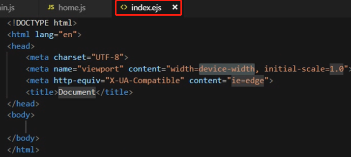
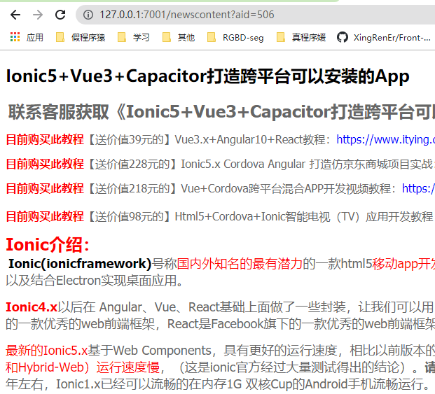
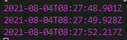

# 一、介绍、环境搭建、项目的创建与运行

## 1.1 简介

Express和Koa是 Node js社区广泛使用的框架,简单且扩展性强,非常适合做**个人项目**。但框架本身缺少约定,标准的MC模型会有各种千奇百怪的写法。Egg.js相比 Express、Koa更规范一些,Egg按照约定进行开发、内置多进程管理、基于Koa开发,性能优异、具有高度可扩展的插件机制、框架稳定、并提供基于Egg定制上层框架的能力。

- [x] [官网](https://eggjs.org/zh-cn/intro/)
- [x] [Github地址](https://github.com/eggjs/egg)

阿里旗下的蚂蚁金服,天猫, UCWeb,村淘,神马等产品都是在Egg.js基础之上扩展的。

## 1.2 快速入门、搭建环境、创建项目

1. 环境准备

   操作系统：支持 macOS, Linux, Windows

   运行环境：Node.js建议选择LTS版本,最低要求8x

2. 创建项目

   - 方法1：使用脚手架 + `egg init`

     推荐直接使用脚手架,只需几条简单指令,即可快速生成项目：

     ```
     npm i egg-init -g						// 全局安装脚手架
     egg-init egg-example --type=simple		// 通过脚手架创建一个基于Egg.js的项目，名为egg-example
     cd egg-example
     npm i									// 安装依赖
     ```

     运行项目：

     ```
     npm run dev
     ```

     

     目录结构：

     

   - 方法2：`npm init` 快速生成项目

     不需要安装egg-init脚手架

     ```
     mkdir egg-example && cd egg-example
     npm init egg --type=simple				// 名为（仅能为）init
     npm i
     ```

     优点：简便

     缺点：需要根据需要修改项目名（默认为init）

# 二、目录结构、配置路由、约定规范、开发工具配置

## 2.1 目录


## 2.2 约定和规范

Express和Koa都是Node.js的**MVC**开发框架，但是由于它们缺少约定和规范，有千奇百怪的写法；

Egg.js对**MVC**进行了**约定和规范**。


1. Egg 中必须有控制器（controller）、路由（router.js）

   当用户访问页面时，如果没有中间件（输入`127.0.0.1:7001/`），首先走路由（`/`），加载控制器 -> home.js -> index 方法

   > 举一反三：
   >
   > 仿照默认路由，再写一个news路由
   >
   > router.js 文件修改如下：
   >
   > 
   >
   > home.js 文件修改如下：
   >
   > 
   >
   > 在浏览器里输入`127.0.0.1:7001/news`，走路由`/news`，加载控制器 -> home.js -> news 方法
   >
   > 

   Egg 规定，所有路由匹配的模块都需要写在控制器中。那么控制器可以有一个（默认的 home.js），也可以有多个。

   新建一个控制器 admin.js，创建 index 方法

   > 在 VS Code 中安装 Egg 的提示工具可以加速开发

   Egg 基于 Koa，Koa 返回响应的响应体写在 `ctx.body` 中，而 Egg 对 `ctx` 进行了进一步的封装，放在 `this` 中，于是通过 `this.ctx.body` 来设置响应体。

   ```js
   /* admin.js */
   'use strict';
   
   const Controller = require('egg').Controller;
   
   class AdminController extends Controller {
     async index() {
       console.log(this);							// 2. 在服务端 node 控制台打印 this 对象
       this.ctx.body = '用户管理';					  // 3. 给用户发送响应，响应体为'用户管理'，显示在页面上
     }
   }
   
   module.exports = AdminController;
   ```

   ```js
   /* router.js */
   router.get('/', controller.home.index);
   router.get('/admin', controller.admin.index);	 // 1. 输入 127.0.0.1:7001/admin，后端路由访问控制器 admin 的 index 方法
   ```

   页面地址如下：

   

   控制台信息如下：

   >  `ctx`、`app`、`config`，还有一些其他的服务，都挂载到了 this 上面。这样便于调用 Koa 中的方法。

   

   用户浏览器页面显示如下：

   

2. 对静态资源文件（public）的约定与规范

   > 与 Koa 的思想一致

   所有静态资源（css、images、js）放在这里

   

   再看 controller：给用户返回渲染模板（而不是一个字符串）更好

   

   路由 -> 控制器 -> 渲染模板

   模板（如 .ejs 格式）必须放到 `view` 文件夹中

   

   

   之后进行简单配置后，即可渲染模板（如下），并作为响应体返回给用户：

   

3. 数据获取

   |                |        | 实现                                                 | 用途                         |
   | -------------- | ------ | ---------------------------------------------------- | ---------------------------- |
   | View           | 视图   | 模板                                                 | 页面的展示                   |
   | Controller     | 控制器 | 路由 -> 不同的控制器中的不同的方法（处理相应的逻辑） | 简单业务逻辑的处理           |
   | Model: service | 模型   | 查询/请求/操作数据库数据                             | 复杂业务逻辑的处理；数据操作 |

   和数据打交道，可以放在 Controller 中，但是不好，逻辑不清晰。用 MVC 架构，业务逻辑清晰，更适合团队开发，有利于开发和维护。

   Egg 是一个 MVC 框架，上面介绍了 Controller、View，那么 Model 在哪里体现？

   通过 service 体现。

   

   

   当用户输入URL访问页面时，由路由匹配控制器。控制器加载视图；若控制器中要访问数据，向服务（service）索要。服务向数据库查询，或者通过接口获取数据。

   

4. 中间件

   当用户访问页面，后端匹配路由之前/匹配路由完成，需要做一些判断：如访问 admin 时，需要进行权限判断，进行权限判断需要使用中间件。

   **中间件的作用**：

   匹配路由之前/匹配路由完成，可以处理一系列的操作

   

   

5. 扩展（extend）

   在视图中使用的扩展功能，需要放到 extend 文件夹中。

   

**总体流程图**


## 2.3 VS Code 中 Egg 插件


# 三、路由(router.js)、get传值、动态路由(controller)

先创建好需要的目录


在 Node.js 中通过 URL 传值有两种方式——get 传值、动态路由

## 3.1 get传值

1. 新建news控制器，配置其路由

   ```js
   /* controller/news.js */
   'use strict';
   
   const Controller = require('egg').Controller;
   
   class NewsController extends Controller {
     async index() {
       this.ctx.body = '新闻页面';
     }
   }
   
   module.exports = NewsController;
   ```

   ```js
   /* router.js */
   router.get('/news', controller.news.index);
   ```

   浏览器地址栏输入 `127.0.0.1:7001/news`，显示新闻页面：

   

2. 在 news 控制器中再新建一个方法，用于显示新闻详情

   ```js
   /* controller/news.js */
   class NewsController extends Controller {
     async index() {
       this.ctx.body = '新闻页面';
     }
     async content() {
       this.ctx.body = '新闻详情';
     }
   }
   ```

   ```js
   /* router.js */
   router.get('/newscontent', controller.news.content);
   ```

   

3. 获取get传值

   在 Koa 中，通过 `ctx.query` 获取；在 Egg 中，通过 **`this.ctx.query`** 获取

   ```js
   /* controller/news.js */
   async content() {
       console.log(this.ctx.query);
       this.ctx.body = '新闻详情';
   }
   ```

   在浏览器中地址栏输入 `http://localhost:7001/newscontent?aid=123`，后端在控制台打印 get 传值

   

## 3.2 动态路由

在 Koa 中，通过 `ctx.params` 获取；在 Egg 中，通过 **`this.ctx.params`** 获取

```js
/* controller/news.js */
async newslist() {
    console.log(this.ctx.params);
    this.ctx.body = '新闻列表';
}
```

```js
/* router.js */
router.get('/newslist/:id', controller.news.newslist);
```

在浏览器中地址栏输入 `http://localhost:7001/newslist/123`，后端在控制台打印动态路由传值


# 四、视图(view)egg-view-ejs、配置文件(config)、静态资源(public)

## 4.1 模板引擎

这里介绍 EJS，性能不太好，但是比较简单。其他模板引擎用法与之相同。

在 [NPM官网](https://www.npmjs.com/) 或者 Github 中搜索 egg ejs，找到了 [egg-view-ejs](https://www.npmjs.com/package/egg-view-ejs)

1. 安装

   ```
   npm i egg-view-ejs --save
   ```

2. 配置插件

   在 *`config/plugin.js`* 配置插件

   ```js
   // {app_root}/config/plugin.js
   module.exports = {
     ejs: {
       enable: true,
       package: 'egg-view-ejs',
     }
   };
   
   ```

   在 *`config/config.default.js`* 配置模板引擎

   ```js
   // {app_root}/config/config.default.js
   config.view = {
     mapping: {
       '.html': 'ejs',		// 修改后表示后缀名为 .html 的文件是模板引擎，要用 ejs 来解析它
     },
   };
   ```

3. 编写视图，在控制器中渲染该视图

   ```html
   <!-- app/view/news.html -->
   ```

   ```js
   // app/controller/news.js
   async index() {
       // this.ctx.body = '新闻页面';
       await this.ctx.render('news');		// 渲染要用异步语句
   }
   ```

4. 控制器为视图传参，在视图中使用模板引擎接收参数

   `// app/controller/news.js`

   

   `<!-- app/view/news.html -->`

   

   浏览器

   

   > controller 可以用来处理数据，但是放在这不好，逻辑不清晰。更推荐放在 service 里。

## 4.2 静态资源

控制器为视图传入静态资源（如图片），在视图中使用模板引擎接收静态资源

在 Koa 中还需要配置一下静态资源，而在 Egg 中放到指定的目录中，直接用就可以了：

1. 图片：

   

   ```html
   <!-- app/view/news.html -->
   
   ```

   > 在 Koa 中，`src="/images/flower.png"`

2. CSS

   

   

# 五、视图(view)、控制器(controller)、数据模型(model：service)、配置文件(config)

## 5.1 service 的简单使用

数据抽离到 service 中，遵循了 MVC 的标准，在不同的 controller 中也可以共用，防止数据冗余。


在 controller 中使用，不需要引入，因为 Egg 已经将 service 绑定到了 this 中

**注**：加上 `await` 异步关键字

`// app/controller/home.js `


## 5.2 controller 与 service

1. 为什么在 controller 中可以访问 service？

   - [x] [控制器（Controller）](https://eggjs.org/zh-cn/basics/controller.html)
   
   另外，controller 中还可以访问别的属性；service 中也有相同的属性。
   
   项目中的 Controller 类继承于 `egg.Controller`，会有下面几个属性挂在 `this` 上（service 相同）。
   
   - `this.ctx`: 当前请求的上下文 [Context](https://eggjs.org/zh-cn/basics/extend.html#context) 对象的实例，通过它我们可以拿到框架封装好的处理当前请求的各种便捷属性和方法。
   - `this.app`: 当前应用 [Application](https://eggjs.org/zh-cn/basics/extend.html#application) 对象的实例，通过它我们可以拿到框架提供的全局对象和方法。
   - `this.service`：应用定义的 [Service](https://eggjs.org/zh-cn/basics/service.html)，通过它我们可以访问到抽象出的业务层，等价于 `this.ctx.service` 。
   - `this.config`：应用运行时的[配置项](https://eggjs.org/zh-cn/basics/config.html)。
   - `this.logger`：logger 对象，上面有四个方法（`debug`，`info`，`warn`，`error`），分别代表打印四个不同级别的日志，使用方法和效果与 [context logger](https://eggjs.org/zh-cn/core/logger.html#context-logger) 中介绍的一样，但是通过这个 logger 对象记录的日志，在日志前面会加上打印该日志的文件路径，以便快速定位日志打印位置。
   
   **注**：
   
   - `this.logger`：除了 `console.log()`，还可通过 `this.logger` 来调试
   
   - `this.config`：可以在 controller/service 中访问 `app/config` 中的数据。
   
     eg. 在 `app/config/config.default.js` 中定义，
   
     在 controller/service 中访问：
   
     

2. 在一个 service 中调用另一个 service

   - [x] [服务（Service）](https://eggjs.org/zh-cn/basics/service.html)

   **总结**：service 可以被 controller/service 调用；一个 service 可以被多个 controller/service 调用；

   **注**：controller 不能被调用

3. service 的命名与访问

   ```
   app/service/biz/user.js => ctx.service.biz.user			// 建议
   app/service/sync_user.js => ctx.service.syncUser
   app/service/HackerNews.js => ctx.service.hackerNews
   ```

# 六、实例

**实例**：《小小爬虫系统》抓取Api接口数据实现一个新闻系统

**第一步**：搭建环境，创建项目

**第二步**：新建控制器，配置路由

```js
// app\controller\home.js
async index() {
    this.ctx.body = '首页';
}
```

```js
// app\controller\news.js
async index() {
    this.ctx.body = '新闻系统';
}
```

```js
// app\router.js
router.get('/', controller.home.index);
router.get('/news', controller.news.index);
```


**第三步**：配置模板引擎，创建模板，使用模板

为什么要配置模板引擎？因为之后要把抓取的数据渲染到页面上

（没有传参）


**第四步**：配置 config [公共 url 地址](http://www.phonegap100.com/)

```js
// config\config.default.js
config.api = 'http://www.phonegap100.com/';
```

**第五步**：路由、控制器、服务、配置相互协作，实现爬取接口，实现小小新闻系统

1. 获取数据的功能放在 service 中

   ```js
   // app\service\news.js
   async getNewsList() {
       return 'getNewsList';
   }
   ```

2. 在 controller 中调用 service

   ```js
   // app\controller\news.js
   async index() {
       // 获取数据显示到新闻界面
       var list = await this.service.news.getNewsList();
       console.log(list);
       this.ctx.body = '新闻系统';
   }
   ```

3. 浏览器中访问 `127.0.0.1:7001/news`

   后端控制台打印出

4. service 中获取真实的接口数据

   在 Node 中提供了 `http.get()` 方法来获取数据；

   在 Egg 中封装了 `curl()` 方法来获取数据：

   ```js
   // app\service\news.js
   async getNewsList() {
       // 通过抓取接口返回数据
       var api = this.config.api + 'appapi.php?a=getPortalList&catid=20&page=1';
       var response = await this.ctx.curl(api);
       console.log(response);
       return 'getNewsList';
   }
   ```

   > 可以查看一下 `curl()` 的源码

   ```js
   console.log(response.data);
   ```

   

   返回 `Buffer` 格式的数据，需要把它转换成 `JSON` 格式，通过 `JSON.parse()` 即可

   > `JSON.parse()`可以解析将字符串解析为对象，也可以将 `Buffer` 格式解析成对象

   完整代码：

   ```js
   // app\service\news.js
   async getNewsList() {
       // 通过抓取接口返回数据
       var api = this.config.api + 'appapi.php?a=getPortalList&catid=20&page=1';
       var response = await this.ctx.curl(api);
       // console.log(response.data);
       var data = JSON.parse(response.data);
       // console.log(data);
       return data.result;
   }
   ```

5. 新建 view，在 controller 中渲染模板

   ```js
   // app\controller\news.js
   async index() {
       // 获取数据显示到新闻界面
       var list = await this.service.news.getNewsList();
       await this.ctx.render('news', {
           list
       });
   }
   ```

   ```html
   <!-- app\view\news.html -->
   <body>
       <h2>新闻列表数据</h2>
       <ul>
           <%for(var i = 0; i < list.length; i++){%>
           <li><a href="#"><%=list[i].title%></a></li>
           <%}%>
       </ul>
   </body>
   ```

   

6. 通过[新闻详情接口](http://www.phonegap100.com/appapi.php?a=getPortalArticle&aid=123)（可传入不同的 aid），跳转到相应的新闻详情

   在 `news` 的 view 中传入相应的 aid，在 router 中配置 `newscontent` 对应的路由，跳转到相应的 controller 并接收 aid 参数，从接口获取数据的功能放在 service 中，在 controller 中调用 service 并传入 aid 参数，得到真实数据，新建 `newscontent` 对应的 view，controller 将真实数据通过模板引擎渲染到 view 中。

   **步骤一**：在 `news` 的 view 中传入 aid

   ```html
   <!-- app\view\news.html -->
   <body>
       <h2>新闻列表数据</h2>
       <ul>
           <%for(var i = 0; i < list.length; i++){%>
           <li><a href="/newscontent?aid=<%=list[i].aid%>"><%=list[i].title%></a></li>
           <%}%>
       </ul>
   </body>
   ```

   **步骤二**：在 router 中配置 `newscontent` 对应的路由

   ```js
   // app\router.js
   router.get('/newscontent', controller.news.content);
   ```

   **步骤三**：跳转到相应的 controller 并接收 get 传值（aid 参数）

   ```js
   // app\controller\news.js
   async content() {
       console.log(this.ctx.query.aid);
   }
   ```

   **步骤四**：从接口获取数据的功能放在 service 中

   ```js
   // app\service\news.js
   async getNewsContent(aid) {
       var api = this.config.api + 'appapi.php?a=getPortalArticle&aid=' + aid;
       var response = await this.ctx.curl(api);
       // console.log(JSON.parse(response.data));
       return JSON.parse(response.data).result;
   }
   ```

   **步骤五**：在 controller 中调用 service 并传入 aid 参数，得到真实数据

   ```js
   // app\controller\news.js
   async content() {
       // console.log(this.ctx.query.aid);
       var content = await this.service.news.getNewsContent(this.ctx.query.aid);
       console.log(content);
   }
   ```

   **步骤六**：新建 `newscontent` 对应的 view，controller 将真实数据通过模板引擎渲染到 view 中

   ```js
   // app\controller\news.js
   async content() {
       // console.log(this.ctx.query.aid);
       var content = await this.service.news.getNewsContent(this.ctx.query.aid);
       // console.log(content);
       await this.ctx.render('newscontent',{
           content: content[0]
       })
   }
   ```

   ```html
   <!-- app\view\newscontent.html -->
   <body>
       <h2><%=content.title%></h2>
       <div><%-content.content%></div>
   </body>
   ```

   

   **注**：若需要设置样式

   在 public 目录下新建 css 文件

   

   在 view 目录下的 `newscontent.html` 中引入该样式

   

   并应用该样式

   

   

# 七、框架扩展(extend)

想在 view 目录中的 `news.html` 的列表中显示日期

```html
<!-- app\view\news.html -->
<li><a href="/newscontent?aid=<%=list[i].aid%>"><%=list[i].title%></a><span>---<%=list[i].dateline%></span></li>
```


显示的是时间戳，希望显示真实的日期。

**方法一**：在 controller 中循环遍历 list，把日期解析好，再传给模板。——循环两次，性能不好

**方法二**：直接在模板中调用解析日期的方法，需要用到 `extend`。——循环一次

## 7.1 extend

- [x] [框架扩展](https://eggjs.org/zh-cn/basics/extend.html)

框架提供了多种扩展点扩展自身的功能：

- Application
- Context
- Request
- Response
- Helper

前四个（Application、Context、Request、Response）是扩展内置对象，最后一个（Helper）是扩展工具方法（**用的最多**；在模板中也可使用）

### 7.1.1 Application

下面只讨论了方法扩展的情况。

封装方法的作用是封装了一些自定义方法，挂载到 `app` 上面，方便调用。

**扩展方式**：框架会把 `app/extend/application.js` 中定义的对象与 Koa Application 的 prototype 对象进行合并，在应用启动时会基于扩展后的 prototype 生成 `app` 对象。

于是新建目录

```js
// app/extend/application.js
module.exports = {
  foo(param) {
    // this 就是 app 对象，在其中可以调用 app 上的其他方法，或访问属性
      console.log('foo', this);
  },
};
```

**访问方式**：外部通过 `this.app.foo()` 调用

```js
// app\controller\home.js
async index() {
    // 调用 extend 里的 application
    this.app.foo();
}
```


### 7.1.2 Context

> Request、Response 都属于 Context，访问需要通过 `this.ctx.request`、`this.ctx.response`

## 7.2 《小小爬虫系统》中日期

需要用到 Helper 扩展

Helper 的作用是一个工具方法

**扩展方式**：

```js
// app/extend/helper.js

// 引入第三方模块
// https://www.npmjs.com/package/silly-datetime
var sd = require('silly-datetime');
module.exports = {
    formatTime(param) {
        // this 是 helper 对象，在其中可以调用其他 helper 方法
        // this.ctx => context 对象
        // this.app => application 对象
        var time = sd.format(new Date(param), 'YYYY-MM-DD HH:mm');
        return time;
    },
};
```

**访问方式**：

```html
<!-- app\view\news.html -->
<li><a href="/newscontent?aid=<%=list[i].aid%>"><%=list[i].title%></a><span>---<%=helper.formatTime(list[i].dateline)%></span></li>
```


时间戳的格式不对。传入的 param 是十位数，而 JavaScript 中应该传入十三位数。

修改：`var time = sd.format(new Date(param * 1000), 'YYYY-MM-DD HH:mm');`

# 八、中间件(middleware)

中间件：匹配路由前、匹配路由完成后，做的一系列的操作。Egg 是基于 Koa 实现的，所以 Egg 的中间件形式和 Koa 的中间件形式是一样的，都是基于洋葱圈模型。

- [x] [Koa 中的中间件](http://eggjs.org/zh-cn/intro/egg-and-koa.html#middleware)
- [x] [Egg 中的中间件](http://eggjs.org/zh-cn/basics/middleware.html)

一般来说中间件也会有自己的配置。在框架中，一个完整的中间件是包含了配置处理的。我们约定一个中间件是一个放置在 `app/middleware` 目录下的单独文件，它需要 exports 一个普通的 function，接收两个参数：

- options：中间件的配置项,框架会将 `app.config[${middlewareName}]` 传递进来
- app：当前应用 Application 的实例

**栗子**：

实现一个中间件，完成以下功能：

1. 请求任何地址时（匹配路由前），打印出当前的日期。

2. 判断用户是否合法，如果不合法，拒绝访问。

## 8.1 功能一

在 Koa 中，中间件的写法为 `app.use(function(){})`

在 Egg 中，**中间件的写法**如下：

```js
// app\middleware\printdate.js
module.exports = (options, app) => {
    // 返回一个异步方法
    return async function printDate(ctx, next) {
        console.log(new Date());
        await next();
    }
}
```

**配置中间件**：

```js
// config\config.default.js

// add your middleware config here
config.middleware = ['printdate'];
```

请求任何地址都会经过该中间件，调用它返回的方法，即打印日期：



也可以在配置中间件时，**给中间件传入参数**：

```js
// config\config.default.js

// add your middleware config here
config.middleware = ['printdate'];
config.printdate = {
    aaa: 'aaaaaa'
}
```

在中间件中获取参数：

```js
// app\middleware\printdate.js
module.exports = (options, app) => {
    console.log(options);
    // 返回一个异步方法
    return async function printDate(ctx, next) {
        console.log(new Date());
        await next();
    }
}
```


## 8.2 功能二

屏蔽特定的客户端 IP。但是由于现在是在开发阶段，客户端和服务器端在一起，只有一个 IP：127.0.0.1，那么下面演示屏蔽 127.0.0.1 的功能。


**创建中间件**：

```js
// app\middleware\forbiddenip.js
module.exports = (options, app) => {
    return async function forbiddenIp(ctx, next) {
        // 要屏蔽的 IP：1. 从数据库获取 2. 从参数传入
        var forbidip = '127.0.0.1';
        // 获取客户端 IP
        console.log(ctx.request.ip);
        await next();
    }
}
```

**配置中间件**：

```js
// config\config.default.js

// add your middleware config here
config.middleware = ['printdate', 'forbiddenip'];
```


也可通过本机 IP 地址访问（本机 IP 用 `ipconfig` 查询）


**为中间件添加屏蔽 IP 功能**：

```js
// app\middleware\forbiddenip.js
module.exports = (options, app) => {
    return async function forbiddenIp(ctx, next) {
        // 要屏蔽的 IP：1. 从数据库获取 2. 从参数传入
        var forbidip = '127.0.0.1';
        // 获取客户端 IP
        if (ctx.request.ip == forbidip) {
            ctx.status = 403;
            ctx.body = '您的ip已经被屏蔽';
        } else {
            await next();
        }
    }
}
```


**从参数传入要屏蔽的 IP 列表**：

```js
// config\config.default.js
config.forbiddenip = {
    forbidips: ['127.0.0.1', '192.168.0.67']
}
```

```JS
// app\middleware\forbiddenip.js
module.exports = (options, app) => {
    return async function forbiddenIp(ctx, next) {
        // 要屏蔽的 IP：1. 从数据库获取 2. 从参数传入
        var forbidips = options.forbidips;
        // 获取客户端 IP
        if (forbidips.indexOf(ctx.request.ip) != -1) {
            ctx.status = 403;
            ctx.body = '您的ip已经被屏蔽';
        } else {
            await next();
        }
    }
}
```

# 九、Post提交数据、CSRF的防范——安全验证机制、配置模板全局变量

在 eggdemo01 项目中做演示。

## 9.1 前端——提交表单；后端——获取数据

**配置路由**：

```js
// app\router.js
module.exports = app => {
  const { router, controller } = app;
  router.get('/', controller.home.index);
};
```

**创建控制器**：

没有传入数据，只是加载 `home.html` 模板。

```js
// app\controller\home.js
async index() {
    this.ctx.render('home');
}
```

**创建模板**：

创建表单，向 `/add` 提交数据：

```html
<!-- app\view\home.html -->
<body>
    <form action="/add" method="POST">
        用户名：<input type="text" name="username" /> <br> <br>
        密  码：<input type="text" name="password" type="password" /> <br> <br>
        <button type="submit">提交</button>
    </form>
</body>
```

**配置提交路径（`/add`）的路由**：

注意是 `router.post()`

```js
// app\router.js
router.post('/add', controller.home.add);
```

**创建控制器**：

获取 POST 提交的数据：

```js
// app\controller\home.js
async add() {
    console.log(this.ctx.request.body);
}
```


## 9.2 CSRF的防范——安全验证机制

在 Koa 中，如果不做处理，POST 数据不受限制；

而在 Egg 中，默认情况下，拒绝一切 POST 请求；必须满足一定的条件（和后端进行简单的签名验证），才可以发送 POST 请求。

### 9.2.1 简单使用

**在用户访问页面时，生成一个密钥，返回给前端**

```js
// app\controller\home.js
async index() {
    // this.ctx.csrf 用户访问页面时，生成一个密钥
    await this.ctx.render('home', {
        csrf: this.ctx.csrf
    });
}
```

**用户提交表单时，将该密钥传给后端**

可以在提交表单的 URL 中 GET 传值，也可以在隐藏的表单域中 POST 传值。参数名为 `_csrf`（如果需要修改，要在后台配置，建议按照默认写法去写）。

**`GET`**

```html
<!-- app\view\home.html -->
<!-- GET -->
<form action="/add?_csrf=<%=csrf%>" method="POST">
    用户名：<input type="text" name="username" /> <br> <br>
    密  码：<input type="text" name="password" type="password" /> <br> <br>
    <button type="submit">提交</button>
</form>
```


这时提交数据，后台会接收到 POST 请求提交的数据

**`POST`**

```html
<!-- app\view\home.html -->
<!-- POST -->
<form action="/add" method="POST">
    <input type="hidden" name="_csrf" value="<%=csrf%>" />
    用户名：<input type="text" name="username" /> <br> <br>
    密  码：<input type="text" name="password" type="password" /> <br> <br>
    <button type="submit">提交</button>
</form>
```

### 9.2.2 提高复用性——全局变量

如果有很多页面都要提交 POST 请求，那么在许多个控制器中分别生成、传递密钥给前端，太麻烦了；

可不可以在用户请求第一个页面的时候，就生成一个密钥（不需要在不同的控制器分别生成），也不需要在不同控制器中分别传递密钥给前端，就可以在所有页面的 POST 请求中共用该密钥？

——使用**模板全局变量**

**创建中间件**：

在中间件中配置模板全局变量 `ctx.state.csrf`（同 Koa），这样在任何模板中都能访问 `csrf` 变量???

```js
// app\middleware\auth.js
module.exports = (options, app) => {
    return async function auth(ctx, next) {
        // ctx.csrf 用户访问第一个页面时，生成一个密钥，并赋值给全局模板变量
        ctx.state.csrf = ctx.csrf;
        await next();
    }
}
```

**配置中间件**：

```js
// config\config.default.js
config.middleware = ['auth'];
```

**修改控制器**：

之前密钥是在控制器中生成的；而现在在控制器中，不需要生成密钥，也不需要传递给前端。

直接正常使用就好：

```js
// app\controller\home.js
async index() {
    await this.ctx.render('home');
}
```

# 十、Cookie的使用、Cookie的配置、设置中文Cookie

## 10.1 Cookie 的使用

**为啥要使用 Cookie？**

*HTTP 协议是无状态协议*，在不同页面之间跳转时，无法实现状态共享。

比如在淘宝首页登录了，可是跳转到其他页面后，无法获取到登录的状态。

**Cookie 简介**

cookie是存储于访问者的计算机中的变量。可以让我们用*同一个浏览器*访问*同一个域名*的时候共享数据。

**Egg 中的 Cookie 语法**

设置：`ctx.cookies.set(key, value, options)`

获取：`ctx.cookies.get(key, options)`

## 10.2 Cookie 的配置

**Cookie 的 options 参数**

默认情况下，浏览器关闭后，cookie 就销毁了，可以通过 options 参数设置 cookie 的保留时间

```js
this.ctx.cookies.set('username', 'zhangsan', {
    maxAge: 1000 * 3600 * 24    // cookie 存储一天
})
```

- [x] [Cookie 与 Session —— Egg 官网](https://eggjs.org/zh-cn/core/cookie-and-session.html)

| 参数                  |                                                              | 注                                     |
| --------------------- | ------------------------------------------------------------ | -------------------------------------- |
| `{Number} maxAge`     | 最长保存时间（毫秒数）                                       | **常用**；和 `expires` 设置一个即可    |
| `{Date} expires`      | 失效时间                                                     |                                        |
| `{String} path`       | URL 路径。默认为根路径（`/`）                                |                                        |
| `{String} domain`     | 域名。默认没有配置                                           | 跨域访问                               |
| `{Boolean} httpOnly`  | 是否仅能在后端访问。默认为 true                              | **常用**                               |
| `{Boolean} secure`    | 框架自动判断当前是否使用 HTTPS 连接，自动设置其值            |                                        |
| `{Boolean} overwrite` |                                                              | 没啥用                                 |
| `{Boolean} signed`    | 是否对 Cookie 进行签名，用于读取时做校验，防止前端篡改。默认为 true | **常用**                               |
| `{Boolean} encrypt`   | 是否对 Cookie 进行加密，客户端无法读取到明文。默认为 false   | **常用**；若进行加密，则获取时需要解密 |

```js
// 设置时对 Cookie 进行加密
this.ctx.cookies.set('username', 'zhangsan', {
    encrypt: true
})
// 获取时对 Cookie 进行解密
this.ctx.cookies.get('username', {
    encrypt: true
})
```

## 10.3 设置中文 Cookie

**注**：默认情况下，Egg 中的 Cookie 无法设置中文。

```js
// 设置中文 Cookie，出错！
this.ctx.cookies.set('username', '张三')
```

**方法一**：配合加密选项。

```js
// 设置时对 Cookie 进行加密
this.ctx.cookies.set('username', '张三', {
    encrypt: true
})
```

**方法二**：转换成 Buffer 字符串

思路：

```js
console.log(new Buffer('hello, world!').toString('base64'));
// 普通字符串转换成base64字符串: aGVsbG8sIHdvcmxkIQ==

console.log(new Buffer('aGVsbG8sIHdvcmxkIQ==', 'base64').toString());
// base64字符串还原成普通字符串: hello, world!
```

实现：

```js
// 设置 Cookie
this.ctx.cookies.set('username', new Buffer('张三').toString('base64'));

// 获取 Cookie
new Buffer(this.ctx.cookies.get('username'), 'base64').toString();
```

## 10.4 Cookie 中设置对象

```js
// 设置 Cookie
this.ctx.cookies.set('username', JSON.stringify(obj));

// 获取 Cookie
JSON.parse(this.ctx.cookies.get('username'));
```

## 10.5 清除 Cookie

**方法一（推荐）**

```js
this.ctx.cookies.set('username', null);
```

**方法二**

```js
this.ctx.cookies.set('username', '', {	// value 可以是任意值
    maxAge: 0							// 或者 -1
});
```

# 十一、Session的使用、Session的配置

**Session 简介**

session 是另一种记录客户状态的机制，不同的是 Cookie 保存在客户端浏览器中，而 session 保存在服务器上。

**Session 的工作流程**

*session 基于 cookie*。

当浏览器访问服务器并发送第一次请求时，服务器端会创建一个 session 对象，生成一个类似于 key,value 的键值对，然后将 key(cookie) 返回到浏览器(客户)端，浏览器下次再访问时，携带 key(cookie)，找到对应的 session(value)。

## 11.1 Egg 中 Session 的使用

Session 的普通使用

```js
// 设置
this.ctx.session.username = '张三';

// 获取
var session = this.ctx.session;				// 获取到整个 Session 对象
var username = this.ctx.session.username;	// 获取到 Session 对象的某个属性
```

Session 中设置对象：不用转为字符串（不同于 Cookie）

```js
// 设置
this.ctx.session.userinfo = {
    name: '张三',
    age: '20'
}

// 获取
var session = this.ctx.session;
var userinfo = this.ctx.session.userinfo;
```

**Session 基于 Cookie 的解释**

当第一次访问页面时，服务器生成一个 Session，并把 SessionID 以 Cookie 键值对的形式传给客户端，于是客户端设置了该 Cookie


当客户端再次访问服务器时，会携带 Cookie（包含了 SessionID） 发送 HTTP 请求


## 11.2 Session 的配置

**Session 的默认设置**

```js
exports.session = {
    key: 'EGG_SESS',
    maxAge: 24 * 3600 * 1000, // 1 day
    httpOnly: true,
    encrypt: true
}
```

**修改 Session 配置**

**方法一**：修改 Session 的默认设置**（不建议）**

栗子：设置 Session 的过期时间

```js
this.ctx.session.maxAge = 2000;
```

**方法二**：在 `config\config.default.js` 中统一配置

```js
config.session = {
    maxAge: 2000
};
```

**Session 的配置有哪些**

Cookie 中有的，Session 都可以配置；

另外，注意 `renew`，若 renew 等于 true，那么每次刷新页面的时候 session 都会被延期

```js
config.session = {
    maxAge: 2000,
    renew: true
};
```

