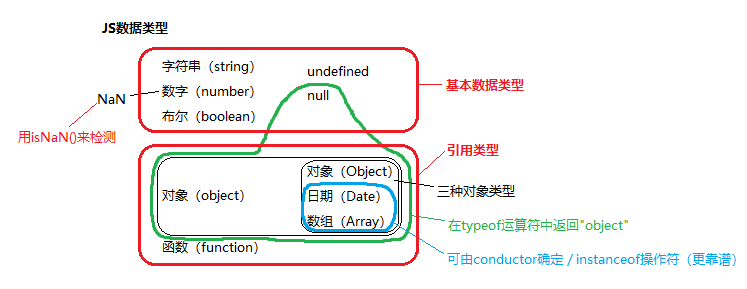

变量
===

<!-- 目录开始 -->
## <a id="one"></a>目录

| 目录 |
| --- |
| [二 var/let/const](#two) |
| [三 暂时性死区](#three) |
| [四 函数作用域和块级作用域](#four) |
| [五 变量提升和函数提升](#five) |
| &emsp;[5.1 详细讲解：变量提升、函数提升和暂时性死区](#five-one) |
| &emsp;[5.2 题目 1](#five-two) |
| &emsp;[5.3 题目 2](#five-three) |
| &emsp;[5.4 题目 3](#five-four) |
| &emsp;[5.5 题目 4](#five-five) |
| &emsp;[5.6 题目 5](#five-six) |
| [六 判断变量](#six) |
| &emsp;[6.1 typeof](#six-one) |
| &emsp;[6.2 instanceof](#six-two) |
| &emsp;[6.3 constructor](#six-three) |
| &emsp;[6.4 Array.prototype.toString.call](#six-four) |
<!-- 目录结束 -->

## <a id="two"></a>二 var/let/const

> [返回目录](#one)

* `let` 和 `var` ：

|  | `var` | `let` |
|--|-------|-------|
|重复声明|可以|同一作用域下不可|
|作用域|全局作用域 和 函数作用域|全局作用域 和 块级作用域 `{}`|
|提升(hoisting)|是|否|
|临时死区(temporal dead zone)|无|有|

* `const`：

1. `let` 有的它也有
2. 初始化必须赋值
3. 赋值后不能改动类型

## <a id="three"></a>三 暂时性死区

> [返回目录](#one)

只要块级作用域内存在 `let`/`const` 命令，它所声明的变量就绑定这个区域，不再受外部的影响。  

在代码块内，使用 `let`/`const` 声明变量之前，该变量都是不可用的，所以叫 “**暂时性死区**”。  

> 函数作用域内存在 `var` 命令，它所声明的变量就绑定这个区域，不再受外部的影响。  
> `var`声明的变量会提升，不存在暂时性死区  

看一道题目：

下面代码输出什么？

```js
let a = 1;
let test = function() {
  console.log(a);
  a++;
}
test();
```

下面代码输出什么？

```js
let a = 1;
let test = function() {
  console.log(a);
  let a = 2;
  a++;
}
test();
```

---

第一道题输出：`1`

第二道题输出：`Uncaught ReferenceError: Cannot access 'a' before initialization`

其原因是在同一个 `block` 中，`let` 在后面重新定义的，那么就不能在之前引用该变量。同时，也不能取嵌套外层的值。

## <a id="four"></a>四 函数作用域和块级作用域

> [返回目录](#one)

* **函数作用域**：在 JavaScript 中定义一个函数，函数内部的变量只能通过函数内部访问，同时它可以修改和影响外部变量。
* **块级作用域**：变量在离开定义的块级代码后立即被回收，存在暂时性死区的特性。

在 ES5 中只有全局作用域和函数作用域，没有块级作用域，这会带来些许麻烦：

1. 内层变量覆盖外层变量
2. 循环的变量泄露为全局变量

> 内层变量覆盖外层变量

```js
var tmp = new Date();

function f(){
  console.log(tmp);
  if(false){
    var tmp = "hello";
  }
}

f(); // undefined
```

> 循环的变量泄露为全局变量

```js
for (var i = 0; i < 3; i++) {

}
console.log(i); // 3
```

通过 `var` 声明的变量或者非严格模式下（non-strict mode）创建的函数声明没有块级作用域。

```js
var x = 1;
{
  var x = 2;
}
console.log(x); // 2
```

所以，为了解决这个问题，ES6 新增了块级作用域：

* 块语句用于组合零个或者多个语句，这个块由一对大括号 `{}` 界定。

> ES5 模拟块级作用域的方法

```js
(function() {

})()
```

> ES6 通过 {} 界定

```js
{
  var x = 1; // 或者 const x = 1;
}
```

## <a id="five"></a>五 变量提升和函数提升

> [返回目录](#one)

关于为什么进行变量提升和函数提升，这个问题一直没有明确的答案。

函数提升就是为了解决相互递归的问题，大体上可以解决自下而上的顺序问题。

```js
// 验证偶数
function isEven(n) {
  if (n === 0) {
    return true;
  }
  return isOdd(n - 1);
}

console.log(isEven(2)); // true

// 验证奇数
function isOdd(n) {
  if (n === 0) {
    return false;
  }
  return isEven(n - 1);
}
```

如果没有函数提升，而是按照自下而上的顺序，当 `isEven` 函数被调用时，`isOdd` 函数还未声明，所以在 `isEven` 内部无法调用 `isOdd` 函数。

而变量提升的缘故，这里就不太清楚了，回答下来就是【设计如此】。

### <a id="five-one"></a>5.1 详细讲解：变量提升、函数提升和暂时性死区

> [返回目录](#one)

变量提升是怎样的呢？

```js
console.log(a);

var a = 10;
```

在这段脚本中，会输出 `undefined`，为什么？

```js
var a;

console.log(a);

a = 10;
```

看上面代码，在 JavaScript 解析的过程中，会将 `a` 提取到上面进行声明。

而 `console.log(a)` 打印的时候，因为 `a` 声明了但是没有填写值，所以是 `undefined`。

而这段代码换成 `let` 或者 `const` 语句呢？就会出现 **暂时性死区**。

```js
console.log(a);

let a = 10;
```

输出：

```
VM196:1 Uncaught ReferenceError: Cannot access 'a' before initialization
```

再看看函数提升：

```js
var foo = 3;

function getFoo() {
  var foo = foo || 5;
  console.log(foo); // 输出 5
}

getFoo();
```

记住一句话：

* **函数是一等公民**

所以，上面的代码，JavaScript 解析会变成：

```js
var foo;

function getFoo() {
  var foo;
  foo = foo || 5;
  console.log(foo);
}

foo = 3;

getFoo();
```

这就是 **函数提升**。  

举一反三：  
```js
var foo = 3;

function getFoo() {
  var foo = foo;
  console.log(foo); // 输出 undefined
}

getFoo();
```

```js
var foo = 3;

function getFoo() {
  console.log(foo); // 输出 3
}

getFoo();
```

### <a id="five-two"></a>5.2 题目 1

> [返回目录](#one)

```js
function getFoo() {
  foo();

  var foo = function() { // 变量提升
    console.log(1);
  }

  foo();

  function foo() { // 函数提升
    console.log(2);
  }

  foo();
}
getFoo();
```

请问上面代码输出什么？

---

```js
2
1
1
```

我们将其换成变量和函数提升后的效果便可得知：

```js
function getFoo() {
  var foo;

  function foo() {
    console.log(2);
  }

  foo(); // 2

  foo = function() {
    console.log(1);
  }

  foo(); // 1

  foo(); // 1
}
getFoo();
```

### <a id="five-three"></a>5.3 题目 2

> [返回目录](#one)

```js
console.log(a);

var a = 10;
var a = 100;

console.log(a);

function a() {
  console.log('a');
}
function a() {
  console.log('aa');
}

a();
```

请问上面代码输出什么？

---

答案：

```js
[Function: a]
100
100
```

### <a id="five-four"></a>5.4 题目 3

> [返回目录](#one)

```js
var a = 1;
function b() {
  a = 10;
  return;
  function a() {}
}
b();
console.log(a);
```

请问上面代码输出什么？

---

答案：1

### <a id="five-five"></a>5.5 题目 4

> [返回目录](#one)

```js
function foo() {
  function bar() {
    return 3;
  }
  return bar();
  function bar() {
    return 8;
  }
}
console.log(foo());
```

请问上面代码输出什么？

---

答案：8

### <a id="five-six"></a>5.6 题目 5???

> [返回目录](#one)

```js
var foo = { n: 1 };

(function(foo) {
  console.log(foo.n);
  foo.n = 3;
  foo = { n: 2 };
  console.log(foo.n);
})(foo)

console.log(foo.n);
```

请问上面代码输出什么？

* A：1 2 3
* B：undefined 2 1
* C：报错
* D：1 2 1

---

答案：

```js
var foo = { n: 1 };
(function(foo){            // 形参 foo 同实参 foo 一样指向同一片内存空间，这个空间里的 n 的值为 1
    var foo;               // 优先级低于形参，无效。
    console.log(foo.n);    // 输出 1
    foo.n = 3;             // 形参与实参 foo 指向的内存空间里的 n 的值被改为 3
    foo = { n: 2 };        // 形参 foo 指向了新的内存空间，里面 n 的值为 2.
    console.log(foo.n);    // 输出新的内存空间的 n 的值
})(foo);
console.log(foo.n);        // 实参 foo 的指向还是原来的内存空间，里面的 n 的值为 3.
```

## <a id="six"></a>六 判断变量

> [返回目录](#one)  

  

JavaScript 判断变量的方式有：

* `typeof(variable)`
* `variable instanceof Array`
* `variable.constructor == Array`
* `Object.prototype.toString.call(variable)`
* 针对Array类型：`Array.isArray(variable)`

它们都有哪些区别呢？

### <a id="six-one"></a>6.1 typeof

> [返回目录](#one)

```js
var num = 123;
var str = 'abcdef';
var bool = true;
var arr = [1, 2, 3, 4];
var json = { name: 'jsliang', age: 25 };
var func = function () { console.log('this is function'); }
var und = undefined;
var nul = null;
var date = new Date();
var reg = /^[a-zA-Z]{5,20}$/;
var error = new Error();

console.log(
  typeof num, // number
  typeof str, // string
  typeof bool, // boolean
  typeof arr, // object
  typeof json, // object
  typeof func, // function
  typeof und, // undefined
  typeof nul, // object
  typeof date, // object
  typeof reg, // object
  typeof error, // object
);
```

`typeof` 能区分的有：

* `number`
* `string`
* `boolean`
* `undefined`
* `function`

检测其他类型的时候，都返回 `object`，不太稳定。

补充：

```js
typeof NaN; // number
typeof 10n; // bigint
typeof Symbol(); // symbol
```

* `NaN` 返回为 `number`
* `10n` 是 `BigInt` 的表示方法，在数字后面追加 `n` 表示 `BigInt`，或者 `BigInt(10)` 也是一样的。
* `Symbol()` 就是 `Symbol`

### <a id="six-two"></a>6.2 instanceof

> [返回目录](#one)

`instanceof` 判断原型链指向，我们可以看一下它的实现原理：

```js
function instanceOf(a, b) {
  // 通过 typeof 判断基本类型
  if (typeof a !== 'object' || b === null) {
    return false;
  }

  // getPrototypeOf 是 Object 自带的一个方法
  // 可以拿到参数的原型对象
  let proto = Object.getPrototypeOf(a);
  const prototype = b.prototype;

  // 从当前 __proto__ 开始查找
  while (proto) {
    
    // 如果找到 null 还没有找到，返回 false
    if (proto === null) {
      return false;
    }

    // 如果 a.__proto__.xxx === b.prototype，返回 true
    if (proto === prototype) {
      return true;
    }

    // 进一步迭代
    proto = proto.__proto__;
  }
}
```

`instanceof` 就是原型链的查找过程。

```js
var num = 123;
var str = 'abcdef';
var bool = true;
var arr = [1, 2, 3, 4];
var json = { name: 'jsliang', age: 25 };
var func = function () { console.log('this is function'); }
var und = undefined;
var nul = null;
var date = new Date();
var reg = /^[a-zA-Z]{5,20}$/;
var error = new Error();

console.log(
  num instanceof Number, // false
  str instanceof String, // false
  bool instanceof Boolean, // false
  und instanceof Object, // false
  nul instanceof Object, // false
  arr instanceof Array, // true
  json instanceof Object, // true
  func instanceof Function, // true
  date instanceof Date, // true
  reg instanceof RegExp, // true
  error instanceof Error, // true
)
```

保险起见，`instanceof` 能判断的有：

* `Array`
* `Function`
* `Date`
* `RegExp`
* `Error`

其他的不太能确定。

### <a id="six-three"></a>6.3 constructor

> [返回目录](#one)

```js
var num = 123;
var str = 'abcdef';
var bool = true;
var arr = [1, 2, 3, 4];
var json = { name: 'jsliang', age: 25 };
var func = function () { console.log('this is function'); }
var und = undefined;
var nul = null;
var date = new Date();
var reg = /^[a-zA-Z]{5,20}$/;
var error = new Error();

function Person(){

}
var Tom = new Person();

console.log(
  Tom.constructor === Person,
  num.constructor === Number,
  str.constructor === String,
  bool.constructor === Boolean,
  arr.constructor === Array,
  json.constructor === Object,
  func.constructor === Function,
  date.constructor === Date,
  reg.constructor === RegExp,
  error.constructor === Error
);
```

得到的所有结果都是 `true`，除了 `undefined` 和 `null`，其他类型基本可以通过 `constructor` 判断。

不过因为 `constructor` 的属性是可以被修改的，可能导致检测出的结果不正确。

### <a id="six-four"></a>6.4 Array.prototype.toString.call

> [返回目录](#one)

```js
var num = 123;
var str = 'abcdef';
var bool = true;
var arr = [1, 2, 3, 4];
var json = { name: 'jsliang', age: 25 };
var func = function () { console.log('this is function'); }
var und = undefined;
var nul = null;
var date = new Date();
var reg = /^[a-zA-Z]{5,20}$/;
var error = new Error();

console.log(
  Object.prototype.toString.call(num), // [object Number]
  Object.prototype.toString.call(str), // [object String]
  Object.prototype.toString.call(bool), // [object Boolean]
  Object.prototype.toString.call(arr), // [object Array]
  Object.prototype.toString.call(json), // [object Object]
  Object.prototype.toString.call(func), // [object Function]
  Object.prototype.toString.call(und), // [object Undefined]
  Object.prototype.toString.call(nul), // [object Null]
  Object.prototype.toString.call(date), // [object Date]
  Object.prototype.toString.call(reg), // [object RegExp]
  Object.prototype.toString.call(error), // [object Error]
);
```

一个完美的判断方法，可以检测上面提到的所有类型，只需要将它的结果 `result.slice(8, -1)` 就能得到具体的类型。
