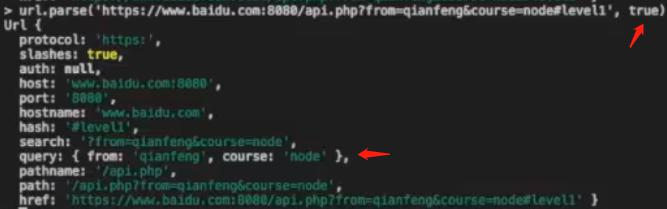
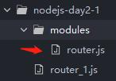
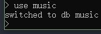
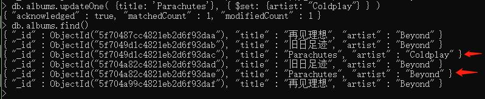
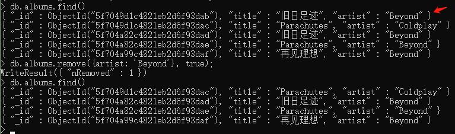

# 01、NodeJS 基础介绍  
## 什么是Node.js  
使用在服务器端  
Node.js是一个基于Chrome V8 引擎的JavaScript 运行环境。  
Node.js使用了一个事件驱动、非阻塞式I/O 的模型，使其轻量又高效。  
Node.js的包管理器npm，是全球最大的开源库生态系统。  
Node.js可以解析JS代码（没有浏览器安全级别的限制）提供很多系统级别的API，如：  
- 文件的读写
- 进程的管理
- 网络通信
- ……

NodeJS代码中，语句后的分号不用写  
# 02、开发环境配置  
## 准备Node.js
https://nodejs.org/zh-cn/ LTS长期支持版；发布版。  
可以使用docker来管理Node.js的版本，也可以使用nvm(为了方便)  
使用nvm来安装并维护多个Node.js的版本  
1. 项目地址：  
https://github.com/creationix/nvm/blob/master/README.md  
2. 在.bash文件中配置：  
(1)环境变量(弹幕说1.17后已配置好)  
(2)配置镜像(也可以不修改.bash文件，用另一种方法配置淘宝镜像)  
```
export NVM_NODEJS_ORG_MIRROR=https://npm.taobao.org/mirrors/node
```
3. 下载node.js  
```
nvm install 版本号
```
(以下两个不好用：)  
最新版：  
```
nvm install node
```
最新长期支持版：  
```
nvm install --lts
```

## 使用不同版本的Node.js
```
nvm use 11.4.0
```
## 命令行中的体验
进入命令行：  
```
node
```
该执行环境和浏览器控制台是类似的(可以解析JS代码)  
区别：node.js中不受浏览器限制，可以执行比如文件操作、跨域请求等；bom、dom是浏览器中特殊的对象  

1. 在浏览器和node命令行中运行代码  
```JS
function add(x, y) {
	console.log(x + y);
}
add(3, 4)
```
2. 在浏览器和node命令行里调用 window, process 两个对象  

## 执行.js文件
1. 编写 index.js 文件  
```JS
console.log('hello');
function add(x, y) {
	console.log(x + y);
}
add(6, 7);
```
2. 执行代码  
```
node index.js 
```
3. 安装nodemon, 实时监听文件的变化。可以使用cnpm安装  
```
cnpm i nodemon -g
```
```
nodemon index.js
```

# 03、模块、包与CommonJS  
AMD、CMD -> CommonJS  
定义模块、暴露接口、引用模块(以上内容详情见下链接)  
[CommonJS规范详细内容](http://www.commonjs.org)  
NodeJS是一种后端的开发语言，CommonJS是用NodeJS实现的，是用在后端的一种规范。  
【注】NodeJS和CommonJS是分离的，CommonJS是一种规范。  

以NodeJS中的模块为例：  
Node.js模块可分为  

1. 内置的Node.js模块(有的需要引用)
2. 第三方的Node.js模块(需要安装、引用)
3. 自定义的Node.js模块(按照CommonJS规范来定义、接口、引用)

## 内置模块
内置的Node.js模块也可叫做NodeJs的API，如：创建文件的模块、加密用的模块、创建web服务器的模块等等  
有的模块可直接使用：如console.log();  
大部分模块需要在文件中引用才能使用，如os模块(提供了很多与操作系统相关的东西)  
### 使用方法
查API文档  
引入模块  
## 模块的引入(无论是内置模块/第三方模块/自定义模块)
```JS
const os = require('os');
```
使用  
```JS
console.log(os.hostname());
```
## 第三方模块
第三方的Node.js模块也可叫做NodeJs的包  
[NodeJs第三方包下载地址](https://www.npmjs.com)  
包的源码一般托管到了GitHub网站上  
### 使用第三方包的流程
有具体需求  
搜索一下该需求  
可能能找到处理该需求的第三方包  
看该包的官方文档  
第三方包管理工具npm  
### 栗子——发送http请求(request模块)
在NodeJs的开发规范中，安装使用第三方包，可以通过创建一个配置文件package.json来管理它们。该文件需要手动创建/使用npm的配置文件创建命令  
```
npm init
```
安装第三方包到本地并将信息写入配置文件  
```
cnpm install request --save
```
package.json文件改变，多了一个node_modules文件夹，其中有request包，也有许多其他的**依赖包**。  
引入模块  
```JS
const request = require('request')
```
第三方模块不需要写路径，自动到node_modules路径下找该模块  
## 自定义模块
### 定义模块
  
引入模块  

```JS
const hello = () => {
  console.log('hello ~');
}
```
### 暴露接口
```JS
module.exports.hello = hello
```
等号左边hello的位置可以是任何类型，如：属性(如上例)、对象字面量等  

> 导出模块的几种方式：
>
> 1. `module.exports`（推荐）
>
>    为`module.exports`添加属性：
>
>    ```js
>    module.exports.hello = hello;
>    module.exports.greet = greet;
>    ```
>
>    直接对`module.exports`赋值：
>
>    ```js
>    module.exports = {
>        hello: hello,
>        greet: greet
>    };
>    ```
>
>    ```js
>    module.exports = hello;
>    ```
>
> 2. `exports`（不推荐）
>
>    为`exports`添加属性：
>
>    ```js
>    exports.hello = hello;
>    exports.greet = greet;
>    ```
>
>    直接对`exports`赋值不可以：
>
>    比如赋值为函数，则`exports = hello`会覆盖`var exports = module.exports`，于是`module.exports`还是空对象

### 引用模块
```JS
const greeting = require('./src/greeting.js')  
greeting.hello()  
```
【注】在不同文件夹，写路径要用'./src/greeting.js'不能是'src/greeting.js'，即使在同一文件夹，也要有'./greeting.js'不能是'greeting.js'，来告诉NodeJs这是自己定义的模块，不用到node_modules中查找第三方包，节省查找的时间，提高效率  

# 04、npm 包管理工具  
NPM-包管理工具(Node Package Manager)  
## npm的升级
  
node和npm是捆绑的，升级node即升级npm，升级node可以使用如下命令  
```
cnpm install n -g
```
```-g```和```--global```相同  
因为在全局内安装的，所以执行一下以下命令来更新nodejs和npm  
```
n stable
```
n模块不支持windows  
## 安装全局模块
```
cnpm i forever -g
```
## 卸载全局模块
```
npm uninstall forever -g
```
## 安装本地模块
默认安装最新版本  
```
cnpm i underscore
```
安装指定版本：  
```
cnpm i underscore@1.10.2
```
## 卸载本地模块
```
npm uninstall babel-cli --save-dev
```
为安装本地模块(或卸载本地模块)进行一些额外的设置：  
--save-dev即-D  
--save
  
  
## 查看本地模块
```
npm list
```
  
只看某个本地模块(在windows上出错)：  
```
npm list | grep gulp
```
  
## 查看模块版本信息
查看模块有那些版本、最新版本、最新稳定版本：  
```
npm info underscore
```
  
## package.json  
### --save-dev与--save
package.json用途：管理第三方模块  
dependencies——项目的依赖  
devDependencies——开发时的依赖，发布到线上时该依赖就不需要了  
```
cnpm i underscore --save
```
--save把依赖包名称添加到package.json文件dependencies
```
cnpm i babel-cli --save-dev
```
--save-dev(即-D)把依赖包名称添加到package.json文件devDependencies
把node_modules删除后，可以利用package.json文件一键安装依赖  
```
cnpm i
```
### ^ ~ 与 *
查看包安装的版本、最新版本(若已经是最新版本则没有输出)：  
```
npm outdated
```
  
  
^表示第一位要保留，第二位是最新的版本。  
三位数字，符合GNU规范。三位数字分别叫major，manner，patch。  
Wanted代表想要在devDependencies中装的版本号。  
那此处Current为什么是3.8.0呢？因为在安装时用@3.8.0约束了它的版本。  
把gulp卸载掉，重新利用package.json文件一键安装依赖，则会安装3.*.*中的最新版本。  
  
  
~表示第一、二位要保留，第三位是最新的版本。  
  
*表示安装最新版本。  

## 选择、切入一个UI
使用NRM模块管理  
在全局安装nrm  
```
cnpm i nrm -g
```
查看  
```
nrm ls
```
可以看到有很多源，当前的源在npm(什么的源???)  
  
测试时间  
```
nrm test
```
【注】每次test的结果都不同  
切换源  
```
nrm use taobao
```
## 缓存相关操作  
【注】  
在安装模块时报错/安装的比较慢，重新安装，还是安装不成功/没有覆盖，解决方法：把该模块彻底卸载，同时把npm的缓存清除  
清除缓存  
```
npm cache clean
```

# 05-12、Node (内置)核心模块  
## 05、url  
url地址解析/后台解析url地址到前端  
相关概念：uri  
uri是一个字符串，uri可能会构成一个url，url一定是一个uri  
NodeJS中有关url的一些处理方法：  
### parse
```
url.parse(urlString[, parseQueryString[,slashesDenoteHost]])
```
1. 第一个参数  
  
  
2. 第二个参数  
  
3. 第三个参数  
解析不了协议、主机、主机名和端口号；路径和路径名解析错误：  
  
  
加上第三个参数后，可解析出主机、主机名和端口号；路径和路径名解析正确：  
  

### format
```
url.format(urlObject)
```
  
### resolve
```
url.resolve(from, to)
```
  

## 06、Query String  
一个功能强大的解析模块，可实现：  
- 一个对象->url字符串的转化  
- url字符串->对象的解析  
- 字符串编码解码  

[NodeJS v14.11.0中文文档](http://nodejs.cn/api/)
### stringify
```
querystring.stringify(obj[, sep[, eq[, options]]])
```
1. 第一个参数  
  
2. 第二个参数  
规定键值对与键值对之间的分隔符  
  
3. 第三个参数  
规定键和值之间的分隔符  
  

### parse
```
querystring.parse(str[, sep[, eq[, options]]])
```
  
使用默认分隔符分割的字符串，第二三个参数可传入/不传入，没必要传入  
未使用默认分隔符分割的字符串，第二/三个参数必须传入  
### escape
```
querystring.escape(str)
```
  
### unescape
```
querystring.unescape(str)
```
  

## 07-09、HTTP模块  
### 07、http 爬虫tscproj  
```
http.get(url, function(res){})
```
抓取lagou网一、二级菜单  
如果在前端通过jQuery来抓取，就很简单了  
那么在后端如何通过node来抓取呢？  
cheerio模块，和jQuery功能类似，方法通用  
【注】  
问题：  
此程序获取的是静态的页面，若想获取异步的一个Ajax请求/具有异步请求的一个接口数据，就不能使用get直接获取了  
### 08、HTTP Request GET  
使用get获取异步数据  
豆瓣API是豆瓣开发者平台对外免费提供的公开接口  
https协议端口号是443  
好像不好用了  
### 09、HTTP Request POST  
  
  
http协议端口号是80  
表单内容的提交是需要登录系统的，所以模拟表单提交，提交时需要携带request headers。
应用：  
刷票软件  
## 10、Events  
### events
类似JS中的观察者模式???  
eg: 在视频网站上，视频的发布、订阅者收到的更新都是**事件**。订阅者收到通知后，用户的决定是**执行的动作**。在NodeJS中，使用events模块实现事件，返回一个类，类中包含了事件发布、订阅的功能，也可以创建自己的类来继承它。  
### 使用事件：EventEmitter
#### 类似JQ的trigger()用法  
```JS
/* JQ的trigger() */
$("#play").on("play", function() {
	// $(this) 开始播放音乐
	alert("开始播放音乐");
})
$("button").eq(0).click(function() {
	$("#play").trigger("play");
})
```
```JS
/* Node */
const EventEmitter = require('events')

class Player extends EventEmitter {}

var player = new Player()

player.on('play', () => {
	console.log('正在播放')
})

player.emit('play')
```
  
#### 传入参数  
```JS
const EventEmitter = require('events')

class Player extends EventEmitter {}

var player = new Player()

player.on('play', (track) => {
	console.log(`正在播放:《${track}》`)
})

player.emit('play', '精绝古城')
```
  
#### 多次触发与单次触发(只执行一个的事件监听器)  
```JS
const EventEmitter = require('events')

class Player extends EventEmitter {}

var player = new Player()

player.on('play', (track) => {
	console.log(`正在播放:《${track}》`)
})

player.emit('play', '精绝古城')
player.emit('play', '黄皮子坟')
```
  
```JS
const EventEmitter = require('events')

class Player extends EventEmitter {}

var player = new Player()

player.once('play', (track) => {
	console.log(`正在播放:《${track}》`)
})

player.emit('play', '精绝古城')
player.emit('play', '黄皮子坟')
```
  

## 11、File System(fs)  
NodeJS是后端运行在服务器的一个平台/宿主环境，因此也可以操作服务器上的文件  
### stat：得到文件与目录的信息  
```JS
const fs = require('fs')

fs.stat('hello.js', (error, stats) => {
	if (error) {
		console.log(error)
	} else {
		console.log(stats)
		console.log(`文件：${stats.isFile()}`)
		console.log(`目录：${stats.isDirectory()}`)
	}
})
```
### mkdir：创建一个目录  
```JS
fs.mkdir('logs', (error) => {
	if (error) {
		console.log(error)
	} else {
		console.log('成功创建目录：logs')
	}
})
```
### writeFile,appendFile：创建文件并写入内容  
若不存在，则先创建文件  
若已存在，则新写入内容覆盖原内容  
```JS
fs.writeFile('logs/hello.log', '您好 ~ \n', (error) => {
	if (error) {
		console.log(error)
	} else {
		console.log('成功写入文件')
	}
})
```
```JS
fs.appendFile('logs/hello.log', 'hello ~ \n', (error) => {
	if (error) {
		console.log(error)
	} else {
		console.log('成功写入文件')
	}
})
```
### readFile：读取文件的内容  
```JS
fs.readFile('logs/hello.log', (error, data) => {
	if (error) {
		console.log(error)
	} else {
		console.log(data)
	}
})
```
读到的是Buffer  
  
```JS
fs.readFile('logs/hello.log', (error, data) => {
	if (error) {
		console.log(error)
	} else {
		console.log(data.toString())
	}
})
```
  
不使用toString()方法，多传入一个参数，也可以解析  
```JS
fs.readFile('logs/hello.log', 'utf8', (error, data) => {
	if (error) {
		console.log(error)
	} else {
		console.log(data)
	}
})
```
### readdir：读取目录的内容  
```JS
fs.readdir('logs', (error, files) => {
	if (error) {
		console.log(error)
	} else {
		console.log(files)
	}
})
```
  
返回一个数组  
【注】readdirSync是同步读取目录  
### rename：重命名目录或文件  
```JS
fs.rename('logs/hello.log', 'logs/greeting.log', (error) => {
	if (error) {
		console.log(error)
	} else {
		console.log('重命名成功')
	}
})
```
重命名目录相同  
### rmdir,unlink：删除目录与文件  
```JS
fs.rmdir('logs', (error) => {
	if (error) {
		console.log(error)
	} else {
		console.log('成功的删除了目录：logs')
	}
})
```
  
```JS
fs.readdirSync('logs').map((file) => {
	fs.unlink(`logs/${file}`, (error) => {
		if (error) {
			console.log(error)
		} else {
			console.log(`成功的删除了文件: ${file}`)
		}
	})
})
```
  
## 12、Stream  
在NodeJS中，通过readFile来读取文件流。文件非常大时，可能会使应用崩溃。Stream模块是用来解决该问题的。可以使用pipe/链式使用pipe来读取文件流。  
### 读取文件流：createReadStream
```JS
const fs = require('fs')

var fileReadStream = fs.createReadStream('data.json')

var count = 0

fileReadStream.once('data', (chunk) => {
	console.log(chunk)
})

fileReadStream.on('data', (chunk) => {
	console.log(`${ ++count } 接收到：${chunk.length}`)
})
```
  
可以把```console.log(chunk)```的chunk改为chunk.toString()  

### 可读流的事件：data end error
增加end、error事件：  
```JS
const fs = require('fs')

var fileReadStream = fs.createReadStream('data.json')

var count = 0

fileReadStream.on('data', (chunk) => {
	console.log(`${ ++count } 接收到：${chunk.length}`)
})

fileReadStream.on('end', () => {
	console.log('--- 结束 ---')
})

fileReadStream.on('error', (error) => {
	console.log(error)
})
```
  
把data.json改成一个不存在的路径data1.json  
  
### 写入文件流：createWriteStream
```JS
const fs = require('fs')

var fileReadStream = fs.createReadStream('data.json')
var fileWriteStream = fs.createWriteStream('data-1.json')

var count = 0

fileReadStream.on('data', (chunk) => {
	console.log(`${ ++count } 接收到：${chunk.length}`)
	fileWriteStream.write(chunk)
})

fileReadStream.on('end', () => {
	console.log('--- 结束 ---')
})

fileReadStream.on('error', (error) => {
	console.log(error)
})
```
data-1.json的内容和data.json的内容是一模一样的  

以上所有的操作是通过手工来进行的，也就是通过触发事件来进行的。上面两个流还可以通过其他方法来实现——pipe。pipe是可读文件的方法，可以把读取到的流放到另外一个流中。  
### pipe()
与上例实现的功能相同：  
```JS
const fs = require('fs')

var fileReadStream = fs.createReadStream('data.json')
var fileWriteStream = fs.createWriteStream('data-1.json')

fileReadStream
  .pipe(fileWriteStream)

```
### pipe()链式使用
压缩一下：  
```JS
const fs = require('fs')
const zlib = require('zlib')

var fileReadStream = fs.createReadStream('data.json')
var fileWriteStream = fs.createWriteStream('data.json.gz')

fileWriteStream.on('pipe', (source) => {
	console.log(source)
})

fileReadStream
	.pipe(zlib.createGzip())
	.pipe(fileWriteStream)
```
### 可写流的事件：pipe

# 13-16、使用Node 创建后端路由  
## 路由初步——显示文字
### http.createServer().listen()
http.createServer()传入一个回调函数，参数为request和response  
200是状态码  
接下来做一个icon图标的处理???防止对icon图标的访问(也就是它会做两次请求)  
```JS
var http = require('http')
var url = require('url')

http.createServer(function(req, res) {
	res.writeHead(200, {
		'Content-Type': 'text/html; charset=utf-8'
	})
	if (req.url !== '/favicon.ico') {
		var pathName = url.parse(req.url).pathname
		console.log(pathName)
	}
}).listen(8000)

console.log('Server running at http://localhost:8000')
```
  
打开几个[http://localhost:8000](http://localhost:8000)就出现几个斜杠  
### end()
  
一直在刷新，要增加end()才可以终止浏览器的监听  
```JS
if (req.url !== '/favicon.ico') {
	var pathName = url.parse(req.url).pathname
	console.log(pathName)
}
res.end()
```
命令行ctrl+C，重新启动  
### supervisor
使用监听工具：supervisor  
为啥不用之前用过的nodemon???  
```
supervisor router_1.js
```
  
  
使用正则表达式去掉/  
```JS
var pathName = url.parse(req.url).pathname.replace(/\//, '')
```
  
  
不需要人工手动重新启动  
### 自定义NodeJS模块
拿到该信息后可以做路由的进一步处理，如根据在地址栏输入的不同的路由来做不同的处理  
#### 定义模块
  
```JS
/* router.js */
module.exports = {
	login: function(req, res) {
		res.write('登录页面')
	},
	registor: function(req, res) {
		res.write('注册页面')
	},
}
```
#### 使用模块
引入模块并使用模块  
```JS
/* router_1.js */
var http = require('http')
var url = require('url')
var router = require('./modules/router')

http.createServer(function(req, res) {
	res.writeHead(200, {
		'Content-Type': 'text/html; charset=utf-8'
	})
	if (req.url !== '/favicon.ico') {
		var pathName = url.parse(req.url).pathname.replace(/\//, '')
		console.log(pathName)
		router[pathName](req, res)
	}
	res.end()
}).listen(8000)

console.log('Server running at http://localhost:8000')
```
  
刚打开[http://localhost:8000](http://localhost:8000)，控制台会报错  
修改网址后，正常运行  
  
  
#### 路由的异常处理
为了解决控制台报错的问题  
```JS
/* router_1.js */
if (req.url !== '/favicon.ico') {
	var pathName = url.parse(req.url).pathname.replace(/\//, '')
	console.log(pathName)
	try {
		router[pathName](req, res)
	} catch (err) {
		router['home'](req, res)
	}
}
```
```JS
/* router.js */
module.exports = {
	// 新增内容
	home: function(req, res) {
		res.write('首页')
	},
}
```
关于异常，可以查看[Nodejs API文档](http://nodejs.cn/api/errors.html)  
## 读取图片并显示
### router_2.js
```JS
/* router_2.js */
var http = require('http')
var url = require('url')

var router = require('./modules/router')

http.createServer(function(req, res) {
	if (req.url !== '/favicon.ico') {
		var pathName = url.parse(req.url).pathname.replace(/\//, '')
		try {
			router[pathName](req, res)
		} catch (err) {
			router['home'](req, res)
		}
	}
}).listen(8000)

console.log('Server running at http://localhost:8000')

```
### router.js
```JS
/* router.js */
var file = require('./file')

module.exports = {
	// 新增内容
	img: function(req, res) {
		file.readImg('./images/pet.jpg', res)
	}
}
```
  
### file.js
```JS
/* file.js */
var fs = require('fs')

module.exports = {
	readImg: function(file, res) {
		fs.readFile(file, 'binary', function(err, data) {
			if (err) throw err
			res.writeHead(200, {
				'Content-Type': 'image/jpeg'
			})
			res.write(data, 'binary')
			res.end()
		})
	}
}
```
  
【注】在输出图片的二进制流时，前面不能输出其他内容，如文字  
  
否则会导致图片输出异常  
## 路由改造
既能显示文本，又能输出图片：需要读取一个HTML文件，在这个文件中加载img，再通过src属性进行img二次加载资源的请求  
  
```HTML
<!-- home.html -->
<!DOCTYPE html>
<html lang="en">
	<head>
		<meta charset="UTF-8">
		<title>Document</title>
	</head>
	<body>
		首页
		
	</body>
</html>
```
这里只加载了一张图片，如果需要加载多张图片，通过``````的方式加载(需要解析读取参数，这里没有涉及到，就先不讲了)  
```JS
/* router_2.js */
// 内容没变
```
```JS
/* router.js */
module.exports = {
	// 修改内容
	home: function(req, res) {
	  file.readFile('./views/home.html', res)
	},
}
```
```JS
/* file.js */
module.exports = {
	// 新增内容
	readFile: function(file, res) {
		fs.readFile(file, 'utf-8', function(err, data) {
			if (err) throw err
			res.writeHead(200, {
				'Content-Type': 'text/html; charset=utf-8'
			})
			res.write(data)
			res.end()
		})
	},
}
```
  
## 路由参数  
### get方法提交表单
```HTML
<!-- login.html -->
<!DOCTYPE html>
<html lang="en">
	<head>
		<meta charset="UTF-8">
		<title>Document</title>
	</head>
	<body>
		登录
		<form action="./login" method="get">
			<label for="email">
				E-mail: <input type="text" name="email" value="" />
			</label>
			<label for="password">
				密码：<input type="password" name="password" value="" />
			</label>
			<label for="submit">
				<input type="submit" value="提交" />
			</label>
		</form>
	</body>
</html>
```
```JS
/* router.js */
module.exports = {
	// 修改内容
	login: function(req, res) {
		file.readFile('./views/login.html', res)
		var urlObject = url.parse(req.url, true).query;
		console.log(urlObject.email)
		console.log(urlObject.password)
	},
}
```
  
此时没有通过get请求发送表单数据，却调用了login对应的方法，因此控制台打印出undefined  
  
  
  
  
### post方法提交表单
```HTML
<!-- login.html -->
<!-- 修改内容 -->
<form action="./login" method="post">
```
```JS
/* router.js */
module.exports = {
	// 修改内容
	login: function(req, res) {
		file.readFile('./views/login.html', res)
		var post = ''
		req.on('data', function(chunk) {
			post += chunk
		})
		req.on('end', function() {
			var urlObject = queryString.parse(post);
			console.log(urlObject.email)
			console.log(urlObject.password)
		})
	},
}
```
### 修改HTML内容
实现功能：提交后表单内容消失，E-mail和密码被替换成刚刚提交的输入的内容  
```HTML
<!-- login.html -->
<!-- 新增内容 -->
<div>
	Email:{email}, 密码：{password}
</div>
```
  
```JS
/* router.js */
module.exports = {
	// 修改内容
	login: function(req, res) {
		var post = ''
		req.on('data', function(chunk) {
			post += chunk
		})
		req.on('end', function() {
			file.postReadFile('./views/login.html', res, post)
		})
	},
}
```
```JS
/* file.js */
var queryString = require('querystring')

module.exports = {
	// 新增内容
	postReadFile: function(file, res, post) {
		var urlObject = queryString.parse(post)
		var array = ['email', 'password']
		var reg;

		fs.readFile(file, 'utf-8', function(err, data) {
			if (err) throw err
			res.writeHead(200, {
				'Content_Type': 'text/html; charset=utf-8'
			})
			for (var i = 0; i < array.length; i++) {
				reg = new RegExp('{' + array[i] + '}', 'gi')
				data = data.replace(reg, urlObject[array[i]])
			}
			res.write(data)
			res.end()
		})
	},
}
```
调试时增加了控制台打印：  
  
  
  
  
### CSS类控制HTML内容显示/隐藏
```HTML
<!-- login.html -->
<!-- 新增内容 -->
<div class="{infoClass}">
<form action="./login" method="post" class="{formClass}">
```
```JS
/* file.js */
var queryString = require('querystring')

module.exports = {
	// 新增内容
	postReadFile: function(file, res, post) {
		var urlObject = queryString.parse(post)
		var array = ['email', 'password']
		var reg;

		fs.readFile(file, 'utf-8', function(err, data) {
			if (err) throw err
			res.writeHead(200, {
				'Content_Type': 'text/html; charset=utf-8'
			})
			for (var i = 0; i < array.length; i++) {
				reg = new RegExp('{' + array[i] + '}', 'gi')
				data = data.replace(reg, urlObject[array[i]])
			}
			res.write(data)
			res.end()
		})
	},
}
```
```JS
/* file.js */
module.exports = {
	// 修改内容
	postReadFile: function(file, res, post) {
		var urlObject = queryString.parse(post)
		var array = ['email', 'password']
		var reg;

		fs.readFile(file, 'utf-8', function(err, data) {
			if (err) throw err
			res.writeHead(200, {
				'Content_Type': 'text/html; charset=utf-8'
			})

			for (var i = 0; i < array.length; i++) {
				reg = new RegExp('{' + array[i] + '}', 'gi')
				console.log(reg)
				console.log(urlObject[array[i]])
				data = data.replace(reg, urlObject[array[i]])
			}
			// 新增内容
			if (urlObject.email && urlObject.password) {
				data = data.replace(new RegExp('{infoClass}', 'gi'), '')
				data = data.replace(new RegExp('{formClass}', 'gi'), 'hide')
			} else {
				data = data.replace(new RegExp('{infoClass}', 'gi'), 'hide')
				data = data.replace(new RegExp('{formClass}', 'gi'), '')
			}
			res.write(data)
			res.end()
		})
	},
}
```

# 17、Async 异步流程控制工具  
它不是NodeJS专属的API，但是做NodeJS开发时经常用到。它是做异步流程控制的，以前实现类似功能，使用的是JQuery的Deferred()，该第三方Async功能更加强大。  
安装async  
```
cnpm i async -D
```
[npm中搜索async](https://www.npmjs.com/)
[async文档](http://caolan.github.io/async/v3/)
## 串行无关联
做两个串行的异步请求，这两个请求没有关联  
### 用法一：参数一为数组
```JS
var async = require('async')

console.time('test')
// 串行无关联
async.series([
	function(callback) {
		setTimeout(function() { // setTimeout模拟一个异步请求
			callback(null, 'one') // null表示没有错误
		}, 2000)
	},
	function(callback) {
		setTimeout(function() {
			callback(null, 'two')
		}, 5000)
	}
], function(err, results) { // 回调函数对串行无关联的两个异步请求做总体处理
	console.log(results)
	console.timeEnd('test')
})
```
  
时间之和。其中7000ms是延迟时间，其余为程序运行时间  
### 用法二：参数一为对象  
```JS
console.time('test')
async.series({
	one: function(callback) {
		setTimeout(function() {
			callback(null, '1')
		}, 1000)
	},
	two: function(callback) {
		setTimeout(function() {
			callback(null, '2')
		}, 2000)
	}
}, function(err, results) {
	console.log(results)
	console.timeEnd('test')
})
```
## 并行无关联
做两个并行的异步请求，这两个请求没有关联  
```JS
console.time('test')
// 串行无关联
async.parallel([
	function(callback) {
		setTimeout(function() { // setTimeout模拟一个异步请求
			callback(null, 'one') // null表示没有错误
		}, 2000)
	},
	function(callback) {
		setTimeout(function() {
			callback(null, 'two')
		}, 5000)
	}
], function(err, results) { // 回调函数对串行无关联的两个异步请求做总体处理
	console.log(results)
	console.timeEnd('test')
})
```
  
以时间最长的为准  
## 串行有关联
做两个串行的异步请求，这两个请求有关联  
```JS
// 串行有关联
async.waterfall([
	function(callback) {
		callback(null, 'one', 'two')
	},
	function(arr1, arr2, callback) {
		callback(null, arr1, arr2, 'three')
	},
	function(arr1, arr2, arr3, callback) {
		callback(null, [arr1, arr2, arr3, 'done'])
	}
], function(err, results) {
	console.log(results)
})
```
  
第一个处理完再处理第二个，再处理第三个...  
应用：解决Ajax嵌套问题  

# 18、npm script 提高开发效率  
npm脚本在package.json文件的"scripts"属性中，可以在其中定义很多指令/命令，在命令行中使用。默认会定义一个"test"  
  
## npm run build
用来执行某个脚本(一般是运行文件)  
  
之前运行文件：  
```
node async.js
```
  
现在：  
```
npm run build
```
  
## npm run
用来查看有哪些脚本  
```
npm run
```
  

使用npm脚本优点：  
1. 把项目相关的脚本集中在一个地方进行编写  
2. 不同项目的脚本命令，只要功能相同，可以有同样的对外的接口  
3. 可以使用npm提供的很多辅助的功能，来在命令行中使用  

# 19-22、Socket  
## 19、Socket简介和通信流程  
### Socket简介  
什么是Socket：网络上的两个程序通过一个双向的通信连接实现数据的交换，这个连接的一端称为一个socket。  
回想通过Ajax进行通信流程：浏览器端通过Ajax向服务器端进行请求，来get到数据；也可以用post向服务器发送数据。该过程实际是浏览器端被动的向服务器端去请求，而且数据的流向是单向的。而在Socket通信中，数据的流向是双向的。  
打个比方：把HTTP比作轿车，那么它提供了封装/显示数据的形式。Socket就是发动机，它提供了网络通信的能力。
### Socket通信流程  
以TCP协议为例，讲解Socket通信流程：  
  

## 20、基于net模块实现socket  
聊天  
因为要传送数据，所以要为Socket对象的实例设置encoding  
```JS
client.setEncoding = 'UTF-8'
```
需要进程的标准输入和输出，readline模块  
(在Node代码中既可以写ES5也可以写ES6)  
  
## 21、websocket (浏览器原生支持)  
webSocket也是使用TCP/IP协议传输的  

## 22、socket.io (兼容性卓越)  
socket.io是一个兼容性方案，当浏览器不支持H5时，socket.io就可用来实现浏览器的兼容。  
安装express和socket.io  
```
cnpm i express socket.io
```

# 23-28、MongoDB  
## 23、MongoDB 简介  
SQL数据库是关系数据库；MongoDB是非关系数据库，或者叫NoSQL  
### MongoDB 是什么  
MongoDB是一个基于分布式文件存储的数据库。由C++语言编写。旨在为WEB应用提供可扩展的高性能数据存储解决方案。  
它的特点:高性能、易部署、易使用，存储数据非常方便。  
### MongoDB 安装  
在Windows系统上安装  
1. [下载](https://www.mongodb.com/try/download/community)  
2. 安装
3. 配置  
创建数据库存储目录，推荐使用d:\data\db  
4. 命令行下运行MongoDB服务器  
从MongoDB目录的bin目录中执行mongod.exe文件，或者将bin配置到系统环境变量path中  
```
> mongod --dbpath d:\data\db
```
5. MongoDB命令行管理Shell  
再开一个窗口  
```
> mongo
```
进入到管理MongoDB的shell里  

## 24、MongoDB 概念解析  
### MongoDB 术语/概念  
  
栗子：  
在SQL数据库——二维表：  
  
MongoDB数据库——集合，类似JSON字符串，通过JS来存储非常方便：  
  
### MongoDB 数据库
一个mongodb中可以建立多个数据库。  
MongoDB的默认数据库为"db"，该数据库存储在data目录中。  
MongoDB的单个实例可以容纳多个独立的数据库，每一个都有自己的集合和权限，不同的数据库也放置在不同的文件中。  
### MongoDB 集合
集合就是MongoDB 文档组，类似于RDBMS （关系数据库管理系统：Relational Database Management System)中的表格。  
集合存在于数据库中，集合没有固定的结构，这意味着你在对集合可以插入不同格式和类型的数据(而在关系数据库中，每个字段的类型是固定的)，但通常情况下我们插入集合的数据都会有一定的关联性。  
### MongoDB 文档
文档是一个键值(key-value)对(即BSON)。MongoDB 的文档*不需要设置相同的字段*，并且*相同的字段不需要相同的数据类型*，这与关系型数据库有很大的区别，也是MongoDB 非常突出的特点。
一个简单的文档例子如下：  
{"genres": ["犯罪","剧情" ],"title": "肖申克的救赎"}  
### MongoDB 数据类型
  

## 25、MongoDB 命令操作
### Help查看命令提示  
```
help
```
```
db.help()
```
数据库的help  
```
db.test.help()
```
集合的help  
```
db.test.find().help()
```
某个命令的help  
### 创建/切换数据库  
```
use [数据库名]
```
  
若该数据库不存在，则创建；若存在，则直接切换进入该数据库  
### 查看数据库  
```
show dbs
```
  
当数据库为空时，并没有真正的创建，也不会显示，除非向其中插入了集合、文档。  
此时没有显示music，需要插入内容再查看数据库  
```
db.albums.insertOne({'title': '再见理想'})
```
创建集合albums并插入文档{'title': '再见理想'}  
  
```
db.albums.find()
```
  
此时使用```show dbs```可以看到music数据库  
  
### 查看当前使用的数据库  
```
db/db.getName()
```
  
### 查看当前DB状态  
```
db.stats()
```
  
### 查看当前DB版本  
```
db.version()
```
  
### 查看当前DB的链接机器地址  
```
db.getMongo()
```
  
### 删除数据库  
```
db.dropDatabase()
```
  

## 26、Collection 集合操作  
### 创建一个集合  
```
db.createCollection([集合名], {size: 20, capped: true, max: 100});
```
集合大小为20字节，  
capped表示规定为固定大小的集合，若要提高数据库访问效率，可以加入该参数，加入该参数后，插入数据时会自动做数据管理  
size优先级比max高  
  
```
db.[集合名].isCapped(); //判断集合是否为定容量
```
  
### 查看指定名称的集合  
```
db.getCollection([集合名]);
```
  
### 查看当前db的所有集合  
```
db.getCollectionNames();
```
  
### 查看当前db所有集合的状态  
```
db.printCollectionStats();
```

## 27、document 文档操作  
### 添加(1)  
```
db.users.save({name: ‘zhangsan', age: 25, sex: true});
```
### 添加(2)
#### 一条
```
db.albums.insertOne({'title': '再见理想'})
```
#### 多条
```
db.albums.insertMany([{'title': '旧日足迹'},{'title': 'Parachutes'}])
```
  
  
#### 一条或多条
```
db.albums.insert([{'title': '旧日足迹'},{'title': 'Parachutes'}])
```
  
```
db.albums.insert({'title': '再见理想'})
```
  
### 修改  
#### 一条
```
db.albums.updateOne( {title: 'Parachutes'}, { $set: {artist: "Coldplay"} } )
```
#### 多条
```
db.albums.updateMany( {}, { $set: {artist: "Beyond"} } )
```
#### 一条或多条
```
db.users.update({age: 25}, {$set: {name: 'changeName'}}, 域, true);
```
```{age: 25}```：选择符合条件的文档  
```{$set: {name: 'changeName'}}```：$set是修改。将域name的值改为'changeName'  
```false```：若符合条件的文档不存在，是否插入一条新的文档  
```true```：若符合条件的文档有很多，是否全部更新；为false只更改找到的第一条  
相当于：```update users set name = ' changeName' where age = 25;```
```
db.users.update({name: 'Lisi'}, {$inc: {age: 50}}, false, true);
```
```{$inc: {age: 50}}```：$inc是增加  
相当于：```update users set age = age + 50 where name = 'Lisi';```
```
db.users.update({name: 'Lisi'}, {$inc: {age: 50}, $set: {name: 'hoho'}}, false, true);
```
相当于：```update users set age = age + 50, name = 'hoho' where name = 'Lisi';```  

**栗子**  
```JS
/* JS编辑器 */
db.albums.updateMany(
	{}, // 修改全部文档
	{
		$set: {artist: "Beyond"}
	}
)
```
复制粘贴到MongoDB命令行中：  
  
```JS
/* JS编辑器 */
db.albums.updateOne(
	{title: 'Parachutes'},
	{
		$set: {artist: "Coldplay"}
	}
)
```
复制粘贴到MongoDB命令行中：  
  
### 删除(1)  
#### 一条
```
db.albums.remove({artist: 'Beyond'}, true);
```
  
#### 多条
```
db.albums.remove({artist: 'Beyond'});
```
#### 全部文档
```
db.albums.remove({});
```
  
### 删除(2)  
#### 一条
```
db.albums.deleteOne({artist: 'Beyond'});
```
  
#### 多条
```
db.albums.deleteMany({artist: 'Beyond'});
```
  
  
## 28、MongoDB 文档查询  
1. 查询所有记录  
```
db.userInfo.find();
```
相当于：```select* from userInfo;```
2. 查询去重后数据  
```
db.userInfo.distinct("name");
```
相当于：```select distict name from userInfo;```
3. 查询age = 22的记录  
```
db.userInfo.find({"age": 22});
```
相当于：```select * from userInfo where age = 22;```
4. 查询age > 22的记录  
```
db.userInfo.find({age: {$gt: 22}});
```
相当于：```select * from userInfo where age > 22;```
5. 查询age < 22的记录  
```
db.userInfo.find({age: {$lt: 22}});
```
相当于：```select * from userInfo where age < 22;```
6. 查询age >= 25的记录  
```
db.userInfo.find({age: {$gte: 25}});
```
相当于：```select * from userInfo where age >= 25;```
7. 查询age <= 25的记录  
```
db.userInfo.find({age: {$lte: 25}});
```
8. 查询age >= 23 并且age <= 26  
```
db.userInfo.find({age: {$gte: 23, $lte: 26}});
```
9. 查询name = zhangsan, age = 22的数据  
```
db.userInfo.find({name: 'zhangsan', age: 22});
```
相当于：```select * from userInfo where name = 'zhangsan' and age = ’22';```
10. or与查询  
```
db.userInfo.find({$or: [{age: 22}, {age: 25}]});
```
相当于：```select * from userInfo where age = 22 or age = 25;```
11. 查询name中包含mongo的数据  
```
db.userInfo.find({name: /mongo/});
```
相当于：```select * from userInfo where name like '%mongo%';```
12. 查询name中以mongo开头的  
```
db.userInfo.find({name: /^mongo/});
```
相当于：```select * from userInfo where name like 'mongo%';```  
13. 查询域中包含/不包含特定内容  
```
db.movie.find({genres: {$in: ['犯罪']}}, { title: 1, genres: 1, _id: 0 })
```
```
db.movie.find({genres: {$nin: ['犯罪', '剧情']}}, { title: 1, genres: 1, _id: 0 });
```
13. 查询指定列name、age数据  
```
db.userInfo.find({}, {name: 1, age: 1});
```
把1换成0则不显示  
相当于：```select name, age from userInfo;```
14. 查询指定列name、age数据, age > 25  
```
db.userInfo.find({age: {$gt: 25}}, {name: 1, age: 1});
```
相当于：```select name, age from userInfo where age >25;```
15. 按照年龄排序  
升序：  
```
db.userInfo.find().sort({age: 1});
```
降序：  
```
db.userInfo.find().sort({age: -1});
```
16. 查询前5条数据  
```
db.userInfo.find().limit(5);
```
相当于：```select top 5 * from userInfo;```
17. 查询第一条数据  
```
db.userInfo.findOne();
```
相当于：```select top 1 * from userInfo;db.userInfo.find().limit(1);```
18. 查询10条以后的数据  
```
db.userInfo.find().skip(10);
```
相当于：```select * from userInfo where id not in (select top 10 * from userInfo);```
19. 查询在6-15之间的数据  
```
db.userInfo.find().skip(5).limit(10);
```
20. 查询某个结果集的记录条数  
```
db.userInfo.find({age: {$gte: 25}}).count();
```
相当于：```select count(*) from userInfo where age >= 20;```
```
db.userInfo.find({age: {$gte: 25}}).size();
```

**栗子**  
准备一些数据(豆瓣top250)，建一个movies数据库，在movie集合中插入数据  
```use movies```  
```db.movie.insertMany([{},{},...])```  
1. 查询全部文档  
2. 查询1997年的电影  
```db.movie.find({year: '1997'})```  
3. 查询1997年的电影的电影名称  
```db.movie.find({year: '1997'}, {title: 1})```  
  
4. 不显示_id  
```db.movie.find({year: '1997'}, {title: 1, _id: 0})```  
  
5. 显示评分的平均值  
```db.movie.find({}, { title: 1, year: 1, "rating.average":1, _id: 0 })```  
  
6. 对上述结果进行操作  
文档集的大小  
```db.movie.find({}, { title: 1, year: 1, "rating.average":1, _id: 0 }).size()```  
  
只显示10条  
```db.movie.find({}, { title: 1, year: 1, "rating.average":1, _id: 0 }).limit(10)```  
  
显示3~5条  
```db.movie.find({}, { title: 1, year: 1, "rating.average":1, _id: 0 }).skip(2).limit(3)```  
  
对评分进行升序排列  
```db.movie.find({}, { title: 1, year: 1, "rating.average":1, _id: 0 }).sort({"rating.average": 1})```  
  
对评分进行降序排列  
  
7. 查询操作符  
- $gt $lt  
评分 > 9.5  
```db.movie.find({"rating.average": {$gt: 9.5}}, { title: 1, "rating.average":1, _id: 0 })```  
  
评分 < 9.5  
```db.movie.find({"rating.average": {$lt: 9.5}}, { title: 1, "rating.average":1, _id: 0 })```  
- $in  
犯罪类型  
```db.movie.find({genres: {$in: ['犯罪']}}, { title: 1, genres: 1, _id: 0 })```  
```db.movie.find({genres: /犯罪/}, { title: 1, genres: 1, _id: 0 }); // 用正则表达式也可以```  
  
犯罪/剧情类型  
```db.movie.find({genres: {$in: ['犯罪', '剧情']}}, { title: 1, genres: 1, _id: 0 }); // "或"的关系```  
  
不包含犯罪/剧情类型  
```db.movie.find({genres: {$nin: ['犯罪', '剧情']}}, { title: 1, genres: 1, _id: 0 });```  
  

# 29-31、Express  
## 29、Express介绍和安装  
Express是Node.js下方便快捷的web框架  
[Express中文官网](https://www.expressjs.com.cn/)  
使用npm全局安装Express：  
```
cnpm install express -g
```
```
cnpm install express-generator -g
```
检查是否安装成功：  
```
express -h
```
创建express项目(切换到项目路径)：  
```
express -e [要创建的文件夹名]
```
  
  
package.json中存有需要安装的默认的依赖，app.js是入口文件  
安装依赖：  
```
cd express
```
```
cnpm i
```
安装完成。下面可以启动一个Express的项目，在浏览器中就可以访问了  
  
可以通过npm script```npm start```命令来启动，启动的是bin/www  
  
  
端口号是3000，可修改  
  

## 30、Express 4.1x 初始化项目详解  
Express这种自动生成模板的工具叫做"脚手架"  
### package.json中的依赖  
  
```JSON
/* 和视频里不太一样 */
"dependencies": {
	"cookie-parser": "~1.4.4",
	"debug": "~2.6.9",
	"ejs": "~2.6.1",
	"express": "~4.16.1",
	"http-errors": "~1.6.3",
	"morgan": "~1.9.1"
}
```
### 从入口文件./bin/www开始分析
入口文件实现了创建一个服务和进行一些中间件和路由的一些配置的功能。  
Express中的重要概念：中间件。好多功能都是通过中间件的方法进行挂载的。中间件可以去运行，并把结果传给下一个中间件。  
Express中有：路由中间件、自己定义的中间件。
自己定义的中间件：  
```JS
/* www */
// 端口号中间件
app.set('port', port);
```
```JS
/* app.js */
// 路由中间件
var indexRouter = require('./routes/index');
var usersRouter = require('./routes/users');
```
```JS
/* index.js */
// 路由中间件(需要最后一行语句，将路由暴露出去，才以中间件的形式存在)
var express = require('express');
var router = express.Router();

/* GET home page. */
router.get('/', function(req, res, next) {
  res.render('index', { title: 'Express' });
});

module.exports = router;
```
在index.js中，通过router进行中间件的定义，侦听通过前端请求的目录"/"(表示捕获路由根)，function中是回调函数，回调函数的'next'参数表示将中间件的处理完毕后交给下一个中间件。实例代码中没有对'next'的操作，即没有对下一个中间件的处理。回调函数中，'res'调用的```render()```方法是路由里提供的方法，表示去渲染一个模板(顺着定义的模板的路径/引擎去找相应的文件，然后再去渲染这个模板)。Express 4.1x默认引入的模板是EJS。看一下app.js中模板的定义：  
```JS
/* app.js */
// 两个中间件
// view engine setup 视图引擎设置/模板引擎设置
app.set('views', path.join(__dirname, 'views'));
app.set('view engine', 'ejs');
```
  
有了模板的定义就可以渲染模板了。扩展名是ejs，在index.js中只需要写index即可，不需要再写扩展名ejs了  
```HTML
<!-- index.ejs -->
<!DOCTYPE html>
<html>
  <head>
    <title><%= title %></title>
    <link rel='stylesheet' href='/stylesheets/style.css' />
  </head>
  <body>
    <h1><%= title %></h1>
    <p>Welcome to <%= title %></p>
  </body>
</html>
```
是一个普通的HTML，但其中有ejs(模板引擎)的一些设置  
1. ```<%= title %>```表示调用引擎时传入的参数  
```JS
/* index.js */
res.render('index', { title: 'Express' });
```
  
2. ```href='/stylesheets/style.css'```样式的访问是从项目的根目录开始的  
找一下style.css  
  
因此根目录是public  
它是在这里设置的：  
```JS
/* app.js */
app.use(express.static(path.join(__dirname, 'public')));
```
设置了静态目录  

index.js和users.js返回的路由赋值给了app.js中的```indexRouter```和```usersRouter```，它们又被后续代码使用  
```JS
/* app.js */
// 路由中间件
app.use('/', indexRouter);
app.use('/users', usersRouter);
```
app是一个express对象，使用use()方法可以注册中间件(这里的中间件是路由中间件，而不是自定义的中间件)。这里直接注册访问的路由名字'/'，即localhost:3000/；同理，'/users'表示localhost:3000/users  
  
render一个ejs模板(模板引擎目录)  
  
直接发送(send())的数据(没有渲染)  

用来处理从前端提交的数据：  
```JS
app.use(express.json());
app.use(express.urlencoded({ extended: false }));
```
一种情况通过form表单提交，传入表单默认的content type——application/x-www-form-urlencoded，第二个中间件专门处理这种内容。json用来处理json字符串。  
【注】前端往后端送数据，通过表单传入的是urlencoded对象，若通过Ajax，使用jQuery，向后端传送数据，那么jQuery的data字段可能会写一个对象，这样会出问题。因为传过来是一个对象，而jQuery默认的content type是application/x-www-form-urlencoded。所以若要给后端传送字符串，需要将data做一个将json字符串化的处理，即需要调用json.stringify()把json对象转化成一个字符串；同时对后端请求数据时，要把content type类型携程application/json才可以。  
content-type非常重要，它是与后端握手的一个依据。它的类型有：  
- application/x-www-form-urlencoded(常见的表单格式，也是默认值)
- application/json(提交json时的表单格式)
- multipart/form-data(上传文件时的表单格式)
- text/xml(提交xml时的表单格式)


## 31、Express 路由  
### 启动服务 加载页面
通过supervisor来启动服务  
```
supervisor ./bin/www
```
浏览器输入  
[http://localhost:3000/users](http://localhost:3000/users)  
  
```JS
/* users.js */
var express = require('express');
var router = express.Router();

router.get('/', function(req, res, next) {
  res.send('respond with a resource');
});

module.exports = router;
```
注：  
不能输入多个send()  
### 增加路由
```JS
/* users.js */
/* 新增内容 */
router.get('/list', function(req, res) { // 不使用next可以不写该参数
  res.send('user lists');
});
```
  
### 正则表达式路由
不需要写成正则表达式的格式，'/正则表达式内容'  
```JS
/* users.js */
/* 新增内容 */
router.get('/ab*cd', function(req, res) { // 其他正则表达式形式 + ? 分组...
  res.send('regexp');
});
```
  
  
### 发送文件
```HTML
<!-- form.html -->
<!DOCTYPE html>
<html>
	<head>
		<meta charset="utf-8">
		<title>Document</title>
	</head>
	<body>
		<form action="">
			<input type="text" value="" name="username">
			<input type="submit" value="提交" name="submit">
		</form>
	</body>
</html>
```
sendFile()的路径要写绝对路径  
```JS
/* users.js */
/* 新增内容 */
router.get('/form', function(req, res) {
  res.sendFile(__dirname + '/form.html');
});
```
  
  
### post提交表单
```HTML
<!-- form.html -->
<!-- 修改内容 -->
<form method="post" action="/users/save">
```
```JS
/* users.js */
/* 新增内容 */
router.post('/save', function(req, res) {
  res.send('表单提交');
});
```
  
  
若将上面路由的'post'改为'get'，则会出错。  
### 既可接收post也可接收get
all()  
```HTML
<!-- form.html -->
<!-- 修改内容 -->
<form method="post" action="/users/all">
```
```JS
/* users.js */
/* 新增内容 */
router.all('/all', function(req, res) {
  res.send('all');
});
```
  
  

# 32、EJS  
上一节中，  
创建express项目(切换到项目路径)：  
```
express -e [要创建的文件夹名]
```
```-e```含义为使用EJS作为模板  

## 什么是EJS
EJS是一个简单高效的模板语言，通过数据和模板，可以生成HTML标记文本。可以说EJS是一个JavaScript库，EJS可以同时运行在客户端和服务器端，客户端安装直接引入文件即可，服务器端用npm包安装。  
## EJS的特点
- 快速编译和渲染
- 简单的模板标签
- 自定义标记分隔符
- 支持文本包含
- 支持浏览器端和服务器端
- 模板静态缓存
- 支持express视图系统

## EJS的成员函数
Render(str,data,[option]):直接渲染字符串并生成html  
- str：需要解析的字符串模板  
- data：数据  
- option：配置选项  

## EJS的常用标签
- <% %>流程控制标签(可以写一些JS语句)  
- <%= %>输出标签(原文输出HTML标签)  
- <%- %>输出标签(HTML会被浏览器解析，如```<b></b>```会被解析成粗体)  
- <%# %>注释标签  
- % 对标记进行转义  

栗子  
### 输出标签
在Express中内置了EJS引擎，通过```render()```方法可以进行渲染。打开上一节的Express项目  
  
```HTML
<!-- index.ejs -->
<!DOCTYPE html>
<html>
  <head>
    <title><%= title %></title>
    <link rel='stylesheet' href='/stylesheets/style.css' />
  </head>
  <body>
    <h1><%= title %></h1>
    <p>Welcome to <%= title %></p>
  </body>
</html>
```
```JS
/* index.js */
var express = require('express');
var router = express.Router();

router.get('/', function(req, res, next) {
  res.render('index', { title: 'Express' });
});

module.exports = router;
```
b标签  
```JS
/* index.js */
/* 修改内容 */
res.render('index', { title: '<b>Express</b>' });
```
  3
解析b标签  
```HTML
<!-- index.ejs -->
<!-- 修改内容 -->
<%- title %>
```
  
title没变，因为HTML的title会原封不动输出  
### 流程控制标签
```JS
/* index.js */
/* 修改内容 */
res.render('index', {
	title: '<b>Express</b>',
	isShow: true
});
```
```HTML
<!-- index.ejs -->
<!-- 增加内容 -->
<div>
	<% if(isShow) { %>
		登录
	<% } %>
</div>
```
  
```JS
/* index.js */
/* 修改内容 */
isShow: false
```
  
### 转义
```HTML
<!-- index.ejs -->
<!-- 增加内容 -->
登录 <%%
```
  
## Includes方法
用于在一个EJS文件中引入另一个EJS文件  
语法：  
```HTML
<ul>
	<% users.forEach(function(user){ %>
		<%-include('user/show', {user: user}); %>
	<% }); %>
</ul>
```
参数一：模板路径；参数二：为模板传入的参数  

栗子：  
创建header.ejs  
  
```HTML
<!-- header.ejs -->
<div class='header'>
	header
</div>
```
```CSS
/* style.css */
.header {
	width: 100%;
	height: 30px;
	background: #f9efd4;
}
```
```HTML
<!-- index.ejs -->
<%- include('header.ejs') %>
```
  

## 33、安装和准备  
### 什么是Mocha
Mocha（发音"摩卡"）诞生于2011年，是现在最流行的JavaScript测试框架之一，在浏览器和Node环境都可以使用。  
所谓"测试框架"，就是运行测试的工具。通过它，可以为JavaScript应用添加测试，从而保证代码的质量。  
### 安装
初始化  
```
cnpm init -y
```
全局安装mocha  
```
cnpm i mocha -g
```
创建test文件夹  
```
mkdir test
```
创建应用文件夹lib  
```
mkdir lib
```
本地安装mocha  
```
cnpm i mocha -D
```
修改package.json中的npm script 'test'  
```JSON
"test": "./node_modules/mocha/bin/mocha"
```
运行test命令  
```
npm test
```

## 34、测试框架  
### 定义测试  
创建demo.js文件  
  
```JS
/* demo.js */
describe('Demo', function(){
	describe('方法 1', function(){
		context('情景 1', function(){
			it('测试 1', function(){
				
			})
			it('测试 2', function(){
				
			})
		})
	})
})
```
命令行执行mocha  
```
mocha
```
  
还可以使用本地安装的mocha来进行测试(windows上不好用)  
```
npm run test
```
### 定义测试之前和测试之后  
```JS
/* demo.js */
describe('Demo', function() {
	describe('方法 1', function() {
		before(function() {
			console.log('------测试之前-----');
		});
		after(function() {
			console.log('------测试之后-----');
		});
		context('情景 1', function() {
			it('测试 1', function() {

			})
			it('测试 2', function() {

			})
		})
	})
})
```
  
```JS
/* demo.js */
describe('Demo', function() {
	describe('方法 1', function() {
		before(function() {
			console.log('------测试之前-----');
		});
		after(function() {
			console.log('------测试之后-----');
		});
		beforeEach(function() {
			console.log('------每条测试之前-----');
		});
		afterEach(function() {
			console.log('------每条测试之后-----');
		});
		context('情景 1', function() {
			it('测试 1', function() {

			})
			it('测试 2', function() {

			})
		})
	})
})
```
  

## 35、断言库chai  
### 断言与断言库
#### 断言assert
断言：断定的话/结论  
在测试中的断言，如：为测试传入值1，则应该返回值2。若断言为真，则测试通过；否则不通过。  
#### 断言库
使用chai断言库  
chai风格：  
- should风格
- expect风格
- assert风格

### 安装chai  
```
cnpm i chai -D
```
(将之前test中的文件移到test_lib，test中新创建demo.js)  
### 使用chai
#### assert风格
```JS
/* demo.js */
const chai = require('chai')
const assert = chai.assert

describe('Demo', function(){
	it('使用 assert 风格的断言测试', function(){
		var value = 'hello'
		assert.typeOf(value, 'string')
		assert.equal(value, 'hello')
		assert.lengthOf(value, 5)
	})
})
```
  
测试通过，因为三个断言都是真的  
#### should风格
```JS
const chai = require('chai')
const should = chai.should()

describe('Demo', function(){
	it('使用 should 风格的断言测试', function(){
		var value = 'hello'
		value.should.exist
		value.should.be.a('string')
		value.should.equal('hello')
		value.should.not.equal('你好')
		value.should.have.length(5)
	})
})
```
should风格断言可以连着写  
```JS
describe('Demo', function() {
	it('使用 should 风格的断言测试', function() {
		var value = 'hello'
		value.should.exist.and
			.be.a('string').and
			.equal('hello').and
			.have.length(5)
	})
})
```
#### expect风格
```JS
const chai = require('chai')
const expect = chai.expect

describe('Demo', function() {
	it('使用 expect 风格的断言测试', function() {
		var value = 'hello'
		expect(value).to.exist
		expect(value).to.be.a('string')
		expect(value).to.equal('hello')
		expect(value).to.not.equal('你好')
		expect(value).to.have.length(5)
	})
})
```
```JS
describe('Demo', function() {
	it('使用 expect 风格的断言测试', function() {
		var number = 3
		expect(number).to.be.at.most(5) // <= 5
		expect(number).to.be.at.least(3) // >= 3
		expect(number).to.be.within(1, 3) // >= 1 <= 3
	})
})
```

## 36-37、项目测试  
### 一个平平无奇的栗子
在lib文件夹下创建demo.js文件  
  
```JS
class Demo {
	subtotal (unitPrice, quantity) {
		return unitPrice * quantity
	}
}

module.exports = Demo
```
在test文件夹下创建demo5.js文件  
  
```JS
const chai = require('chai');
const expect = chai.expect;

var Demo = require('../lib/demo.js');
var demo = new Demo();

describe('Demo', () => {
	it('单价10元 * 3件 = 30元', () => {
		var subtotal = demo.subtotal(10, 3);
		expect(subtotal).to.equal(30);
	})
})
```
### mocha是异步的
测试异步的方法：setTimeout  
```JS
/* ./test/demo.js */
it('一段时间后返回数据', function(){
	demo.waitTwoSecond('hello', function(data){
		expect(data).to.equal('你好')
	})
})
```
```JS
/* ./lib/demo.js */
waitTwoSecond(data, callback){
	setTimeout(function(){
		callback(data)
	}, 2000)
}
```
惊Σ(っ °Д °;)っ！竟然通过了测试  
这是因为mocha测试是异步的，进入setTimeOut函数中之后，没有来得及执行callback就出来了，没有执行断言语句就完成了测试，测试通过  
解决：为测试的回调函数传入一个参数(比如叫done)，等待延迟结束后再调用断言句  
```JS
/* ./test/demo.js */
it('一段时间以后返回数据', function (done) {
  demo.waitTwoSecond('hello', function (data) {
    expect(data).to.equal('hello')
    done()
  })
})
```
  
报错：mocha默认的最长等待时间是2s，而因为程序有2s的延迟，运行时间>2s  
解决：命令行设置mocha最长等待时间  
```
mocha -t 5000
```
  
断言改为'hello'  
  
### 测试异步方法http  
一个对象中有某个属性的(expect风格的)chai断言写法如下  
```JS
/* ./test/demo.js */
expect(data).to.have.property('subjects') // 证明是豆瓣Top250(豆瓣250有该属性)
```
### 测试方法的异常
#### 写法一
```JS
/* ./test/demo.js */
it('给汽车引擎加水是不能接受的事情', function () {
	expect(function () {
		demo.engine('water')
	}).to.throw('not accept')
})
```
```JS
/* ./lib/demo.js */
engine (fuel) {
	if (!(fuel === 'gas')) {
		throw new Error('not accept')
	}
}
```
"若传入水，则会抛出异常"->通过测试  
"若传入汽油，则会抛出异常"->不通过测试  
#### 写法二
```JS
/* ./test/demo.js */
it('给汽车引擎加水是不能接受的事情', function () {
	expect(demo.engine.bind(demo, 'gas')).to.throw('not accept')
})
```
### 运行多个测试  
  
```
mocha 文件夹名
```
  
改造了目录：  
  
```
mocha --recursive // 递归
```
  

# 38-41、Node.js项目实战
拉勾网管理系统  
## 38、项目效果演示  


## 39、项目准备  


## 40、首页结构和样式  


## 41、注册页面结构和样式  

