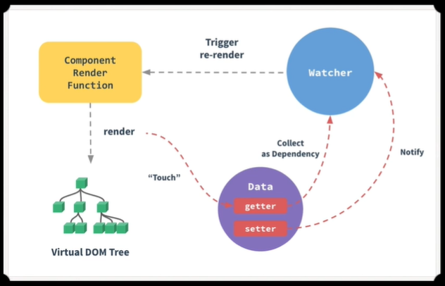

# Vue 优点

- 轻量级、渐进式框架

- 虚拟DOM与differ算法

  是在传统开发中，用JQuery或者原生的JavaScript DOM操作函数对DOM进行频繁操作的时候，浏览器要不停的渲染新的DOM树，导致页面看起来非常卡顿。

  虚拟DOM预先通过JavaScript进行各种计算，只操作变更部分。

- 响应式与双向数据绑定

  响应式：Vue状态变化 -> 更新相应数据 + 视图

  双向数据绑定：通过v-model属性绑定input标签的value与Vue的状态，两者同步改变，并更新相应数据 + 视图

- 组件化

  借鉴模块化的思想，将问题拆解为子问题（分治思想），并可实现代码的复用

# 响应式原理

> At the top, we have our data object and our variables.
>
> `data` 对象中存储着变量

> We have our Dep class with our storage, our depend method and our notify method to rerun each of our subscribers.
>
> `Dep` 类中有：
>
> - 用来存储 `subscribers` 的属性
> - `depend` 方法
> - 用来重新运行每个 `subscribers` 的 `notify` 方法

> Further down, we go through each keys of our object,
>
> get our internal value, instantiate our Dep class,
>
> go through call define property.
>
> There's our get method, there's our set method.
>
> 遍历 `data` 对象的每一个键，通过键获取值；创建 `Dep` 类的实例；调用 `defineProperty` 设置 `get()` 和 `set()`

> Further down, we have our watcher function, which is a little simplified.
>
> We just set our target, run it and then unset it.
>
> 简化的 `watcher`：设置 `target`，执行，重置

> And then down here, we have two watchers for running the total and the sale price.
>

> As you can see here, we have data getters and setter.
>
> That's using object define property.
>
> When get is run on a reactive property, we collect it
>
> as a dependency and call dep depend on our Dep class,
>
> and when our property is set, we call dep notify also
>
> on our Dep class.
>
> Notice Vue also has a watcher.
>
> It's also much more complex than the watcher we wrote,
>
> and we'll get there in future lessons.

# $nextTick

- [x] [面试必考：真的理解 $nextTick 么](https://jishuin.proginn.com/p/763bfbd2be01)

# keep-alive
