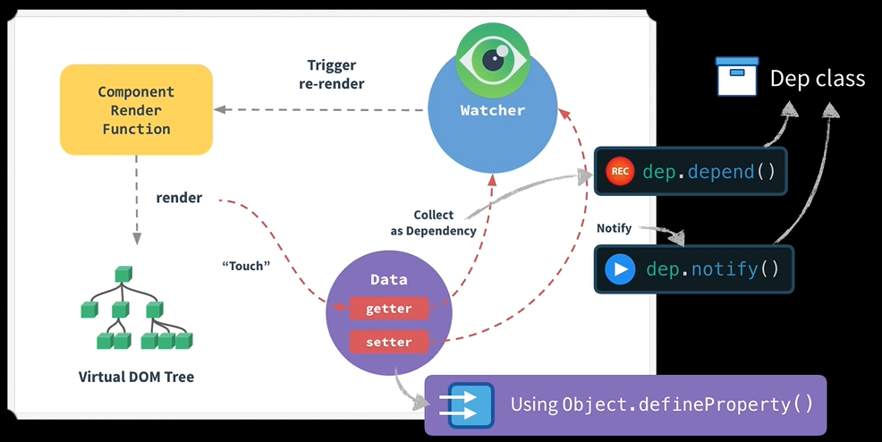
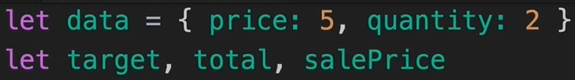
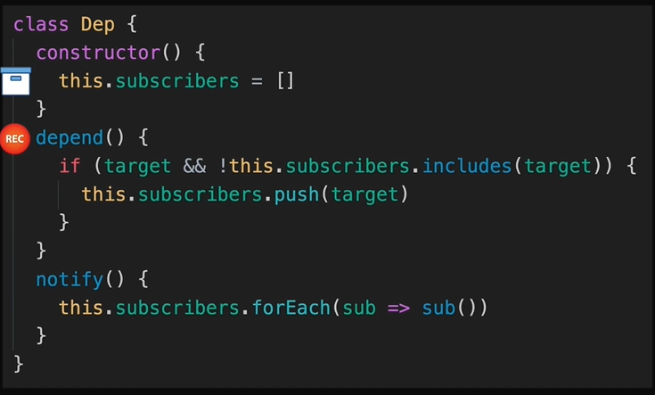
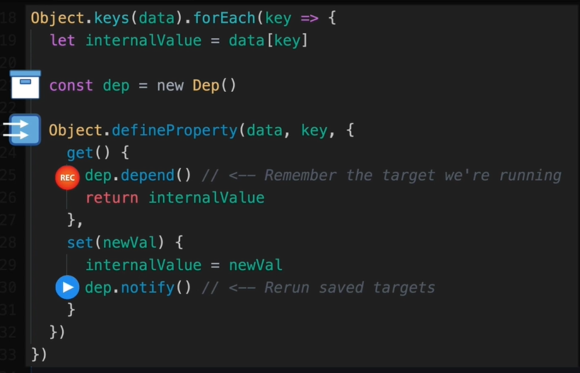
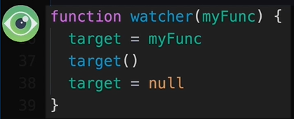
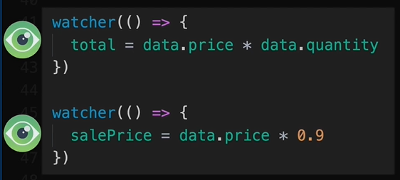

- [x] [最全的 Vue 面试题+详解答案](https://juejin.cn/post/6961222829979697165)

- [x] 响应式/双向数据绑定

  [Vue响应式原理](https://juejin.cn/post/6844903597986037768)

  [【视频】vue双向数据绑定原理](https://www.bilibili.com/video/BV1Dr4y1c7xS)

- [x] [面试必考：真的理解 $nextTick 么](https://jishuin.proginn.com/p/763bfbd2be01)

# Vue 优点

- 轻量级、渐进式框架

- 虚拟DOM与differ算法

  是在传统开发中，用JQuery或者原生的JavaScript DOM操作函数对DOM进行频繁操作的时候，浏览器要不停的渲染新的DOM树，导致页面看起来非常卡顿。

  虚拟DOM预先通过JavaScript进行各种计算，只操作变更部分。

- 响应式与双向数据绑定

  响应式：Vue状态变化 -> 更新相应数据 + 视图

  双向数据绑定：data数据可渲染到页面上；通过v-model属性绑定input标签的value与Vue的状态，两者同步改变，并更新相应数据 + 视图

- 组件化

  借鉴模块化的思想，将问题拆解为子问题（分治思想），并可实现代码的复用

# 响应式原理

**响应式简述**：

修改Vue中的data，该赋值操作会被Vue劫持 -> Vue将数据的变化，通知给每个订阅者 -> 订阅者（DOM元素）根据最新数据更新内容。



其中，依赖收集是通过`Dep`类实现的。该类包含了用来存储`watcher`的`subscribers`数组、用来追加`watcher`的`depend`方法、用来通知所有`watcher`更新内容的`notify`方法。

遍历 `data` 对象，为每一个属性（也就是Vue的状态）创建依赖收集器，通过`Object.defineProperty()`的`getter`和`setter`实现取值操作和赋值操作的劫持。当初始化`watcher`时，响应式属性被访问，在`getter`内部会调用`dep.depend()`，`watcher`被依赖收集器（`dep`）收集；当属性被重新赋值，在`setter`内部会调用`dep.notify()`来通知与该属性相关的所有`watcher`更新内容。

订阅者是通过`Watcher`实现的。订阅者（DOM元素）与Vue的状态相关联，初始化`watcher`时需传入更新内容所需的回调函数，订阅者会自动被依赖收集器存储，在相应的Vue状态改变时，会通过`dep.notify()`触发`watcher`的`update()`方法，调用回调函数，内容得到更新。

**技术点**：

- 发布订阅模式

  `Dep` 类：依赖收集

  `Watcher` 类：订阅一些事件

- `Object.defineProperty()` **数据劫持**

**手撕（简易版）**： 

| `data` 对象中存储着变量                                      |  |
| ------------------------------------------------------------ | ------------------------------------------------------------ |
| `Dep` 类（**依赖收集**）中有：<br/>①`subscribers` 数组：用来存储所有的订阅信息<br/>②`depend` 方法：追加订阅信息，**收集订阅**<br/>③`notify` 方法：循环触发数组中的每个订阅信息，**发布订阅** |  |
| 遍历 `data` 对象；<br/>创建 `Dep` 类的实例；<br/>调用 `defineProperty` 设置 `get()` 和 `set()`，**数据劫持** |  |
| `watcher` 负责**订阅一些事件**<br/>简化的 `watcher`：设置 `target`，执行，重置<br/>代码中有两个`watcher`分别负责计算`total`和`sale price` | <br/> |

# 双向数据绑定

**是什么**

单向数据绑定（将Vue的data数据渲染到页面上） -> 双向数据绑定（修改input框中的值，Vue的data改变）

**技术点**：

- 发布订阅模式

  `Dep` 类：依赖收集

  `Watcher` 类：订阅一些事件

- `Object.defineProperty()` **数据劫持**

- 数组`reduce()` 链式获取对象的属性值

**单向数据绑定**

在对 HTML 结构进行模板编译的方法 Compile 中，

创建**文档碎片**，可提高 DOM 操作的性能：

普通做法，DOM 元素已经显示在页面中。在编译时，每遇到一个插值表达式，就要通过 JS 操作来更新 DOM 元素的内容。这样频繁地操作 DOM，会频繁触发重排和重绘。

文档碎片，是在内存中开辟一块区域，把 DOM 节点存入。页面上没有 DOM 节点，是一片空白区域。编译时，在内存中操作文档碎片，不是直接操作 DOM 元素。把数据填充到插值表达式中的操作全部完成后，再一次性将文档碎片渲染到页面上。不会触发重排和重绘。

通过数组的**`reduce()`**方法，来链式获取对象的属性值。

```js
const obj = {
    name: 'zs',
    age: 20,
    info: {
        a: 'a1',
        c: 'c1'
    }
}

str = "info.a"

// 获取 obj.info.a 属性值
// reduce 方法遍历数组时,依赖上一次迭代的结果
str.split('.').reduce((newObj, k) => newObj[k], obj)
```


# $nextTick


# keep-alive
