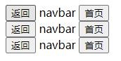
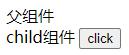

# <a id='zero'></a>目录

| 目录 |
| --- |
| [一 介绍](#one) |
| [二 模板语法](#two) |
| &emsp;&emsp;[2.1 插值{{}}](#two-one) |
| &emsp;&emsp;[2.2 指令](#two-two) |
| &emsp;&emsp;[2.3 缩写](#two-three) |
| [三 class与style](#three) |
| &emsp;&emsp;[3.1 class 绑定](#three-one) |
| &emsp;&emsp;[3.2 style 绑定](#three-two) |
| [四 条件渲染](#four) |
| &emsp;&emsp;[4.1 v-if](#four-one) |
| &emsp;&emsp;[4.2 v-else](#four-two) |
| &emsp;&emsp;[4.3 v-else-if](#four-three) |
| &emsp;&emsp;[4.4 template v-if ,包装元素template 不会被创建](#four-four) |
| &emsp;&emsp;[4.4 v-show](#four-four) |
| [五 列表渲染](#five) |
| &emsp;&emsp;[5.1 v-for](#five-one) |
| &emsp;&emsp;[5.2 key](#five-two) |
| &emsp;&emsp;[5.3 数组更新检测](#five-three) |
| &emsp;&emsp;[5.4 应用：列表过滤](#five-four) |
| [六 事件处理](#six) |
| &emsp;&emsp;[6.1 事件处理器](#six-one) |
| &emsp;&emsp;[6.2 事件修饰符 ](#six-two) |
| &emsp;&emsp;[6.3 按键修饰符](#six-three) |
| [七 表单控件绑定/双向数据绑定](#seven) |
| &emsp;&emsp;[7.1 表单控件绑定](#seven-one) |
| &emsp;&emsp;[7.2 购物车](#seven-two) |
| &emsp;&emsp;[7.3 表单修饰符](#seven-three) |
| [八 axios与fetch实现数据请求](#eight) |
| &emsp;&emsp;[8.1 fetch](#eight-one) |
| &emsp;&emsp;[8.2 axios](#eight-two) |
| [九 计算属性](#nine) |
| &emsp;&emsp;[9.1 栗子](#nine-one) |
| &emsp;&emsp;[9.2 计算缓存 VS methods](#nine-two) |
| &emsp;&emsp;[9.3 重写过滤应用](#nine-three) |
| [十 虚拟dom与diff算法](#ten) |
| [十一 组件](#eleven) |
| &emsp;&emsp;[11.1 定义组件](#eleven-one) |
| &emsp;&emsp;[11.2 组件与Vue实例区别](#eleven-two) |
| &emsp;&emsp;[11.3 组件通信](#eleven-three) |
| &emsp;&emsp;[11.4 动态组件](#eleven-four) |
| [十二 slot插槽](#twelve) |
| &emsp;&emsp;[12.1 单个slot](#twelve-one) |
| &emsp;&emsp;[12.2 具名slot](#twelve-two) |
| [十三 transition过渡](#thirteen) |
| &emsp;&emsp;[13.1 单个元素/组件过渡](#thirteen-one) |
| &emsp;&emsp;[13.2 多个元素过渡(设置key)](#thirteen-two) |
| &emsp;&emsp;[13.3 多个组件过渡](#thirteen-three) |
| &emsp;&emsp;[13.4 列表过渡(设置key)](#thirteen-four) |
| [十四 生命周期](#fourteen) |
| &emsp;&emsp;[14.1 生命周期各个阶段](#fourteen-two) |
| &emsp;&emsp;[14.2 生命周期钩子函数](#fourteen-one) |
| [十五 过滤器](#fifteen) |
| [十六 swiper](#sixteen) |
| &emsp;&emsp;[16.1 swiper静态](#sixteen-one) |
| &emsp;&emsp;[16.2 swiper动态](#sixteen-two) |
| &emsp;&emsp;[16.3 在Vue中使用swiper](#sixteen-three) |
| &emsp;&emsp;[16.4 swiper 组件封装](#sixteen-four) |
| [十七 自定义指令](#seventeen) |
| &emsp;&emsp;[17.1 指令用法](#seventeen-one) |
| &emsp;&emsp;[17.2 指令轮播](#seventeen-two) |
| [十八 Vue-cli脚手架](#eighteen) |
| &emsp;&emsp;[18.1 单文件组件介绍](#eighteen-one) |
| &emsp;&emsp;[18.2 脚手架的安装](#eighteen-two) |
| &emsp;&emsp;[18.3 脚手架创建并启动项目](#eighteen-three) |
| &emsp;&emsp;[18.4 单文件组件](#eighteen-four) |
| &emsp;&emsp;[18.5 多个单文件组件_scoped](#eighteen-five) |
| &emsp;&emsp;[18.6 eslint+打包](#eighteen-six) |
| &emsp;&emsp;[18.7 反向代理配置](#eighteen-seven) |

搜索“`千锋教育_Vue全套教程全开源_Vue.js入门（强烈推荐）`”关键字

# <a id='one'></a>一 (001)-介绍  

> [返回目录](#zero)

[Vue官网](https://cn.vuejs.org/)  

**渐进式**：随着业务需求的增加，可以满足不同场景的需求。如：要做一个多页面的开发，只希望将Vue当作模板来使用——支持；需要将Vue做成一个创建组件的系统——支持；若要做一个单页面的应用，Vue也有相应的一套路由来支持单页面应用。  

> - [x] [NingJS · Vue.js: the Past and the Future, Evan You, Author of Vue.js - Nanjing September 2016](https://www.youtube.com/watch?v=EiTORdpGqns)
>
> 原作者对于“渐进式框架”的解释：
>
> 前端框架可以做到事情特别多，如果把它想剥洋葱一样剥开：最核心的部分是声明式渲染（避免手动操作DOM，状态变，DOM自动更新重新渲染）和组件系统，客户端路由（单页面应用需要用到），大规模状态管理（当应用变大时，需要对多组件之间的沟通、状态的共享有一个解决方案），构建工具（babel），数据持久化……
>
> 
>
> 在Vue中，把每一块做的尽量的解耦。如果项目规模比较小/只想使用其中一部分，Vue的核心是声明式渲染和组件系统，不需要关心其他任何部分（如构建工具），即可使用Vue的库（通过script标签引入）；但当需要其他部分时，可以选择性地把对应的组件加入进来，使用起来有一种框架式的体验。

**使用：**

1. CDN 引入
2. 用 npm 安装

**栗子**  

```HTML
<body>
	<div id="box">
		{{ 10+20 }}
		<p>{{ myname }}</p>
	</div>

	<div>
		{{ 10+20 }}
	</div>
	<script>
		var vm = new Vue({
			el: "#box", // Vue 开始渲染的地方
			data: { // 状态(变量)
				myname: "kerwin"
			}
		})
	</script>
</body>
```
  

HTML中使用Vue的模板语法，支持表达式。类似NodeJS中的模板EJS。  

不需要通过DOM来操作页面：  

  

  

# <a id='two'></a>二 模板语法
> [返回目录](#zero)

## <a id='two-one'></a>2.1 (002)-插值{{}}  
> [返回目录](#zero)

说白了就是双大括号的用法，双大括号内部就是JS的地盘。  
### 表达式
双大括号可以处理+-*/，三目运算符  

[函数表达式](#seven-two)

```HTML
<body>
	<div id="box">
		{{ 10+20 }}
		{{10>20?'aaa':'bbb'}}
	</div>
	<script>
		var vm = new Vue({
			el: "#box",
		})
	</script>
</body>
```
### 文本
双大括号内部不加引号，会当做变量(在Vue中叫做状态)来对待  
```HTML
<body>
	<div id="box">
		{{ myname }}
	</div>
	<script>
		var vm = new Vue({
			el: "#box",
			data: { // 状态
				myname: "kerwin",
			}
		})
	</script>
</body>
```
### 纯HTML
```HTML
<body>
	<div id="box">
		{{ myhtml }}
	</div>
	<script>
		var vm = new Vue({
			el: "#box",
			data: { // 状态
				myhtml: "<b>11111111</b>"
			}
		})
	</script>
</body>
```
将字符串显示在页面上  

与v-html区别：  

```HTML
<body>
	<div id="box">
		<div v-html="myhtml"></div>
	</div>
	<script>
		var vm = new Vue({
			el: "#box",
			data: { // 状态
				myhtml: "<b>11111111</b>"
			}
		})
	</script>
</body>
```
  

v-html是html标签的自定义属性(在Vue中以v-开头的属性叫指令)，不能随意使用v-html，内容可信任的时候才可以使用。不当使用可能会被攻击，比如html元素是一个危险的script标签。  

- [x] [XSS攻击](https://tech.meituan.com/2018/09/27/fe-security.html)  

防止XSS，csrf：(1)前端过滤(2)后台转义(<> &lt &gt)(3)给cookie加上属性HttpOnly  

## <a id='two-two'></a>2.2 (003)-指令  
> [返回目录](#zero)

指令是带有v前缀的特殊属性  
### ```v-html```  
### ```v-show```动态地显示和隐藏  

在 Vue 中，不希望操作 DOM，因此出现了另一种控制标签显示和隐藏的方法：`v-show` 指令

其实是加了一个 `display: none;` CSS 属性

```HTML
<body>
	<div id="box">
		<div v-show="isShow">显示/隐藏</div>
	</div>
	<script type="text/javascript">
		var vm = new Vue({
			el: "#box",
			data: {
				isShow: true,
			}
		})
	</script>
</body>
```
  

  

  

### ```v-if```动态地创建和删除  
```HTML
<body>
	<div id="box">
		<div v-if="isCreated">创建/删除</div>
	</div>
	<script type="text/javascript">
		var vm = new Vue({
			el: "#box",
			data: {
				isCreated: true,
			}
		})
	</script>
</body>
```
在控制台 `vm.isCreated=false`，则标签删除

### ```v-bind:value```动态绑定  

后面是JS的地盘  

缩写：```:value```  

### ```v-on:click```绑定事件  
缩写：```@click```  
### ```v-for```  
## <a id='two-three'></a>2.3 缩写
> [返回目录](#zero)

v-bind:src => :src  
v-on:click => @click  
# <a id='three'></a>三 class与style
> [返回目录](#zero)

## <a id='three-one'></a>3.1 (004)-class 绑定  
> [返回目录](#zero)

需求：动态切换CSS样式。  

实现：动态绑定class，点击按钮切换class。

### 三目语法
```HTML
<body>
	<div id="box">
		<button @click="handleClick()">click</button>
		<div :class="isActive?'red':'yellow'">我是动态绑定class-三目写法</div>
	</div>

	<script type="text/javascript">
		var vm = new Vue({
			el: "#box",
			data: {
				isActive: true,
			},
			methods: {
				handleClick() {
					this.isActive = !this.isActive
				}
			}
		})
	</script>
</body>
```
### 对象语法

如果要绑定更多的class，三目语法不再适用

```HTML
<body>
	<div id="box">
		<div :class="classobj">我是动态绑定class-对象写法</div>
	</div>

	<script type="text/javascript">
		var vm = new Vue({
			el: "#box",
			data: {
				classobj: {
					a: true,
					b: true
					// a b, class名字
				},
			},
		})
	</script>
</body>
```


**修改class**：控制台```vm.classobj.a = false```  

**问题**：```vm.classobj.c = true```无法添加新的class c。  

原因：涉及到Vue的更新原理。在定义classobj状态时，生成了`get a`,`set a`,`get b`,`set b`方法，因此只能对状态中已经定义的属性进行true/false的设置。  

  

### 数组语法

解决无法添加新的class的问题

```HTML
<body>
	<div id="box">
		<div :class="classarr">我是动态绑定class-数组写法</div>
	</div>

	<script type="text/javascript">
		var vm = new Vue({
			el: "#box",
			data: {
				classarr: ["a", "b"],
			},
		})
	</script>
</body>
```
使用操作数组的方法即可修改class，可添加新class。

`vm.classarr.push("c")`

## <a id='three-two'></a>3.2 (005)-style 绑定  
> [返回目录](#zero)

对内联样式的动态修改，比class麻烦  

对于原生JS，可获取DOM节点，直接修改内联样式

在Vue中，v-bind绑定(`:style`为`v-bind:style`的简写)后，后面是JS的地盘  

**三目语法**：

```HTML
<body>
	<div id="box">
		<button @click="handleClick()">click</button>
		<div :style="'background:'+(isActive?'red':'yellow')">我是动态绑定style-三目写法</div>
		<div :style="styleobj">我是动态绑定style-对象写法</div>
		<div :style="stylearr">我是动态绑定style-数组写法</div>
	</div>

	<script type="text/javascript">
		var vm = new Vue({
			el: "#box",
			data: {
				isActive: true,
				styleobj: {
					backgroundColor: "red"
				},
				stylearr: []
			},
			methods: {
				handleClick() {
					this.isActive = !this.isActive
				}
			}
		})
	</script>
</body>
```
**对象语法**：不能新加样式(原理同class绑定)。  

想修改之前，可以先看一看原来的值是什么格式，再修改。

  

**数组语法**：样式的增加和移除举例如下  

  

# <a id='four'></a>四 (006)-条件渲染  
> [返回目录](#zero)

## <a id='four-one'></a>4.1 v-if
> [返回目录](#zero)

```HTML
<body>
	<div id="box">
		<button @click="handleClick()">click</button>
		<div v-if="isCreated">动态创建和删除</div>
	</div>

	<script type="text/javascript">
		var vm = new Vue({
			el: "#box",
			data: {
				isCreated: false,
			},
			methods: {
				handleClick() {
					this.isCreated = !this.isCreated
				}
			},
		})
	</script>
</body>
```
  

**条件渲染分组**
如果想切换多个元素，在 `<template>` 元素上使用 `v-if`。包装元素 `<template>` 不会被创建

## <a id='four-two'></a>4.2 v-else  
> [返回目录](#zero)

### 小栗子  
```HTML
<body>
	<div id="box">
		<button @click="handleClick()">click</button>
		<div v-if="isCreated">动态创建和删除-1</div>
		<div v-else>动态创建和删除-2</div>
	</div>

	<script type="text/javascript">
		var vm = new Vue({
			el: "#box",
			data: {
				isCreated: false,
			},
			methods: {
				handleClick() {
					this.isCreated = !this.isCreated
				}
			},
		})
	</script>
</body>
```
    
### 应用
购物车是空的——显示"购物车空空如也"；非空——显示购物车内容列表  
```HTML
<body>
	<div id="box">
		<button @click="handleClick">加载购物车数据</button>
		<ul v-if="datalist.length">
			<li v-for="data in datalist">
				{{data}}
			</li>
		</ul>
		<div v-else>
			购物车空空如也
		</div>
	</div>

	<script type="text/javascript">
		var vm = new Vue({
			el: "#box",
			data: {
				datalist: [],
			},
			methods: {
				handleClick() {
					this.datalist = ["翘脚牛肉", "钵钵鸡", "麻辣烫", "豆花"]
				}
			},
		})
	</script>
</body>
```
  

  


## <a id='four-three'></a>4.3 v-else-if
> [返回目录](#zero)

```HTML
<body>
	<div id="box">
		<div v-if="which===1">1</div>
		<div v-else-if="which===2">2</div>
		<div v-else>3</div>
	</div>

	<script type="text/javascript">
		var vm = new Vue({
			el: "#box",
			data: {
				which: 1
			},
		})
	</script>
</body>
```
  

  

## <a id='four-four'></a>4.4 v-show
> [返回目录](#zero)


# <a id='five'></a>五 列表渲染
> [返回目录](#zero)

## <a id='five-one'></a>5.1 (007)-v-for 指令
> [返回目录](#zero)

(特殊 v-for="n in 10")  

v-for 后接 in/of 关键字均可，作用完全相同

### 遍历数组  
```HTML
<body>
	<div id="box">
		<ul>
			<li v-for="data in datalist">
				{{data}}
			</li>
		</ul>
	</div>

	<script type="text/javascript">
		var vm = new Vue({
			el: "#box",
			data: {
				datalist: ["111", "222", "333"],
			},
		})
	</script>
</body>
```

  
```HTML
<div id="box">
	<ul>
		<li v-for="(data,index) in datalist">
			{{data}}---{{index}}
		</li>
	</ul>
</div>
```
  
### 遍历对象  
```HTML
<body>
	<div id="box">
		<ul>
			<li v-for="data in obj">
				{{data}}
			</li>
		</ul>
	</div>

	<script type="text/javascript">
		var vm = new Vue({
			el: "#box",
			data: {
				obj: {
					name: "kerwin",
					age: 100,
					location: "dalian"
				}
			},
		})
	</script>
</body>
```
```HTML
<div id="box">
	<ul>
		<li v-for="(data,key) in obj">
			{{data}}---{{key}}
		</li>
	</ul>
</div>
```
  
## <a id='five-two'></a>5.2 (008)-key 属性
> [返回目录](#zero)

【引入】  

  

在列表中间插入新的节点55555  

Vue原理：数据拦截之后，创建新的虚拟DOM节点对比老的节点，对比的时候（通过索引值来对比不合理，需要修改一次节点，再在后面创建一个节点）**key值（唯一）**登场——  

1. 数组中把索引设置为key是没意义的，和上面说的情况是一样的。  
```HTML
<div id="box">
	<ul>
		<li v-for="(data,index) in datalist" key="index">
			{{data}}---{{index}}
		</li>
	</ul>
</div>
```
2. 把data设置为key  
- 跟踪每个节点的身份，从而重用和重新排序现有元素  
```HTML
<div id="box">
	<ul>
		<li v-for="(data,index) in datalist" key="data">
			{{data}}---{{index}}
		</li>
	</ul>
</div>
```
  
3. 把data.id设置为key  
- 理想的 key 值是每项都有的且唯一的 id。data.id  

  实际项目中，拿到的真实的后端数据中的大对象中，都会有id属性。后端传回来的唯一的不重复的属性，恰好作为前端列表渲染的key值，可以帮助你来复用，从而达到一个最佳的用户体验。  

## <a id='five-three'></a>5.3 (009)-数组更新检测
> [返回目录](#zero)

### 使原数组更新的方法
`push()` `pop()` `shift()` `unshift()` `splice()` `sort()` `reverse()`  

  

  

### 不使原数组更新的方法
`filter()`, `concat()` 和 `slice()`, `map()`  

  

想使用这些方法更新页面怎么做——**新数组给旧数组赋值**：  

  

### 无法检测的情况
通过索引值改变原数组：  

```vm.items[indexOfItem] = newValue```  

  

数组被修改了，但是页面并没有更新：  

  

【原因】  

push() pop()等方法在Vue中被重写了，修改数组的同时还会被检测到；而通过索引值修改数组的方法无法被Vue检测到  

【解决】  

- ```Vue.set(example.item, indexOfItem, newValue)```  

    

  该方法还可用于使用对象进行动态class绑定时，添加新class(之前讲过不能使用```vm.classobj.c = true```添加新的class c)  

    

- ```splice```

  `vm.datalist.splice(0, 1, "kerwin");`

    

    

## <a id='five-four'></a>5.4 (010~011)-应用：列表过滤
> [返回目录](#zero)

【模糊查询】  

输入一个字符之后，他会把数组中包含这个字符的所有元素选出来，并且展示到用户界面上。当持续不断的输入时，会随时检测出匹配这样一个字段的内容。  

【构建界面】  

```HTML
<body>
	<div id="box">
		<input type="text" />
		<ul>
			<li v-for="data in datalist">
				{{data}}
			</li>
		</ul>
	</div>

	<script type="text/javascript">
		var vm = new Vue({
			el: "#box",
			data: {
				datalist: ["aaa", "bbb", "ccc", "ddd", "add", "cee", "eee"], // 假数据
			},
		})
	</script>
</body>
```
  

希望做到列表筛选的功能，如：输入'a'，只显示列表中包含'a'的列表项，'aaa'，'add'。  

【添加事件】  

原生JS中，input元素有input事件，当输入框的value值改变时触发  

```HTML
<body>
	<div id="box">
		<input type="text" @input="handleInput" />
		<ul>
			<li v-for="data in datalist">
				{{data}}
			</li>
		</ul>
	</div>

	<script type="text/javascript">
		var vm = new Vue({
			el: "#box",
			data: {
				datalist: ["aaa", "bbb", "ccc", "ddd", "add", "cee", "eee"], // 假数据
			},
			methods: {
				handleInput() {
					console.log("只要value改变，就会触发")
				}
			}
		})
	</script>
</body>
```
  
>相关事件：change事件，在失去焦点时触发，和传统事件中的blur事件相同  

【获取输入框的字符——双向数据绑定状态】```v-model```  
```HTML
<body>
	<div id="box">
		<input type="text" @input="handleInput()" v-model="mytext" />
		<ul>
			<li v-for="data in datalist">
				{{data}}
			</li>
		</ul>
	</div>

	<script type="text/javascript">
		var vm = new Vue({
			el: "#box",
			data: {
				mytext: '',
				datalist: ["aaa", "bbb", "ccc", "ddd", "add", "cee", "eee"], // 假数据
			},
			methods: {
				handleInput() {
					console.log(this.mytext)
				}
			}
		})
	</script>
</body>
```
  

  

【过滤数组元素——filter函数】  

```HTML
<body>
	<div id="box">
		<input type="text" @input="handleInput()" v-model="mytext" />
		<ul>
			<li v-for="data in datalist">
				{{data}}
			</li>
		</ul>
	</div>

	<script type="text/javascript">
		var vm = new Vue({
			el: "#box",
			data: {
				mytext: '',
				datalist: ["aaa", "bbb", "ccc", "ddd", "add", "cee", "eee"], // 假数据
			},
			methods: {
				handleInput() {
					console.log(this.mytext)
					//filter 过滤
					var newlist = this.datalist.filter(item => item.indexOf(this.mytext) > -1)
					console.log(newlist)
				}
			}
		})
	</script>
</body>
```
  

【解决原数组不被更新】  

这里不能用简单粗暴的给datalist赋值解决，否则下次过滤无法直接对原始数据进行过滤，而是对已经被过滤过的数据进行过滤  

解决办法：  

1. [计算属性](#nine-three)(后面会学习的优雅的方法)
2. 原始数据备份(笨办法)
```HTML
<script type="text/javascript">
	//["aaa","bbb","ccc","ddd","add","cee","eee"]        
	var vm = new Vue({
		el: "#box",
		data: {
			mytext: '',
			datalist: ["aaa", "bbb", "ccc", "ddd", "add", "cee", "eee"],
			list: ["aaa", "bbb", "ccc", "ddd", "add", "cee", "eee"]
		},
		methods: {
			handleInput() {
				console.log(this.mytext);

				//filter 过滤
				this.datalist = this.list.filter(item => item.indexOf(this.mytext) > -1)
			}
		}
	})
</script>
```

# <a id='six'></a>六 事件处理
> [返回目录](#zero)

## <a id='six-one'></a>6.1 (012)-事件处理器
> [返回目录](#zero)

### 直接触发代码
当事件中的逻辑及其简单，只有一句话(如取反、赋值)，可使用该方法  
```HTML
<body>
	<div id="box">
		<button @click="isShow = !isShow">click3</button>

		<div v-show="isShow">111111111111111</div>
	</div>

	<script type="text/javascript">
		var vm = new Vue({
			el: "#box",
			data: {
				isShow: false,
			},
		})
	</script>
</body>
```
在模板中没有```this```：在模板中访问状态，从来不加this，因为它会自动找到当前实例来进行初始化。（当然加上 this 也可以运行，只是没必要）  

将逻辑写到模板中，很多JS代码混入到HTML代码中，使得模板的**可维护性极差**，不建议！！！

### 写函数名 
handleClick  

【函数名、函数表达式】  

不传入参数的前提下，两种方法相同；若需要传参，需要有括号

```HTML
<body>
	<div id="box">
		<button @click="handleClick">click1</button>
		<button @click="handleClick()">click2</button>

		<div v-show="isShow">111111111111111</div>
	</div>

	<script type="text/javascript">
		var vm = new Vue({
			el: "#box",
			data: {
				isShow: false,
			},
			methods: {
				handleClick() {
					this.isShow = !this.isShow
				},
			}
		})
	</script>
</body>
```
### 执行函数表达式 
handleClick($event)，$event为事件对象，不写$event也会把事件对象传函数

## <a id='six-two'></a>6.2 (013)-事件修饰符 
> [返回目录](#zero)

- [x] [Vue官方文档](https://cn.vuejs.org/v2/guide/events.html)  

【冒泡】  

经常遇到触发孩子上的事件时，父亲上的方法也被触发了——冒泡  

Vue中也存在冒泡的现象  

```HTML
<ul @click="handleUlClick()">
	<li @click="handleLiClick()">11111</li>
	<li>2222</li>
	<li>3333</li>
</ul>
```
```HTML
<script type="text/javascript">
	var vm = new Vue({
		el: "#box",
		methods: {
			handleLiClick() {
				console.log("li click")
			},
			handleUlClick() {
				console.log("ul click")
			},
		}
	})
</script>
```
  

  

【阻止冒泡】  

1. 原生JS方法  
```HTML
<ul @click="handleUlClick()">
	<li @click="handleLiClick($event)">11111</li>
	<li>2222</li>
	<li>3333</li>
</ul>
```
```HTML
<script type="text/javascript">
	var vm = new Vue({
		el: "#box",
		methods: {
			handleLiClick(ev) {
				ev.stopPropagation();
				console.log("li click")
			},
			handleUlClick() {
				console.log("ul click")
			},
		}
	})
</script>
```
  
2. 事件修饰符(Vue中的方法)
```HTML
<ul @click="handleUlClick()">
	<li @click.stop="handleLiClick()">11111</li>
	<li>2222</li>
	<li>3333</li>
</ul>
```
自动调用阻止冒泡的方法  

【事件修饰符】  
1. ```stop```阻止冒泡  

  与原生JS中 ```stopPropagation()``` 对应  

2. ```prevent```阻止(a链接/表单提交按钮)默认行为  

  `<a href="http://www.baidu.com" @click.prevent="handleChangePage()">changepage</a>`

  与原生JS中 ```preventDefault()``` 对应  

3. 父元素上```self```：事件源为自己——触发；事件源为孩子冒泡冒上来的——不触发  

  与阻止冒泡不同

4. ```once```事件只执行一次  

  应用：抽奖只有一次机会  

## <a id='six-three'></a>6.3 (014)-按键修饰符
> [返回目录](#zero)

做一个to do list，希望一回车就可以添加内容，而不需要点击输入框后面的按钮  
1. keyup事件——原生JS  

  如果用keyup事件来做，每抬起一个按键就会触发一次  
```HTML
<input type="text" @keyup="handleKeyup($event)" />
```
```JS
handleKeyup(ev) {
	if(ev.keyCode===13){
	    console.log("执行todolist 添加动作")
	}
}
```
所有代码都得写到if中  
2. 按键修饰符  
```HTML
<input type="text" @keyup.enter="handleKeyup()" />
```
```JS
handleKeyup() {
	console.log("执行todolist 添加动作")
}
```

【按键修饰符】  

`enter` `space` `up` `down` `left` `right`  

并不是所有按键都和名字对应好的（如字母 W）。也可使用键值，如enter和`ev.keyCode===13`等价  

# <a id='seven'></a>七 表单控件绑定/双向数据绑定
> [返回目录](#zero)

## <a id='seven-one'></a>7.1 (015~016)-表单控件绑定  
> [返回目录](#zero)

### 输入框  
```HTML
<input type="text" v-model="mytext"/>
```
```HTML
<script type="text/javascript">
	var vm = new Vue({
	 el:"#box",
	 data:{
		mytext:"",
	 }
   })
</script>
```
通过```v-model="mytext"```，不需要操作DOM节点取value值，直接使用状态mytext即可获取表单输入框中的value值  

从输入框修改表单value值，状态mytext会改变；从控制台修改状态mytext值，输入框的表单value值也会改变，因此```v-model```指令是一种**双向数据绑定**  

### 多行输入框  
```HTML
<textarea v-model="mytext"></textarea>
```
```HTML
<script type="text/javascript">
	var vm = new Vue({
	 el:"#box",
	 data:{
		mytext:"",
	 }
   })
</script>
```
  
### 多选框的单选应用  

**栗子**：可勾选的“记住用户名”选项

原生JS方法：获取DOM节点，.checked属性  

Vue中：```v-model="isChecked"```，isChecked为布尔值，访问isChecked状态即可读取是否勾选  

```HTML
<input type="checkbox" v-model="isChecked"/>记录用户名
```
```HTML
<script type="text/javascript">
	var vm = new Vue({
	 el:"#box",
	 data:{
		isChecked:true,
	 }
   })
</script>
```
### 多选框的多选应用  
**栗子**：  

原生JS方法：获取DOM节点，for循环遍历.checked属性  

Vue中：绑定数组，给多选框设置value值  

```HTML
<p>你喜欢的运动？
	<input type="checkbox" v-model="checkgroup" value="游泳"/>游泳
	<input type="checkbox" v-model="checkgroup" value="滑冰"/>滑冰
	<input type="checkbox" v-model="checkgroup" value="长跑"/>长跑
</p>
```
```HTML
<script type="text/javascript">
	var vm = new Vue({
		el:"#box",
		data:{
			checkgroup:[],
		}
	})
</script>
```
  
### 单选框  
绑定字符串  
```HTML
<p>你最喜欢的开发语言？
	<input type="radio" v-model="picked" value="php" />php
	<input type="radio" v-model="picked" value="js" />js
	<input type="radio" v-model="picked" value="java" />java
</p>
```
```HTML
<script type="text/javascript">
	var vm = new Vue({
		el:"#box",
		data:{
			picked: ""
		}
	})
</script>
```

## <a id='seven-two'></a>7.2 (017~020)-应用：购物车  
> [返回目录](#zero)

【bind:value】
  

多选框value绑定内容可以是data.id，可以是data.number*data.price；

这里绑定data  

```HTML
<ul>
	<li v-for="data in datalist">
		<input type="checkbox" v-model="checkgroup" :value="data" />
		{{data}}
	</li>
</ul>
```
  

【计算总金额】  


传统方法：需要为复选框绑定点击事件、之后还要为加减商品数量的按钮绑定点击事件，非常麻烦  

Vue：使用模板渲染一个函数调用（用[计算属性](#nine-three)更好），来计算总金额  

函数什么时候被调用？  

函数计算中的状态改变后，状态被拦截，函数会自动执行一遍  

```HTML
<p>总金额计算:{{ getSum() }}</p>
```
```JS
getSum() {
	// 函数计算中的状态改变后， 函数会自动执行一遍
	var sum = 0;
	for (var i in this.checkgroup) {
		sum += this.checkgroup[i].number * this.checkgroup[i].price
	}
	return sum
},
```
【全选】  

点击全选框后，复选框随之修改：由于使用了双向绑定，value值和状态值可以互相影响。修改复选框的状态值即可设置value值，从而勾选/取消勾选复选框  

```HTML
<input type="checkbox" @change="handleChange" v-model="isAllChecked" />
```
```JS
handleChange() {
	console.log("改变了", this.isAllChecked)
	if (this.isAllChecked) {
		this.checkgroup = this.datalist
	} else {
		this.checkgroup = []
	}
}
```
点击复选框后，若符合条件，全选框随之修改：需要给所有复选框添加点击事件(用change事件来实现点击即触发的效果)  
```HTML
<input type="checkbox" v-model="checkgroup" :value="data" />
```
改为：  
```HTML
<input type="checkbox" v-model="checkgroup" :value="data" @change="handleLiChange" />
```
```JS
handleLiChange() {
	if (this.checkgroup.length === this.datalist.length) {
		this.isAllChecked = true
	} else {
		this.isAllChecked = false
	}
}
```
【动态修改数量】  


增加操作可以写直接触发代码`<button @click="data.number++">add</button>`

减少操作需要调用函数实现逻辑  

`<button @click="handleDelClick(data)">del</button>`

```js
handleDelClick(data) {
    // data.number
}
```

## <a id='seven-three'></a>7.3 (021)-表单修饰符  
> [返回目录](#zero)

1. ```lazy```  

  ```v-model```指令非常勤快，使状态时时刻刻跟着value值变化  

  ```lazy```修饰符：失去焦点时，状态才随着value值更新，节省资源  

  ```html
  <input type="text" v-model.lazy="mytext" />
  ```

    

    

  【注】  

  在过滤应用实例中，讲过文本输入框的input事件会在value值改变时就触发，change事件会在失去焦点时才触发。  

  input——勤劳的，v-model——勤劳的：可搭配在一起，随时触发  

  ```html
  <input type="text" @input="handleInput()" v-model="mytext" />
  ```

  input——勤劳的，v-model.lazy——懒惰的：搭配在一起不报错但是会出错  

  ```html
  <input type="text" @input="handleInput()" v-model.lazy="mytext" />
  ```

  change——懒惰的，v-model.lazy——懒惰的：可搭配在一起，失去焦点时触发  

  ```html
  <input type="text" @change="handleInput()" v-model.lazy="mytext" />
  ```

2. ```number```(鸡肋)  

   ```html
   <input type="text" v-model.number="mynumber" />
   ```

   【输入值以数字开头】  

   状态值不会随着输入的value值中不是number的乱七八糟的部分更新  

     

   失去焦点后，由于双向绑定，输入框中的value值被状态值更新  

     

   【输入值不以数字开头】  

   修饰符失效  

   【解决】  

   ```html
   <input type="number" v-model="mynumber" />
   ```

3. ```trim```  

  去除表单中的首尾空格(注册用户名的场景可以使用)，原生JS方法是使用正则表达式  

  ```html
  <input type="text" v-model.trim="myusername" />
  ```

# <a id='eight'></a>八 axios与fetch实现数据请求  
> [返回目录](#zero)

与框架没有关系(原生JS/jQuery/Vue都可以使用)，fetch是一种标准，axios是第三方库。  
## <a id='eight-one'></a>8.1 (022)-fetch  
> [返回目录](#zero)

不是库，而是W3C的一种标准。  

【背景】  

XMLHttpRequest 是一个设计粗糙的 API，配置和调用方式非常混乱，而且基于事件的异步模型写起来不友好。  

【缺点】  

兼容性不好  

Chrome支持  

  

>- [x] [polyfill](https://github.com/camsong/fetch-ie8)

【用法】  
```JS
fetch("./json/test.json").then(res => {
	console.log(res)
});
```
  
第一个.then取得的只是返回头的一些信息，必须链式调用第二个.then才会取得数据  
```JS
fetch("./json/test.json").then(res => res.json()).then(res => {
	console.log(res)
});
```
  

【运用在Vue项目中】  
```HTML
<div id="box">
	<button @click="handleClick()">获取影片信息</button>
	<ul>
		<li v-for="data in datalist">
			<h3>{{data.name}}</h3>
			
		</li>
	</ul>
</div>
<script type="text/javascript">
	new Vue({
		el: "#box",
		data: {
			datalist: []
		},
		methods: {
			handleClick() {
				fetch("./json/test.json").then(res => res.json()).then(res => {
					console.log(res.data.films)
					this.datalist = res.data.films
				})
			}
		}
	})
</script>
```
  

>【注意】  
>Fetch 请求默认是不带 cookie 的，需要设置 fetch(url, {credentials:'include'})  

## <a id='eight-two'></a>8.2 (023)-axios  
> [返回目录](#zero)

是第三方库，专门做Ajax请求的，Vue作者强烈推荐去使用这个库  

【下载方式】  

1. 模块化下载  
```
npm install axios
```
2. 通过cdn的方式直接由script标签引入axios.js  
```HTML
<script src="https://unpkg.com/axios/dist/axios.min.js"></script>
```

【运用在Vue项目中】  

axios将数据自动包装在data属性中，需要通过res.data才能取到真正的后端传回的数据  

对于同一个栗子```./json/test.json```  

  

fetch中：```res.data.films```即可取到films数据  

axios中：```res.data.data.films```方能取到films数据  

```JS
handleClick() {
	axios.get("./json/test.json").then(res => {
		console.log(res.data.data.films) // axios 自动包装data属性 res.data
		this.datalist = res.data.data.films
	}).catch(err => {
		console.log(err);
	})
}
```

# <a id='nine'></a>九 (024~025)-计算属性  
> [返回目录](#zero)

【原因】  

复杂逻辑(即JS代码)，模板难以维护。计算属性将逻辑移到JS中，而不是模板中  

## <a id='nine-one'></a>9.1 栗子
> [返回目录](#zero)

后端返回一个小写的字符串，前端需要把首字母大写的字符串显示在页面中

```HTML
<!-- 将逻辑写到模板中 -->
<div id="box">
	{{myname.substring(0,1).toUpperCase() + myname.substring(1)}}
</div>

<script type="text/javascript">
	var vm = new Vue({
		el: "#box",
		data: {
			myname: "xiaoming"
		}
	})
</script>
```

## <a id='nine-two'></a>9.2 计算属性 VS methods
> [返回目录](#zero)

```HTML
<!-- 计算属性-->
<div id="box">
	<p>计算属性:{{getMyName}}</p>
</div>

<script type="text/javascript">
	var vm = new Vue({
		el: "#box",
		data: {
			myname: "xiaoming"
		},
		computed: {
			getMyName() {
				return this.myname.substring(0, 1).toUpperCase() + this.myname.substring(1)
			}
		}
	})
</script>
```
计算属性**定义起来像**一个**函数**一样，**使用起来像**一个**属性**一样(不加括号)。依赖的状态改变了，计算属性会重新计算一遍  

```HTML
<!-- 普通方法 -->
<div id="box">
	<p>普通方法:{{getMyNameMethod()}}</p>
</div>

<script type="text/javascript">
	var vm = new Vue({
		el: "#box",
		data: {
			myname: "xiaoming"
		},
		methods: {
			getMyNameMethod() {
				return this.myname.substring(0, 1).toUpperCase() + this.myname.substring(1)
			}
		},
	})
</script>
```
普通方法使用时必须加括号  

【计算属性与普通方法的区别】  

计算属性与普通方法唯一的区别就是调用时是否使用括号？——大错特错  

计算属性的性能比普通方法高一些。  

在一个页面中，若一个计算结果要**在多个位置使用**，计算属性性能的优越之处就体现出来了  

普通方法只要调用一次，方法就会重新执行一次；而计算属性计算过以后，会把计算结果缓存下来（只是在内存中的一个缓存，刷新页面就丢了），当在页面多处使用时，只调用一次  

【计算属性的特点】  
1. 依赖的状态改变了，计算属性会重新计算一遍  
2. 计算属性会缓存  

## <a id='nine-three'></a>9.3 重写过滤应用  
> [返回目录](#zero)

```HTML
<!-- 计算属性-->
<div id="box">
	<input type="text" v-model="mytext" />

	<ul>
		<li v-for="data in newList">
			{{data}}
		</li>
	</ul>
</div>

<script type="text/javascript">
	var vm = new Vue({
		el: "#box",
		data: {
			mytext: '',
			datalist: ["aaa", "bbb", "ccc", "ddd", "add", "cee", "eee"],
		},
		computed: {
			newList() {
				return this.datalist.filter(item => item.indexOf(this.mytext) > -1)
			}
		}
	})
</script>
```

```HTML
<!-- 普通方法 -->
<div id="box">
	<input type="text" v-model="mytext" />

	<ul>
		<li v-for="data in newList()">
			{{data}}
		</li>
	</ul>
</div>

<script type="text/javascript">
	var vm = new Vue({
		el: "#box",
		data: {
			mytext: '',
			datalist: ["aaa", "bbb", "ccc", "ddd", "add", "cee", "eee"],
		},
		methods: {
			newList() {
				return this.datalist.filter(item => item.indexOf(this.mytext) > -1)
			}
		}
	})
</script>
```

# <a id='ten'></a>十 (026)-虚拟dom与diff算法  
> [返回目录](#zero)

**Vue的更新原理**：  

数据修改后被ES5中固带的方法`Object.defineProperty`的`get` `set`拦截到后，通知watcher，watcher去重新渲染函数。  

**渲染**函数需要做很多事情：创新新的虚拟dom，对比老的虚拟dom节点(该过程称为diff)，做出一个补丁，打到真实的DOM上，真实DOM节点就被更新了。  

    

Vue大部分借鉴React中虚拟DOM以及diff算法的概念。这些做法是为了保证页面中的节点，能复用的尽量复用，减少重新创建的次数，优化网页，达到更好的用户体验。  

【Vue中的**diff算法**】  

进行同层级对比，因为虚拟DOM有父与子，父子间的对比没有意义。  

1. 把树按照层级分解  

    

2. 同key值对比  

  Vue中列表要设置key值```v-bind:key```，否则会按照索引值一个一个对比

    

3. 同组件（或标签）对比  

  组件的概念在下一节。先按照标签tag来理解——  

    

  栗子  

    

  状态```isA = true```变为```isA = false```，  

  旧的和新的虚拟DOM节点分别为：  

    

  先对比tag：

  若标签不同：p不同于div——虚拟DOM节点发生了翻天覆地的变化，不可能复用了，于是不再进行text的对比，直接删除旧节点，创建新节点。  

  若标签相同，则复用原节点；再对比内容，若内容不同，则仅替换内容即可。  

    

    

# <a id='eleven'></a>十一 组件  
> [返回目录](#zero)

【是什么】  

扩展 HTML 元素，封装可重用的代码，目的是复用  

举个栗子，要在用一个页面的不同位置、同一个项目的多处，甚至是在其他项目中使用轮播的效果，  

传统方法：需要把轮播的DOM节点写得一模一样，CSS写的一模一样，JS也要写的一样，  

使用组件：把HTML、CSS、JS打包到一起，成为一个组件。需要复用的地方，只需要拷贝组件即可。  

组件的**封装**性、**复用**性更强。  

【作用】  

复用，简化重复部分的开发  

【如何写】  

## <a id='eleven-one'></a>11.1 (027~028)-定义组件  
> [返回目录](#zero)

### 全局组件
【添加组件】  

`Vue.component`

配合ES6的模板字符串

```HTML
<div id="box">
	<navbar></navbar>
</div>

<script type="text/javascript">
	//1. 全局定义组件 (作用域隔离)
	Vue.component("navbar", {
		template: `
			<div>
				<button>返回</button>
				navbar
				<button>主页</button>
			</div>`
	})
	new Vue({
		el: "#box"
	})
</script>
```
使用时如同使用自定义标签  

  

【小问题】  

组件中如果写错了不会报错  

在真正的项目中，需要配合模块化开发（npm、webpack、ES6）等的知识

【添加逻辑】  

```HTML
<div id="box">
	<navbar></navbar>
</div>

<script type="text/javascript">
	//1. 全局定义组件 (作用域隔离)
	Vue.component("navbar", {
		template: `
			<div>
				<button @click="handleback()">返回</button>
				navbar
				<button>主页</button>
			</div>`,
		methods: {
			handleback() {
				console.log("back")
			}
		},
	})
	new Vue({
		el: "#box",
	})
</script>
```
【添加样式】  

现在没学模块化写法，只会添加内联样式  

```HTML
<div id="box">
	<navbar></navbar>
</div>

<script type="text/javascript">
	//1. 全局定义组件 (作用域隔离)
	Vue.component("navbar", {
		template: `
			<div style="background:yellow">
				<button @click="handleback()">返回</button>
				navbar
				<button>主页</button>
			</div>`,
		methods: {
			handleback() {
				console.log("back")
			}
		},
	})
	new Vue({
		el: "#box",
	})
</script>
```

### 局部组件  
【栗子】在全局组件navbar中使用子组件  

1. 定义全局组件：  

   这种定义方式在任何位置——根组件以及根组件中任何其他组件中使用  

   > 根组件：root component就是new Vue()的实例  
   >
   > 判断父子组件的方法：A组件使用在B组件的模板中，就是B组件的孩子。本例中：根组件——navbar——child

   ```html
   <script type="text/javascript">
   	Vue.component("navbar", {
   		template: `
   			<div style="background:yellow">
   				<button @click="handleback()">返回</button>
   				navbar
   				<button>主页</button>
   				<child></child>
   			</div>`,
   		methods: {
   			handleback() {
   				console.log("back")
   			}
   		},
   	})
   	//1. 定义全局组件
   	Vue.component("child", {
   		template: `<div>child组件-全局定义</div>`
   	})
   	
   	new Vue({
   		el: "#box",
   	})
   </script>
   ```

2. 定义局部组件：  

   这种定义方式只能在父组件中使用  

   ```html
   <script type="text/javascript">
   	Vue.component("navbar", {
   		template: `
   			<div style="background:yellow">
   				<button @click="handleback()">返回</button>
   				navbar
   				<button>主页</button>
   				<navbarchild></navbarchild>
   			</div>`,
   		methods: {
   			handleback() {
   				console.log("back")
   			}
   		},
   		//2. 定义局部组件
   		components: {
   			navbarchild: {
   				template: `<div>navbarchild组件-局部定义</div>`
   			}
   		}
   	})
   	
   	new Vue({
   		el: "#box",
   	})
   </script>
   ```

## <a id='eleven-two'></a>11.2 (029)-组件与Vue实例区别  
> [返回目录](#zero)

- 自定义组件需要有一个root element(即必须有一个根节点，不能是两个，需要用div/section什么的包一下)  
- 父子组件的data/methods无法共享  
- 组件可以有data,methods,computed....,但是data必须是一个函数  
```JS
Vue.component("navbar", {
	template: `
		<div style="background:yellow">
			<button @click="handleback()">返回</button> 
			navbar--{{navbarname}}
			<button>主页</button> 
			<child></child>
			<navbarchild></navbarchild>
		</div>`,
	methods: {
		handleback() {
			console.log("back")
		}
	},
	data() {
		return {
			navbarname: "navbarname"
		}
	},
	//定义局部组件
	components: {
		navbarchild: {
			template: `<div>navbarchild-只能再navbar组件中使用</div>`
		}
	}
})
```

## <a id='eleven-three'></a>11.3 组件通信
> [返回目录](#zero)

### (030)-父传子 props down(属性向下传)  
【使用场景】  

希望子组件在不同的父组件中效果略有差异，即需要受父组件传来的参数的控制  

还是上一节的栗子  

```HTML
<div id="box">
	<navbar></navbar>
	<navbar></navbar>
	<navbar></navbar>
</div>

<script type="text/javascript">
	Vue.component("navbar", {
		template: `
			<div>
				<button>返回</button>  
				navbar
				<button>首页</button>  
			</div>`,
	})

	new Vue({
		el: "#box",
	})
</script>
```
  

【传值——通过HTML的自定义属性】  
```HTML
<div id="box">
	<navbar myname="home"></navbar> <!-- 自定义属性 -->
	<navbar myname="list"></navbar>
	<navbar myname="shopcar"></navbar>
</div>

<script type="text/javascript">
	Vue.component("navbar", {
		template: `
			<div>
				<button>返回</button>  
				navbar -- {{myname}}
				<button>首页</button>  
			</div>`,

		props: ["myname"] // 接受父组件传来的属性
	})

	new Vue({
		el: "#box",
	})
</script>
```
  

都可以传值了，是否可以传状态？  

【传状态】  
```HTML
<div id="box">
	<navbar myname="parentname"></navbar>
</div>

<script type="text/javascript">
	Vue.component("navbar", {
		template: `
			<div>
				<button>返回</button>  
				navbar -- {{myname}}
				<button>首页</button>  
			</div>`,

		props: ["myname"]
	})

	new Vue({
		el: "#box",
		data: {
			parentname: "父组件的状态"
		}
	})
</script>
```
  

问题：与上例无差别，将属性值当作字符串了。需要将其变为JS的地盘，传状态，解决方法：**动态绑定**  

```HTML
<div id="box">
	<navbar :myname="parentname"></navbar>
</div>
```
  

【传多个值】  

希望在首页不显示"首页"按钮  

```HTML
<div id="box">
	<navbar myname="home" myshow="false"></navbar>
	<navbar myname="list" myshow="true"></navbar>
	<navbar myname="shopcar" myshow="true"></navbar>
</div>

<script type="text/javascript">
	Vue.component("navbar", {
		template: `
			<div>
				<button>返回</button>  
				navbar -- {{myname}}
				<button v-show="myshow">首页</button>  
			</div>`,

		props: ["myname", "myshow"]
	})

	new Vue({
		el: "#box",
	})
</script>
```
第一个的"首页"按钮并没有隐藏，因为需要将myshow设置为动态绑定，后面才是JS的地盘，false/true才会被当作bool值而不是字符串  
```HTML
<div id="box">
	<navbar myname="home" :myshow="false"></navbar>
	<navbar myname="list" :myshow="true"></navbar>
	<navbar myname="shopcar" :myshow="true"></navbar>
</div>
```
  

在实际开发的组件化开发中，同事写了个组件，并写文档说明了使用方法，然而自己在使用中仍然可能犯(诸如上面这种忘记动态绑定的)错误，需要进行属性验证  
#### (031)-属性验证  
```HTML
<div id="box">
	<navbar myname="home" :myshow="false"></navbar>
	<navbar myname="list" :myshow="true"></navbar>
	<navbar myname="shopcar" :myshow="true"></navbar>
</div>

<script type="text/javascript">
	Vue.component("navbar", {
		template: `
			<div>
				<button>返回</button>  
				navbar -- {{myname}}
				<button v-show="myshow">首页</button>  
			</div>`,

		// props: ["myname", "myshow"]
		props: {
			myname: String,
			myshow: Boolean
		}
	})

	new Vue({
		el: "#box",
	})
</script>
```
可验证类型：Number，String，Boolean，Array，Object，Function，null（不限制类型）
### (032)-子传父 events up(事件向上传)  
```html
<div id="box">
	父组件
	<child></child>
</div>

<script type="text/javascript">
	//子组件
	Vue.component("child", {
		template: `
			<div>
				child组件
				<button>click</button>
			</div>`,

		data() {
			return {
				childname: "子组件的状态"
			}
		},
	})

	new Vue({
		el: "#box",
	})
</script>
```
  

希望点击子组件的按钮，将子组件的状态childname传给父组件  

先简单一点，不传状态，只管通信  

【子组件触发父组件的事件】  

需要在父组件中定义一个自定义事件，绑定到子组件上，事件处理的方法写在父组件中  

子组件可以使用 `$emit` 触发父组件的自定义事件  

```HTML
<div id="box">
	父组件
	<child @myevent="handleEvent"></child> <!-- 自定义事件 myevent -->
</div>

<script type="text/javascript">
	//子组件
	Vue.component("child", {
		template: `
			<div>
				child组件
				<button @click="payMoney">click</button>
			</div>`,
		methods: {
			payMoney() {
				this.$emit("myevent") // 触发 myevent 事件
			}
		}
	})

	new Vue({
		el: "#box",
		methods: {
			handleEvent() {
				console.log("父组件收到钱了")
			}
		}
	})
</script>
```
  

【触发事件并传参】  
```HTML
<div id="box">
	父组件
	<child @myevent="handleEvent"></child>
</div>

<script type="text/javascript">
	//子组件
	Vue.component("child", {
		template: `
			<div>
				child组件
				<button @click="payMoney">click</button>
			</div>`,
		data() {
			return {
				childname: "子组件的状态"
			}
		},
		methods: {
			payMoney() {
				this.$emit("myevent", this.childname)
			}
		}
	})

	new Vue({
		el: "#box",
		methods: {
			handleEvent(ev) {
				console.log("父组件收到钱了", ev)
			}
		}
	})
</script>
```
  

父组件中自定义事件的事件处理方法在调用时，要接收参数，有两种写法：  

1. 不加小括号 `<child @myevent="handleEvent"></child>`
2. 加小括号的固定写法 ```<child @myevent2="handleEvent($event)"></child>```  

#### (033)-应用
【栗子】  

有一个按钮，有一个装着列表的侧边栏组件sidebar。点击按钮，隐藏列表，再次点击，显示。（点击QQ头像出现/隐藏的侧边栏）

```HTML
<div id="box">
	<button @click="isShow = !isShow">点击</button>
	<sidebar v-show="isShow"></sidebar>
</div>

<script type="text/javascript">
	Vue.component("sidebar", {
		template: `
			<ul>
				<li>1</li>
				<li>2</li>
				<li>3</li>
				<li>4</li>
				<li>5</li>
			</ul>`,
	})
	
	new Vue({
		el: "#box",
		data: {
			isShow: true
		}
	})
</script>
```

【进阶】  

button不再是根组件的一部分，而是作为其他全局组件的一部分被包装在全局组件(相对于根组件是子组件)里，无法直接操作根组件的状态  

```html
<div id="box">
	<navbar @myevent="handleEvent"></navbar>
	<sidebar v-show="isShow"></sidebar>
</div>

<script type="text/javascript">
	Vue.component("navbar", {
		template: `
			<div>
				navbar
				<button @click="handleClick()">点击</button>
			</div>`,
		methods: {
			handleClick() {
				this.$emit("myevent");
			}
		}
	})
	Vue.component("sidebar", {
		template: `
			<ul>
				<li>1</li>
				<li>2</li>
				<li>3</li>
				<li>4</li>
				<li>5</li>
			</ul>`,
	})
	
	new Vue({
		el: "#box",
		data: {
			isShow: true
		},
		methods: {
			handleEvent() {
				this.isShow = !this.isShow;
			}
		}
	})
</script>
```

### (034)-ref 通信  
利用ref实现父子通信。ref是引用的意思  
1. ref放在标签上，拿到的是原生DOM节点  

   【栗子】  

   不使用双向数据绑定，如何获取input标签的文本内容？  

   ```html
   <body>
       <div id="box">
           <input type="text" ref="mytext">
           <button @click="handleAdd">add</button>
       </div>
   
       <script type="text/javascript">
           new Vue({
               el: "#box",
               methods: {
                   handleAdd() {
                       console.log(this)
                   }
               }
           })
       </script>
   </body>
   ```

     
   
   点击按钮，控制台打印Vue的实例（即 `this` 对应着Vue实例），展开看到Vue实例的$refs属性，mytext就是自定义的属性值
   
     
   
   鼠标放到input上，发现输入框被选中，即 `this.$refs.mytext` 对应着输入框原生DOM节点  
   
     
   
     
   
   `this.$refs.mytext.value` 即可取到该输入框节点的value值  
   
   ```js
   console.log(this.$refs.mytext.value)
   ```
     
   
     
   
2. ref放在组件上，拿到的是组件对象  

   可用于实现父子通信  

   【子传父】  

   ```html
   <body>
   	<div id="box">
   		<input type="text" ref="mytext">
   		<button @click="handleAdd">add</button>
   		
   		<child ref="mychild"></child>
   	</div>
   
   	<script type="text/javascript">
   		Vue.component("child", {
   			template: `
   				<div>
   					child  
   				</div>`,
   		
   			data() {
   				return {
   					childname: "子组件的状态"
   				}
   			},
   		})
   		
   		new Vue({
   			el: "#box",
   			methods: {
   				handleAdd() {
   					console.log(this)
   				}
   			}
   		})
   	</script>
   </body>
   ```
   
     
   
   mychild是组件对象  
   
     
   
   可以直接取到子组件的状态childname  

   ```js
   console.log(this.$refs.mychild.childname)
   ```
   
     

   之前子传父，子组件愿意传，父组件才拿得到子组件的状态；ref通信中，可以直接得到子组件的实例，对于子组件有了绝对的控制权  
   
   子组件添加方法：  
   
   ```JS
   methods: {
   	add() {
   		console.log("子组件的方法")
   	}
   }
   ```
   
   父组件中调用子组件的方法：  

   ```JS
   methods: {
   	handleAdd() {
   		console.log(this.$refs.mychild.childname);
   		this.$refs.mychild.add();
   	}
   }
   ```
   
     

   【父传子】  
   
   父组件中调用子组件的方法并传递参数，即可实现父传子
   
   ```JS
   /* 父组件 */
   methods: {
   	handleAdd() {
   		console.log(this.$refs.mychild.childname);
   		this.$refs.mychild.add("孩子听话");
   	}
   }
   ```
   ```JS
   /* 子组件 */
   methods: {
   	add(data) {
   		console.log("子组件的方法", data)
   	}
   }
   ```
   
     
   
   【注】  
   
   该方法不提倡使用，因为耦合度太高了，需要拿到孩子时，每一个都必须标记一个引用  
   
   > 耦合度(Coupling)是对模块间关联程度的度量。
   >
   > 我的理解是：`$ref` 中放了太多东西

### (035~036)-非父子通信-中央事件总线  
  

两个子组件通过父组件进行通信太麻烦了  

事件总线独立于组件，可以当任何两个组件之间的中间人  

（之后还会讲Vuex）

  

```HTML
<body>
	<div id="box">
		<weixinauthor></weixinauthor>
		<weixinuser></weixinuser>
	</div>

	<script type="text/javascript">
		var bus = new Vue(); // 空vue实例 就是中央事件总线

		Vue.component("weixinauthor", {
			template: `
			<div style="background:blue">
				我是一个微信公众号作者
				<input type="text" v-model="mytext"/> 
				<button @click="handleClick()">发布</button>
			</div>`,
			data() {
				return {
					mytext: ""
				}
			},
			methods: {
				handleClick() {
					bus.$emit("weixinmessage", this.mytext) // 发布
				}
			}
		})

		Vue.component("weixinuser", {
			template: `
			<div style="background:yellow">
				我是一个微信用户
			</div>`,
			mounted() {
                // 合适的位置先 订阅好 bus.$on
				bus.$on("weixinmessage", (data) => {
					console.log("收到推送了", data)
				})
				console.log("生命周期函数-当前组件的dom渲染完成后，就会调用")
			}
		})

		new Vue({
			el: "#box"
		})
	</script>
</body>
```
一共有8个生命周期函数，mounted是其中一个  

  

  

## <a id='eleven-four'></a>11.4 (037)-动态组件  
> [返回目录](#zero)

Vue提供了 `<component>` 动态组件，帮助方便地管理多个组件的显示与否  

若没有动态组件的帮助，需要使用 `v-show` 指令，通过给多个状态设置 `true/false` 来动态地显示/隐藏  

```HTML
<body>
	<div id="box">
		<component is="home"></component>
		<footer>
			<ul>
				<li><a>首页</a></li>
				<li><a>列表页</a></li>
				<li><a>购物车页面</a></li>
			</ul>
		</footer>
	</div>

	<script type="text/javascript">
		var vm = new Vue({
			el: "#box",
			components: {
				"home": {
					template: `<div>home</div>`
				},
				"list": {
					template: `<div>list</div>`
				},
				"shopcar": {
					template: `<div>shopcar</div>`
				}
			}
		})
	</script>
</body>
```

```<component is="home"></component>```设置成home则显示home组件  

动态地绑定多个组件到component元素的is属性  

```HTML
<div id="box">
	<component :is="who"></component>
	<footer>
		<ul>
			<li><a @click="who='home'">首页</a></li>
			<li><a @click="who='list'">列表页</a></li>
			<li><a @click="who='shopcar'">购物车页面</a></li>
		</ul>
	</footer>
</div>
```
```JS
data: {
	who: 'home'
},
```

做一个小测试：  

```JS
"home": {
	template: `<div>home<input type="text"/></div>`
},
```

  

**问题**：输入字符，切换到别的页面，再回来，刚刚输入的字符就不见了  

原因：动态组件在切换时，会把删除旧组件/创建新组件，而不是隐藏/显示  

**解决**：  

```<keep-alive>```保留状态，控制组件隐藏/显示，而不是删除旧组件/创建新组件，避免重新渲染  

```HTML
<keep-alive>
	<component :is="who"></component>
</keep-alive>
```

# <a id='twelve'></a>十二 slot插槽  
> [返回目录](#zero)

## <a id='twelve-one'></a>12.1 (038~039)-单个slot  
> [返回目录](#zero)

有这样一个子组件  
```html
<div id="box">
    <child></child>
</div>

<script type="text/javascript">
    Vue.component("child", {
        template: `
			<div>
				child
    		</div>`
    })

	new Vue({
        el: "#box",
    })
</script>
```
若在html代码中，在组件中写的其他所有内容(包括元素)，不会显示  
```html
<child>
	<div>aaaaaaaaaaaa</div>
</child>
```
需要在子组件的模板中添加插槽  
```js
Vue.component("child", {
	template: `
		<div>
			child
			<slot></slot>
		</div>`
})
```
  

【作用】  

**将父组件的内容混合到子组件自己的模板中** -> 内容分发  

【为什么要使用插槽】  

**应用一**：封装一个轮播组件，列表中的内容很可能是动态获取的，不能给写死。这时就需要使用插槽  

```html
<body>
	<div id="box">
		<swiper>
			<li v-for="data in datalist">
				{{data}}
			</li>
		</swiper>
	</div>

	<script type="text/javascript">
		Vue.component("swiper", {
			template: `
				<div>
					<ul>
						<slot></slot>
					</ul>
				</div>`
		})

		new Vue({
			el: "#box",
			data: {
				datalist: ["11111", "22222", "333333"]
			}
		})
	</script>
</body>
```
  

【重新审视[子传父](#eleven-three)应用那节的栗子】  

**应用二**：

子组件中的button按钮访问不到父组件中的状态isShow，因此使用子传父(将事件传给父)，触发根组件中的事件，从而在父组件中改变isShow状态  

而通过插槽，可以将属于父组件的button按钮插入到子组件中，该按钮可以直接访问到父组件的状态isShow  

```html
<body>
	<div id="box">
		<navbar>
			<button @click="isShow=!isShow">navbar-button</button>
		</navbar>
		<sidebar v-show="isShow"></sidebar>
	</div>

	<script type="text/javascript">
		Vue.component("navbar", {
			template: `
			<div>
				navbar
				<slot></slot>
			</div>`,
		})

		Vue.component("sidebar", {
			template: `
			<div style="background:yellow;width:200px;">
				<ul>
					<li>11111</li>
					<li>11111</li>
					<li>11111</li>
				</ul>
			</div>`
		})

		new Vue({
			el: "#box",
			data: {
				isShow: false
			}
		})
	</script>
</body>
```
【特点】  

**父组件模板的内容在父组件作用域内编译；子组件模板的内容在子组件作用域内编译。**  

## <a id='twelve-two'></a>12.2 (040)-具名slot  
> [返回目录](#zero)

多个元素，怎么插入插槽？

【多个元素，一个插槽(不具名)】  
```html
<body>
	<div id="box">
		<child>
			<div>aaaaaaaaaaaa</div>
			<div>bbbbbbbbbbbb</div>
		</child>
	</div>

	<script type="text/javascript">
		Vue.component("child", {
			template: `
				<div>
					child
					<slot></slot>
				</div>`
		})

		new Vue({
			el: "#box",
		})
	</script>
</body>
```
  

会把多个元素当作一个整体一起插在一个插槽中。  

【多个元素，多个插槽(不具名)】  

```html
<body>
	<div id="box">
		<child>
			<div>aaaaaaaaaaaa</div>
			<div>bbbbbbbbbbbb</div>
		</child>
	</div>

	<script type="text/javascript">
		Vue.component("child", {
			template: `
				<div>
					<slot></slot>
					child
					<slot></slot>
				</div>`
		})

		new Vue({
			el: "#box",
		})
	</script>
</body>
```
  

会把多个元素当作一个整体分别插在多个插槽中。  

【多个元素，多个插槽(具名)】  

```html
<div slot="a">aaaaaaaaaaaa</div>
<div slot="b">bbbbbbbbbbbb</div>
```
```html
<slot name="a"></slot>
child
<slot name="b"></slot>
```
  

# <a id='thirteen'></a>十三 transition过渡  
> [返回目录](#zero)

Vue 在插入、更新或者移除 DOM 时，提供多种不同方式的应用过渡效果。  

所有的动画要自己来写，写CSS3动画，只不过class名不用自己来切换，Vue的动画解决方案帮助你在该有某class/移除某class/切换class时，来自动切换class名，从而实现动画效果。  

> 自己切换 class 名，来调用 CSS3 动画
>
> - [x] [通过JavaScript调用CSS动画](https://blog.csdn.net/pcbhyy/article/details/106884396)
>
> 1. 定义好 CSS3 动画
>
>    ```css
>    @keyframes move {
>        0% {
>            transform: rotate(0deg) translate(-100px, 0); ;
>        }
>        100% {
>            transform: rotate(360deg) translate(100px, 0);
>        }
>    }
>    ```
>
> 2. 某个 CSS 类的 `animation` 属性使用该动画
>
>    ```css
>    .animation {
>        animation: move 2s infinite alternate;
>        border:1px solid;
>        width:100px;
>        height:100px;
>        margin-top:50px;
>    }
>    ```
>
> 3. 想使用该动画的时候为元素添加 CSS 类

它不是代替CSS3，而是在CSS3基础上，提供解决方案而已。  

## <a id='thirteen-one'></a>13.1 (041)-单个元素/组件过渡  
> [返回目录](#zero)

### css过渡
```CSS
<style>
	.kerwinfade-enter-active,
	.kerwinfade-leave-active {
		transition: all 1.5s;
	}

	.kerwinfade-enter,
	.kerwinfade-leave-to {
		opacity: 0;
		transform: translateX(100px);
	}
</style>
```

```HTML
<body>
	<div id="box">
		<button @click="isShow=!isShow">click</button>

		<transition name="kerwinfade">
			<div v-if="isShow">1111111111111</div>
		</transition>
	</div>

	<script>
		var vm = new Vue({
			el: "#box",
			data: {
				isShow: false
			}
		})
	</script>
</body>
```

### css动画
```CSS
<style>
	.kerwinbounce-enter-active {
		animation: bounce-in .5s;
	}

	.kerwinbounce-leave-active {
		animation: bounce-in .5s reverse;
	}

	@keyframes bounce-in {
		0% {
			opacity: 0;
			transform: translateX(100px);
		}

		100% {
			opacity: 1;
			transform: translateX(0px);
		}
	}
</style>
```

```HTML
<body>
	<div id="box">
		<button @click="isShow=!isShow">click</button>

		<transition name="kerwinbounce">
			<div v-if="isShow">222222222</div>
		</transition>
	</div>

	<script>
		var vm = new Vue({
			el: "#box",
			data: {
				isShow: false
			}
		})
	</script>
</body>
```

### 结合animate.css动画库


## <a id='thirteen-two'></a>13.2 (042)-多个元素过渡(设置key)  
> [返回目录](#zero)

这里指的是一个来另一个要走/一个要走另一个来的情况  
### 两个动画同时进行
```HTML
<transition name="bounce">
	<p v-show="isShow">11111111111</p>
	<p v-show="isShow">11111111111</p>
</transition>
```
会有警告。因为transition中只能放一个元素  
改成if else的形式(这样就只有一个元素了)  
```HTML
<transition name="bounce">
	<p v-if="isShow">11111111111</p>
	<p v-else>222222222</p>
</transition>
```
两者之间会切换，但是没有了动画效果。  
【原因】与diff算法有关。isShow改变时，对于新旧虚拟DOM节点，先对比标签，再对比内容。标签是相同的，那么直接将新内容替换旧内容即可，不会删除旧DOM节点添加新节点，于是没有动画。  
【解决】  
换成不同标签  
```HTML
<transition name="bounce">
	<p v-if="isShow">11111111111</p>
	<div v-else>222222222</div>
</transition>
```
设置key  
```HTML
<transition name="bounce">
	<p v-if="isShow" key="1">11111111111</p>
	<p v-else key="2">222222222</p>
</transition>
```
### 两个动画不同时进行
mode="in-out"; 先来后走  
mode="out-in"; 先走后来  
```HTML
<transition name="bounce" mode="in-out">
	<p v-if="isShow" key="1">11111111111</p>
	<p v-else key="2">222222222</p>
</transition>
```

## <a id='thirteen-three'></a>13.3 (043)-多个组件过渡  
> [返回目录](#zero)

```HTML
<div id="box">
	<keep-alive>
		<transition name="bounce" mode="out-in">
			<component :is="who"></component>
		</transition>
	</keep-alive>
	<footer>
		<ul>
			<li><a @click="who='home'">首页</a></li>
			<li><a @click="who='list'">列表页</a></li>
			<li><a @click="who='shopcar'">购物车页面</a></li>
		</ul>
	</footer>
</div>
```
页面最下方有横向滚动条  
```CSS
overflow-y: hidden;
```

## <a id='thirteen-four'></a>13.4 (044)-列表过渡(设置key)  
> [返回目录](#zero)

【注】  
```<transition-group>```不同于transition，它会以一个真实元素呈现：默认为一个```<span>```。你也可以通过tag特性更换为其他元素。  
不能这样使用transition-group：
```HTML
<ul>
	<transition-group name="bounce">
		<li v-for="(data,index) in datalist" :key="data">
			{{data}}---{{index}}
			<button @click="handleDelClick(index)">del</button>
		</li>
	</transition-group>
</ul>
```
而要这样：  
```HTML
<transition-group tag="ul" name="bounce">
	<li v-for="(data,index) in datalist" :key="data">
		{{data}}---{{index}}
		<button @click="handleDelClick(index)">del</button>
	</li>
</transition-group>
```

【注】  
key属性值的设置：(1)不能是列表索引值 (2)值要唯一  
此例中，若将key设置成索引值，不管点击哪个删除按钮，移除的动画效果都在最后一个列表项上：  
  
于是将key设置成value值(其实也有问题，因为value值可能重复)  
最好设置成data.id  
```HTML
<body>
	<div id="box">
		<input type="text" v-model="mytext" /> {{mytext}}
		<button @click="handleAddClick">add</button>

		<transition-group tag="ul" name="bounce">
			<li v-for="(data,index) in datalist" :key="data">
				{{data}}---{{index}}
				<button @click="handleDelClick(index)">del</button>
			</li>
		</transition-group>
	</div>

	<script type="text/javascript">
		var vm = new Vue({
			el: "#box",
			data: {
				datalist: [],
				mytext: "111111"
			},
			methods: {
				handleAddClick() {
					this.datalist.push(this.mytext)
				},
				handleDelClick(index) {
					console.log("delete", index);
					this.datalist.splice(index, 1)
				}
			}
		})
	</script>
</body>
```

# <a id='fourteen'></a>十四 (045)-生命周期  
> [返回目录](#zero)

## <a id='fourteen-one'></a>14.1 生命周期各个阶段
> [返回目录](#zero)

- [x] [生命周期图示](https://cn.vuejs.org/v2/guide/instance.html#%E7%94%9F%E5%91%BD%E5%91%A8%E6%9C%9F%E5%9B%BE%E7%A4%BA)  

  

1. 创建之前beforeCreate
2. 创建完成created
3. 挂载之前beforeMount
4. 挂载完成mounted
5. 更新之前beforeUpdate
6. 更新完成updated
7. 销毁之前beforeDestroy
8. 销毁完成destroyed

创建 <=> 初始化  

挂载 <=> 渲染完成(使用场景：在组件一展示出来就操作DOM、绑定事件、发送Ajax)  

销毁 <=> ```v-if=false```(在mounted中绑定的事件、启动的监听、启动的定时器，要在此过程中解绑)  

【为什么会有生命周期的概念】  

组件是活着的，组件从出生到死亡都需要经历一系列的函数，可以为这些生命周期绑定回调函数。  

【比较重要的几个生命周期】  

mounted、updated、destroyed  

## <a id='fourteen-two'></a>14.2 生命周期钩子函数
> [返回目录](#zero)

【触发条件】  

【作用】  

# <a id='fifteen'></a>十五 (046)-过滤器  
> [返回目录](#zero)

与fetch那一节类似的栗子。这次取猫眼电影的数据(而不是豆瓣Top250)  

- [x] [猫眼电影](https://m.maoyan.com/#movie)  

```html
<body>
	<div id="box">
		<ul>
			<li v-for="data in datalist" :key="data.id">
				<h3>{{data.nm}}</h3>
				
			</li>
		</ul>
	</div>

	<script>
		new Vue({
			el: "#box",
			data: {
				datalist: []
			},
			mounted() {
				axios.get("test.json").then(res => {
					console.log(res.data.movieList);
					this.datalist = res.data.movieList
				})
			},
		})
		//http://p0.meituan.net/w.h/moviemachine/5dac476535359b7bb951ff15d37a9d0b153821.jpg
		//https://p0.meituan.net/128.180/moviemachine/5dac476535359b7bb951ff15d37a9d0b153821.jpg
	</script>
</body>
```
图片显示不了。JSON字符串中的地址(w.h)与官网中图片的地址(128.180)有差异。  

这是后端经常做的一个处理。因为后端放的是一张高清图，前端只需要放一张小一点的海报在页面上。如果下载高清图，会浪费很多流量且效率低。于是后端写了一个接口，前端传入需要的分辨率，后端将图片压缩后再传回来。  

【方法一】  

写个方法处理字符串  

```HTML

```
```JS
methods: {
	changepath(path) {
		return path.replace('w.h', '128.180')
	}
}
```
【方法二】  

- [x] [过滤器](https://cn.vuejs.org/v2/guide/filters.html)  

data.img | kerwinpath 表示将数据 data.img 送到过滤器 kerwinpath 中去处理，返回处理完成的结果。| 为管道符  

```HTML

```
```JS
Vue.filter("kerwinpath", function(data) {
	return data.replace('w.h', '128.180')
})
```
只是一种新的写法而已，愿意用普通函数也可以  

# <a id='sixteen'></a>十六 swiper
> [返回目录](#zero)

swiper是一个触摸滑动插件  

[Swiper中文网](https://www.swiper.com.cn/)  

可以按照以下方法引入：  

```HTML
<link rel="stylesheet" href="lib/swiper/css/swiper.css">
<script src="lib/swiper/js/swiper.js"></script>
```
## <a id='sixteen-one'></a>16.1 swiper静态
> [返回目录](#zero)

- [x] [Swiper 使用方法](https://www.swiper.com.cn/usage/index.html)  

```html
<!-- HTML内容 -->
<div class="swiper-container">
    <div class="swiper-wrapper">
        <div class="swiper-slide">Slide 1</div>
        <div class="swiper-slide">Slide 2</div>
        <div class="swiper-slide">Slide 3</div>
    </div>
    <!-- 如果需要分页器 -->
    <div class="swiper-pagination"></div>
    
    <!-- 如果需要导航按钮 -->
    <div class="swiper-button-prev"></div>
    <div class="swiper-button-next"></div>
    
    <!-- 如果需要滚动条 -->
    <div class="swiper-scrollbar"></div>
</div>
```

```css
/* 给Swiper定义一个大小 */
.swiper-container {
    width: 600px;
    height: 300px;
}  
```

```js
/* 初始化Swiper */
var mySwiper = new Swiper ('.swiper-container', {
    direction: 'vertical', // 垂直切换选项
    loop: true, // 循环模式选项

    // 如果需要分页器
    pagination: {
        el: '.swiper-pagination',
    },

    // 如果需要前进后退按钮
    navigation: {
        nextEl: '.swiper-button-next',
        prevEl: '.swiper-button-prev',
    },

    // 如果需要滚动条
    scrollbar: {
        el: '.swiper-scrollbar',
    },
})  
```

为了防止和其他人有冲突，不使用类选择器选择 swiper-container 类，而是添加一个 a 类，选择 a 类  

```HTML
<div class="swiper-container a">
	<div class="swiper-wrapper">
		<div class="swiper-slide">Slide 1</div>
		<div class="swiper-slide">Slide 2</div>
		<div class="swiper-slide">Slide 3</div>
	</div>
	
	<!-- 如果需要分页器 -->
	<div class="swiper-pagination"></div>
</div>
```
```JS
new Swiper('.a', {
	loop: true,
	
	// 如果需要分页器
	pagination: {
		el: '.swiper-pagination',
	}
})
```
## <a id='sixteen-two'></a>16.2 swiper动态
> [返回目录](#zero)

在静态页面的基础上，动态添加内容即可  
```HTML
<div class="swiper-container a">
	<div class="swiper-wrapper">
		<!-- <div class="swiper-slide">Slide 1</div>
		<div class="swiper-slide">Slide 2</div>
		<div class="swiper-slide">Slide 3</div> -->
	</div>
	
	<!-- 如果需要分页器 -->
	<div class="swiper-pagination"></div>
</div>
```
异步加载内容：  
```JS
<script type="text/javascript">
	setTimeout(function() {
		var datalist = ["1111", "22222", "33333"]
		var newlist = datalist.map(item => `<div class="swiper-slide">${item}</div>`)
		document.querySelector(".swiper-wrapper").innerHTML = newlist.join('')

		new Swiper('.a', {
			loop: true,
			
			// 如果需要分页器
			pagination: {
				el: '.swiper-pagination',
			}
		})
	}, 2000)
</script>
```
## <a id='sixteen-three'></a>16.3 (047)-在Vue中使用swiper
> [返回目录](#zero)

```HTML
<body>
	<div id="box">
		<div class="swiper-container">
			<div class="swiper-wrapper">
				<div class="swiper-slide" v-for="data in datalist">
					{{data}}
				</div>
			</div>
			
			<!-- 如果需要分页器 -->
			<div class="swiper-pagination"></div>
		</div>
	</div>

	<script type="text/javascript">
		new Vue({
			el: "#box",
			data: {
				datalist: []
			},

			mounted() {
				setTimeout(() => {
					this.datalist = ["1111", "2222", "33333"] // 状态改完，异步更新dom
					console.log(document.querySelectorAll(".swiper-slide").length) // DOM节点并没有创建完(Swiper必须在已有的节点基础上使用)，在这时初始化Swiper会出问题
				}, 2000)
			},

			updated() {
				new Swiper('.a', {
					loop: true,
					
					// 如果需要分页器
					pagination: {
						el: '.swiper-pagination',
					}
				})
			},
		})
	</script>
</body>
```
【注】  
1. 在mounted()生命周期中修改了状态，由于DOM节点异步更新，并不会立刻创建好DOM节点，而Swiper必须在已有的节点基础上使用，因此在这时初始化Swiper会出问题。在updated()生命周期才会更新完成，创建好DOM节点，此时才可初始化Swiper  
2. 此例中可以看出与原生JS对比，Vue运用模板的优势  
3. 放在updated()中也不是最优方法，因为各种操作都可能触发updated，这样swiper就会被触发多次，另外，复用性也不好。最好自定义一个Swiper组件  

## <a id='sixteen-four'></a>16.4 (048)-swiper 组件封装  
> [返回目录](#zero)

子组件的mounted生命周期比根组件的mounted生命周期先执行，因此与之前的问题一样，在DOM节点还没创建好之前，就已经初始化Swiper了，会出错：  
```HTML
<body>
	<div id="box">
		<swiper>
			<div class="swiper-slide" v-for="data in datalist">
				{{data}}
			</div>
		</swiper>
	</div>

	<script type="text/javascript">
		Vue.component("swiper", {
			template: `
				<div class="swiper-container a">
					<div class="swiper-wrapper">
						<slot></slot>
					</div>
					<div class="swiper-pagination"></div>
				</div>`,

			mounted() {
				console.log("swiper-mounted")
				new Swiper('.a', {
					loop: true,
					pagination: {
						el: '.swiper-pagination',
					}
				})
			}
		})

		new Vue({
			el: "#box",
			data: {
				datalist: [],
			},
			mounted() {
				console.log("root-mounted")
				setTimeout(() => {
					this.datalist = ["1111", "22222", "33333"]
				}, 2000)
			},
		})
	</script>
</body>
```
【方法一】  

把swiper组件的mounted生命周期改为updated生命周期  

问题：如果有父传子的通信(或者其他原因导致的)组件中其他的状态改变了，也要重复执行初始化操作，频繁初始化可能会导致不可预期的错误  

【方法二】  

diff算法原理  

mounted生命周期只能走一遍所以状态改变后也无法重新初始化swiper了。如果能在更新datalist状态(并创建好相应的DOM节点)后，让mounted生命周期再走一遍就好了  

无法重新初始化swiper是由于更新datalist状态后，只有插槽内的部分需要改变(可以看作只更新内容，不更新标签)，swiper组件还是之前的swiper组件，不需要删除再重新创建。  

为swiper组件动态绑定key值。key值不同，不会复用swiper，而会删除旧组件，创建新组件  

```html
<swiper :key="datalist.length">
```

【方法三】

[用自定义指令](#seventeen-two)

# <a id='seventeen'></a>十七 自定义指令

> [返回目录](#zero)

## <a id='seventeen-one'></a>17.1 (049)-指令用法  
> [返回目录](#zero)

指令类型   |举例                              |作用  
-          |-                                |-
Vue中的指令 |v-if="isShow" v-for v-model v....|
自定义指令  |v-kerwin v-swipe                 |操作底层dom。如果用原生JS代码直接操作DOM，与Vue风格格格不入  

【指令生命周期】  

生命周期 | 作用                                                   |说明
-        |-                                                       |-
inserted |指令所在的节点被实例化时执行，```inserted([el, [bind]])```|指令生命周期——创建。只执行一次
updated  |指令所在的节点被更新时执行，```updated([el, [bind]])```   |指令生命周期——更新。

```JS
Vue.directive("hello", {
	inserted() { // 插入
		console.log("当前节点插入到父节点了")
	},
})
```
当v-hello自定义指令所在的节点被插入到父节点中时，就会执行inserted()中定义的方法  
```html
<div id="box">
	<div v-hello>111111</div>
</div>
```
  

inserted生命周期作用：使用该指令的标签已经实例化了，可以取到其DOM节点

inserted函数接收回传的参数(实例化的节点)  

```JS
Vue.directive("hello", {
	inserted(el) {
		console.log(el)
	},
})
```
  

可以对该DOM节点进行操作，比如修改背景颜色  

```JS
Vue.directive("hello", {
	inserted(el) {
		el.style.background = "red"
	},
})
```
使用指令时传入参数(参数为字符串)  
```html
<div id="box">
	<div v-hello="'red'">111111</div>
	<div v-hello="'yellow'">2222222</div>
</div>
```
```JS
Vue.directive("hello", {
	inserted(el, bind) {
		el.style.background = bind.value
	},
})
```
使用指令时传入参数(参数为状态)  
```html
<div id="box">
	<div v-hello="mycolor">3333333</div>
</div>
```
```js
var vm = new Vue({
	el: "#box",
	data: {
		mycolor: "red"
	}
})
```
当把mycolor状态修改了之后，背景色仍然是红色。与指令的生命周期有关，inserted生命周期只执行一次。此时需要用到updated生命周期  
```js
Vue.directive("hello", {
    inserted(el, bind) {
        el.style.background = bind.value
    },
    update(el, bind) { // 更新
        el.style.background = bind.value
    }
})
```

## <a id='seventeen-two'></a>17.2 (050)-应用：指令轮播  
> [返回目录](#zero)

之前使用swiper时的问题：swiper实例化过早，`.swiper-slide` 还没实例化并插入到DOM呢，就调用了`new Swiper()`。  

解决方法：  

1. 使用根节点updated生命周期初始化swiper；  
2. 使用组件，在updated生命周期初始化swiper。  
3. 使用组件，为swiper组件动态绑定key值。（最好。**复用性**好）
4. 因为自定义指令能够**准确的知道使用该指令的节点什么时候才实例化完，插入到节点中**。因此非常适合用自定义指令的来解决该问题。（取代方法1）

基本结构  

```html
<body>
	<div id="box">
		<div class="swiper-container a">
			<div class="swiper-wrapper">
				<div class="swiper-slide" v-for="data in list" v-swipe>
					{{data}}
				</div>
			</div>
			<!-- 如果需要分页器 -->
			<div class="swiper-pagination"></div>
		</div>
	</div>

	<script type="text/javascript">
		Vue.directive("swipe", {
			inserted(el) {
				console.log(el)
			}
		})

		new Vue({
			el: "#box",
			data: {
				list: []
			},
			mounted() {
				setTimeout(() => {
					this.list = ["1111", "2222", "3333"]
				}, 2000)
			},
		})
	</script>
</body>
```
每个节点上树，都会调用相应元素的自定义指令的inserted生命周期  

  

如果最后一个节点上树，就可以执行swiper的初始化操作了。伪代码如下  

```JS
Vue.directive("swipe", {
	inserted(el) {
		/* if (最后一个节点上树) {
			new Swiper('.a', {
				loop: true,
				// 如果需要分页器
				pagination: {
					el: '.swiper-pagination',
				}
			})
		} */
	}
})
```
如何判断最后一个节点上树呢？使用list的index值  
```html
<div id="box">
	<div class="swiper-container a">
		<div class="swiper-wrapper">
			<div class="swiper-slide" v-for="(data,index) in list" v-swipe="index">
				{{data}}
			</div>
		</div>
		<!-- 如果需要分页器 -->
		<div class="swiper-pagination"></div>
	</div>
</div>
```
```JS
Vue.directive("swipe", {
	inserted(el, bind) {
		console.log(bind.value)
	}
})
```
  

此例中最后一个index为2，如果把代码写死了，灵活性不高。灵活的伪代码应该是这样的：  

```JS
Vue.directive("swipe", {
	inserted(el, bind) {
		/* if (bind.value === 数组的长度 - 1) {
			new Swiper('.a', {
				loop: true,
				// 如果需要分页器
				pagination: {
					el: '.swiper-pagination',
				}
			})
		} */
	}
})
```
相应的，为指令传值（只能传一个值但是没有规定是什么类型的）应该传入一个对象（因为想传两个参数——index和数组的长度）
```html
<div id="box">
	<div class="swiper-container a">
		<div class="swiper-wrapper">
			<div class="swiper-slide" v-for="(data,index) in list" v-swipe="{
				index: index,
				length: list.length
			}">
				{{data}}
			</div>
		</div>
		<!-- 如果需要分页器 -->
		<div class="swiper-pagination"></div>
	</div>
</div>
```
  

整体代码：  

```html
<body>
	<div id="box">
		<div class="swiper-container a">
			<div class="swiper-wrapper">
				<div class="swiper-slide" v-for="(data,index) in list" v-swipe="{
					index: index,
					length: list.length
				}">
					{{data}}
				</div>
			</div>
			<!-- 如果需要分页器 -->
			<div class="swiper-pagination"></div>
		</div>
	</div>

	<script type="text/javascript">
		Vue.directive("swipe", {
			inserted(el, bind) {
				if (bind.value.index === bind.value.length - 1) {
					new Swiper('.a', {
						loop: true,
						// 如果需要分页器
						pagination: {
							el: '.swiper-pagination',
						}
					})
				}
			}
		})

		new Vue({
			el: "#box",
			data: {
				list: []
			},
			mounted() {
				setTimeout(() => {
					this.list = ["1111", "2222", "3333"]
				}, 2000)
			},
		})
	</script>
</body>
```
【组件轮播】  

组件复用性更好。  

# <a id='eighteen'></a>十八 Vue-cli脚手架
> [返回目录](#zero)

组件化开发存在很多问题：  
1. 组件过多时，所有组件都写在同一个页面中，不直观，也不容易维护代码。  
2. 没有错误提示  
3. 不支持 CSS
4. 没有构建步骤

## <a id='eighteen-one'></a>18.1 (051)-单文件组件介绍
> [返回目录](#zero)

[**单文件组件（single-file components）**](https://cn.vuejs.org/v2/guide/single-file-components.html)：一个文件 <-> 一个组件。文件扩展名为 .vue

  

将.vue转换成浏览器认识的HTML CSS JS的预处理器(需要配合相关插件)：**Babel**，预处理器还可以将浏览器不认识的ES6转成ES5...  

其实，最终的转接的由 **webpack** 完成的。只需要将 webpack 引入进来，写好 webpack 一系列的配置文件，就可以将 Vue 文件直接转换成HTML文件，ES6 代码直接转换成 ES5 代码。  

Vue 官方提供的**Vue-cli脚手架**把 webpack 的配置文件写好了(几百行代码)，因此引入 Vue-cli 即可进行单文件组件开发  

- [x] [Vue CLI3](https://cli.vuejs.org/zh/)  

## <a id='eighteen-two'></a>18.2 脚手架的安装
> [返回目录](#zero)

全局安装一次即可，不要安装第二个第三个...  
```
npm install -g @vue/cli
```

## <a id='eighteen-three'></a>18.3 (052)-脚手架创建并启动项目  
> [返回目录](#zero)

### 创建项目
```
vue create myapp
```
手动选择特性  

  

路由的概念在后端中学习过(NodeJS)，在前端也有路由开发  

  

  

  

  

  

保存这个配置文件，下回直接使用该配置文件即可  

  

然后就开始使用npm安装...

模块化开发，会引入很多文件，这些文件都是通过 `module.export` 导出包，使用时通过 `require` 引入。

安装到node-sass卡住的话，ctrl+C，删除node_modules文件夹，使用 `cnpm -i` 来安装package.json配置文件中的包即可  

### 启动项目
【package.json脚本说明】  

serve：开发环境下运行的脚本  

build：开发完成后，要将项目进行编译交给后端  

> 编译生成 dist 目录再合并到后端代码中，上线项目
>
> 与开发时的 src 目录不一样

lint：检查ES Lint的风格是不是整齐划一的，并自动修复  

```
npm run serve
```
看到端口号  

在浏览器中输入  

```
localhost:8080
```
  

## <a id='eighteen-four'></a>18.4 (053)-单文件组件  
> [返回目录](#zero)

在 VS Code 中开发 Vue，记得安装 Vetur 插件

### 入口页面  
任何一个项目都需要有页面才能启动起来，它藏在public/index.html，它就是项目的入口页面。这里Vue不是通过script标签引入的，而是通过模块化的方式引入的  

  

  

### 入口文件  
路径：src/main.js  

之前引入是通过require——CommonJS规范，脚手架中是通过ES6规范  

  

把实例化的Vue对象挂到"app"上了  

【ES6导入规范】  

只看没有被注释掉的部分  

```JS
import Vue from 'vue' // const Vue = require('vue')
import App from './App.vue' // const App = require('./App.vue')

Vue.config.productionTip = false

new Vue({
  render: h => h(App)
}).$mount('#app')
```

> 可以把 render 方法看作是渲染组件的一种方法，这里的代码都不要动，修改代码的话，从 App 组件开始

### 根组件

App 组件
```html
<template>
	<!-- html代码 -->
</template>
<script>
	/* js代码 */
</script>
<style>
	/* css代码 */
</style>
```
CommonJS毕竟是第三方的模块导入导出的标准，ES6应该制定自己的标准  

【ES6导出规范】  

```js
export default {
  data () {
    return {
      datalist: []
    }
  },
  methods: {
    handleAdd () {
      console.log('add')
    }
  }
}
```

```html
<template>
  <div>
    hello vue
    <input type="text">
    <button @click="handleAdd()">add</button>

    <ul>
      <li v-for="data in datalist" :key="data">
        {{data}}
      </li>
    </ul>
  </div>
</template>

<script>
export default {
  data () {
    return {
      datalist: []
    }
  },
  methods: {
    handleAdd () {
      console.log('add')
    }
  }
}
</script>
```
注：  

要严格按照代码格式写不然无法编译(使用VS Code，调整好缩进2空格)。  

【热更新】  

有时会看到控制台报错，这可能是上一次保存后导致的错误。新的代码保存后，并不会刷新整个页面，而是只更新被修改了的组件。这称为——**热更新**  

【完整的todolist添加功能】  

```html
<template>
  <div>
    hello vue
    <input type="text" ref="mytext">
    <button @click="handleAdd()">add</button>

    <ul>
      <li v-for="data in datalist" :key="data">
        {{data}}
      </li>
    </ul>
  </div>
</template>

<script>
export default {
  data () {
    return {
      datalist: []
    }
  },
  methods: {
    handleAdd () {
      // console.log(this.$refs.mytext.value)
      this.datalist.push(this.$refs.mytext.value)
    }
  }
}
</script>

<style lang="scss">
ul {
  list-style: none;
  li {
    background: yellow;
  }
}
</style>
```

## <a id='eighteen-five'></a>18.5 (054~055)-多个单文件组件_scoped  
> [返回目录](#zero)

上一节相当于插入了根组件，这一节讲怎么定义、使用子组件  
### 定义  
创建两个新的单文件组件

   

```html
<!-- Navbar.vue -->
<template>
  <nav>
    navbar
  </nav>
</template>
```
```html
<!-- Sidebar.vue -->
<template>
  <aside>
    sidebar
  </aside>
</template>
```
### 使用  
App.vue文件  
#### 模板
```html
<template>
  <div>
    <navbar></navbar>
	<sidebar></sidebar>
  </div>
</template>
```
#### 引入
```html
<script>
import navbar from './components/Navbar'
import sidebar from './components/Sidebar'
</script>
```
只引入了，还需要将它们注册成全局组件/局部组件  
#### 注册成全局组件
```html
<script>
import navbar from './components/Navbar'
import sidebar from './components/Sidebar'
import Vue from 'vue'
Vue.component('navbar', navbar)
Vue.component('sidebar', sidebar)
</script>
```
成功！  
#### 注册成局部组件
```html
<script>
import navbar from './components/Navbar'
import sidebar from './components/Sidebar'

export default {
  components: {
    navbar: navbar,
    sidebar: sidebar
  }
}
</script>
```
### 小栗子
在navbar中设置一个按钮，点击按钮，可以控制sidebar的显示和隐藏  

这里使用插槽的方式，减少通信  

```html
<!-- Navbar.vue -->
<template>
  <nav>
    navbar
    <slot></slot>
  </nav>
</template>
```
```html
<!-- App.vue -->
<template>
  <div>
    <navbar>
      <button @click="isShow=!isShow">click</button>
    </navbar>
    <sidebar v-show="isShow"></sidebar>
  </div>
</template>

<script>
import navbar from './components/Navbar'
import sidebar from './components/Sidebar'

export default {
  data () {
    return {
      isShow: true
    }
  },
  components: {
    navbar: navbar,
    sidebar: sidebar
  }
}
</script>
```
```html
<!-- Sidebar.vue -->
<template>
  <aside>
    sidebar
    <ul>
      <li>11111</li>
      <li>11111</li>
      <li>11111</li>
    </ul>
  </aside>
</template>
```
在根组件中，给列表增加样式：

```html
<!-- App.vue -->
<template>
  <div>
    <ul>
      <li>111</li>
      <li>111</li>
      <li>111</li>
    </ul>
    <navbar>
      <button @click="isShow=!isShow">click</button>
    </navbar>
    <sidebar v-show="isShow"></sidebar>
  </div>
</template>
<style lang="scss">
ul {
  list-style: none;
  li {
    background: yellow;
  }
}
</style>
```
  

**问题**：在根组件中添加的样式跑到了子组件上！  

  

**问题**：子组件中写了样式，又出问题了：根组件样式被覆盖???（与视频中讲的不一样：视频中是子组件样式被根组件覆盖）

```html
<!-- Sidebar.vue -->
<style lang="scss">
ul{
  li{
    background:blue
  }
}
</style>
```
  

因为这里有优先级的问题  

【解决】  

加一个scoped(作用域)属性  

```html
<!-- Sidebar.vue -->
<style lang="scss" scoped>
ul{
  li{
    background:blue
  }
}
</style>
```
  

【原理】  

为元素添加了独一无二的属性（永远不会和别人冲突），样式则加上了属性选择器，实现了局部CSS作用域的效果  

  

## <a id='eighteen-six'></a>18.6 (056)-eslint+打包  
> [返回目录](#zero)

```
npm run lint
```
会自动修正所有的错误  

【注】  

新版本的Vue中，开发过程中如果有格式上的错误，无法编译  

```
npm run build
```
打包成一个dist文件夹  

  

如果会Node开发，将dist文件夹里所有的内容放到Node项目中的public文件夹下  

【演示Node开发中的打包】  

在05-Vue-cli(根目录)中建立脚手架  

  

  

  

将dist文件夹中的文件，全部粘贴到后端项目的public文件夹下

  

可以启动node项目了  

  

## <a id='eighteen-seven'></a>18.7 (057)-反向代理配置  
> [返回目录](#zero)

关于Vue-cli常用的一些配置文件  

需要配置什么？  

**目标**：做出一个网站。需要跟后端接口对接，而且后端接口一定会有跨域的问题。  

以[猫眼电影项目](https://m.maoyan.com/#movie)接口为例  

  

- [x] [猫眼电影接口地址](https://m.maoyan.com/ajax/movieOnInfoList?token=&optimus_uuid=DFDCE310105211EB85FB01669405DCB692D63CDB1B7E46658BFD0EA8BD4303A1&optimus_risk_level=71&optimus_code=10)  

接口返回的是JSON数据  

想在App.vue中发送Ajax请求来请求该数据  

在myapp项目中下载一下axios库  

```
cnpm i axios --save
```
使用axios发送Ajax请求  

> 引入通过 npm 安装的第三方库，不需要加相对路径，默认会从项目的 node_modules 或全局中寻找。

```html
<!-- App.vue -->
<template>
</template>

<script>
import axios from 'axios' // 引入 axios
export default {
  mounted () {
    axios.get('https://m.maoyan.com/ajax/movieOnInfoList?token=&optimus_uuid=DFDCE310105211EB85FB01669405DCB692D63CDB1B7E46658BFD0EA8BD4303A1&optimus_risk_level=71&optimus_code=10').then(res => {
      console.log(res.data)
    })
  }
}
</script>
```
跨域被阻止了  

  

由于后端已经写好了，没有JSONP的接口

若后端有配置CORS跨域，并允许一切源的跨域请求 `Access-Controw-Allow-Origin: *` 就可以随便请求数据了。如下图：

  

然鹅猫眼电影没有以上两个接口  

【解决方法——配置反向代理】  

配置反向代理，在需要时改变一下服务器的运行状态，让服务器帮忙代理一下  

- [x] [全局 CLI 配置](https://cli.vuejs.org/zh/config/#%E5%85%A8%E5%B1%80-cli-%E9%85%8D%E7%BD%AE)  

```vue.config.js```是一个可选的配置文件，需要时再配置它。该文件路径应该和```package.json```同级，文件内容应该如下  

```js
/* vue.config.js */
module.exports = {
  // 选项...
}
```
配置文件相关内容很多，但是只需要看需要使用的部分。搜索反向代理(proxy)  

  

找到了和跨域相关的内容```devServer.proxy```  

【使用方法】  

```js
module.exports = {
  devServer: {
    proxy: {
      '/api': {
        target: '<url>',
        ws: true,
        changeOrigin: true
      },
      '/foo': {
        target: '<other_url>'
      }
    }
  }
}
```
其实它是基于NodeJS的一个中间件```http-proxy-middleware```  

【使用】  

  

以ajax开头的请求路径，全部转到猫眼服务器来  

```js
/* vue.config.js */
module.exports = {
    devServer: {
        proxy: {
            '/ajax': {
                target: 'https://m.maoyan.com',
                //   ws: true,
                changeOrigin: true
            },
            // '/foo': {
            //   target: '<other_url>'
            // }
        }
    }
}
```
```js
/* App.vue */
axios.get('./ajax/movieOnInfoList?token=&optimus_uuid=DFDCE310105211EB85FB01669405DCB692D63CDB1B7E46658BFD0EA8BD4303A1&optimus_risk_level=71&optimus_code=10').then(res => {
  console.log(res.data)
})
```
修改了配置文件，需要重新启动serve  

  

跨域请求成功！  