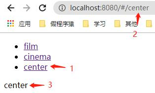
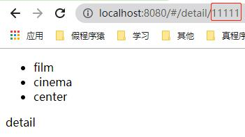
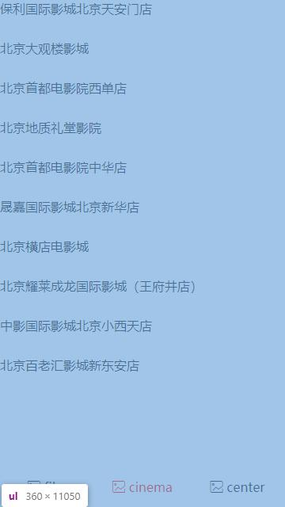
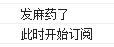
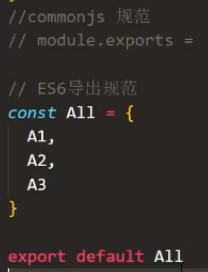
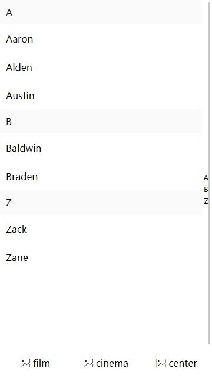

[卖座电影](https://m.maizuo.com/v5/#/films/nowPlaying)  

# <a id='zero'></a>目录

| 目录 |
| --- |
| [一 Vue路由](#1) |
| &emsp;&emsp;[1.1 一级路由](#1.1) |
| &emsp;&emsp;&emsp;&emsp;[1.1.1 一级路由配置 router-view(路由容器)](#1.1.1) |
| &emsp;&emsp;&emsp;&emsp;[1.1.2 路由声明式导航 router-link](#1.1.2) |
| &emsp;&emsp;&emsp;&emsp;[1.1.3 重定向](#1.1.3) |
| &emsp;&emsp;[1.2 二级路由](#1.2) |
| &emsp;&emsp;&emsp;&emsp;[1.2.1 二级路由配置](#1.2.1) |
| &emsp;&emsp;&emsp;&emsp;[1.2.2 重定向](#1.2.2) |
| &emsp;&emsp;[1.3 动态路由](#1.3) |
| &emsp;&emsp;&emsp;&emsp;[1.3.1 编程式导航——路径跳转](#1.3.1) |
| &emsp;&emsp;&emsp;&emsp;[1.3.2 编程式导航 动态路由](#1.3.2) |
| &emsp;&emsp;[1.4 命名路由](#1.4) |
| &emsp;&emsp;&emsp;&emsp;[1.4.1 编程式导航——名字跳转](#1.4.1) |
| &emsp;&emsp;[1.5 history 模式](#1.5) |
| &emsp;&emsp;[1.6 路由守卫/路由拦截](#1.6) |
| &emsp;&emsp;&emsp;&emsp;[1.6.1 全局守卫](#1.6.2) |
| &emsp;&emsp;&emsp;&emsp;[1.6.2 局部守卫](#1.6.1) |
| [二 项目](#2) |
| &emsp;&emsp;[2.1 项目数据请求 字段验证](#2.1) |
| &emsp;&emsp;[2.2 Tabbar iconfont](#2.2) |
| &emsp;&emsp;[2.3 Nowplaying filter](#2.3) |
| &emsp;&emsp;[2.4 Film 轮播](#2.4) |
| &emsp;&emsp;[2.5 Film 二级导航吸顶效果](#2.5) |
| &emsp;&emsp;[2.6 Detail](#2.6) |
| &emsp;&emsp;[2.7 Detail 轮播](#2.7) |
| &emsp;&emsp;[2.8 Cinema better-scroll](#2.8) |
| &emsp;&emsp;[2.9 Tabbar 事件总线](#2.9) |
| [三 组件库 第三方UI框架](#3) |
| &emsp;&emsp;[3.1 PC框架 elementUI](#3.1) |
| &emsp;&emsp;[3.2 移动端框架 mintUI](#3.2) |
| [四 移动端布局及事件](#4) |
| &emsp;&emsp;[4.1 手势事件](#4.1) |

# <a id='1'></a>一 Vue路由  
> [返回目录](#zero)

首先要安装路由。  
在创建脚手架的时候已经安装好Vue路由了  
  
下一步要配置路由  
## <a id='1.1'></a>1.1 一级路由
> [返回目录](#zero)

### <a id='1.1.1'></a>1.1.1 (058)-一级路由配置 router-view(路由容器)  
【router配置路由】  
路由有一个默认的配置文件，  
  
修改成自定义的配置：  
```js
/* router */
import Vue from 'vue'
import VueRouter from 'vue-router'

Vue.use(VueRouter) // 注册Vue的路由插件

const routes = [
  {
    path: '/film',
    component: Film
  },
  {
    path: '/cinema',
    component: Cinema
  },
  {
    path: '/center',
    component: Center
  }
]

const router = new VueRouter({
  routes
})

export default router
```
```routes```是```routes: routes```的简写。(ES6语法)  
【页面级组件的定义和引入】  
上面自定义的Film，Cinema，Center都是页面级组件。  
  
页面级组件放在views文件夹下，共用的组件放在components文件夹下  
  
```html
<!-- Center.vue -->
<template>
<div>
  center
</div>
</template>
```
引入页面级组件  
```js
/* router */
import Film from '@/views/Film'
import Cinema from '@/views/Cinema'
import Center from '@/views/Center'
```
```@```是```/src```的别名，不然```..```容易乱；路径名中可以省略```.vue```  
【在实例化Vue时配置路由】  
```js
/* main.js */
import Vue from 'vue'
import App from './App.vue'
import router from './router'
// import store from './store'

Vue.config.productionTip = false

new Vue({
  router,
  // store,
  render: h => h(App)
}).$mount('#app')
```
地址栏多了个```#/```，和猫眼的地址相比，有点路由的意思了~  
  
  
【页面级组件的使用】  
刚刚定义的路由的页面级组件属于根组件的子组件，要加载到App.vue的某一个位置上，需要使用一个类似**插槽(slot)**的概念——**路由容器(router-view)**  
```html
<!-- App.vue -->
<template>
  <div>
    hello, vue!
    <router-view></router-view>
  </div>
</template>
```
  

### <a id='1.1.2'></a>1.1.2 (059)-路由声明式导航 router-link  
声明式导航：诸如通过a链接进行导航  
编程式导航：location.href(通过JS驱动的导航)  
#### 普通导航组件  
使用导航组件  
```html
<!-- App.vue -->
<template>
  <div>
    <tabbar></tabbar>
    <router-view></router-view>
  </div>
</template>
```
定义导航组件  
```html
<!-- Tabbar.vue -->
<template>
<nav>
  <ul>
    <li><a href="">film</a></li>
    <li><a href="">cinema</a></li>
    <li><a href="">center</a></li>
  </ul>
</nav>
</template>
```
引入并注册导航组件  
```html
<!-- App.vue -->
<script>
import tabbar from '@/components/Tabbar'

export default {
  components: {
    tabbar
  }
}
</script>
```
  
为a标签写上链接  
```html
<!-- Tabbar.vue -->
<template>
<nav>
  <ul>
    <li><a href="#/film">film</a></li>
    <li><a href="#/cinema">cinema</a></li>
    <li><a href="#/center">center</a></li>
  </ul>
</nav>
</template>
```
可以使用锚点的形式```href="#/film"```，也可以使用相对路径```href="/#/film"```  
  
#### Vue路由声明式导航组件(可以高亮变换)  
  
旧方法中的实现：  
1. **点击**(只考虑导航条的效果，不考虑页面跳转)：点击哪个，相应的索引值对应的内容高亮(jQuery)  
2. **在地址栏输入url**：多页面开发，写重复的四个页面，在不同的页面设置相应内容高亮  

在Vue中，路由不仅可以管理**组件**的切换(点击链接/输入url地址)，还能管理**高亮**的变换  
【抛弃上面a标签的写法】  
文件修改：  
```html
<!-- Tabbar.vue -->
<template>
<nav>
  <ul>
    <router-link to="/film" tag='li'>film</router-link>
    <router-link to="/cinema" tag='li'>cinema</router-link>
    <router-link to="/center" tag='li'>center</router-link>
  </ul>
</nav>
</template>
```
其他同理  
【添加样式】  
```html
<!-- Tabbar.vue -->
<template>
<nav>
  <ul>
    <router-link to="/film" tag='li' activeClass='myactive'>film</router-link>
    <router-link to="/cinema" tag='li' activeClass='myactive'>cinema</router-link>
    <router-link to="/center" tag='li' activeClass='myactive'>center</router-link>
  </ul>
</nav>
</template>

<style lang="scss" scoped>
  .myactive {
    color: red;
  }
</style>
```
  
### <a id='1.1.3'></a>1.1.3 (060)-重定向  
【功能描述】  
地址栏输入```localhost:8080```，没有加载出组件来。希望一加载主页就可以重定向到某个特定的组件，如```localhost:8080/#/film```  
这叫做路由的**重定向**  
```js
/* router */
const routes = [
  {
    path: '/film',
    component: Film
  },
  {
    path: '/cinema',
    component: Cinema
  },
  {
    path: '/center',
    component: Center
  },
  {
    path: '*',
    redirect: '/film'
  }
]
```
当前几个都不匹配的时候，匹配到最后一个  
## <a id='1.2'></a>1.2 (061)-二级路由  
> [返回目录](#zero)

### <a id='1.2.1'></a>1.2.1 二级路由配置
  
【Film组件结构】  
修改  
```html
<!-- Film.vue -->
<template>
<div>
  <div>轮播</div>
  <div>film-header</div>
  <router-view></router-view>
</div>
</template>
```
【二级路由配置】  
```js
/* router */
import Nowplaying from '@/views/Film/Nowplaying'
import Comingsoon from '@/views/Film/Comingsoon'

const routes = [
  {
    path: '/film',
    component: Film,
    children: [
      {
        path: 'nowplaying',
        component: Nowplaying
      },
      {
        path: 'comingsoon',
        component: Comingsoon
      }
    ]
  },
  {
    path: '/cinema',
    component: Cinema
  },
  {
    path: '/center',
    component: Center
  },
  {
    path: '*',
    redirect: '/film'
  }
]
```
二级路由与一级路由在配置上可看出父子关系  
注意：  
```path: 'nowplaying'```还可以写成```path: '/film/nowplaying'```，  
不能写成```path: '/nowplaying'```否则会路由到```localhost:8080/#/nowplaying```而不是```localhost:8080/#/film/nowplaying```  
【二级页面级组件创建】  
为了体现出父子关系，创建在页面级组件的Film子文件夹下更合理  
  
  
### <a id='1.2.2'></a>1.2.2 重定向
```js
/* router */
const routes = [
  {
    path: '/film',
    component: Film,
    children: [
      {
        path: 'nowplaying',
        component: Nowplaying
      },
      {
        path: 'comingsoon',
        component: Comingsoon
      },
      {
        path: '',
        redirect: 'nowplaying'
      }
    ]
  },
  {
    path: '/cinema',
    component: Cinema
  },
  {
    path: '/center',
    component: Center
  },
  {
    path: '*',
    redirect: '/film'
  }
]
```
而[原网站](https://m.maizuo.com/v5/#/films/)在二级路由的重定向上有bug  
  
而输入```https://m.maizuo.com/v5/#/films/```时应该自动重定向到```https://m.maizuo.com/v5/#/films/nowPlaying```上  

## <a id='1.3'></a>1.3 (062)-动态路由  
> [返回目录](#zero)

### <a id='1.3.1'></a>1.3.1 编程式导航——路径跳转
把"正在热映"页面用假数据填一下  
```html
<!-- Nowplaying.vue -->
<template>
<div>
  nowplaying
  <ul>
    <li v-for="data in datalist" :key="data">
      {{data}}
    </li>
  </ul>
</div>
</template>

<script>
export default {
  data () {
    return {
      datalist: ['11111', '22222', '33333']
    }
  }
}
</script>
```
  
当创建Vue实例、配置路由式，就会在Vue实例上挂一个```$router```属性(即router配置返回的对象)。  
可以通过```this.$router```来访问，```this.$router.push('')```方法可实现页面跳转  
```html
<!-- Nowplaying.vue -->
<script>
export default {
  data () {
    return {
      datalist: ['11111', '22222', '33333']
    }
  },
  methods: {
    handleChangePage (id) {
      // 编程式导航
      this.$router.push(`/detail`)
    }
  }
}
</script>
```
新建一个```Detail.vue```页面级组件、在```router```中配置路由  
  
```js
/* router */
const routes = [
  {
    path: '/detail',
    component: Detail
  },
]
```
效果如下  
  
点击  
  
### <a id='1.3.2'></a>1.3.2 编程式导航 动态路由
【传id】  
跳转页面的同时传递唯一的id  
```html
<!-- Nowplaying.vue -->
<script>
export default {
  methods: {
    handleChangePage (id) {
      // 编程式导航
      this.$router.push(`/detail/${id}`)
    }
  }
}
</script>
```
控制台会报错。  
需要配置二级路由  
```js
/* router */
const routes = [
  {
    path: '/detail',
    component: Detail,
    children: [
      ???
    ]
  },
]
```
不能用原来这种方式。children的path是写死的，有一万多个数据的话，不可能一个一个写上去  
要用**动态路由**  
(类似**动态绑定**，需要加一个```:```)  
```js
/* router */
const routes = [
  {
    path: '/detail/:myid',
    component: Detail
  },
]
```
  
此时如果手动在地址栏敲```http://localhost:8080/#/detail/```，不存在，会自动重定向。detail后面必须接id才会路由到Detail组件  
【接收id】  
```html
<!-- Detail.vue -->
<script>
export default {
  mounted () {
    console.log(this.$route)
  }
}
</script>
```
  
来到detail页面，最终是为了获得传入的id，利用这个id，再ajax请求后端详情页面数据  
```html
<!-- Detail.vue -->
<script>
export default {
  mounted () {
    console.log(this.$route.params.myid)
  }
}
</script>
```

【动态路由传递参数】  
上面这个过程，看似是从```..```跳转到了```../detail/1234```，实际上是跳转到了```../detail```页面，顺带发了一个id```1234```，(get请求可以完成与动态路由类似的功能)  
动态路由的本质是A组件跳转到B组件(这里不一定是父与子的关系，范围更广)，同时传了参数过去。  
父传子，prop向下传：在父组件中使用子组件时，在子组件上通过**自定义属性**，可传递参数过去，并且在子组件中，可通过**props**来接收参数。  
类似的，A组件通过**动态路由**传递参数给了B组件，B组件可通过**props**来接收参数。  
于是，动态路由接收参数的两种方式——  
1. 通过**props**  
```js
/* router */
{
  path: '/detail/:myid',
  name: 'kerwindetail',
  component: Detail,
  props: true
},
```
```html
<!-- Detail.vue -->
<script>
export default {
  props: ['myid'],
  mounted () {
    console.log(this.myid)
  }
}
</script>
```
如果需要经常调用该参数，方便  
2. 通过**$route**  
```html
<!-- Detail.vue -->
<script>
export default {
  mounted () {
    console.log(this.$route.params.myid)
  }
}
</script>
```

## <a id='1.4'></a>1.4 (063)-命名路由  
> [返回目录](#zero)

【定义】起了名字的路由  
【作用】利用路由的名字实现跳转  
### <a id='1.4.1'></a>1.4.1 编程式导航——名字跳转  
```js
/* router */
const routes = [
  {
    path: '/detail/:myid',
    name: 'kerwindetail',
    component: Detail
  },
]
```

```js
/* Nowplaying.vue */
this.$router.push(`/detail/${id}`)
```
修改为：  
```js
/* Nowplaying.vue */
this.$router.push({
  name: 'kerwindetail',
  params: {
    myid: id
  }
})
```
```myid: id```比较麻烦，希望写成```id: id```从而简化成```id```  
对```router```和```Nowplaying.vue```做如下修改：  
```js
/* router */
const routes = [
  {
    path: '/detail/:id',
    name: 'kerwindetail',
    component: Detail
  },
]
```
```js
/* Nowplaying.vue */
this.$router.push({
  name: 'kerwindetail',
  params: {
    id
  }
})
```
使用路由的名字比使用路由的路径麻烦  

## <a id='1.5'></a>1.5 (064)-history 模式  
> [返回目录](#zero)


想去掉地址栏显示的地址的  
只需要在路由配置文件中设置history模式即可  
```js
/* router */
const router = new VueRouter({
  mode: 'history',
  routes
})
```
把丑陋的hash的#去掉了，有一种后端路由的感觉  
【原理】  
```mode: 'hash'```/不设置mode(默认)，会设置为hash模式。路由完全交给前端，不需要后端处理  
```mode: 'history'```，会设置为history模式。需要在后端进行相关配置  
【缺点】  
它不仅像后端路由，它真的会向后端发起请求，所以后端必须配置好相关路由，否则，可能会返回404(???什么情况下会返回404？另外，这是前端路由，怎么会牵扯到后端的配置？)  
> 问：在本例中为什么怎么也出现不了404？  
> 答：因为这已经运行在本地服务器上了，并且脚手架进行了后端的相关配置，会重新渲染index.html页面  

【解决】  
后端配置：若URL匹配不到任何静态资源，则应返回同一个index.html页面  
  
即重新渲染打包发布的index.html  
[后端配置栗子](https://router.vuejs.org/zh/guide/essentials/history-mode.html#%E5%90%8E%E7%AB%AF%E9%85%8D%E7%BD%AE%E4%BE%8B%E5%AD%90)  

## <a id='1.6'></a>1.6 (065)-路由守卫/路由拦截  
> [返回目录](#zero)

eg.在[猫眼](https://m.maoyan.com/)点击'我的'，会跳转到登录页。原因：一点击该路径，被拦截下来，问我有没有身份凭证(即是否登录过)，若有，则继续进入'我的'，否则进入登录页。  
### <a id='1.6.1'></a>1.6.1 全局守卫
你可以使用 ```router.beforeEach``` 注册一个全局前置守卫：  
```js
const router = new VueRouter({ ... })

router.beforeEach((to, from, next) => {
  // ...
})
```
在任何一个路由跳转之前，都会进入这个函数中  
看一下to的内容：  
  
希望进入center前，可以拦截下来并做一些盘查，否则放行。点击center，看一下to的内容：  
  
因此，路由守卫可以进行如下设置：  
```js
/* router */
router.beforeEach((to, from, next) => {
  if (to.path === '/center') {
    console.log('盘查')
  } else {
    next()
  }
})
```
  
  
盘查的具体操作(伪代码)：  
```js
/* router */
router.beforeEach((to, from, next) => {
  if (to.path === '/center') {
    if (此时已经登录) {
      next()
    } else {
      next('/login')
    }
  } else {
    next()
  }
})
```
```next()```放行到下一个已经设定好的路径，```next('/login')```重定向到login  
【如何判断登录与否】  
检查本地Token的一些验证，有两种：一种是cookie和session，另一种是JWT。  
Token验证设置在本地的local storage中。  
可以封装一个方法来实现验证  
```js
/* router */
import Login from '@/views/Login'

const auth = {
  isLogin () {
    return false
  }
}

const routes = [
  // ...
  {
    path: '/login',
    component: Login
  },
  // ...
]

router.beforeEach((to, from, next) => {
  if (to.path === '/center') {
    if (auth.isLogin()) {
      next()
    } else {
      next('/login')
    }
  } else {
    next()
  }
})
```
建立Login.vue文件  
  
【效果】  
点击center，被路由守卫拦截，判断发现没有登录，重定向到login页面  
  
如果判断发现已登录，则会放行到center页面  

### <a id='1.6.2'></a>1.6.2 局部守卫
你可以在路由组件内直接定义以下路由导航守卫：  
- ```beforeRouteEnter```  
- ```beforeRouteUpdate``` (2.2 新增)  
- ```beforeRouteLeave```  
```beforeRouteUpdate```指的是同一个路由，内容有更新，如  
变为  

```html
<!-- Center.vue -->
<script>
const auth = {
  isLogin () {
    return false
  }
}

export default {
  beforeRouteEnter (to, from, next) {
    if (auth.isLogin()) {
      next()
    } else {
      next('/login')
    }
  }
}
</script>
```

# <a id='2'></a>二 项目
> [返回目录](#zero)

## <a id='2.1'></a>2.1 (066)-项目数据请求 字段验证  
> [返回目录](#zero)

  
在上面这些请求中要找一找(因为不是自己写的后端代码，不知道接口是什么样的)  
  
在Nowplaying.vue中请求该地址的数据，跨域。进行反向代理配置，没用。看一下卖座电影原网站请求数据的headers：  
  
应该所有的地址都能够请求到呀！但是服务器不能随随便便就请求数据——  
【字段验证】  
为了防止一些无效的ajax请求增加服务器负担，有些网站需要在请求时加入一些字段验证。有某些字段，就可以通过请求，没有这些字段，则不会返回请求的数据。卖座就是其中这样一个网站。  
(因为不是自己写的后端代码)字段要慢慢找  
熟悉HTTP协议的话，可以看出最后四个为增加的字段  
  
(可与猫眼电影的请求头部进行对比，进行验证)  
经过实验(模拟原网站的数据请求头部)，发现只要有下面两个字段验证通过，就可以认为是合法用户  
  
【axios进行完整的ajax请求】  
类似于$.ajax(完整)，$.get(方便简洁)  
要为ajax请求传入字段，要使用axios函数传入大对象，而不能使用axios.get()方法  
```html
<!-- Nowplaying.vue -->
<script>
import axios from 'axios'
export default {
  // ...
  mounted () {
    /* axios.get('ajax1/gateway?cityId=110100&pageNum=1&pageSize=10&type=1&k=2582400').then(res => {
      console.log(res.data)
    }) */
    axios({
      url: 'https://m.maizuo.com/gateway?cityId=110100&pageNum=1&pageSize=10&type=1&k=2582400',
      headers: {
        'X-Client-Info': '{"a":"3000","ch":"1002","v":"5.0.4","e":"1603093401441501163192323","bc":"110100"}',
        'X-Host': 'mall.film-ticket.film.list'
      }
    }).then((res) => {
      console.log(res.data.data.films)
    })
  }
}
</script>
```
注意：  
headers对象中，键值对都要加上引号变成字符串。  


## <a id='2.2'></a>2.2 (067)-Tabbar iconfont  
> [返回目录](#zero)

【全局样式】  
在App.vue中设置的CSS样式(不要加scoped属性)，会影响到所有子组件  
【Tabbar小图标】  
方法：  
1. 一个小图标对应着一张.png图片
2. 拼接的图，控制background-position来显示不同的图片
3. (本例)img标签，src指向的不是地址，而是一串base64编码。img标签支持base64编码格式  
直接把原网站的img标签复制下来即可使用  
  
**base64**编码：适用于小图片/小图标(否则会变得很长)  
为什么使用base64编码：页面下载下来后，还要发送一个请求去请求图片；而使用base64编码，页面加载完成后，图片也会加载完成  
4. (目前使用最多)iconfont：矢量图，不失真，可以向字体一样操作——改变颜色改变大小很方便  
在项目中使用：放在public文件夹下(放公共的静态资源)  
  
  
加入这样一句话  
```html
<!-- index.html -->
<link rel="stylesheet" type="text/css" href="<%= BASE_URL %>iconfont/iconfont.css">
```
引入成功  
  

## <a id='2.3'></a>2.3 (068)-Nowplaying filter  
> [返回目录](#zero)

  
怎样把这样的数据渲染成这种形式？  
【思路一】  
在模板中进行数组遍历(模板中代码变得复杂，不便于维护模板)  
```html
<p>主演：<span v-for="actor in data.actors" :key="actor">{{actor.name}} </span></p>
```
【思路二】  
后端传回来的数据不是我想要的，想到Vue过滤器  
```html
<!-- Nowplaying.vue -->
<template>
  <div>
    // ...
        <p>主演：{{data.actors | actorfilter}}</p>
    // ...
  </div>
</template>

<script>
import Vue from 'vue'
Vue.filter('actorfilter', function (list) {
  var newList = list.map(item => item.name)
  return newList.join(' ')
})
// ...
</script>
```

## <a id='2.4'></a>2.4 (069~070)-Film 轮播  
> [返回目录](#zero)

可以在Github上搜索[vue swipe插件](https://github.com/surmon-china/vue-awesome-swiper)，也可以自己封装轮播组件  
这里我们使用传统方法  
### 轮播效果
【安装Swiper】  
```
cnpm i swiper --save
```
swiper/Vue/jQuery...都可以通过npm来安装  
【封装swiper组件】  
注意  
```js
/* Swiper.vue */
import Swiper from 'swiper'
```
上述语句引入的仅仅是JS代码，CSS代码要自己找出来并引入  
在script引入css代码：  
```js
import 'swiper/swiper.scss'
```
在style引入css代码(后来出错了所以没使用这种方法)：  
```css
@import "swiper/swiper.scss";
```

【与pagination有关的bug】  
1. 产生假的datalist  
```html
<!-- Film.vue -->
<template>
<div>
  <swiper>
    <div class="swiper-slide" v-for="data in 10" :key="data">
      {{data}}
    </div>
  </swiper>
</div>
</template>
```
  
虽然该产生datalist和下面一种产生datalist的方法都不是异步的，但是这种方法，会产生一组pagination的按钮；而另外一种方法不会产生(所以不使用这种方法)：  
```html
<!-- Film.vue -->
<template>
<div>
  <swiper>
    <div class="swiper-slide" v-for="data in datalist" :key="data">
      {{data}}
    </div>
  </swiper>
</div>
</template>
```
  
2. pagination不是swiper的核心组件  
当执行```import Swiper from 'swiper'```时，Swiper仅导出核心版本，没有其他模块比如分页等，而要使用分页的功能还要导入分页等。  
若导入Navigation和Pagination组件：  
```js
/* Swiper.vue */
import Swiper, { Navigation, Pagination } from 'swiper'
Swiper.use([Navigation, Pagination])
```
若只需导入Pagination组件：  
```js
import Swiper, { Pagination } from 'swiper'
Swiper.use(Pagination)
```
分页组件的CSS样式(顺着上面的Pagination的同级目录中的components文件夹找到的)也需要手动导入  
```js
import '_swiper@6.3.3@swiper/components/pagination/pagination.scss'
```
  
终于好了！  
同理，自动轮播autoplay效果也不是swiper的核心组件，需要引入  

**【11月3日更新】**  
查看npm第三方库Swiper的官方文档，发现使用很简单：  
安装：  
```
$ npm install swiper
```
使用核心模块：  
```JS
// import Swiper JS
import Swiper from 'swiper'
// import Swiper styles
import 'swiper/swiper-bundle.css'
const swiper = new Swiper(...)
```
使用部分附加模块：  
```JS
// core version + navigation, pagination modules:
import Swiper, { Navigation, Pagination } from 'swiper';
// configure Swiper to use modules
Swiper.use([Navigation, Pagination]);
// init Swiper:
const swiper = new Swiper(...);
```
使用全部模块：  
```JS
// import Swiper bundle with all modules installed
import swiper from 'swiper/bundle'
// init Swiper:
const swiper = new Swiper(...)
```

### 异步数据  
【接收异步数据】  
注意Swiper会初始化过早，要重新初始化Swiper。(利用key值)  
```html
<swiper :key="datalist.length">
```
【注】  
在单文件组件中，注意this的指向问题。  
如，在mounted()的setTimeout()函数中，this指向Window。  
【样式调整】  
如果向为Swiper组件增加自定义样式，推荐新增一个class(防止被全局样式覆盖)  
  
【父组件中有多个的子组件，效果略不同】  
没必要使用父传子，直接在父组件中为使用的子组件添加class即可  
1. 在父组件中，为子组件设定class，该class会添加到子组件上  
```html
<!-- Film.vue -->
<swiper :key="looplist.length" class="filmswiper">
```
2. 在子组件中为该class添加样式  
Swiper组件有更细分的类别，如父组件添加的filmswiper类，统一设置样式——  
```html
<!-- Swiper.vue -->
<style lang='scss'>
.swiper-container {
  width: 100%;
}

.filmswiper {
  height: 200px;
  .swiper-pagination {
    text-align: right;
  }
}
</style>
```

## <a id='2.5'></a>2.5 (071~072)-Film 二级导航吸顶效果  
> [返回目录](#zero)

### 二级导航  
使用路由声明式导航  
### 吸顶效果
思路：监听滚动高度，当高度等于轮播组件的高度时，把二级导航的CSS样式加一个fixed  
【取得轮播组件的高度】  
方法：  
1. 原生JS获取DOM节点(在Vue中希望尽量少地使用原生JS)  
2. ref获取DOM节点  
```html
<!-- Film.vue -->
<swiper :key="looplist.length" myswiper="filmswiper" ref="filmswiper">
```
```this.$refs.filmswiper.$el```为DOM节点；```this.$refs.filmswiper.$el.offsetHeight```为高度  

【为二级导航组件动态添加/删除class】  
```html
<!-- Film.vue -->
<template>
<!-- ... -->
  <filmtabbar :class="isFixed?'fixed':''"></filmtabbar>
<!-- ... -->
</template>

<script>
// ...
  data () {
    return {
      // ...
      isFixed: false
    }
  },

  methods: {
    handleScroll () {
      if (document.documentElement.scrollTop > this.$refs.filmswiper.$el.offsetHeight) {
        this.isFixed = true
      } else {
        this.isFixed = false
      }
    }
  }
// ...
</script>
```
【在子组件中设置该class的样式】  
```html
<!-- Filmtabbar.vue -->
<style lang='scss' scoped>
ul {
  height: 49px;
  border-bottom: 1px solid #F9F9F9;
  width: 100%;
  background-color: #fff;
  &.fixed {
    position: fixed;
    top: 0;
  }
  li {
    &.myactive {
      color: #ff5f16;
      border-bottom: 2px solid #ff5f16;
    }
    float: left;
    width: 64px;
    text-align: center;
    line-height: 49px;
    margin: 0px calc((50% - 64px)/2);
    border-bottom: 2px solid white;
  }
}
</style>
```
【注】  
由于是单页面应用开发(所谓的页面切换其实都是div的更换)，该滚动事件的监听在所有页面都生效  
希望onscroll事件只活在Film组件中(一离开Film组件就解绑事件)，而不影响其他事件。  
放在beforeDestroy/destroy生命周期均可：  
```js
beforeDestroy () {
  window.onscroll = null
},
```

## <a id='2.6'></a>2.6 (073~074)-Detail  
> [返回目录](#zero)

【fimlinfo起初为空导致的问题】  
接收的数据是对象，给filminfo初始化为```null```  
数据来了以后更新filminfo，但是由于fimlinfo起初为空，渲染时要使用fimlinfo对象的各种属性，因此会报错  
  
解决：  
```html
<!-- Detail.vue -->
<template>
<div v-if="filminfo">
  <div>{{filminfo.name}}</div>
</div>
</template>
``` 

## <a id='2.7'></a>2.7 (075~076)-Detail 轮播  
> [返回目录](#zero)

【特定形式的轮播效果】  
在swiper官网的栗子中，找到类似的效果，查看框架的源代码，可以看到实例化Swiper组件时增加了几个属性：  
```html
<!-- Initialize Swiper -->
<script>
var swiper = new Swiper('.swiper-container', {
  slidesPerView: 3,
  spaceBetween: 30,
  freeMode: true,
});
</script>
```
感觉```slidesPerView```和```spaceBetween```冲突啊，使用```slidesPerView```就可以了  
服务器传过来的actors和photos数组没有增删改查操作，因此可以将key动态绑定为索引值  
【传参复用——父传子】  
```html
<!-- Detail.vue -->
<detailswiper perview="3.7"><!-- ... --></detailswiper>
<detailswiper perview="2.2"><!-- ... --></detailswiper>
```
```js
/* Detailswiper.vue */
export default {
  props: ['perview'],
  mounted () {
    /* eslint-disable no-new */
    new Swiper('.swiper-container', {
      slidesPerView: this.perview,
      freeMode: true
    })
  }
}
```
在一个页面中有两个swiper，会出bug  
解决：  
为每个swiper增加一个特有的类，在自己封装的swiper组件中，使用该特有的类名来实例化Swiper(需要父传子把类名传过来)，否则```.swiper-container```会选中两个swiper  
```html
<!-- Detail.vue -->
<detailswiper class="swiper-actors" swipername="swiper-actors" perview="3.7"><!-- ... --></detailswiper>
<detailswiper class="swiper-photos" swipername="swiper-photos" perview="2.2"><!-- ... --></detailswiper>
```
```js
/* Detailswiper.vue */
export default {
  props: ['swipername', 'perview'],
  mounted () {
    /* eslint-disable no-new */
    new Swiper(`.${this.swipername}`, {
      slidesPerView: this.perview,
      freeMode: true
    })
  }
}
```

## <a id='2.8'></a>2.8 (077~078)-Cinema better-scroll  
> [返回目录](#zero)

  
加平滑、有惯性的滑动效果(像swiper组件那样)，更平稳地去滑动  
运用了大量的CSS3的transition  
**better-scroll**  
[better-scroll](https://ustbhuangyi.github.io/better-scroll/)  
### 安装  
### 使用  
#### 布局  
```html
<!-- Cinema.vue -->
<template>
<div class="cinema">
  <ul>
    <li v-for="data in datalist" :key="data.cinemaId">
      {{data.name}}
    </li>
  </ul>
</div>
</template>

<style lang='scss' scoped>
.cinema {
  height: 500px;
  overflow: hidden;
}
</style>
```
不使用自带的滚动条。  
【外围包裹元素】：高度小于等于窗口高度，这样就不会出现滚动条，里面有一个比外围元素高的子元素，父元素的CSS属性```overflow: hidden;```，不让子元素多余部分显示出来  
  
  

#### 初始化  
axios是异步的，BetterScroll不能实例化过早：  
1. BetterScroll的实例化要放在axios().then()中，请求完数据后再实例化；  
2. 要等datalist渲染完成再实例化BetterScroll。  
渲染完成，即DOM节点创建完成。  
【方法一——使用自定义指令】  
每个DOM创建完成都会执行一次，需要判断是不是最后一个节点上树了  
【方法二——"Vue黑魔法"```$nextTick()```】  
```$nextTick()```方法会等待上面所有的节点上树了再执行  
```html
<!-- Cinema.vue -->
<script>
import BetterScroll from 'better-scroll'
export default {
  // ...
  mounted () {
    axios(/* 。。。 */).then(res => {
      // ...
      this.$nextTick(() => {
        /* eslint-disable no-new */
        new BetterScroll('.cinema')
      })
    })
  }
}
</script>
```

#### 加滚动条  
```js
new BetterScroll('.cinema', {
  scrollbar: {
    fade: true,
    interactive: true
  }
})
```
bug：滚动条出去了  
  
解决：  
  
  
#### 高度自适应
设置内联样式  
获取视口高度，```document.documentElement.clientHeight```或者```window.innerHeight```均可  
```html
<!-- Cinema.vue -->
<template>
<div class="cinema" :style="mystyle">
<!-- ... -->
</div>
</template>

<script>
export default {
  data () {
    return {
      // ...
      mystyle: {
        height: '0px'
      }
    }
  },
  mounted () {
    this.mystyle.height = `${window.innerHeight - 50}px`
    // ...
  }
}
</script>
```

## <a id='2.9'></a>2.9 (079)-Tabbar 事件总线  
> [返回目录](#zero)

进入详情页需要隐藏Tabbar。  
【思路】  
一进入，隐藏；一离开，显示  
在```Detail.vue```中，  
  
  
【问题】  
在Detail组件中，控制不了Tabbar组件(Tabbar是在App.vue中使用的)，除非通过原生JS操作DOM节点  
  
当url地址为/detail时，router-view路由容器会被匹配成Detail组件，与Tabbar不是父子关系，直接进行通信做不到  
【解决】  
**中央事件总线**  
在非模块化开发中，在```<script>```标签中定义全局变量```bus```，在A组件中使用```bus.$emit```触发事件总线中的某自定义事件；在B组件中使用```bus.$on```来监听事件总线中的该事件  
而在模块化开发中，没有全局的变量，也不提倡挂载到window下使用全局变量。提倡使用模块，谁需要谁导入该模块  
1. 定义总线模块  
  
```js
/* router */
import Vue from 'vue'
var bus = new Vue()
export default bus
```
2. 引入并使用模块  
在需要使用的组件中都要引入该模块  
- App.vue中要监听事件，并控制Tabbar的显示/隐藏  
```html
<!-- App.vue -->
<template>
  <div>
    <tabbar v-show="isShow"></tabbar>
    <router-view></router-view>
  </div>
</template>

<script>
import bus from '@/bus'

export default {
  data () {
    return {
      isShow: true
    }
  },
  // ...
  mounted () {
    bus.$on('tabbarControl', (data) => {
      this.isShow = data
    })
  }
}
</script>
```
【注】  
若引入某文件夹下的index.js文件，则index.js可省略。如引入```src/bus/index.js```简写为```@/bus```  
- Detail.vue、Login.vue组件中要触发事件，传入true(显示)/false(隐藏)  
```html
<!-- Login.vue -->
<script>
import bus from '@/bus'

export default {
  beforeMount () {
    bus.$emit('tabbarControl', false)
  },
  destroyed () {
    bus.$emit('tabbarControl', true)
  }
}
</script>

<style>
</style>
```

【bug】  
刷新页面Tabbar失控  
  
订阅的不够早。因为App是其他组件的父组件，其mounted生命周期在其他组件创建完成后才执行  
  
【解决】  
App组件中在beforeMount生命周期订阅  
  

## Vuex
### (080~081)-Tabbar Vuex(非标准用法)
【使用事件总线的问题】  
若项目中非父子通信特别多，使用事件总线的问题：  
1. 会比较混乱，管理不方便。比如，多人开发，使用同一个事件总线，可能重名。  
2. 耦合度不高  
3. 原本组件只需要实现它自己的功能即可，现在还要进行事件的监听和触发，代码的逻辑混乱  

【Vuex 状态管理】  
Vuex是用来做状态管理的，在这个项目的场景下顺带可以实现非父子通信的功能  
【Vuex使用】  
  
  
1. 设置共享状态```isTabbarShow```：  
```js
/* store */
import Vue from 'vue'
import Vuex from 'vuex'

Vue.use(Vuex)

export default new Vuex.Store({
  state: {
    isTabbarShow: true
  },
  mutations: {
  },
  actions: {
  },
  modules: {
  }
})
```
2. main.js中配置store(以前不会，就没使用)  
  
```js
/* main.js */
import Vue from 'vue'
import App from './App.vue'
import router from './router'
import store from './store'

Vue.config.productionTip = false

new Vue({
  router,
  store,
  render: h => h(App)
}).$mount('#app')
```
3. App.vue中由共享状态控制Tabbar的显示/隐藏  
```html
<!-- App.vue -->
<template>
  <div>
    <tabbar v-show="$store.state.isTabbarShow"></tabbar>
    <router-view></router-view>
  </div>
</template>
```
4. Detail.vue、Login.vue中修改共享状态  
```html
<!-- Login.vue -->
<script>
export default {
  beforeMount () {
    this.$store.state.isTabbarShow = false
  },
  destroyed () {
    this.$store.state.isTabbarShow = true
  }
}
</script>
```

### 无异步处理
【问题】  
使用共享状态是Vuex的一种滥用，和之前的事件总线的问题一样。谁都可以在项目中修改任意一个状态，一旦出错，非常难以排查。  
要注意**权限**问题：即在项目中，每个人只有有限的权限，不能访问所有的共享状态  
如果有一个**监控/监管**就好了。  

[Vuex官方文档](https://vuex.vuejs.org/zh/)  
Vuex 是一个专为 Vue.js 应用程序开发的**状态管理模式**。它采用集中式存储管理应用的共性组件的状态，并以相应的规则保证状态以一种可预测的方式发生变化(即加上了监控)。Vuex 也集成到 Vue 的官方调试工具 **devtools extension**，提供了诸如零配置的 time-travel 调试、状态快照导入导出等高级调试功能(Vuex工作流程图中我们任何的操作都被'**记录**'下来了，要通过调试工具才能看到这些记录)。  
  
为了安全和规范，Vuex的工作流程必须按照流程图来走。(不按照流程图来走，像上一节那样，也能实现一定的功能，但是所有人都有权限操作同一个共享状态，有很大的安全隐患)  
  
【代码修改】  
刚才的代码中没有异步操作，不需要走Actions步骤  
Detail.vue、Login.vue中不能直接修改共享状态  
```html
<!-- Login.vue -->
<script>
export default {
  beforeMount () {
    this.$store.commit('hideMaizuoTabbar', false)
  },
  destroyed () {
    this.$store.commit('hideMaizuoTabbar', true)
  }
}
</script>
```
```commit()```的第一个参数就是Mutation的名字。  
将```false```提交(```commit```)到名字为```hideMaizuoTabbar```的Mutation去  
```hideMaizuoTabbar```的定义在store中：  
```js
/* store */
// ...
export default new Vuex.Store({
  state: {
    isTabbarShow: true
  },
  mutations: {
    hideMaizuoTabbar (state, data) {
      state.isTabbarShow = data
    }
  },
  // ...
})
```
mutations是唯一修改状态的地方。方便管理  

### (082)-devtools  
千方百计的通过mutations去修改状态，主要是为了方便通过devtools调试。每一步的操作都被记录在案，可以查看  
需要下载Chrome的一个插件，在Github上搜索vue devtools  
【时光旅行】  
  
  
可以看到每一步的操作，方便调试；还可以时光旅行，回到之前的任意一步，可以高效找到问题所在  
【组件结构】  
  
【父传子prop】  
  

### (083~084)-异步处理  
【使用场景】  
在film下的'正在上映'和'即将上演'中来回切换，每次切换都会重新请求数据，增大服务器压力(明明数据已经请求过一遍了)  
希望给请求到的数据缓存下来，下次进入该页面时直接从缓存中读取数据。  
使用cookie/local storage？大对象，不方便。  
这里使用store  
【流程】  
如果判断store中没有nowplaying数据，要发送ajax请求(异步请求)来请求数据，该异步请求应在action中发送，并通过mutation把数据存到state中  
  
【注】  
所谓缓存，是缓存到内存中。只要网页不刷新，数据可以随时访问随时使用；如果刷新页面，浏览器会把当前页面所占的内存释放掉，再重新加载新的内存，来加载数据，即之前缓存在store中的数据已经丢失了  
【Vuex功能】  
1. 状态管理——非父子通信  
2. 数据快照——缓存后端的数据到store中，减少重复的请求，减轻后端的压力，增强用户体验  
3. 方便管理和调试，时光旅行  

【代码】  
Comingsoon.vue  
伪代码：  
  
完整代码：  
```html
<!-- Comingsoon.vue -->
<template>
  <ul>
    <li
      v-for="data in $store.state.comingList"
      :key="data.filmId"
    >
	<!-- ... -->
    </li>
  </ul>
</template>

<script>
// ...
export default {
  mounted () {
    if (this.$store.state.comingList.length === 0) {
      // console.log('发送Ajax请求')
      this.$store.dispatch('getComingListAction')
    } else {
      // console.log('使用缓存数据')
    }
  }
}
</script>
```
```js
/* store */
// ...
import axios from 'axios'
// ...

export default new Vuex.Store({
  state: {
    // ...
    comingList: []
  },
  mutations: {
    // ...
    commingListMutation (state, data) {
      state.comingList = data
    }
  },
  actions: {
    getComingListAction (store) {
      axios({
        url:
          'https://m.maizuo.com/gateway?cityId=110100&pageNum=1&pageSize=10&type=2&k=4874929',
        headers: {
          'X-Client-Info':
            '{"a":"3000","ch":"1002","v":"5.0.4","e":"1603631798333182087987201"}',
          'X-Host': 'mall.film-ticket.film.list'
        }
      }).then((res) => {
        store.commit('commingListMutation', res.data.data.films)
      })
    }
  }
})
```
在devtools调试工具中可以看到状态的修改  
  

### (085~086)-mapState  
#### mapState使用
【从计算属性说起】  
```html
<!-- App.vue -->
<template>
  <div>
    <tabbar v-show="isShow"></tabbar>
    <router-view></router-view>
  </div>
</template>

<script>
// ...
export default {
  // ...
  computed: {
    isShow () {
      return this.$store.state.isTabbarShow
    }
  }
}
</script>
```
【mapState】  
```html
<!-- App.vue -->
<template>
  <div>
    <tabbar v-show="isTabbarShow"></tabbar>
    <router-view></router-view>
  </div>
</template>

<script>
// ...
import { mapState } from 'vuex' // ES6另一种导出方式

export default {
  // ...
  computed: mapState(['isTabbarShow'])
}
</script>
```
mapState会将共享状态映射成同名计算属性  
这种写法的缺点：  
没有办法再写别的计算属性了  
解决：  
```html
<!-- App.vue -->
<script>
// ...
export default {
  // ...
  computed: {
    ...mapState(['isTabbarShow'])
  }
</script>
```
```...```是ES6中的展开合并运算符  
  
```mapState(['isTabbarShow'])```返回的是对象(如下)，可用展开运算符展开  
```
{
  isTabbarShow () {
    return this.$store.state.isTabbarShow
  }
}
```
用法：  
1. 合并数组，替代数组的concat方法  
  
  
2. 合并对象，替代遍历重写的方法  
  

#### ES6导入导出
ES6导入规范比CommonJS规范多了一种：只导入某几个需要的模块，这样打包后文件体积更小，客户端下载文件速度更快，用户体验更好。  
【第一种导入导出规范——导入所有接口】  
导出：  
  
  
  
导入：  
  
结果：  
  
【第二种导入导出规范——导入一部分接口】  
导出：  
  
导入(❌)：  
  
结果：  
  
导入：  
  
结果：  
  
导入多个方法：  
  
导入并重命名：  
  

### (087)-getters  
getters并不在流程图中，那么它是什么呢？  
getters可以认为是处理后的共享状态/共享状态的计算属性  
如果需要用到的是原始的共享状态，不需要使用getters，如果需要将原始共享状态加工一下再返回，使用getters  
栗子：  
在Comingsoon.vue中，只需要取得comingList的前三个数据  
【代码】  
```js
/* store */
// ...
export default new Vuex.Store({
  state: {
    // ...
    comingList: []
  },
  getters: {
    comingListGetter (state) {
      return state.comingList.filter((item, index) => index < 3)
    }
  },
  // ...
})
```
```html
<!-- Comingsoon.vue -->
<template>
  <ul>
    <li
      v-for="data in $store.getters.comingListGetter"
      :key="data.filmId"
    >
    <!-- ... -->
    </li>
  </ul>
</template>
```
【注】  
如state一样，使用使有两种写法：  
1. this.$store.getters.计算属性的名字  
2. ...mapGetters(['计算属性的名字'])  

### (088)-mutation 常量风格  
【定义常量】  
  
```js
/* type */
export const CONTROL_TABBAR_MUTATION = 'controlTabbar'
```
【mutation定义】  
ES6的一个语法：将对象中的属性当作变量来对待  
  
```js
/* store */
// ...
import { CONTROL_TABBAR_MUTATION } from '@/type'
// ...

export default new Vuex.Store({
  // ...
  mutations: {
    [CONTROL_TABBAR_MUTATION] (state, data) {
      state.isTabbarShow = data
    },
  // ...
  },
  // ...
})
```
【mutation使用】  
```html
<!-- Detail.vue -->
<script>
import { CONTROL_TABBAR_MUTATION } from '@/type'

export default {
  beforeMount () {
    this.$store.commit(CONTROL_TABBAR_MUTATION, false)
  },
  destroyed () {
    this.$store.commit(CONTROL_TABBAR_MUTATION, true)
  }
}
</script>
```
为什么废了半天劲，用中括号来转换？  
1. 一个mutation的定义有一处，使用有若干处  
如果再一个项目中，不同的人定义了同样名字的mutation，  
  
使用常量来写的mutation，修改时只需要修改一次就可以把代码中所有相关部分进行修改，而不用一个一个改  
  
2. 将所有mutation放在一个文件中，一眼就可以看出项目中有多少mutation，即非父子通信的状态管理  

### (089)-设计原则  
1. 应用层级的状态应该集中到单个 store 对象中。  
2. 提交 mutation 是更改状态的唯一方法，并且这个过程是同步的。  
3. 异步逻辑都应该封装到 action 里面。  

# <a id='3'></a>三 组件库 第三方UI框架
> [返回目录](#zero)

[第三方插件和库](https://github.com/vuejs/awesome-vue#components--libraries)  
其中，我们主要介绍一下第三方UI框架。  
之前讲过的Bootstrap也有对应的Vue版本  
主流的PC框架：elementUI，iview  
移动端框架：mintUI  
## <a id='3.1'></a>3.1 (090~091)-PC框架 elementUI  
> [返回目录](#zero)

常用来做后台管理系统  
[elementUI文档](https://element.eleme.cn/#/zh-CN)  
查看"组件"页面  
【使用】  
1. 安装  
npm安装/CDN引入  
2. 引入  
在 main.js 中写入以下内容：  
```js
import ElementUI from 'element-ui';
import 'element-ui/lib/theme-chalk/index.css';
Vue.use(ElementUI);
```
3. 使用  
每次引入一个新的库，先用个简单的功能测试一下这个库好不好用(比如：按钮)  
要切换到PC模式使用  

## <a id='3.2'></a>3.2 移动端框架 mintUI
> [返回目录](#zero)

[mintUI文档](https://mint-ui.github.io/docs/#/)  
### (092)-indictor  
转动的小圆圈(可以显示"正在加载")  
  
### (093~095)-infinitescroll  
懒加载，无限滚动  
【模拟Ajax请求】  
1. HTML布局 + 状态初始化 + 自己封装loadMore()函数  
```html
<ul
  v-infinite-scroll="loadMore"
  infinite-scroll-disabled="loading"
  infinite-scroll-distance="50">
```
loading初始值为false  
```js
loadMore () {
  console.log('load more')
}
```
2. 到底了要禁用一下(已经封装了指令，修改状态loading即可)，数据请求回来后再启用该函数  
模拟Ajax请求测试代码  
```js
loadMore () {
  this.loading = true
  console.log('load more')
  setTimeout(() => {
    this.loading = false
  }, 2000)
}
```
3. 问题  
一进入页面就触发"到底了"：刚进入页面时，由于数据是异步加载的，所以是"到底了"的  
```infinite-scroll-immediate-check=false```  

【不断发送Ajax请求】  
1. url找规律  
  
2. 将模拟Ajax请求代码转成真实Ajax请求  
```js
loadMore () {
  this.loading = true
  axios({
    url:
      `https://m.maizuo.com/gateway?cityId=110100&pageNum=${++this.pageNum}&pageSize=10&type=1&k=2582400`,
    headers: {
      'X-Client-Info':
        '{"a":"3000","ch":"1002","v":"5.0.4","e":"1603093401441501163192323","bc":"110100"}',
      'X-Host': 'mall.film-ticket.film.list'
    }
  }).then((res) => {
    this.datalist = [...this.datalist, ...res.data.data.films]
    this.loading = false
  })
}
```
3. 问题  
所有数据请求完成后，接着往下滑动会不断触发Ajax请求  
```js
if (this.datalist.length === this.total) {
  // console.log('到底啦')
  // this.loading = false
  return null
}
```
4. 加载数据时显示'正在加载中'  
```html
  <div v-show="isShow">正在加载中...</div>
</ul>
```
在列表最下面增加一个div即可  

### (096)-messagebox  
弹出信息框  
```js
MessageBox({
  title: '提示',
  message: '确定执行此操作?',
  showCancelButton: true
}).then(res => {
  console.log(res)
})
```
后端会传给前端一个属性来告诉前端，该电影是否要弹出信息框(在别人的项目中属性只能自己找了...)。  
  
```js
handleClick (isPresale) {
  if (!isPresale) {
	MessageBox({
	  title: '提示',
	  message: '该影片没有排期',
	  showCancelButton: true
	}).then(res => {
	  if (res === 'confirm') {
		this.$router.push('/film')
	  }
	})
  }
}
```
跳转详情页面  
```js
handleClick (isPresale, id) {
  this.$router.push(`/detail/${id}`)
  if (!isPresale) {
	MessageBox({
	  // title: '提示',
	  message: '该影片没有排期',
	  showCancelButton: true
	}).then(res => {
	  if (res === 'confirm') {
		this.$router.push('/film')
	  }
	})
  }
}
```

### (097)-swipe  
1. 引入组件  
  
【注】  
已经在main.js中初始化时注册了全局组件，在其他地方使用组件时不用再引入了  
  
(092讲的)indictor、(096讲的)MessageBox需要引入。因为它是一个对象，不是一个组件，使用时需要引入  
  
2. 使用组件  
【问题】  
在为组件中的一部分应用自定义样式时，有时候由于CSS选择器优先级不够高，可能无法覆盖默认的样式。  
【解决】  
一种解决思路：此时需要自己在使用该组件的地方增加一个id，选择器优先级变高  

### (098~102)-indexList  
索引列表  
【栗子】  
要实现的功能为：  
在列表(创建city路由)中选择城市，  
  
存在cookie中，  
  
向后端请求电影信息时，将城市信息从cookie中取出来拼接到cityId字段  
  
【思路】  
city界面(city路由 -> UI效果 -> 真实数据) -> 存 -> 取  
【实现】  
#### city界面  
  
使用indexList组件(先在center页面使用假数据测试一下)  
城市数据使用原网站后台传过来的真实数据  
  
**前端中的算法**  
对城市按照拼音排序，并按照首字母分好组  
1. city路由  
- 创建City组件(City.vue)  
- 在router中配置city的路由  
至此，在地址栏输入/city可跳转到city界面  
  
2. UI效果  
- 滚动条的bug  
  
  
产生原因：自动设定的高度为body高度；而由于下面有Tabbar占用了50px，需要手动修改该元素的高度为body高度减去50px  
方法一：因为要通过JS代码计算高度，动态绑定style，在mounted生命周期设置高度值(在Cinema页面已经使用过该方法)  
```html
<div>
  <mt-index-list :style="mystyle">
```
```js
data () {
  return {
    mystyle: {
      height: '0px'
    }
  }
},
mounted () {
  this.mystyle.height = `${window.innerHeight - 50}px`
}
```
方法二：使用ref通信获取该节点，在mounted生命周期设置高度值  
  
3. 真实数据  
- 引入axios  
- 存放的数据的结构  
  
在数组处理函数中，创建一个新的数组来存放字母'A'~'Z'  
使用循环+```String.fromCharCode()```方法来创建  
- 嵌套遍历渲染到页面上  

#### 存
不能用redux(react中常用)来存储，因为一刷新就丢失了  
要用刷新页面也不会丢失的技术来存储——cookie/local storage  
cookie没有封装好的方法，这里不使用了，这里使用local storage  
  
- 测试click事件  
这是别人封装的组件，支不支持click事件还不一定呢，先打印个111试一试  
```html
<div>
  <mt-index-list :style="mystyle">
    <mt-index-section :index="cities.index" v-for="cities in citylist" :key="cities.index">
      <mt-cell :title="city.name" v-for="city in cities.cities" :key="city.cityId" @click="handleClick(city.cityId)"></mt-cell>
    </mt-index-section>
  </mt-index-list>
</div>
```
- 不支持click事件，修改一下组件的使用  
测试发现套上一个div就支持了(也不知道是咋试出来的)  
```html
<div>
  <mt-index-list :style="mystyle">
    <mt-index-section :index="cities.index" v-for="cities in citylist" :key="cities.index">
      <div v-for="city in cities.cities" :key="city.cityId" @click="handleClick(city.cityId)"><mt-cell :title="city.name"></mt-cell></div>
    </mt-index-section>
  </mt-index-list>
</div>
```
- cityId存储到local storage中  
```js
localStorage.setItem('cityId', cityId)
```
- 跳转到cinema页面  
```js
this.$router.push('/cinema')
```

#### 取
- 取出local storage中的cityId  
```js
localStorage.getItem('cityId')
```

# <a id='4'></a>四 移动端布局及事件
> [返回目录](#zero)

## <a id='4.1'></a>4.1 (103)-手势事件  
> [返回目录](#zero)

[**HammerJS**](https://github.com/hammerjs/hammer.js)是一个优秀的、轻量级的触屏设备手势库  
[**vue touch**](https://github.com/vuejs/vue-touch/tree/next)是由HammerJS封装而成的手势库  
vue touch  
【安装】  
```
npm install vue-touch@next
```
【引入】  
```js
var VueTouch = require('vue-touch') // CommonJS引入规范，换成ES6引入规范也可以
Vue.use(VueTouch, {name: 'v-touch'})
```
【使用】  
包裹在需要添加手势事件的元素外即可，  
```html
<v-touch v-on:swipeleft="onSwipeLeft">
  <div style="width:100px;height:100px;background-color:red"></div>
</v-touch>
```
onSwipeLeft方法自己定义  
可使用多个  
```html
<v-touch v-on:swipeleft="onSwipeLeft" v-on:swiperight="onSwipeRight">
  <div style="width:100px;height:100px;background-color:red"></div>
</v-touch>
```