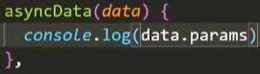

  

# <a id='zero'></a>目录

| 目录 |
| --- |
| [一 ssr](#1) |
| &emsp;&emsp;[1.1 渲染一个 Vue 实例](#1.1) |
| &emsp;&emsp;[1.2 使用 node 的 Express 框架](#1.2) |
| [二 nuxt-项目创建](#2) |
| [三 nuxt-一级路由](#3) |
| [四 nuxt-声明式导航](#4) |
| [五 nuxt-嵌套子路由](#5) |
| [六 nuxt-重定向](#6) |
| [七 nuxt-动态路由](#7) |
| [八 nuxt-视图](#8) |
| [九 nuxt-asyncData](#9) |
| &emsp;&emsp;[9.1 基本使用](#9.1) |
| &emsp;&emsp;[9.2 函数的执行特点](#9.2) |
| &emsp;&emsp;[9.3 函数的参数](#9.3) |
| &emsp;&emsp;[9.4 detail 组件](#9.4) |
| [十 nuxt-反向代理](#10) |
| &emsp;&emsp;[10.1 配置反向代理](#10.1) |
| &emsp;&emsp;[10.2 区分客户端/服务端](#10.2) |
| [十一 nuxt-elementUI](#11) |

# <a id='1'></a>一 (104~105)-ssr
> [返回目录](#zero)

之前做的项目是单文件组件开发的，开发成了前后端分离的方式。所有的渲染、包括模板引擎的解析，都是在前端做的。这种做法的问题：  
在SEO这块，会比较差一点???  
解决方法：  
[**SSR(服务端渲染)**](https://ssr.vuejs.org/zh/)  
将Vue写成单文件组件，没有问题。组件的解析时间：在请求时，在服务端将Vue翻译成浏览器能够理解的语法，...???  
其实只有主页是在服务端渲染的，其他页面还是在浏览器端渲染的???  
【优势】  
- 更好的 SEO  
搜索引擎优化方面做的比较好  
以前的做法抓不到布局  
  
- 更快的内容到达时间 (time-to-content)  
不需要等待全部JS下载完成，只需要下载完当前页面组件的代码即可抛给浏览器，进行显示  

【说明】  
之前的单文件组件开发，是用webpack来编译成浏览器可以识别的内容，这些工作都是在本地编译的时候，浏览器做的  
现在希望在一请求网址时，在服务端做好，变成HTML+CSS+JS后，再传给浏览器，这样浏览器只需要加载一些内容即可  

【用法】  
## <a id='1.1'></a>1.1 渲染一个 Vue 实例  
> [返回目录](#zero)

第 1 步：创建一个 Vue 实例(浏览器端，只需要这一步即可使用浏览器来渲染了)  
第 2 步：创建一个 renderer  
第 3 步：使用 renderer 将 Vue 实例渲染为 HTML  
要结合Node这种服务器，来执行上述代码  
```01-rendertostring.js```文件  
```js
// 第 1 步：创建一个 Vue 实例
const Vue = require('vue')
const app = new Vue({
  template: `<div>{{myname}}-{{myage}}</div>`,
  data:{
      myname:"kerwin",
      myage:100
  }
})

// 第 2 步：创建一个 renderer
const renderer = require('vue-server-renderer').createRenderer()

// 第 3 步：将 Vue 实例渲染为 HTML
// 在 2.5.0+，如果没有传入回调函数，则会返回 Promise：
renderer.renderToString(app).then(html => {
  console.log(html)
}).catch(err => {
  console.error(err)
})
```
安装包  
```
cnpm i -S vue vue-server-renderer
```
运行上述代码  
```
node .\01-rendertostring.js
```
  
在服务端完成转换  
## <a id='1.2'></a>1.2 使用 node 的 Express 框架
> [返回目录](#zero)

安装包  
```
cnpm i -S express
```
```02-express-ssr.js```文件  
```js
const Vue = require('vue')
const server = require('express')()
const renderer = require('vue-server-renderer').createRenderer()

server.get('*', (req, res) => {
  const app = new Vue({
    data: {
      myname:"kerwin"
    },
    template: `<div :class="myname">访问的 {{myname}}</div>`
  })

  renderer.renderToString(app, (err, html) => {
    
    if (err) {
      res.status(500).end('Internal Server Error')
      return
    }
    res.writeHead(200,{"Content-Type":'text/html;charset=utf8'});
    res.end(`
      <!DOCTYPE html>
      <html lang="en">
        <head><title>Hello</title></head>
        <body>${html}</body>
      </html>
    `)
  })
})

server.listen(8080)
```
运行上述代码  
```
node .\02-express-ssr.js
```

# <a id='2'></a>二 (106)-nuxt-项目创建  
> [返回目录](#zero)

nuxt 是一个基于 Vue.js 的服务端渲染应用框架  
[nuxt中文文档](https://www.nuxtjs.cn/)  
【安装】  
安装 create-nuxt-app 脚手架  
方式一：  
  
方式二：  
通过 npx 来安装，两句命令合成了一句。npx 会检查脚手架有没有在全局/局部安装，若有，则直接创建项目；若没有，则先进行脚手架的局部安装再创建项目  
```
npx create-nuxt-app <项目名>
```
  
【启动】  
```
npm run dev
```
浏览器输入 localhost:3000  
【项目结构】  
assets —— 静态资源  
components —— 全局的公共组件  
layouts —— 布局  
middleware —— 中间件，可以拦截路由  
pages —— 类似vue-cli项目中的views文件夹，放置页面级组件以及其所依赖的子组件  
plugins —— 插件，如element-ui  
server —— 对server的配置。如为什么监听3000端口号？启动了NodeJS，在server中进行了端口号等Express的配置  
static —— 静态资源，小图标、模拟数据...  
store —— Vuex  
# <a id='3'></a>三 (107)-nuxt-一级路由  
> [返回目录](#zero)

Nuxt.js 依据 pages 目录结构自动生成 vue-router 模块的路由配置。  
删除pages下默认的index.vue  
  
新建页面级组件  
  
组件内容如下：  
  
路由自动生成。(此时没有根组件???，输入 localhost:3000 没有页面)  
  
可在地址栏输入 localhost:3000/center  
  

# <a id='4'></a>四 (108)-nuxt-声明式导航  
> [返回目录](#zero)

根组件在 layouts/default.vue 中：  
  
  
【**路由容器**】  
```html
<nuxt />
```
等同于Vue-cli项目中的  
```html
<router-view></router-view>
```
【在浏览器中的显示效果】  
  
【**声明式导航**】  
```html
<nuxt-link></nuxt-link>
```
等同于Vue-cli项目中的  
```html
<router-link></router-link>
```
此例中，  
```html
<ul>
  <nuxt-link to="/film" tag='li' activeClass='myactive'>film</nuxt-link>
  <nuxt-link to="/cinema" tag='li' activeClass='myactive'>cinema</nuxt-link>
  <nuxt-link to="/center" tag='li' activeClass='myactive'>center</nuxt-link>
</ul>
```
  
等同于Vue-cli项目中的  
```html
<ul>
  <router-link to="/film" tag='li' activeClass='myactive'>film</router-link>
  <router-link to="/cinema" tag='li' activeClass='myactive'>cinema</router-link>
  <router-link to="/center" tag='li' activeClass='myactive'>center</router-link>
</ul>
```

# <a id='5'></a>五 (109)-nuxt-嵌套子路由  
> [返回目录](#zero)

创建内嵌子路由，你需要添加一个 Vue 文件，同时添加一个与该文件同名的目录用来存放子视图组件。  
  
父组件中要预留好子路由容器 nuxt-child  
  
浏览器中：  
  

# <a id='6'></a>六 (110)-nuxt-重定向  
> [返回目录](#zero)

localhost:3000 重定向到 localhost:3000/film/nowplaying  
【方法一】  
nuxt.config.js  
```js
router:{
  extendRoutes(routes){
    routes.push({
      path:"/",
      redirect:'/film/nowplaying'
    })
  }
}
```
重启服务器  
小bug：希望点击声明式导航中的 film 也能重定向到 localhost:3000/film/nowplaying  
【方法二】  
利用中间件  
在 middleware 文件夹中新建 redirect.js 文件，创建中间件  
  
```js
export default function ({ isHMR, app, store, route, params, error, redirect }) {
  if (isHMR) return
  if (route.fullPath == '/film') {
    return redirect('/film/nowplaying')
  }
}
```
isHMR 是用于热更新(只更新组件而不刷新页面)的。热更新 -> 不需要判断路由名称、重定向、刷新页面 -> 也即不需要执行之后的代码  
在 nuxt.config.js 中，配置中间件  
```js
router:{
  middleware:'redirect',
  extendRoutes(routes){
    routes.push({
      path:"/",
      redirect:'/film/nowplaying'
    })
  }
}
```
重启服务器(记得修改配置文件了要重启服务器)  
点击声明式导航中的 film 也能重定向到 localhost:3000/film/nowplaying  

# <a id='7'></a>七 (111)-nuxt-动态路由  
> [返回目录](#zero)

使用**编程式导航**进行路径跳转，传入 id 实现**动态路由**， nowplaying.vue 与 Vue-cli项目中的写法一模一样  
```html
<script>
export default {
  methods: {
    handleChangePage (id) {
      this.$router.push(`/detail/${id}`)
    }
  }
}
</script>
```
【问题】  
如果定义了 detail 页面级组件，带着id跳转，会出错。(因为没有二级路由)  
【解决】  
创建这样的目录结构：  
  
_myid.vue 组件内容如下(接收传入的 id 参数)：  
```html
<template>
  <div>
    detail--{{$route.params.myid}}
  </div>
</template>
```
  
  

# <a id='8'></a>八 (112)-nuxt-视图  
> [返回目录](#zero)

在 nuxt 中，根组件是 layouts/default.vue 
刚才在根组件中插入了声明式导航  
声明式导航的显示与隐藏 —— Vuex的共享状态来控制  
在 nuxt 中，有另一种有意思的解决方式 —— 不以 default.vue 作根组件 —— 这种自定义哪个组件为根组件的技术叫做**视图**  
在 layouts 文件夹下新建一个 detail 组件的**模板文件** detailtemplate.vue ，内容与 default.vue 大致相同，只需要将 声明式导航删除即可  
  
使 detail 组件加载时以 detailtemplate.vue 作为根组件：  
```js
export default {
  layout: "detailtemplate",
}
```

# <a id='9'></a>九 (113~115)-nuxt-asyncData  
> [返回目录](#zero)

## <a id='9.1'></a>9.1 基本使用  
> [返回目录](#zero)

nuxt 开发中数据的请求，放在 mounted 生命周期中？  
不可以！  
当前页面所有组件已经完成挂载，变成真实的DOM时，才会触发 mounted 生命周期。此时页面已经在前端显示完成了，再去触发 mounted 生命周期，前端再发送 Ajax 进行数据请求。请求数据会存在 SEO 的问题，爬不到  
【解决】  
需要使请求数据的时机更早 —— 当有人请求这个网址，请求这个路由时，就触发一个生命周期函数，向后端请求数据。请求回数据后就把页面渲染好，把整个页面在服务端组装好后，再给前端返回数据。这样浏览器取得的是拼接完成的页面了，这样会解决 SEO 问题，可以爬到数据  
【使用 ```req/res(request/response)``` 对象】  
在服务端调用 ```asyncData``` 时，您可以访问用户请求的req和res对象。  
在当前页面刷新， 服务端执行此函数  
从其他页面跳转过来，客户端执行此函数  
```js
asyncData() {
  return axios({
    url:"https://m.maizuo.com/gateway?cityId=110100&pageNum=1&pageSize=10&type=1&k=6341699",
    headers:{
      'X-Client-Info': '{"a":"3000","ch":"1002","v":"5.0.4","e":"15610855429195524981146"}',
      'X-Host': 'mall.film-ticket.film.list'
    }
  }).then(res=>{
    console.log(res.data);
  })
},
```
打印在服务器的控制台上，而没有打印在浏览器的控制台上  
  
取得数据——通过 Promise 对象???  
1. 使后续可以取得 asyncData() 这个 Promise 对象的返回值  
asyncData() 返回的是 Promise 对象，为了后续能够取得该 Promise 对象的返回值，要在 then 中 return  
  
```js
asyncData() {
  return axios({
    url:"https://m.maizuo.com/gateway?cityId=110100&pageNum=1&pageSize=10&type=1&k=6341699",
    headers:{
      'X-Client-Info': '{"a":"3000","ch":"1002","v":"5.0.4","e":"15610855429195524981146"}',
      'X-Host': 'mall.film-ticket.film.list'
    }
  }).then(res=>{
    console.log(res.data);
    return {
      datalist:res.data.data.films
    }// 状态
  })
},
```
datalist: res.data 中的 datalist 是状态  
2. 可以取得 Promise 对象的返回值  
  
???干嘛要取得该 Promise 对象的返回值呢(也没看到使用呀)？在 Promise 对象中直接赋值给状态不就可以了吗  

## <a id='9.2'></a>9.2 函数的执行特点  
> [返回目录](#zero)

【 asyncData 函数的执行特点】  
在当前页面(并且是当前组件)刷新， 服务端执行此函数(早早地触发，方便服务端给页面组装好，返还给客户端，便于 SEO )  
从其他页面跳转过来，客户端执行此函数(之前在服务端打印的数据，在浏览器中打印出来了，说明是在客户端请求的数据)  
【原因】  
服务端渲染，主要解决的是两个问题：  
1. 首页加载过慢的问题，只要首页的数据是从服务端渲染好后发送给客户端，直接显示在浏览器中，即可  
2. 爬虫问题。搜索引擎爬虫是直接爬取特定的路径，而不是鼠标点击导航，从其他页面跳转过来。所以是服务端执行的 asyncData 函数，是服务端渲染后传给的客户端，不存在客户端执行此函数导致无法爬的问题  

【说明】  
鼠标点击导航(从其他页面跳转过来)，渲染才交给客户端来做。  
这样做的好处是：提高了用户体验???点击的时候才触发数据请求，没必要再从服务器渲染过来(难道好处不是减轻服务器的压力🍐嘛)  
可以这样认为：只有首屏是从服务端渲染的，其他通过点击到达的页面，是客户端渲染的(前后端分离的体验/服务端客户端分离的体验，我认为这样说更准确)  

## <a id='9.3'></a>9.3 函数的参数  
> [返回目录](#zero)

```js
asyncData(data) {
  console.log(data);
},
```
故意让它在前端打印出来  
  
params —— 路由传参的参数( detail 组件的动态路由)  
route —— 路由对象  
detail 组件动态路由实例  
  
  
之前可以通过 ```this.$route.params.myid``` 来访问呀？  
  
出错啦???(为什么会出错)  

## <a id='9.4'></a>9.4 detail 组件  
> [返回目录](#zero)

template 中的注释记得删掉，不然在节点对比时会出现问题  

# <a id='10'></a>十 (116~118)-nuxt-反向代理  
> [返回目录](#zero)

猫眼网站是需要配置反向代理的  
假如 comingsoon 的数据是从猫眼请求回来的  
首先，在 film 中增加声明式导航。  
然后，在 comingsoon 中向猫眼请求异步数据  
```js
asyncData() {
  return axios({
    url: "http://m.maoyan.com/ajax/movieOnInfoList?token=",
  }).then(res=>{
    console.log(res.data);
    return {
      datalist:res.data.movieList
    }
  })
}
```
【问题】  
点击跳转，在客户端渲染，console.log 打印在浏览器控制台上(报错)；刷新，在服务端渲染，打印在服务端(不报错且能看到数据)  
【原因】  
在服务端请求数据，服务端没有跨域限制；而在客户端请求数据有跨域的问题  
【解决】  
## <a id='10.1'></a>10.1 配置反向代理  
> [返回目录](#zero)

解决客户端的跨域问题 —— 配置反向代理  
安装模块  
```
npm i @nuxtjs/proxy ‐D
```
在 nuxt.config.js 配置文件中添加对应的模块，并设置代理  
  
修改 comingsoon 中向猫眼请求异步数据的 url 地址  
```js
asyncData() {
  return axios({
    url:"/ajax/movieOnInfoList?token=",
  }).then(res=>{
    console.log(res.data);
    return {
      datalist:res.data.movieList
    }
  })
}
```
重启服务器  
【问题】  
1. 从其他页面跳转过来(点击导航)，客户端渲染  
向本地服务器发送 Ajax 请求( url 地址为 /ajax/movieOnInfoList?token= )，本地服务器再通过反向代理将请求发送给猫眼服务器  
  
2. 在当前页面刷新，服务端渲染  
直接向猫眼服务器发送 Ajax 请求( url 地址为 /ajax/movieOnInfoList?token= )，请求不到  

【解决】  
## <a id='10.2'></a>10.2 区分客户端/服务端  
> [返回目录](#zero)

process.server 全局变量  
在 comingsoon 组件中，发送异步请求时打印一下该全局变量  
  
```js
asyncData() {
  return axios({
    url:process.server?"http://m.maoyan.com/ajax/movieOnInfoList?token=":"/ajax/movieOnInfoList?token=",
  }).then(res=>{
    console.log(res.data);
    return {
      datalist:res.data.movieList
    }
  })
}
```

# <a id='11'></a>十一 (119~120)-nuxt-elementUI  
> [返回目录](#zero)

按钮  
轮播  
  
  