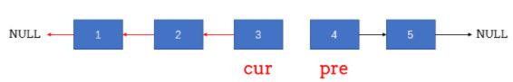
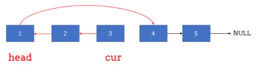
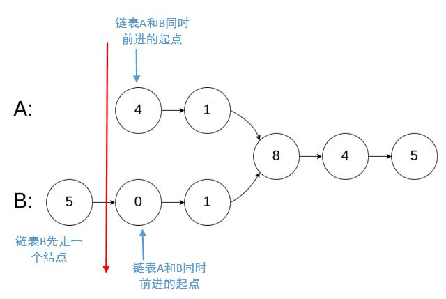
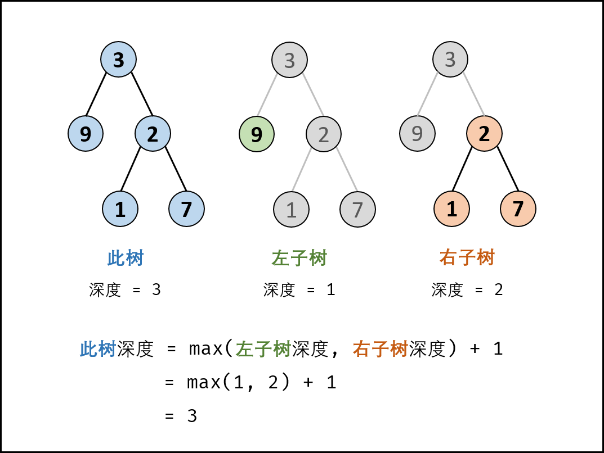

# <a id="zero"></a>目录

| 目录 |
| ---- |
| [一 字符串](#one) |
| [二 线性结构](#two) |
| &emsp;[2.1 数组](#two-one) |
| &emsp;[2.2 链表](#two-two) |
| &emsp;[2.3 栈](#two-three) |
| &emsp;[2.4 队列](#two-four) |
| [三 哈希表(散列表)](#three) |
| [四 树形结构](#four) |
| &emsp;[4.1 树](#four-one) |
| &emsp;[4.2 二叉搜索树](#four-two) |
| &emsp;[4.3 字典树](#four-three) |
| &emsp;[4.4 树状数组](#four-four) |
| &emsp;[4.5 线段树](#four-five) |
| [五 堆](#five) |
| [六 图](#six) |
| &emsp;[6.1 拓扑排序](#six-one) |
| [七 基本算法思想](#seven) |
| &emsp;[7.1 动态规划](#seven-one) |
| &emsp;[7.2 贪心算法](#seven-two) |
| &emsp;[7.3 回溯算法](#seven-three) |
| &emsp;[7.4 分治算法](#seven-four) |
| [八 搜索](#eight) |
| &emsp;[8.1 深度优先搜索](#eight-one) |
| &emsp;[8.2 广度优先搜索](#eight-two) |
| [九 查找](#nine) |
| &emsp;[9.1 二分查找](#nine-one) |
| [十 排序](#ten) |
| [十一 其他](#eleven) |
| &emsp;[11.1 并查集](#eleven-one) |
| [十二 LeetCode其他分类](#twelve) |
| &emsp;[12.1 数学(210)](#twelve-one) |
| &emsp;[12.2 双指针(75)](#twelve-two) |
| &emsp;[12.3 设计(69)](#twelve-three) |
| &emsp;[12.4 位运算(67)](#twelve-four) |
| &emsp;[12.5 Sliding Window(29)](#twelve-five) |
| &emsp;[12.6 递归(24)](#twelve-six) |
| &emsp;[12.7 Ordered Map(13)](#twelve-seven) |
| &emsp;[12.8 几何(12)](#twelve-eight) |
| &emsp;[12.9 极小化极大(8)](#twelve-nine) |
| &emsp;[12.10 脑筋急转弯(7)](#twelve-ten) |
| &emsp;[12.11 Random(6)](#twelve-eleven) |
| &emsp;[12.12 Line Sweep(6)](#twelve-twelve) |
| &emsp;[12.13 记忆化(3)](#twelve-thirteen) |
| &emsp;[12.14 蓄水池抽样(2)](#twelve-fourteen) |
| &emsp;[12.15 Rejection Sampling(2)](#twelve-fifteen) |
| &emsp;[12.16 Map()](#twelve-sixteen) |

# <a id="one"></a>一 字符串
> [返回目录](#zero)  

## 1.1 (简单) 剑指 Offer 58 - Ⅱ. 左旋转字符串
字符串的左旋转操作是把字符串前面的若干个字符转移到字符串的尾部。请定义一个函数实现字符串左旋转操作的功能。比如，输入字符串"abcdefg"和数字2，该函数将返回左旋转两位得到的结果"cdefgab"。

示例 1：

输入: s = "abcdefg", k = 2  
输出: "cdefgab"  
示例 2：  

输入: s = "lrloseumgh", k = 6  
输出: "umghlrlose"  
 

限制：

1 <= k < s.length <= 10000

```JS
var reverseLeftWords = function(s, n) {
	// 方法一：slice
	return s.slice(n) + s.slice(0, n)
};
```

## 1.2 (简单) 剑指 Offer 58 - Ⅰ. 翻转单词顺序
输入一个英文句子，翻转句子中单词的顺序，但单词内字符的顺序不变。为简单起见，标点符号和普通字母一样处理。例如输入字符串"I am a student. "，则输出"student. a am I"。

示例 1：

输入: "the sky is blue"  
输出: "blue is sky the"  
示例 2：  

输入: "  hello world!  "  
输出: "world! hello"  
解释: 输入字符串可以在前面或者后面包含多余的空格，但是反转后的字符不能包括。  
示例 3：  

输入: "a good   example"  
输出: "example good a"  
解释: 如果两个单词间有多余的空格，将反转后单词间的空格减少到只含一个。  

说明：

无空格字符构成一个单词。  
输入字符串可以在前面或者后面包含多余的空格，但是反转后的字符不能包括。  
如果两个单词间有多余的空格，将反转后单词间的空格减少到只含一个。  

```JS
var reverseWords = function(s) {
	s = s.trim();
	var arr = s.split(/\s+/);
	return arr.reverse().join(' ');
};
```


# <a id="two"></a>二 线性结构
> [返回目录](#zero)  

## <a id="two-one"></a>2.1 数组
> [返回目录](#zero)  

### <a id="two-one-one">2.1.1 (简单) 剑指 Offer 03. 数组中的重复数字
找出数组中重复的数字。

在一个长度为 n 的数组 nums 里的所有数字都在 0～n-1 的范围内。数组中某些数字是重复的，但不知道有几个数字重复了，也不知道每个数字重复了几次。请找出数组中任意一个重复的数字。

**示例 1：**

```
输入：  
[2, 3, 1, 0, 2, 5, 3]  
输出：2 或 3 
```

**限制：**

2 <= n <= 100000

(加分项：问时间、空间复杂度)  
```JS
// 方法一：暴力 时间O(n2)，空间O(1)
var findRepeatNumber = function(nums) {
	const numLength = nums.length
	for (var i = 0; i < numLength; i++) {
		for (var j = i + 1; j < numLength; j++) {
			if (nums[j] === nums[i]) {
				return nums[i]
			}
		}
	}
};
```
```JS
// 方法二：数组模拟Java中的哈希表 时间O(n)，空间O(n)
var findRepeatNumber = function(nums) {
	var newNums = new Array(nums.length)
	newNums.fill(-1)
	for(var i in nums) {
		if(newNums[nums[i]] !== -1) {
			return nums[i]
		}
		newNums[nums[i]] = i
	}
};
```
```JS
// 方法三：利用原地排序的思路 时间O(n)，空间O(1)
var findRepeatNumber = function(nums) {
	for (var i in nums) {
		var temp
		while (nums[i] != i) {
			if (nums[nums[i]] === nums[i]) {
				return nums[i]
			} else {
				temp = nums[nums[i]]
				nums[nums[i]] = nums[i]
				nums[i] = temp
			}
		}
	}
};
```

### (相关) 数组去重

数组去重是个经常提及的点：

```JS
const arr = [1, 1, 2, 3, 3];
// 期望得到：[1, 2, 3]
```

解答：  
```JS
// 方法一：includes
const newArr1 = [];
for (let i = 0; i < arr.length; i++) {
  if (!newArr1.includes(arr[i])) {
    newArr1.push(arr[i]); 
  }
}
console.log('newArr1：', newArr1);

// indexOf，与上述方法几乎完全一样，但是语义不如includes好
const newArr1 = [];
for (let i = 0; i < arr.length; i++) {
  if (newArr1.indexOf(arr[i]) == -1) {
    newArr1.push(arr[i]); 
  }
}
console.log('newArr1：', newArr1);
```

```JS
// 方法二： Set
const newArr2 = [...new Set(arr)];
console.log('newArr2：', newArr2);
```

```JS
// 方法三： filter
const newArr3 = arr.filter((item, index) => arr.lastIndexOf(item) === index);
console.log('newArr3：', newArr3);
```

有一次面试碰到的有意思的提问是：不使用数组 `API` 进行去重。

> 注意：不能使用 `push`、`indexOf` 等 `API`

```JS
// 方法四：不使用数组API
// (1) 暴力遍历
var newArr4 = [arr[0]];
for (var i = 1; i < arr.length; i++) {
  var repeatflag = false;
  for (var j = 0; j < newArr4.length; j++) {
    if (arr[i] === newArr4[j]) {
      repeatflag = true;
      break;
    }
  }
  if (!repeatflag) {
    newArr4[newArr4.length] = arr[i];
  }
}
console.log('newArr4', newArr4);
// (2) 二分法
```

### 2.1.2 (简单) 剑指 Offer 53 - Ⅰ. 在排序数组中查找数字Ⅰ
统计一个数字在排序数组中出现的次数。

示例 1:

输入: nums = [5,7,7,8,8,10], target = 8  
输出: 2  
示例 2:  

输入: nums = [5,7,7,8,8,10], target = 6  
输出: 0  

限制：

0 <= 数组长度 <= 50000

```JS
var search = function(nums, target) {
  var left = 0,
    right = nums.length - 1,
    middle, count = 0;

  while (left < right) {
    middle = Math.floor((right + left) / 2);
    if (nums[middle] >= target) {
      right = middle
    } else {
      left = middle + 1
    }
  }

  while (left < nums.length && nums[left++] == target) {
    count++
  }
  
  return count

};

var nums = [5, 7, 7, 8, 8, 10],
  target = 6;
console.log(search(nums, target));
```

### 2.1.3 (简单) 剑指 Offer 29. 顺时针打印矩阵
输入一个矩阵，按照从外向里以顺时针的顺序依次打印出每一个数字。

示例 1：

输入：matrix = [[1,2,3],[4,5,6],[7,8,9]]
输出：[1,2,3,6,9,8,7,4,5]
示例 2：

输入：matrix = [[1,2,3,4],[5,6,7,8],[9,10,11,12]]
输出：[1,2,3,4,8,12,11,10,9,5,6,7]
 

限制：

0 <= matrix.length <= 100  
0 <= matrix[i].length <= 100  

```js
var spiralOrder = function(matrix) {
  var j = 0; // 用于判断是第几行/列
  var newMatrix = [];

  while (matrix.length !== 0) {
    switch (j++ % 4) {
      case 0:
        newMatrix = [...newMatrix, ...matrix.shift()];
        break;
      case 1:
        matrix.forEach((item) => {
          newMatrix.push(item.pop());
        });
        if (matrix[0] && matrix[0].length === 0) { // 防止[[],[],[]]这种情况出现
          matrix = [];
        }
        break;
      case 2:
        newMatrix = [...newMatrix, ...matrix.pop().reverse()];
        break;
      case 3:
        for (let i = matrix.length - 1; i >= 0; i--) {
          newMatrix.push(matrix[i].shift());
        }
        if (matrix[0] && matrix[0].length === 0) { // 防止[[],[],[]]这种情况出现
          matrix = [];
        }
    }
  }

  return newMatrix;
};

var matrix = [
  [7],
  [9],
  [6]
];
console.log(spiralOrder(matrix));
```

### 2.1.4 (简单) 剑指 Offer 53 - Ⅱ. 0~n-1中缺失的数字
一个长度为n-1的递增排序数组中的所有数字都是唯一的，并且每个数字都在范围0～n-1之内。在范围0～n-1内的n个数字中有且只有一个数字不在该数组中，请找出这个数字。

示例 1:

输入: [0,1,3]  
输出: 2  
示例 2:  

输入: [0,1,2,3,4,5,6,7,9]  
输出: 8  

限制：

1 <= 数组长度 <= 10000

```js
var missingNumber = function(nums) {
  var l = 0,
    r = nums.length - 1;
  var middle;
  if (nums[0] > 0) {
    return 0;
  } else if (nums[r] === r) {
    return r + 1;
  } else {
    while (r - l > 1) {
      middle = Math.floor((l + r) / 2);
      if (nums[middle] > middle) {
        r = middle;
      } else {
        l = middle;
      }
    }
    return nums[l] + 1;
  }
};
```
## <a id="two-two"></a>2.2 链表  
> [返回目录](#zero)  

### 2.2.1 (简单) 剑指 Offer 22. 链表中倒数第k个节点
输入一个链表，输出该链表中倒数第k个节点。为了符合大多数人的习惯，本题从1开始计数，即链表的尾节点是倒数第1个节点。例如，一个链表有6个节点，从头节点开始，它们的值依次是1、2、3、4、5、6。这个链表的倒数第3个节点是值为4的节点。

示例：

给定一个链表: 1->2->3->4->5, 和 k = 2.

返回链表 4->5.

```js
// 方法一：用数组存放所有节点的指针 时间O(n)，空间O(n)
var getKthFromEnd = function(head, k) {
    var p = head;
    var pArr = [];
    while(p != null) {
        pArr.push(p);
        p = p.next;
    }
    return pArr[pArr.length - k];
};
```

```js
// 方法二：快慢指针 时间O(n)，空间O(1)
var getKthFromEnd = function(head, k) {
    var pFront = head, pBehind = head;
    while(k-- > 0) {
        pFront = pFront.next;
    }
    while(pFront != null) {
        pFront = pFront.next;
        pBehind = pBehind.next;
    }
    return pBehind;
};
```

### 2.2.2 (简单) 剑指 Offer 06. 从尾到头打印链表
输入一个链表的头节点，从尾到头反过来返回每个节点的值（用数组返回）。

示例 1：

输入：head = [1,3,2]  
输出：[2,3,1]  

限制：

0 <= 链表长度 <= 10000

```js
// 方法一 时间O(n)，空间O(n)
var reversePrint = function(head) {
    var p = head;
    var pArr = [];
    while(p != null) {
        pArr.push(p.val);
        p = p.next;
    }
    pArr.reverse();
    return pArr;
};
```

```js
// 方法一 时间O(n)，空间O(n)
// 代码简洁了，但是貌似时间更久了？
var reversePrint = function(head) {
    let nums = [];
    let node = head;
    while (node !== null) {
        nums.unshift(node.val);
        node = node.next;
    }
    return nums;
};
```

### 2.2.3 (简单) 剑指 Offer 24. 反转链表
定义一个函数，输入一个链表的头节点，反转该链表并输出反转后链表的头节点。

示例:

输入: 1->2->3->4->5->NULL  
输出: 5->4->3->2->1->NULL  

限制：

0 <= 节点个数 <= 5000

```js
// (我的方法)
// 方法一：pLeft pMiddle pRight三个指针，移动顺序为左中右
var reverseList = function(head) {
    if (head === null) { // 空链表
        return null;
    }
    var pLeft = null, pMiddle = head, pRight = pMiddle.next;
    if (pRight === null) { // 只有一个元素的链表
        return pMiddle;
    }
    pMiddle.next = null;
    do {
        pLeft = pMiddle;
        pMiddle = pRight;
        pRight = pRight.next;
        pMiddle.next = pLeft;
    } while (pRight != null)
    return pMiddle;
};
```

  
```js
// 方法一：双指针(官方方法。和上面的方法几乎无差别，但是'双指针'比'三个指针'思路更清晰)
var reverseList = function(head) {
    if (head === null) { // 空链表
        return null;
    }
    var cur = null, pre = head;
    if (pre.next === null) { // 只有一个元素的链表
        return pre;
    }
    while (pre != null) {
        var t = pre.next;
        pre.next = cur;
        cur = pre;
        pre = t;
    } 
    return cur;
};
```

```js
// (我的方法)
// 方法二：链表入栈 空间O(n)
var reverseList = function(head) {
    // 空链表 或 只有一个元素的链表
    if (head == null || head.next == null) {
        return head;
    }

    var arr = [];
    while(head != null) {
        arr.push(head); // 入栈
        head = head.next;
    }
    head = arr.pop();
    var t = head;
    while (t.next = arr.pop()) { // 出栈
        t = t.next;
    }
    t.next = null;
    return head;
};
```

```js
// 方法二：递归。递归的内部实现是使用栈
```

  
```js
// 方法三：妖魔化的双指针
```

### 2.2.4 (简单) 剑指 Offer 52. 两个链表的第一个公共节点
[leetcode](https://leetcode-cn.com/problems/liang-ge-lian-biao-de-di-yi-ge-gong-gong-jie-dian-lcof/)  

  
```js
// (我的方法)
var getIntersectionNode = function(headA, headB) {
    var pA = headA, pB = headB, lengthA = 0, lengthB = 0;
    for (; pA !== null; pA = pA.next, lengthA++) {}
    for (; pB !== null; pB = pB.next, lengthB++) {}
    pA = headA, pB = headB;
    if (lengthA - lengthB > 0) {
        for (var i = lengthA - lengthB; i > 0; pA = pA.next, i--) {}
    } else if (lengthA - lengthB < 0) {
        for (var i = lengthB - lengthA; i > 0; pB = pB.next, i--) {}
    }
    for (; pA !== null; pA = pA.next, pB = pB.next) {
        if (pA == pB) {
            return pA;
        } 
    }
    return null;
};
```

### 2.2.5 (简单) 剑指 Offer 18. 删除链表的节点
[leetcode](https://leetcode-cn.com/problems/shan-chu-lian-biao-de-jie-dian-lcof/)  

```js
var deleteNode = function(head, val) {
    if (head.val === val) {
        return head.next;
    }
    var p = head;
    for (; p.next.val !== val; p = p.next) {}
    p.next = p.next.next;
    return head;
};
```

## <a id="two-three"></a>2.3 栈  
> [返回目录](#zero)  

### 2.3.1 (简单) 剑指 Offer 09. 用两个栈实现队列
用两个栈实现一个队列。队列的声明如下，请实现它的两个函数 appendTail 和 deleteHead ，分别完成在队列尾部插入整数和在队列头部删除整数的功能。(若队列中没有元素，deleteHead 操作返回 -1 )

示例 1：

输入：  
["CQueue","appendTail","deleteHead","deleteHead"]  
[[],[3],[],[]]  
输出：[null,null,3,-1]  
示例 2：  

输入：  
["CQueue","deleteHead","appendTail","appendTail","deleteHead","deleteHead"]  
[[],[],[5],[2],[],[]]  
输出：[null,-1,null,null,5,2]  
提示：  

1 <= values <= 10000  
最多会对 appendTail、deleteHead 进行 10000 次调用  

```js
// 方法一：
var CQueue = function() {
    this.stack1 = [];
    this.stack2 = [];
};

/** 
 * @param {number} value
 * @return {void}
 */
CQueue.prototype.appendTail = function(value) {
    while(this.stack2.length !== 0) {
        this.stack1.push(this.stack2.pop());
    };
    this.stack1.push(value);
};

/**
 * @return {number}
 */
CQueue.prototype.deleteHead = function() {
    while(this.stack1.length !== 0) {
        this.stack2.push(this.stack1.pop());
    };
    return this.stack2.pop() || -1;
};

/**
 * Your CQueue object will be instantiated and called as such:
 * var obj = new CQueue()
 * obj.appendTail(value)
 * var param_2 = obj.deleteHead()
 */
```

### 2.3.2 (简单) 剑指 Offer 30. 包含min函数的栈
定义栈的数据结构，请在该类型中实现一个能够得到栈的最小元素的 min 函数在该栈中，调用 min、push 及 pop 的时间复杂度都是 O(1)。

示例:

MinStack minStack = new MinStack();  
minStack.push(-2);  
minStack.push(0);  
minStack.push(-3);  
minStack.min();   --> 返回 -3.  
minStack.pop();  
minStack.top();      --> 返回 0.  
minStack.min();   --> 返回 -2.  
 
提示：

各函数的调用总次数不超过 20000 次
 
```js
// 方法一：数组中存储对象
var MinStack = function() {
    this.stack = [];
};

MinStack.prototype.push = function(x) {
    if(this.stack.length === 0) {
        this.stack[0] = {
            num: x,
            min: x
        };
    } else {
        this.stack[this.stack.length] = {
            num: x,
            min: Math.min(this.stack[this.stack.length - 1].min, x)
        };
    }
};

MinStack.prototype.pop = function() {
    this.stack.length--;
};

MinStack.prototype.top = function() {
    return this.stack[this.stack.length - 1].num;
};

MinStack.prototype.min = function() {
    return this.stack[this.stack.length - 1].min;
};
```

```js
// 方法二：两个数组，不用每一步都存储当前最小值
var MinStack = function() {
    this.stack = [];
    this.minStack = [];
};

MinStack.prototype.push = function(x) {
    if(this.stack.length === 0) {
        this.minStack[0] = x;
    } else {
        if (x <= this.minStack[this.minStack.length - 1]) {
          this.minStack[this.minStack.length] = x
        }
    }
    this.stack[this.stack.length] = x;
};

MinStack.prototype.pop = function() {
    if (this.minStack[this.minStack.length - 1] === this.stack[this.stack.length - 1]) {
        this.minStack.length--;
    }
    this.stack.length--;
};

MinStack.prototype.top = function() {
    return this.stack[this.stack.length - 1];
};

MinStack.prototype.min = function() {
    return this.minStack[this.minStack.length - 1];
};
```


## <a id="two-four"></a>2.4 队列
> [返回目录](#zero)  

### 2.4.1 (简单) 剑指 Offer 59 - Ⅰ. 滑动窗口的最大值
给定一个数组 nums 和滑动窗口的大小 k，请找出所有滑动窗口里的最大值。

**示例:**

```
输入: nums = [1,3,-1,-3,5,3,6,7], 和 k = 3
输出: [3,3,5,5,6,7] 
解释: 

  滑动窗口的位置                最大值
---------------               -----
[1  3  -1] -3  5  3  6  7       3
 1 [3  -1  -3] 5  3  6  7       3
 1  3 [-1  -3  5] 3  6  7       5
 1  3  -1 [-3  5  3] 6  7       5
 1  3  -1  -3 [5  3  6] 7       6
 1  3  -1  -3  5 [3  6  7]      7
```
 

**提示：**

你可以假设 k 总是有效的，在输入数组不为空的情况下，1 ≤ k ≤ 输入数组的大小。

注意：本题与主站 239 题相同：https://leetcode-cn.com/problems/sliding-window-maximum/

```js
// (我的方法)
// 方法一：时间O(nk)
var maxSlidingWindow = function(nums, k) {
    if (nums.length === 0) {
        return [];
    }
    var maxNums = [];
    for (let i = 0, len = nums.length - k; i <= len; i++) {
        maxNums.push(Math.max(...nums.slice(i, i+k)));
    }
    return maxNums;
};
```

### (困难) 239. 滑动窗口最大值 (要求线性时间复杂度)
给你一个整数数组 nums，有一个大小为 k 的滑动窗口从数组的最左侧移动到数组的最右侧。你只可以看到在滑动窗口内的 k 个数字。滑动窗口每次只向右移动一位。

返回滑动窗口中的最大值。

**示例 1：**

```
输入：nums = [1,3,-1,-3,5,3,6,7], k = 3
输出：[3,3,5,5,6,7]
解释：
滑动窗口的位置                最大值
---------------               -----
[1  3  -1] -3  5  3  6  7       3
 1 [3  -1  -3] 5  3  6  7       3
 1  3 [-1  -3  5] 3  6  7       5
 1  3  -1 [-3  5  3] 6  7       5
 1  3  -1  -3 [5  3  6] 7       6
 1  3  -1  -3  5 [3  6  7]      7
 ```
**示例 2：**

```
输入：nums = [1], k = 1
输出：[1]
```
**示例 3：**

```
输入：nums = [1,-1], k = 1
输出：[1,-1]
```
**示例 4：**

```
输入：nums = [9,11], k = 2
输出：[11]
```
示例 5：

```
输入：nums = [4,-2], k = 2
输出：[4]
```

提示：

- 1 <= nums.length <= 10^5
- -10^4 <= nums[i] <= 10^4
- 1 <= k <= nums.length


**本题难点**： 如何在每次窗口滑动后，将 “获取窗口内最大值” 的时间复杂度从 O(k) 降低至 O(1) 。  

**算法流程**：  
1. 初始化： 双端队列 `deque` ，结果列表 `res` ，数组长度 `n` ；  
2. 滑动窗口： 左边界范围 `i∈[1−k,n+1−k]` ，右边界范围 `j∈[0,n−1]` ；  
若 `i>0` 且 队首元素 `deque[0]` = 被删除元素 `nums[i−1]` ：则队首元素出队；  
删除 `deque` 内所有 < `nums[j]` 的元素，以保持 `deque` 递减；(这里的时间复杂度怎么算的???为什么是O(1))  
将 `nums[j]` 添加至 `deque` 尾部；  
若已形成窗口（即 `i≥0` ）：将窗口最大值（即队首元素 `deque[0]` ）添加至列表 `res` 。  
3. 返回值： 返回结果列表 `res` 。  

# <a id="three"></a>三 哈希表(散列表)  
> [返回目录](#zero)  

## 3.1 [(简单) 剑指 Offer 03. 数组中的重复数字](#two-one-one)  
## 3.2 (简单) 剑指 Offer 50. 第一个只出现一次的字符
在字符串 s 中找出第一个只出现一次的字符。如果没有，返回一个单空格。 s 只包含小写字母。

**示例:**

```
s = "abaccdeff"
返回 "b"

s = "" 
返回 " "
```

**限制：**

0 <= s 的长度 <= 50000

```js
// 方法一：哈希表
var firstUniqChar = function(s) {
  var countObj = {};
  for (let i = 0; i < s.length; i++) {
      countObj[s[i]] = countObj[s[i]] >= 0 ? countObj[s[i]] + 1 : 1;
  }
  for (let prop in countObj) {
      if (countObj[prop] == 1) {
          return prop;
      }
  }
  return " ";
};
```
```js
// 方法二：代码更简单，空间占用更小
var firstUniqChar = function(s) {
  for (let x of s) {
    if (s.indexOf(x) === s.lastIndexOf(x)) return x;
  }
  return ' ';
};
```

# <a id="four"></a>四 树形结构
> [返回目录](#zero)  

## <a id="four-one"></a>4.1 树  
> [返回目录](#zero)  
### 4.1.1 (简单) 剑指 Offer 27. 二叉树的镜像
请完成一个函数，输入一个二叉树，该函数输出它的镜像。

例如输入：

```
     4
   /   \
  2     7
 / \   / \
1   3 6   9
```
镜像输出：

```
     4
   /   \
  7     2
 / \   / \
9   6 3   1
```

**示例 1：**

输入：root = [4,2,7,1,3,6,9]
输出：[4,7,2,9,6,3,1]

**限制：**

0 <= 节点个数 <= 1000

注意：本题与主站 226 题相同：https://leetcode-cn.com/problems/invert-binary-tree/

```js
// 方法一：递归
var mirrorTree = function (root) {
    if (!root) {
        return null;
    }
    [root.left, root.right] = [root.right, root.left]
    mirrorTree(root.left)
    mirrorTree(root.right)
    return root
};

/* 二叉树构造函数 */
function TreeNode(val) {
  this.val = val;
  this.left = this.right = null;
}
/* 二叉树的创建 */
var arr = [4, 2, 7, 1, 3, 6, 9];
var objArr = arr.map((item) => new TreeNode(item));
var [A, B, C, D, E, F, G] = objArr;
[A.left, A.right] = [B, C];
[B.left, B.right] = [D, E];
[C.left, C.right] = [F, G];
```

```
// 方法二：栈
```

### 4.1.2 (简单) 剑指 Offer 55 - I. 二叉树的深度

输入一棵二叉树的根节点，求该树的深度。从根节点到叶节点依次经过的节点（含根、叶节点）形成树的一条路径，最长路径的长度为树的深度。

例如：

给定二叉树 [3,9,20,null,null,15,7]，

```
    3
   / \
  9  20
    /  \
   15   7
```
返回它的最大深度 3 。

 

**提示：**

节点总数 <= 10000
注意：本题与主站 104 题相同：https://leetcode-cn.com/problems/maximum-depth-of-binary-tree/

```js
// 方法一：后序遍历（DFS）
// 树的后序遍历 / 深度优先搜索往往利用 递归 或 栈 实现，本文使用递归实现。
var maxDepth = function(root) {
    if (!root) {
        return 0;
    }
    return Math.max(maxDepth(root.left), maxDepth(root.right)) + 1;
};
```
  

```
// 方法二：层序遍历（BFS）
// 树的层序遍历 / 广度优先搜索往往利用 队列 实现。
```

### 4.1.3 (简单) 剑指 Offer 54. 二叉搜索树的第k大节点
给定一棵二叉搜索树，请找出其中第k大的节点。

**示例 1:**

```
输入: root = [3,1,4,null,2], k = 1
   3
  / \
 1   4
  \
   2
输出: 4
```
**示例 2:**

```
输入: root = [5,3,6,2,4,null,null,1], k = 3
       5
      / \
     3   6
    / \
   2   4
  /
 1
输出: 4
```

**限制：**

1 ≤ k ≤ 二叉搜索树元素个数

```js
// 反着的中序遍历
var kthLargest = function(root, k) {
  var max = 0;
  var inorderTraversal = function(root) {
    if (!root) return;
    inorderTraversal(root.right);
    if (!k) return; // 若 k 为零，已找到，不需要继续遍历，提前返回
    if (!--k) {
      max = root.val;
      return;
    }
    inorderTraversal(root.left);
  }
  inorderTraversal(root);
  return max;
};
```

### 4.1.4 (中等) 剑指 Offer 68 - II. 二叉树的最近公共祖先 (未完成)
给定一个二叉树, 找到该树中两个指定节点的最近公共祖先。

百度百科中最近公共祖先的定义为：“对于有根树 T 的两个结点 p、q，最近公共祖先表示为一个结点 x，满足 x 是 p、q 的祖先且 x 的深度尽可能大（**一个节点也可以是它自己的祖先**）。”

例如，给定如下二叉树:  root = [3,5,1,6,2,0,8,null,null,7,4]


 
**示例 1:**

```
输入: root = [3,5,1,6,2,0,8,null,null,7,4], p = 5, q = 1
输出: 3
解释: 节点 5 和节点 1 的最近公共祖先是节点 3。
```
**示例 2:**

```
输入: root = [3,5,1,6,2,0,8,null,null,7,4], p = 5, q = 4
输出: 5
解释: 节点 5 和节点 4 的最近公共祖先是节点 5。因为根据定义最近公共祖先节点可以为节点本身。
```

**说明:**

- 所有节点的值都是唯一的。
- p、q 为不同节点且均存在于给定的二叉树中。
注意：本题与主站 236 题相同：https://leetcode-cn.com/problems/lowest-common-ancestor-of-a-binary-tree/

```
// 层序遍历（没通过 LeetCode 上的测试，超出内存）
var lowestCommonAncestor = function(root, p, q) {
  var queue = [],
    index = 0,
    pIndex = -1,
    qIndex = -1;
    queue.push(root);
  while (true) { // 层序遍历
    if (root && root.val == p) {
      pIndex = index;
      if (qIndex >= 0) break; // 若 p q 在(数组形式存储的)树中的序号都已找到，则终止循环
    }
    if (root && root.val == q) {
      qIndex = index;
      if (pIndex >= 0) break;
    }
    queue.push(root ? root.left : null);
    queue.push(root ? root.right : null);
    root = queue[++index];
  }
  while (pIndex != qIndex) {
    if (pIndex > qIndex) {
      pIndex = Math.floor((pIndex - 1) / 2);
    } else {
      qIndex = Math.floor((qIndex - 1) / 2);
    }
  }
  return queue[pIndex];
};
```

### 4.1.5 (简单) 剑指 Offer 68 - I. 二叉搜索树的最近公共祖先 (未完成)
给定一个二叉搜索树, 找到该树中两个指定节点的最近公共祖先。

百度百科中最近公共祖先的定义为：“对于有根树 T 的两个结点 p、q，最近公共祖先表示为一个结点 x，满足 x 是 p、q 的祖先且 x 的深度尽可能大（**一个节点也可以是它自己的祖先**）。”

例如，给定如下二叉搜索树:  root = [6,2,8,0,4,7,9,null,null,3,5]


**示例 1:**

```
输入: root = [6,2,8,0,4,7,9,null,null,3,5], p = 2, q = 8
输出: 6 
解释: 节点 2 和节点 8 的最近公共祖先是 6。
```
**示例 2:**

```
输入: root = [6,2,8,0,4,7,9,null,null,3,5], p = 2, q = 4
输出: 2
解释: 节点 2 和节点 4 的最近公共祖先是 2, 因为根据定义最近公共祖先节点可以为节点本身。
```

**说明:**

- 所有节点的值都是唯一的。
- p、q 为不同节点且均存在于给定的二叉搜索树中。

注意：本题与主站 235 题相同：https://leetcode-cn.com/problems/lowest-common-ancestor-of-a-binary-search-tree/

### 4.1.6 (中等) 剑指 Offer 32 - II. 从上到下打印二叉树 II
从上到下按层打印二叉树，同一层的节点按从左到右的顺序打印，每一层打印到一行。

例如:
给定二叉树: [3,9,20,null,null,15,7],

```
    3
   / \
  9  20
    /  \
   15   7
```
返回其层次遍历结果：

```
[
  [3],
  [9,20],
  [15,7]
]
```

**提示：**

节点总数 <= 1000
注意：本题与主站 102 题相同：https://leetcode-cn.com/problems/binary-tree-level-order-traversal/

```js
// 方法一：超市结账处分隔板的思路（我的方法）
var levelOrder = function(root) {
  if (!root) {
    return []
  }
  var queue = [],
    node, arr = [];
  queue.push(false);
  queue.push(root);
  while (queue.length > 0) {
    node = queue.shift();
    if (!node) {
      if (queue.length == 0) break;
      arr[arr.length] = [];
      queue.push(false);
      continue;
    }
    if (node.val != null) arr[arr.length - 1].push(node.val);
    if (node.left) queue.push(node.left);
    if (node.right) queue.push(node.right);
  }
  return arr;
};
```

## <a id="four-two"></a>4.2 二叉搜索树  
> [返回目录](#zero)  

## <a id="four-three"></a>4.3 字典树  
> [返回目录](#zero)  

## <a id="four-four"></a>4.4 树状数组  
> [返回目录](#zero)  

## <a id="four-five"></a>4.5 线段树
> [返回目录](#zero)  

# <a id="five"></a>五 堆  
> [返回目录](#zero)  

# <a id="six"></a>六 图  
> [返回目录](#zero)  

## <a id="six-one"></a>6.1 拓扑排序  
> [返回目录](#zero)  

# <a id="seven"></a>七 基本算法思想
> [返回目录](#zero)  

## <a id="seven-one"></a>7.1 动态规划  
> [返回目录](#zero)  

## <a id="seven-two"></a>7.2 贪心算法  
> [返回目录](#zero)  

## <a id="seven-three"></a>7.3 回溯算法  
> [返回目录](#zero)  

## <a id="seven-four"></a>7.4 分治算法  
> [返回目录](#zero)  

# <a id="eight"></a>八 搜索  
> [返回目录](#zero)  

## <a id="eight-one"></a>8.1 深度优先搜索  
> [返回目录](#zero)  

## <a id="eight-two"></a>8.2 广度优先搜索  
> [返回目录](#zero)  

# <a id="nine"></a>九 查找
> [返回目录](#zero)  

## <a id="nine-one"></a>9.1 二分查找  
> [返回目录](#zero)  


# <a id="ten"></a>十 排序  
> [返回目录](#zero)  


# <a id="eleven"></a>十一 其他
> [返回目录](#zero)  

## <a id="eleven-one"></a>11.1 并查集  
> [返回目录](#zero)  


# <a id="twelve"></a>十二 LeetCode其他分类
> [返回目录](#zero)  

## <a id="twelve-one"></a>12.1 数学(210)  
> [返回目录](#zero)  

## <a id="twelve-two"></a>12.2 双指针(75)  
> [返回目录](#zero)  

## <a id="twelve-three"></a>12.3 设计(69)  
> [返回目录](#zero)  

## <a id="twelve-four"></a>12.4 位运算(67)  
> [返回目录](#zero)  

## <a id="twelve-five"></a>12.5 Sliding Window(29)  
> [返回目录](#zero)  

## <a id="twelve-six"></a>12.6 递归(24)  
> [返回目录](#zero)  

## <a id="twelve-seven"></a>12.7 Ordered Map(13)  
> [返回目录](#zero)  

## <a id="twelve-eight"></a>12.8 几何(12)  
> [返回目录](#zero)  

## <a id="twelve-nine"></a>12.9 极小化极大(8)  
> [返回目录](#zero)  

## <a id="twelve-ten"></a>12.10 脑筋急转弯(7)  
> [返回目录](#zero)  

## <a id="twelve-eleven"></a>12.11 Random(6)  
> [返回目录](#zero)  

## <a id="twelve-twelve"></a>12.12 Line Sweep(6)  
> [返回目录](#zero)  

## <a id="twelve-thirteen"></a>12.13 记忆化(3)  
> [返回目录](#zero)  

## <a id="twelve-fourteen"></a>12.14 蓄水池抽样(2)  
> [返回目录](#zero)  

## <a id="twelve-fifteen"></a>12.15 Rejection Sampling(2)  
> [返回目录](#zero)  

## <a id="twelve-sixteen"></a>12.16 Map()  
> [返回目录](#zero)  

