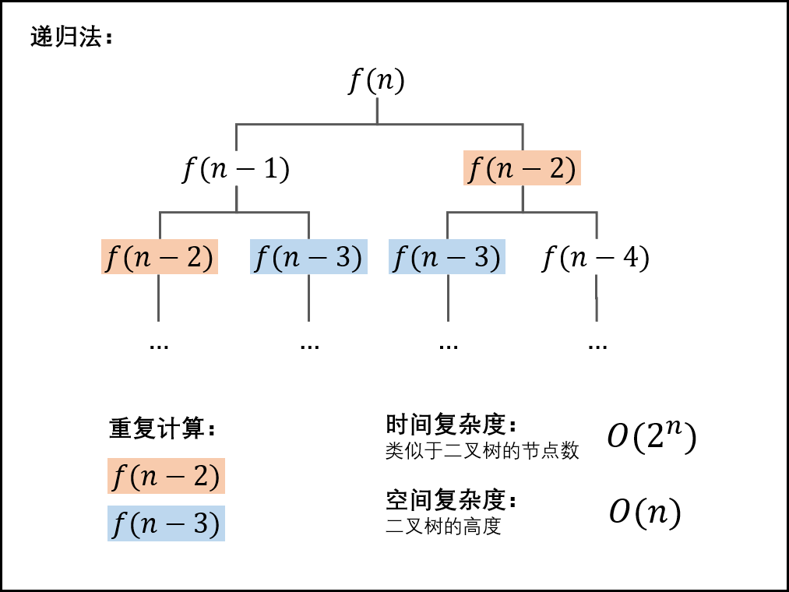
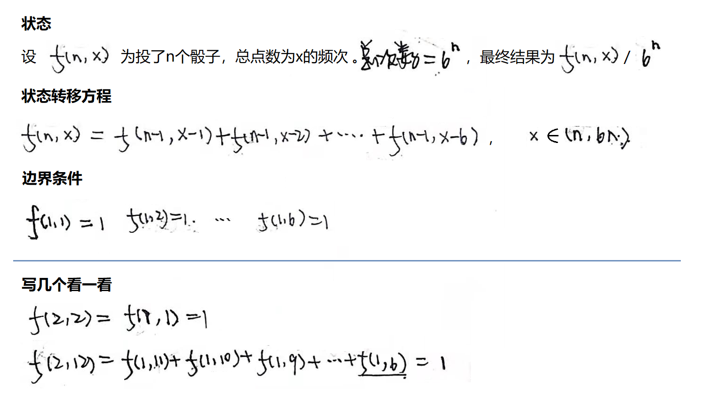
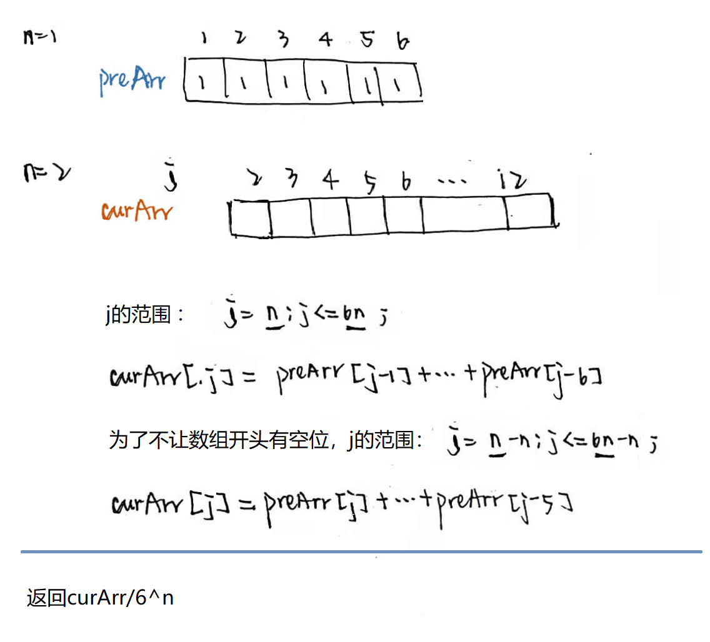
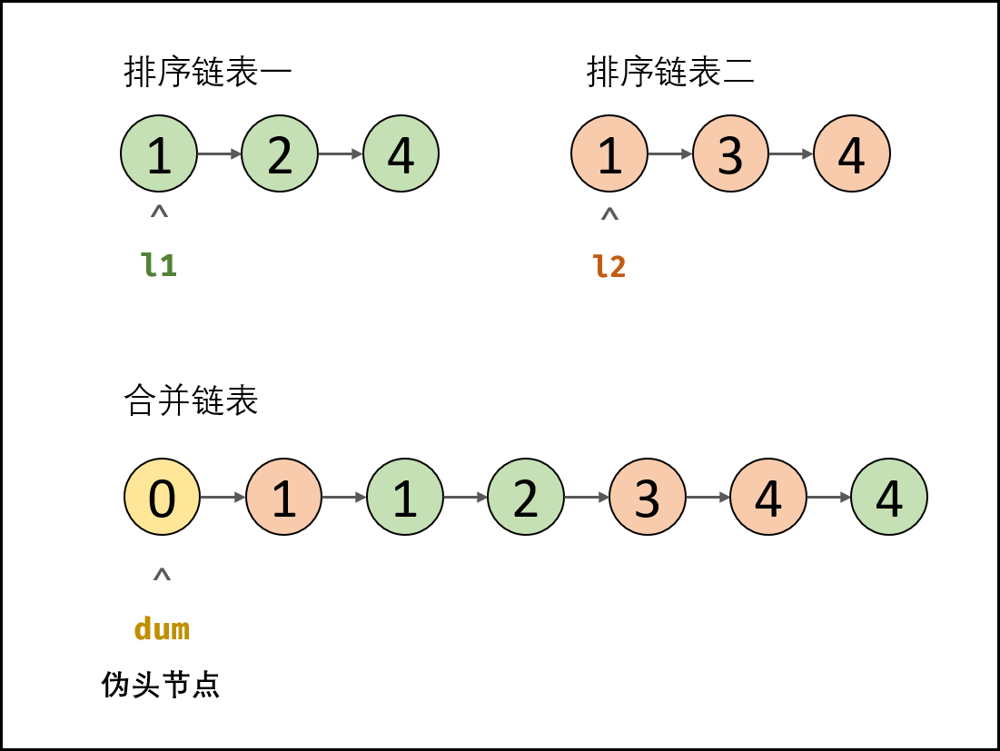
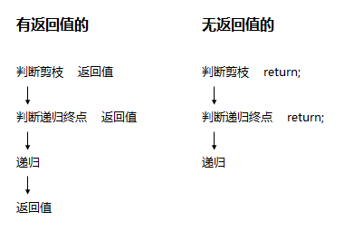
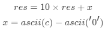
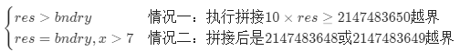
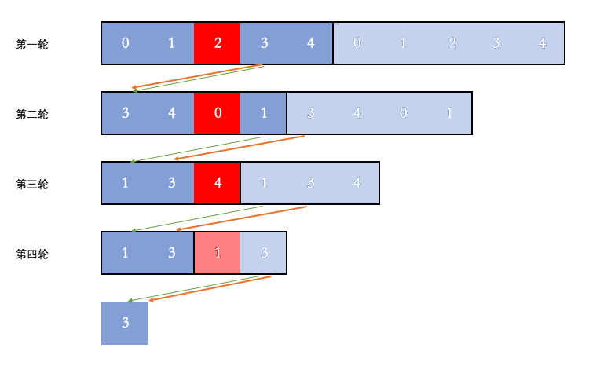
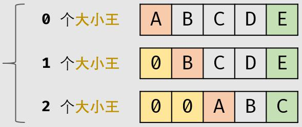

# <a id="zero"></a>目录

| 目录 |
| ---- |
| [一 字符串](#one) |
| [二 线性结构](#two) |
| &emsp;[2.1 数组](#two-one) |
| &emsp;[2.2 链表](#two-two) |
| &emsp;[2.3 栈](#two-three) |
| &emsp;[2.4 队列](#two-four) |
| [三 哈希表(散列表)](#three) |
| [四 树形结构](#four) |
| &emsp;[4.1 树](#four-one) |
| &emsp;[4.2 二叉搜索树](#four-two) |
| &emsp;[4.3 字典树](#four-three) |
| &emsp;[4.4 树状数组](#four-four) |
| &emsp;[4.5 线段树](#four-five) |
| [五 堆](#five) |
| [六 图](#six) |
| &emsp;[6.1 拓扑排序](#six-one) |
| [七 基本算法思想](#seven) |
| &emsp;[7.1 动态规划](#seven-one) |
| &emsp;[7.2 贪心算法](#seven-two) |
| &emsp;[7.3 回溯算法](#seven-three) |
| &emsp;[7.4 分治算法](#seven-four) |
| [八 搜索](#eight) |
| &emsp;[8.1 深度优先搜索](#eight-one) |
| &emsp;[8.2 广度优先搜索](#eight-two) |
| [九 查找](#nine) |
| &emsp;[9.1 二分查找](#nine-one) |
| [十 排序](#ten) |
| [十一 其他](#eleven) |
| &emsp;[11.1 并查集](#eleven-one) |
| [十二 LeetCode其他分类](#twelve) |
| &emsp;[12.1 数学(210)](#twelve-one) |
| &emsp;[12.2 双指针(75)](#twelve-two) |
| &emsp;[12.3 设计(69)](#twelve-three) |
| &emsp;[12.4 位运算(67)](#twelve-four) |
| &emsp;[12.5 Sliding Window(29)](#twelve-five) |
| &emsp;[12.6 递归(24)](#twelve-six) |
| &emsp;[12.7 Ordered Map(13)](#twelve-seven) |
| &emsp;[12.8 几何(12)](#twelve-eight) |
| &emsp;[12.9 极小化极大(8)](#twelve-nine) |
| &emsp;[12.10 脑筋急转弯(7)](#twelve-ten) |
| &emsp;[12.11 Random(6)](#twelve-eleven) |
| &emsp;[12.12 Line Sweep(6)](#twelve-twelve) |
| &emsp;[12.13 记忆化(3)](#twelve-thirteen) |
| &emsp;[12.14 蓄水池抽样(2)](#twelve-fourteen) |
| &emsp;[12.15 Rejection Sampling(2)](#twelve-fifteen) |
| &emsp;[12.16 Map()](#twelve-sixteen) |
| &emsp;[12.17 无分类](#twelve-seventeen) |

# <a id="one"></a>一 字符串
> [返回目录](#zero)  

## 1.1 (简单) 剑指 Offer 58 - Ⅱ. 左旋转字符串
字符串的左旋转操作是把字符串前面的若干个字符转移到字符串的尾部。请定义一个函数实现字符串左旋转操作的功能。比如，输入字符串"abcdefg"和数字2，该函数将返回左旋转两位得到的结果"cdefgab"。

**示例 1：**

```
输入: s = "abcdefg", k = 2  
输出: "cdefgab"  
```
**示例 2：**  

```
输入: s = "lrloseumgh", k = 6  
输出: "umghlrlose"  
```

限制：

1 <= k < s.length <= 10000

### 方法一：slice
```JS
var reverseLeftWords = function(s, n) {
	return s.slice(n) + s.slice(0, n)
};
```

## 1.2 (简单) 剑指 Offer 58 - Ⅰ. 翻转单词顺序
输入一个英文句子，翻转句子中单词的顺序，但单词内字符的顺序不变。为简单起见，标点符号和普通字母一样处理。例如输入字符串"I am a student. "，则输出"student. a am I"。

**示例 1：**

```
输入: "the sky is blue"  
输出: "blue is sky the"  
```
**示例 2：**

输入: "  hello world!  "  
```
输出: "world! hello"  
解释: 输入字符串可以在前面或者后面包含多余的空格，但是反转后的字符不能包括。  
```
**示例 3：**

输入: "a good   example"  
```
输出: "example good a"  
解释: 如果两个单词间有多余的空格，将反转后单词间的空格减少到只含一个。  
```
说明：

无空格字符构成一个单词。  
输入字符串可以在前面或者后面包含多余的空格，但是反转后的字符不能包括。  
如果两个单词间有多余的空格，将反转后单词间的空格减少到只含一个。  

### 方法一
```JS
var reverseWords = function(s) {
	s = s.trim();
	var arr = s.split(/\s+/);
	return arr.reverse().join(' ');
};
```


# <a id="two"></a>二 线性结构
> [返回目录](#zero)  

## <a id="two-one"></a>2.1 数组
> [返回目录](#zero)  

### <a id="two-one-one">2.1.1 (简单) 剑指 Offer 03. 数组中的重复数字
找出数组中重复的数字。

在一个长度为 n 的数组 nums 里的所有数字都在 0～n-1 的范围内。数组中某些数字是重复的，但不知道有几个数字重复了，也不知道每个数字重复了几次。请找出数组中任意一个重复的数字。

**示例 1：**

```
输入：  
[2, 3, 1, 0, 2, 5, 3]  
输出：2 或 3 
```

**限制：**

2 <= n <= 100000

(加分项：问时间、空间复杂度)  

#### 方法一：暴力  
时间O(n2)，空间O(1)
```JS
var findRepeatNumber = function(nums) {
	const numLength = nums.length
	for (var i = 0; i < numLength; i++) {
		for (var j = i + 1; j < numLength; j++) {
			if (nums[j] === nums[i]) {
				return nums[i]
			}
		}
	}
};
```
#### 方法二：数组模拟Java中的哈希表  
时间O(n)，空间O(n)
```JS
var findRepeatNumber = function(nums) {
	var newNums = new Array(nums.length)
	newNums.fill(-1)
	for(var i in nums) {
		if(newNums[nums[i]] !== -1) {
			return nums[i]
		}
		newNums[nums[i]] = i
	}
};
```
#### 方法三：利用原地排序的思路
时间O(n)，空间O(1)
```JS
var findRepeatNumber = function(nums) {
	for (var i in nums) {
		var temp
		while (nums[i] != i) {
			if (nums[nums[i]] === nums[i]) {
				return nums[i]
			} else {
				temp = nums[nums[i]]
				nums[nums[i]] = nums[i]
				nums[i] = temp
			}
		}
	}
};
```

### (相关) 数组去重

数组去重是个经常提及的点：

```JS
const arr = [1, 1, 2, 3, 3];
// 期望得到：[1, 2, 3]
```

解答：  
#### 方法一：includes
```JS
const newArr1 = [];
for (let i = 0; i < arr.length; i++) {
  if (!newArr1.includes(arr[i])) {
    newArr1.push(arr[i]); 
  }
}
console.log('newArr1：', newArr1);
```
#### indexOf  
与上述方法几乎完全一样，但是语义不如includes好
```
const newArr1 = [];
for (let i = 0; i < arr.length; i++) {
  if (newArr1.indexOf(arr[i]) == -1) {
    newArr1.push(arr[i]); 
  }
}
console.log('newArr1：', newArr1);
```

#### 方法二： Set
```JS
const newArr2 = [...new Set(arr)];
console.log('newArr2：', newArr2);
```

#### 方法三： filter
```JS
const newArr3 = arr.filter((item, index) => arr.lastIndexOf(item) === index);
console.log('newArr3：', newArr3);
```

有一次面试碰到的有意思的提问是：不使用数组 `API` 进行去重。

> 注意：不能使用 `push`、`indexOf` 等 `API`

#### 方法四：不使用数组API  
暴力遍历
```JS
var newArr4 = [arr[0]];
for (var i = 1; i < arr.length; i++) {
  var repeatflag = false;
  for (var j = 0; j < newArr4.length; j++) {
    if (arr[i] === newArr4[j]) {
      repeatflag = true;
      break;
    }
  }
  if (!repeatflag) {
    newArr4[newArr4.length] = arr[i];
  }
}
console.log('newArr4', newArr4);
```

### <a id="two-one-two">2.1.2 (简单) 剑指 Offer 53 - Ⅰ. 在排序数组中查找数字Ⅰ
统计一个数字在排序数组中出现的次数。

**示例 1:**

```
输入: nums = [5,7,7,8,8,10], target = 8  
输出: 2  
```
**示例 2:**

```
输入: nums = [5,7,7,8,8,10], target = 6  
输出: 0  
```
限制：

0 <= 数组长度 <= 50000

#### 方法一
```JS
var search = function(nums, target) {
  var left = 0,
    right = nums.length - 1,
    middle, count = 0;

  while (left < right) {
    middle = Math.floor((right + left) / 2);
    if (nums[middle] >= target) {
      right = middle
    } else {
      left = middle + 1
    }
  }

  while (left < nums.length && nums[left++] == target) {
    count++
  }
  
  return count

};

var nums = [5, 7, 7, 8, 8, 10],
  target = 6;
console.log(search(nums, target));
```

### 2.1.3 (简单) 剑指 Offer 29. 顺时针打印矩阵
输入一个矩阵，按照从外向里以顺时针的顺序依次打印出每一个数字。

**示例 1：**

```
输入：matrix = [[1,2,3],[4,5,6],[7,8,9]]
输出：[1,2,3,6,9,8,7,4,5]
```
**示例 2：**

```
输入：matrix = [[1,2,3,4],[5,6,7,8],[9,10,11,12]]
输出：[1,2,3,4,8,12,11,10,9,5,6,7]
```

限制：

0 <= matrix.length <= 100  
0 <= matrix[i].length <= 100  

#### 方法一
```js
var spiralOrder = function(matrix) {
  var j = 0; // 用于判断是第几行/列
  var newMatrix = [];

  while (matrix.length !== 0) {
    switch (j++ % 4) {
      case 0:
        newMatrix = [...newMatrix, ...matrix.shift()];
        break;
      case 1:
        matrix.forEach((item) => {
          newMatrix.push(item.pop());
        });
        if (matrix[0] && matrix[0].length === 0) { // 防止[[],[],[]]这种情况出现
          matrix = [];
        }
        break;
      case 2:
        newMatrix = [...newMatrix, ...matrix.pop().reverse()];
        break;
      case 3:
        for (let i = matrix.length - 1; i >= 0; i--) {
          newMatrix.push(matrix[i].shift());
        }
        if (matrix[0] && matrix[0].length === 0) { // 防止[[],[],[]]这种情况出现
          matrix = [];
        }
    }
  }

  return newMatrix;
};

var matrix = [
  [7],
  [9],
  [6]
];
console.log(spiralOrder(matrix));
```

### <a id="two-one-four">2.1.4 (简单) 剑指 Offer 53 - II. 0～n-1中缺失的数字
一个长度为n-1的递增排序数组中的所有数字都是唯一的，并且每个数字都在范围0～n-1之内。在范围0～n-1内的n个数字中有且只有一个数字不在该数组中，请找出这个数字。

**示例 1:**

```
输入: [0,1,3]  
输出: 2  
```

**示例 2:**

```
输入: [0,1,2,3,4,5,6,7,9]  
输出: 8  
```
限制：

1 <= 数组长度 <= 10000

#### 方法一
```js
var missingNumber = function(nums) {
  var l = 0,
    r = nums.length - 1;
  var middle;
  if (nums[0] > 0) {
    return 0;
  } else if (nums[r] === r) {
    return r + 1;
  } else {
    while (r - l > 1) {
      middle = Math.floor((l + r) / 2);
      if (nums[middle] > middle) {
        r = middle;
      } else {
        l = middle;
      }
    }
    return nums[l] + 1;
  }
};
```

为了和[(简单) 剑指 Offer 53 - Ⅰ. 在排序数组中查找数字Ⅰ](#two-one-two)写法相同：  
```js
var missingNumber = function(nums) {
  var l = 0,
    r = nums.length - 1;
  var middle;
  if (nums[r] == r) return r + 1;
  while (l < r) {
    middle = Math.floor((l + r) / 2);
    if (nums[middle] > middle) {
      r = middle;
    } else {
      l = middle + 1;
    }
  }
  return nums[l] - 1;
};
```

### 2.1.5 (中等) 剑指 Offer 04. 二维数组中的查找
在一个 n * m 的二维数组中，每一行都按照从左到右递增的顺序排序，每一列都按照从上到下递增的顺序排序。请完成一个高效的函数，输入这样的一个二维数组和一个整数，判断数组中是否含有该整数。

**示例:**

现有矩阵 matrix 如下：

```
[
  [1,   4,  7, 11, 15],
  [2,   5,  8, 12, 19],
  [3,   6,  9, 16, 22],
  [10, 13, 14, 17, 24],
  [18, 21, 23, 26, 30]
]
```

给定 target = 5，返回 true。

给定 target = 20，返回 false。

**限制：**

0 <= n <= 1000

0 <= m <= 1000

**注意：**本题与主站 240 题相同：https://leetcode-cn.com/problems/search-a-2d-matrix-ii/

**解题思路：**  
[面试题04. 二维数组中的查找（标志数，清晰图解）](https://leetcode-cn.com/problems/er-wei-shu-zu-zhong-de-cha-zhao-lcof/solution/mian-shi-ti-04-er-wei-shu-zu-zhong-de-cha-zhao-zuo/)  
  
逆时针旋转90°后类似二叉搜索树  
#### 方法一：二叉搜索树
**复杂度分析：**  
- 时间复杂度 O(M+N)  
- 空间复杂度 O(1)  

在例图中，以右上角的7或左下角的3(更好，代码更简洁)为顶点，都可以构成二叉搜索树  
以右上角为顶点构成二叉搜索树：  
```js
var findNumberIn2DArray = function(matrix, target) {
    if (matrix.length == 0) return false;
    var i = 0, j = matrix[0].length - 1; // 初始化j之前需要判断matrix.length
    while(i < matrix.length && j >= 0) {
        if (matrix[i][j] > target) j--;
        else if (matrix[i][j] < target) i++;
        else return true;
    }
    return false;
};
```
以左下角为顶点构成二叉搜索树：  
```js
var findNumberIn2DArray = function(matrix, target) {
    var i = matrix.length - 1, j = 0;
    while(i >= 0 && j < matrix[0].length) {
        if (matrix[i][j] > target) i--;
        else if (matrix[i][j] < target) j++;
        else return true;
    }
    return false;
};
```

## <a id="two-two"></a>2.2 链表  
> [返回目录](#zero)  

### 2.2.1 (简单) 剑指 Offer 22. 链表中倒数第k个节点
输入一个链表，输出该链表中倒数第k个节点。为了符合大多数人的习惯，本题从1开始计数，即链表的尾节点是倒数第1个节点。例如，一个链表有6个节点，从头节点开始，它们的值依次是1、2、3、4、5、6。这个链表的倒数第3个节点是值为4的节点。

**示例：**

```
给定一个链表: 1->2->3->4->5, 和 k = 2.
返回链表 4->5.
```

#### 方法一：用数组存放所有节点的指针  
时间O(n)，空间O(n)
```js
var getKthFromEnd = function(head, k) {
    var p = head;
    var pArr = [];
    while(p != null) {
        pArr.push(p);
        p = p.next;
    }
    return pArr[pArr.length - k];
};
```

#### 方法二：快慢指针  
时间O(n)，空间O(1)
```js
var getKthFromEnd = function(head, k) {
    var pFront = head, pBehind = head;
    while(k-- > 0) {
        pFront = pFront.next;
    }
    while(pFront != null) {
        pFront = pFront.next;
        pBehind = pBehind.next;
    }
    return pBehind;
};
```

### 2.2.2 (简单) 剑指 Offer 06. 从尾到头打印链表
输入一个链表的头节点，从尾到头反过来返回每个节点的值（用数组返回）。

**示例 1：**

```
输入：head = [1,3,2]  
输出：[2,3,1]  
```
限制：

0 <= 链表长度 <= 10000

#### 方法一  
时间O(n)，空间O(n)
```js
var reversePrint = function(head) {
    var p = head;
    var pArr = [];
    while(p != null) {
        pArr.push(p.val);
        p = p.next;
    }
    pArr.reverse();
    return pArr;
};
```

#### 方法二  
时间O(n)，空间O(n)  
代码简洁了，但是貌似时间更久了？
```js
var reversePrint = function(head) {
    let nums = [];
    let node = head;
    while (node !== null) {
        nums.unshift(node.val);
        node = node.next;
    }
    return nums;
};
```

### 2.2.3 (简单) 剑指 Offer 24. 反转链表
定义一个函数，输入一个链表的头节点，反转该链表并输出反转后链表的头节点。

**示例:**

```
输入: 1->2->3->4->5->NULL  
输出: 5->4->3->2->1->NULL  
```
限制：

0 <= 节点个数 <= 5000

#### 方法一：(我的方法)  
pLeft pMiddle pRight三个指针，移动顺序为左中右
```js
var reverseList = function(head) {
    if (head === null) { // 空链表
        return null;
    }
    var pLeft = null, pMiddle = head, pRight = pMiddle.next;
    if (pRight === null) { // 只有一个元素的链表
        return pMiddle;
    }
    pMiddle.next = null;
    do {
        pLeft = pMiddle;
        pMiddle = pRight;
        pRight = pRight.next;
        pMiddle.next = pLeft;
    } while (pRight != null)
    return pMiddle;
};
```

#### *方法一：双指针(官方方法)  

**复杂度分析**：空间O(1)，时间O(n)

和上面的方法几乎无差别，但是'双指针'比'三个指针'思路更清晰
  

```js
var reverseList = function(head) {
    if (!head || !head.next) return head; // 空链表或只有一个元素的链表
    var cur = null, pre = head;
    while (pre != null) {
        var t = pre.next;
        pre.next = cur;
        cur = pre;
        pre = t;
    } 
    return cur;
};
```

#### 方法二：链表入栈(我的方法)  
空间O(n)
```js
var reverseList = function(head) {
    // 空链表 或 只有一个元素的链表
    if (head == null || head.next == null) {
        return head;
    }

    var arr = [];
    while(head != null) {
        arr.push(head); // 入栈
        head = head.next;
    }
    head = arr.pop();
    var t = head;
    while (t.next = arr.pop()) { // 出栈
        t = t.next;
    }
    t.next = null;
    return head;
};
```

#### 方法二：递归  
递归的内部实现是使用栈
```js
```

#### 方法三：妖魔化的双指针  
  
```js
```

### 2.2.4 (简单) 剑指 Offer 52. 两个链表的第一个公共节点
[leetcode](https://leetcode-cn.com/problems/liang-ge-lian-biao-de-di-yi-ge-gong-gong-jie-dian-lcof/)  

#### 方法一(我的方法)  
  
```js
var getIntersectionNode = function(headA, headB) {
    var pA = headA, pB = headB, lengthA = 0, lengthB = 0;
    for (; pA !== null; pA = pA.next, lengthA++) {}
    for (; pB !== null; pB = pB.next, lengthB++) {}
    pA = headA, pB = headB;
    if (lengthA - lengthB > 0) {
        for (var i = lengthA - lengthB; i > 0; pA = pA.next, i--) {}
    } else if (lengthA - lengthB < 0) {
        for (var i = lengthB - lengthA; i > 0; pB = pB.next, i--) {}
    }
    for (; pA !== null; pA = pA.next, pB = pB.next) {
        if (pA == pB) {
            return pA;
        } 
    }
    return null;
};
```

### 2.2.5 (简单) 剑指 Offer 18. 删除链表的节点
给定单向链表的头指针和一个要删除的节点的值，定义一个函数删除该节点。

返回删除后的链表的头节点。

注意：此题对比原题有改动

**示例 1:**

```
输入: head = [4,5,1,9], val = 5
输出: [4,1,9]
解释: 给定你链表中值为 5 的第二个节点，那么在调用了你的函数之后，该链表应变为 4 -> 1 -> 9.
```

**示例 2:**

```
输入: head = [4,5,1,9], val = 1
输出: [4,5,9]
解释: 给定你链表中值为 1 的第三个节点，那么在调用了你的函数之后，该链表应变为 4 -> 5 -> 9.
```

说明：

题目保证链表中节点的值互不相同
若使用 C 或 C++ 语言，你不需要 free 或 delete 被删除的节点

#### 方法一
```js
var deleteNode = function(head, val) {
    if (head.val === val) {
        return head.next;
    }
    var p = head;
    for (; p.next.val !== val; p = p.next) {}
    p.next = p.next.next;
    return head;
};
```

### 2.2.6 (中等) 61. 旋转链表

给你一个链表的头节点 `head` ，旋转链表，将链表每个节点向右移动 `k` 个位置。

**示例** 1：

```
输入：head = [1,2,3,4,5], k = 2
输出：[4,5,1,2,3]
```

**示例** 2：

```
输入：head = [0,1,2], k = 4
输出：[2,0,1]
```

**提示**：

- 链表中节点的数目在范围 [0, 500] 内
- -100 <= Node.val <= 100
- 0 <= k <= 2 * 10^9

#### 方法一：闭合为环

```js
var rotateRight = function(head, k) {
    if (k == 0 || !head || !head.next) return head;

    // 计算链表长度
    let len = 1, cur = head;
    while(cur.next) {
        cur = cur.next;
        len++;
    }
	
    // 找到新链表的最后一个节点
    let add = len - k % len;
    if (add == len) return head;

    cur.next = head;
    while(add--) {
        cur = cur.next;
    }
	
    // 在指定位置断开
    let ret = cur.next;
    cur.next = null;
    return ret;    
};
```

### 2.2.7 (中等) [剑指 Offer 35. 复杂链表的复制](https://leetcode-cn.com/problems/fu-za-lian-biao-de-fu-zhi-lcof/)

请实现 copyRandomList 函数，复制一个复杂链表。在复杂链表中，每个节点除了有一个 next 指针指向下一个节点，还有一个 random 指针指向链表中的任意节点或者 null。

#### 方法一：哈希表

JS中，若想把对象作为键，则需使用Map类型

**算法流程**：

1. 若头节点 head 为空节点，直接返回 null ；
2. 初始化： 哈希表 m， 节点 cur 指向头节点；
3. 复制链表：
   - 建立新节点，并向 m 添加键值对 (原 cur 节点, 新 cur 节点） ；
   - cur 遍历至原链表下一节点；
4. 构建新链表的引用指向：
   - 构建新节点的 next 和 random 引用指向；
   - cur 遍历至原链表下一节点；
5. 返回值： 新链表的头节点 m[head] ；

**复杂度分析**：

- 时间复杂度 O(N) ： 两轮遍历链表，使用 O(N) 时间。
- 空间复杂度 O(N) ： 哈希表 m 使用线性大小的额外空间。

```js
var copyRandomList = function(head) {
    if (!head) return null;
    var m = new Map(), cur = head;
    while (cur) {
        m.set(cur, new Node(cur.val, null, null));
        cur = cur.next;
    }
    cur = head;
    while (cur) {
        m.get(cur).next = cur.next ? m.get(cur.next) : null;
        m.get(cur).random = cur.random ? m.get(cur.random) : null;
        cur = cur.next;
    }
    return m.get(head);
};
```

#### 方法二：原地修改：拼接+拆分

https://leetcode-cn.com/problems/fu-za-lian-biao-de-fu-zhi-lcof/solution/jian-zhi-offer-35-fu-za-lian-biao-de-fu-zhi-ha-xi-/

**复杂度分析**：

- 时间复杂度 O(N) ： 三轮遍历链表，使用 O(N) 时间。

- 空间复杂度 O(1) ： 节点引用变量使用常数大小的额外空间。


## <a id="two-three"></a>2.3 栈  

> [返回目录](#zero)  

### 2.3.1 (简单) 剑指 Offer 09. 用两个栈实现队列
用两个栈实现一个队列。队列的声明如下，请实现它的两个函数 appendTail 和 deleteHead ，分别完成在队列尾部插入整数和在队列头部删除整数的功能。(若队列中没有元素，deleteHead 操作返回 -1 )

**示例 1：**

```
输入：  
["CQueue","appendTail","deleteHead","deleteHead"]  
[[],[3],[],[]]  
输出：[null,null,3,-1]  
```

**示例 2：**

```
输入：  
["CQueue","deleteHead","appendTail","appendTail","deleteHead","deleteHead"]  
[[],[],[5],[2],[],[]]  
输出：[null,-1,null,null,5,2]  
```

提示：  

1 <= values <= 10000  
最多会对 appendTail、deleteHead 进行 10000 次调用  

#### 方法一：双栈
[用两个栈实现队列](https://leetcode-cn.com/problems/yong-liang-ge-zhan-shi-xian-dui-lie-lcof/solution/mian-shi-ti-09-yong-liang-ge-zhan-shi-xian-dui-l-3/)  
**复杂度分析**  
- 时间复杂度：对于插入和删除操作，时间复杂度均为 O(1)。插入不多说，对于删除操作，虽然看起来是 O(n) 的时间复杂度，但是仔细考虑下每个元素只会*至多被插入和弹出 stack2 一次*，因此均摊下来每个元素被删除的时间复杂度仍为 O(1)。  
- 空间复杂度：O(n)  

```js
var CQueue = function() {
    this.stack1 = [];
    this.stack2 = [];
};

/** 
 * @param {number} value
 * @return {void}
 */
CQueue.prototype.appendTail = function(value) {
    this.stack1.push(value);
};

/**
 * @return {number}
 */
CQueue.prototype.deleteHead = function() {
    if (!this.stack2.length) {
        while (this.stack1.length) {
            this.stack2.push(this.stack1.pop());
        }
    }
    return this.stack2.pop() || -1;
};

/**
 * Your CQueue object will be instantiated and called as such:
 * var obj = new CQueue()
 * obj.appendTail(value)
 * var param_2 = obj.deleteHead()
 */
```

### 2.3.2 (简单) 剑指 Offer 30. 包含min函数的栈
定义栈的数据结构，请在该类型中实现一个能够得到栈的最小元素的 min 函数在该栈中，调用 min、push 及 pop 的时间复杂度都是 O(1)。

**示例:**

```
MinStack minStack = new MinStack();  
minStack.push(-2);  
minStack.push(0);  
minStack.push(-3);  
minStack.min();   --> 返回 -3.  
minStack.pop();  
minStack.top();      --> 返回 0.  
minStack.min();   --> 返回 -2.  
```

提示：

各函数的调用总次数不超过 20000 次

#### 方法一：(我的方法)  
数组中存储对象
```js
var MinStack = function() {
    this.stack = [];
};

MinStack.prototype.push = function(x) {
    if(this.stack.length === 0) {
        this.stack[0] = {
            num: x,
            min: x
        };
    } else {
        this.stack[this.stack.length] = {
            num: x,
            min: Math.min(this.stack[this.stack.length - 1].min, x)
        };
    }
};

MinStack.prototype.pop = function() {
    this.stack.length--;
};

MinStack.prototype.top = function() {
    return this.stack[this.stack.length - 1].num;
};

MinStack.prototype.min = function() {
    return this.stack[this.stack.length - 1].min;
};
```

#### 方法二：辅助栈  
[面试题30. 包含 min 函数的栈（辅助栈，清晰图解）](https://leetcode-cn.com/problems/bao-han-minhan-shu-de-zhan-lcof/solution/mian-shi-ti-30-bao-han-minhan-shu-de-zhan-fu-zhu-z/)  
两个栈，不用每一步都存储当前最小值  
```js
var MinStack = function() {
    this.stack = [];
    this.minStack = [];
};

MinStack.prototype.push = function(x) {
    this.stack.push(x);
    if (this.minStack.length === 0 || x <= this.minStack[this.minStack.length - 1]) {
        this.minStack.push(x);
    }
};

MinStack.prototype.pop = function() {
    if (this.minStack[this.minStack.length - 1] === this.stack.pop()) {
        this.minStack.pop();
    }
};

MinStack.prototype.top = function() {
    return this.stack[this.stack.length - 1];
};

MinStack.prototype.min = function() {
    return this.minStack[this.minStack.length - 1];
};
```

### 2.3.3 (中等) 剑指 Offer 31. 栈的压入、弹出序列
输入两个整数序列，第一个序列表示栈的压入顺序，请判断第二个序列是否为该栈的弹出顺序。假设压入栈的所有数字均不相等。例如，序列 {1,2,3,4,5} 是某栈的压栈序列，序列 {4,5,3,2,1} 是该压栈序列对应的一个弹出序列，但 {4,3,5,1,2} 就不可能是该压栈序列的弹出序列。

**示例 1：**
```
输入：pushed = [1,2,3,4,5], popped = [4,5,3,2,1]
输出：true
解释：我们可以按以下顺序执行：
push(1), push(2), push(3), push(4), pop() -> 4,
push(5), pop() -> 5, pop() -> 3, pop() -> 2, pop() -> 1
```

**示例 2：**
```
输入：pushed = [1,2,3,4,5], popped = [4,3,5,1,2]
输出：false
解释：1 不能在 2 之前弹出。
```

**提示：**
- 0 <= pushed.length == popped.length <= 1000  
- 0 <= pushed[i], popped[i] < 1000  
- pushed 是 popped 的排列。  
注意：本题与主站 946 题相同：https://leetcode-cn.com/problems/validate-stack-sequences/  

**解题思路**  
[面试题31. 栈的压入、弹出序列（模拟，清晰图解）](https://leetcode-cn.com/problems/zhan-de-ya-ru-dan-chu-xu-lie-lcof/solution/mian-shi-ti-31-zhan-de-ya-ru-dan-chu-xu-lie-mo-n-2/)  

#### 方法一：辅助栈+模拟
```js
var validateStackSequences = function(pushed, popped) {
    var stack = [];
    var i = 0;
    for (let num of pushed) {
        stack.push(num);
        while (stack.length && stack[stack.length - 1] == popped[i]) {
            stack.pop();
            i++;
        }
    }
    return stack.length == 0;
};
```

## <a id="two-four"></a>2.4 队列
> [返回目录](#zero)  

### <a id="two-four-one"></a>2.4.1 (简单) 剑指 Offer 59 - Ⅰ. 滑动窗口的最大值
给定一个数组 nums 和滑动窗口的大小 k，请找出所有滑动窗口里的最大值。

**示例:**

```
输入: nums = [1,3,-1,-3,5,3,6,7], 和 k = 3
输出: [3,3,5,5,6,7] 
解释: 

  滑动窗口的位置                最大值
---------------               -----
[1  3  -1] -3  5  3  6  7       3
 1 [3  -1  -3] 5  3  6  7       3
 1  3 [-1  -3  5] 3  6  7       5
 1  3  -1 [-3  5  3] 6  7       5
 1  3  -1  -3 [5  3  6] 7       6
 1  3  -1  -3  5 [3  6  7]      7
```


**提示：**

你可以假设 k 总是有效的，在输入数组不为空的情况下，1 ≤ k ≤ 输入数组的大小。

注意：本题与主站 239 题相同：https://leetcode-cn.com/problems/sliding-window-maximum/

#### 方法一(我的方法)  
时间O(nk)
```js
var maxSlidingWindow = function(nums, k) {
    if (nums.length === 0) {
        return [];
    }
    var maxNums = [];
    for (let i = 0, len = nums.length - k; i <= len; i++) {
        maxNums.push(Math.max(...nums.slice(i, i+k)));
    }
    return maxNums;
};
```

### 2.4.2 (困难) 239. 滑动窗口最大值 (要求线性时间复杂度) (未完成)
给你一个整数数组 nums，有一个大小为 k 的滑动窗口从数组的最左侧移动到数组的最右侧。你只可以看到在滑动窗口内的 k 个数字。滑动窗口每次只向右移动一位。

返回滑动窗口中的最大值。

**示例 1：**

```
输入：nums = [1,3,-1,-3,5,3,6,7], k = 3
输出：[3,3,5,5,6,7]
解释：
滑动窗口的位置                最大值
---------------               -----
[1  3  -1] -3  5  3  6  7       3
 1 [3  -1  -3] 5  3  6  7       3
 1  3 [-1  -3  5] 3  6  7       5
 1  3  -1 [-3  5  3] 6  7       5
 1  3  -1  -3 [5  3  6] 7       6
 1  3  -1  -3  5 [3  6  7]      7
```
**示例 2：**

```
输入：nums = [1], k = 1
输出：[1]
```
**示例 3：**

```
输入：nums = [1,-1], k = 1
输出：[1,-1]
```
**示例 4：**

```
输入：nums = [9,11], k = 2
输出：[11]
```
示例 5：

```
输入：nums = [4,-2], k = 2
输出：[4]
```

提示：

- 1 <= nums.length <= 10^5
- -10^4 <= nums[i] <= 10^4
- 1 <= k <= nums.length


**本题难点**： 如何在每次窗口滑动后，将 “获取窗口内最大值” 的时间复杂度从 O(k) 降低至 O(1) 。  

**算法流程**：  
1. 初始化： 双端队列 `deque` ，结果列表 `res` ，数组长度 `n` ；  
2. 滑动窗口： 左边界范围 `i∈[1−k,n+1−k]` ，右边界范围 `j∈[0,n−1]` ；  
若 `i>0` 且 队首元素 `deque[0]` = 被删除元素 `nums[i−1]` ：则队首元素出队；  
删除 `deque` 内所有 < `nums[j]` 的元素，以保持 `deque` 递减；(这里的时间复杂度怎么算的???为什么是O(1))  
将 `nums[j]` 添加至 `deque` 尾部；  
若已形成窗口（即 `i≥0` ）：将窗口最大值（即队首元素 `deque[0]` ）添加至列表 `res` 。  
3. 返回值： 返回结果列表 `res` 。  

### 2.4.3 (中等) 剑指 Offer 59 - II. 队列的最大值
请定义一个队列并实现函数 max_value 得到队列里的最大值，要求函数max_value、push_back 和 pop_front 的均摊时间复杂度都是O(1)。

若队列为空，pop_front 和 max_value 需要返回 -1

**示例 1：**

```
输入: 
["MaxQueue","push_back","push_back","max_value","pop_front","max_value"]
[[],[1],[2],[],[],[]]
输出: [null,null,null,2,1,2]
```

**示例 2：**

```
输入: 
["MaxQueue","pop_front","max_value"]
[[],[],[]]
输出: [null,-1,-1]
```

**限制：**

- 1 <= push_back,pop_front,max_value的总操作数 <= 10000
- 1 <= value <= 10^5

#### 方法一：队列+双端队列
**解题思路**  
对于一个普通队列，`push_back` 和 `pop_front` 的时间复杂度都是 O(1)  
此题重点在于求 max  
[如何解决 O(1) 复杂度的 API 设计题](https://leetcode-cn.com/problems/dui-lie-de-zui-da-zhi-lcof/solution/ru-he-jie-jue-o1-fu-za-du-de-api-she-ji-ti-by-z1m/)  

```js
var MaxQueue = function() {
    this.queue = [];
    this.deque = [];
};

MaxQueue.prototype.max_value = function() {
    return this.deque[0] || -1;
};

MaxQueue.prototype.push_back = function(value) {
    this.queue.push(value);
    while (this.deque.length && this.deque[this.deque.length - 1] < value) {
        this.deque.pop();
    }
    this.deque.push(value);
};

MaxQueue.prototype.pop_front = function() {
    if (!this.queue.length) return -1;
    var res = this.queue.shift();
    if (res == this.deque[0]) {
        this.deque.shift();
    }
    return res;
};

```

# <a id="three"></a>三 哈希表(散列表)  
> [返回目录](#zero)  

## 3.1 [(简单) 剑指 Offer 03. 数组中的重复数字](#two-one-one)  
## 3.2 (简单) 剑指 Offer 50. 第一个只出现一次的字符
在字符串 s 中找出第一个只出现一次的字符。如果没有，返回一个单空格。 s 只包含小写字母。

**示例:**

```
s = "abaccdeff"
返回 "b"

s = "" 
返回 " "
```

**限制：**

0 <= s 的长度 <= 50000

#### 方法一：哈希表
```js
var firstUniqChar = function(s) {
  var countObj = {};
  for (let i = 0; i < s.length; i++) {
      countObj[s[i]] = countObj[s[i]] >= 0 ? countObj[s[i]] + 1 : 1;
  }
  for (let prop in countObj) {
      if (countObj[prop] == 1) {
          return prop;
      }
  }
  return " ";
};
```
#### 方法二  
代码更简单，空间占用更小
```js
var firstUniqChar = function(s) {
  for (let x of s) {
    if (s.indexOf(x) === s.lastIndexOf(x)) return x;
  }
  return ' ';
};
```


## 3.3 (简单) 剑指 Offer 39. 数组中出现次数超过一半的数字
数组中有一个数字出现的次数超过数组长度的一半，请找出这个数字。

你可以假设数组是非空的，并且给定的数组总是存在多数元素。

**示例 1:**

```
输入: [1, 2, 3, 2, 2, 2, 5, 4, 2]
输出: 2
```

**限制：**

1 <= 数组长度 <= 50000

注意：本题与主站 169 题相同：https://leetcode-cn.com/problems/majority-element/

### 方法一：哈希表统计法
遍历数组 nums ，用 HashMap 统计各数字的数量，即可找出 “众数” 。此方法时间和空间复杂度均为 O(N) 。
```js
var majorityElement = function(nums) {
    var numsObj = {}, len = nums.length;
    for(let i = 0; i < len; i++) {
        if (nums[i] in numsObj) {
            numsObj[nums[i]]++;
            
        } else {
            numsObj[nums[i]] = 1;
        }
        if (numsObj[nums[i]] > len/2) return nums[i];
    }
};
```

### 方法二：数组排序法
将数组 nums 排序，数组中点的元素 一定为“众数”。

### 方法三：摩尔投票法
核心理念为 票数正负抵消 。此方法时间和空间复杂度分别为 O(N) 和 O(1) ，为本题的最佳解法。  
  
投票法简单来说就是不同则抵消，占半数以上的数字必然留到最后。  
```js
var majorityElement = function(nums) {
    var votes = 0, x;
    for(let num of nums) {
        if (votes == 0) x = num;
        num ==x ? votes++ : votes--;
    }
    return x;
};
```

# <a id="four"></a>四 树形结构
> [返回目录](#zero)  

## <a id="four-one"></a>4.1 树  
> [返回目录](#zero)  
### 4.1.1 (简单) 剑指 Offer 27. 二叉树的镜像
请完成一个函数，输入一个二叉树，该函数输出它的镜像。

例如输入：

```
     4
   /   \
  2     7
 / \   / \
1   3 6   9
```
镜像输出：

```
     4
   /   \
  7     2
 / \   / \
9   6 3   1
```

**示例 1：**

输入：root = [4,2,7,1,3,6,9]
输出：[4,7,2,9,6,3,1]

**限制：**

0 <= 节点个数 <= 1000

注意：本题与主站 226 题相同：https://leetcode-cn.com/problems/invert-binary-tree/

#### 方法一：递归
```js
var mirrorTree = function (root) {
    if (!root) {
        return null;
    }
    [root.left, root.right] = [root.right, root.left]
    mirrorTree(root.left)
    mirrorTree(root.right)
    return root
};

/* 二叉树构造函数 */
function TreeNode(val) {
  this.val = val;
  this.left = this.right = null;
}
/* 二叉树的创建 */
var arr = [4, 2, 7, 1, 3, 6, 9];
var objArr = arr.map((item) => new TreeNode(item));
var [A, B, C, D, E, F, G] = objArr;
[A.left, A.right] = [B, C];
[B.left, B.right] = [D, E];
[C.left, C.right] = [F, G];
```

#### 方法二：栈
```
```

### <a id="four-one-two"></a>4.1.2 (简单) 剑指 Offer 55 - I. 二叉树的深度

输入一棵二叉树的根节点，求该树的深度。从根节点到叶节点依次经过的节点（含根、叶节点）形成树的一条路径，最长路径的长度为树的深度。

例如：

给定二叉树 [3,9,20,null,null,15,7]，

```
    3
   / \
  9  20
    /  \
   15   7
```
返回它的最大深度 3 。

**提示：**

节点总数 <= 10000
注意：本题与主站 104 题相同：https://leetcode-cn.com/problems/maximum-depth-of-binary-tree/

#### 方法一：后序遍历（DFS）
树的后序遍历 / 深度优先搜索往往利用 递归 或 栈 实现，本文使用递归实现。
```js
var maxDepth = function(root) {
    if (!root) {
        return 0;
    }
    return Math.max(maxDepth(root.left), maxDepth(root.right)) + 1;
};
```
  

#### 方法二：层序遍历（BFS）  
树的层序遍历 / 广度优先搜索往往利用 队列 实现。
```
```


### <a id="four-one-three"></a>4.1.3 (中等) 剑指 Offer 68 - II. 二叉树的最近公共祖先
给定一个二叉树, 找到该树中两个指定节点的最近公共祖先。

百度百科中最近公共祖先的定义为：“对于有根树 T 的两个结点 p、q，最近公共祖先表示为一个结点 x，满足 x 是 p、q 的祖先且 x 的深度尽可能大（**一个节点也可以是它自己的祖先**）。”

例如，给定如下二叉树:  root = [3,5,1,6,2,0,8,null,null,7,4]


**示例 1:**

```
输入: root = [3,5,1,6,2,0,8,null,null,7,4], p = 5, q = 1
输出: 3
解释: 节点 5 和节点 1 的最近公共祖先是节点 3。
```
**示例 2:**

```
输入: root = [3,5,1,6,2,0,8,null,null,7,4], p = 5, q = 4
输出: 5
解释: 节点 5 和节点 4 的最近公共祖先是节点 5。因为根据定义最近公共祖先节点可以为节点本身。
```

**说明:**

- 所有节点的值都是唯一的。  
- p、q 为不同节点且均存在于给定的二叉树中。  

注意：本题与主站 236 题相同：https://leetcode-cn.com/problems/lowest-common-ancestor-of-a-binary-tree/

#### 失败方法：层序遍历  
不好：不能把 TreeNode 类型的节点全部保留在 queue 中  
（没通过 LeetCode 上的测试，超出内存）  
```js
var lowestCommonAncestor = function(root, p, q) {
  var queue = [],
    index = 0,
    pIndex = -1,
    qIndex = -1;
    queue.push(root);
  while (true) { // 层序遍历
    if (root && root.val == p) {
      pIndex = index;
      if (qIndex >= 0) break; // 若 p q 在(数组形式存储的)树中的序号都已找到，则终止循环
    }
    if (root && root.val == q) {
      qIndex = index;
      if (pIndex >= 0) break;
    }
    queue.push(root ? root.left : null);
    queue.push(root ? root.right : null);
    root = queue[++index];
  }
  while (pIndex != qIndex) { // 查找公共父节点序号
    if (pIndex > qIndex) {
      pIndex = Math.floor((pIndex - 1) / 2);
    } else {
      qIndex = Math.floor((qIndex - 1) / 2);
    }
  }
  return queue[pIndex]; // 通过下标取得数组中的父节点
};
```
#### 失败方法：层序遍历  
层序遍历 2 次  
不好：超出时间限制
```js
var lowestCommonAncestor = function(root, p, q) {
  var queue = [root],
    node,
    index = 0,
    pIndex = -1,
    qIndex = -1;
  while (true) { // 层序遍历
    node = queue.shift();
    if (node && node.val == p) {
      pIndex = index;
      if (qIndex >= 0) break; // 若 p q 在(数组形式存储的)树中的序号都已找到，则终止循环
    }
    if (node && node.val == q) {
      qIndex = index;
      if (pIndex >= 0) break;
    }
    queue.push(node ? node.left : null);
    queue.push(node ? node.right : null);
    ++index;
  }
  queue = [root];
  while (pIndex != qIndex) {
    if (pIndex > qIndex) {
      pIndex = Math.floor((pIndex - 1) / 2);
    } else {
      qIndex = Math.floor((qIndex - 1) / 2);
    }
  }
  while (qIndex-- >= 0) { // 层序遍历
    node = queue.shift();
    queue.push(node ? node.left : null);
    queue.push(node ? node.right : null);
  }
  return node;
};
```

#### 方法三： 后序遍历
**复杂度分析**  
- 时间复杂度：O(N)  
- 空间复杂度：O(N)  
```js
var lowestCommonAncestor = function(root, p, q) {
    var result = null;
    var dfs = function(root) {
        if (result != null) return; // 找到最近公共祖先后，提前返回
        if (root == null || root.val == null) return 0; // 初始条件
        let l = dfs(root.left), r = dfs(root.right); // 递归求左右子树是否包含 p q 之一
        let ro = (root.val == p.val || root.val == q.val) & 1; // 求根节点是否为 p q 之一
        if (l + r + ro == 2) {
            result = root;
            return;
        }
        return l + r + ro;
    }
    dfs(root);
    return result;
};
```


### <a id="four-one-four"></a>4.1.4 (简单) 剑指 Offer 55 - II. 平衡二叉树
输入一棵二叉树的根节点，判断该树是不是平衡二叉树。如果某二叉树中任意节点的左右子树的深度相差不超过1，那么它就是一棵平衡二叉树。

**示例 1:**

给定二叉树 [3,9,20,null,null,15,7]

```
    3
   / \
  9  20
    /  \
   15   7
```
返回 true 。

**示例 2:**

给定二叉树 [1,2,2,3,3,null,null,4,4]

```
       1
      / \
     2   2
    / \
   3   3
  / \
 4   4
```
返回 false 。

限制：

0 <= 树的结点个数 <= 10000
注意：本题与主站 110 题相同：https://leetcode-cn.com/problems/balanced-binary-tree/

#### 方法一：后序遍历 + 提前返回（我的方法）
```js
var isBalanced = function(root) {
  var balanceFlag = true;
  var dfs = function(root) {
    if (!balanceFlag) return; // 若不平衡，提前返回（即类似方法二中的剪枝操作）
    if (!root || root.val == null) return 0; // 递归的初始值
    var lson = dfs(root.left),
      rson = dfs(root.right);
    if (Math.abs(lson - rson) > 1) {
      balanceFlag = false;
      return;
    }
    return Math.max(lson, rson) + 1;
  }
  dfs(root);
  return balanceFlag;
};
```
#### 方法二：后序遍历 + 剪枝（从底至顶）  
巧用 return -1
```js
var isBalanced = function(root) {
  var dfs = function(root) {
    if (!root || root.val == null) return 0; // 递归的初始值
    var lson = dfs(root.left), rson = dfs(root.right);
    if (lson == -1 || rson == -1) return -1;
    return Math.abs(lson - rson) <= 1 ? Math.max(lson, rson) + 1 : -1;
  }
  return dfs(root) != -1;
};
```
### <a id="four-one-five"></a>4.1.5 (简单) 剑指 Offer 28. 对称的二叉树
请实现一个函数，用来判断一棵二叉树是不是对称的。如果一棵二叉树和它的镜像一样，那么它是对称的。

例如，二叉树 [1,2,2,3,4,4,3] 是对称的。

```
    1
   / \
  2   2
 / \ / \
3  4 4  3
```
但是下面这个 [1,2,2,null,3,null,3] 则不是镜像对称的:

```
    1
   / \
  2   2
   \   \
   3    3
```

**示例 1：**

```
输入：root = [1,2,2,3,4,4,3]
输出：true
```
**示例 2：**

```
输入：root = [1,2,2,null,3,null,3]
输出：false
```

**限制：**

0 <= 节点个数 <= 1000

注意：本题与主站 101 题相同：https://leetcode-cn.com/problems/symmetric-tree/

#### 方法一：左右子树同时先序遍历，其中一个中左右，另一个中右左（我的方法）  
巧用 return -1
```js
var isSymmetric = function(root) {
  var dfs = function(root1, root2) {
    // 返回 -1 (即不对称的情况) ：
    // 1. 左右子树根节点一个存在另一个不存在
    // 2. 左右子树根节点都存在，但是不相等
    if ((!root1 || root1.val == null) && (!root2 || root2.val == null)) return;
    if ((!root1 || root1.val == null) && root2 && root2.val != null) return -1;
    if ((!root2 || root2.val == null) && root1 && root1.val != null) return -1;
    if (root1.val != root2.val) return -1;
    var res1 = dfs(root1.left, root2.right);
    var res2 = dfs(root1.right, root2.left);
    if (res1 == -1 || res2 == -1) return -1;
  }
  return root ? dfs(root.left, root.right) != -1 : true;
};
```

### <a id="four-one-six"></a>4.1.6 (中等) 剑指 Offer 32 - I. 从上到下打印二叉树
从上到下打印出二叉树的每个节点，同一层的节点按照从左到右的顺序打印。

**例如:**  
给定二叉树: `[3,9,20,null,null,15,7]`,

```
    3
   / \
  9  20
    /  \
   15   7
```

**返回：**  

```
[3,9,20,15,7]
```

**提示：**  

节点总数 <= 1000

#### 方法一：BFS
层序遍历——广度优先搜索
```js
var levelOrder = function(root) {
    if (!root) return [];
    var queue = [root], arr = [];
    while (queue.length) {
        let node = queue.shift();
        arr.push(node.val);
        if (node.left != null && node.left.val != null) queue.push(node.left);
        if (node.right != null && node.right.val != null) queue.push(node.right);
    }
    return arr;
};
```


### <a id="four-one-seven"></a>4.1.7 (中等) 剑指 Offer 32 - II. 从上到下打印二叉树 II
从上到下按层打印二叉树，同一层的节点按从左到右的顺序打印，每一层打印到一行。

例如:
给定二叉树: [3,9,20,null,null,15,7],

```
    3
   / \
  9  20
    /  \
   15   7
```
返回其层次遍历结果：

```
[
  [3],
  [9,20],
  [15,7]
]
```

**提示：**

节点总数 <= 1000
注意：本题与主站 102 题相同：https://leetcode-cn.com/problems/binary-tree-level-order-traversal/

#### 方法一：超市结账处分隔板的思路（我的方法）
层序遍历——广度优先搜索
```js
var levelOrder = function(root) {
  if (!root) return []; // 特例处理
  var queue = [], arr = [], node;
  queue.push(false); // 隔板
  queue.push(root);
  while (queue.length) {
    node = queue.shift();
    if (!node) {
      if (!queue.length) break; // 如果是队列中的最后一个隔板，则不再给 arr 增加行
      arr[arr.length] = []; // 给 arr 增加行
      queue.push(false); // 从队列中取出一个隔板，则新增一个隔板
      continue;
    }
    if (node.val != null) arr[arr.length - 1].push(node.val);
    if (node.left) queue.push(node.left);
    if (node.right) queue.push(node.right);
  }
  return arr;
};
```

#### 方法二：循环嵌套  
内层循环次数为当前层节点数（即队列 queue 长度），用临时数组暂存当前层节点的值  
代码更容易理解
```js
var levelOrder = function(root) {
  if (!root) return []; // 特例处理
  var queue = [], arr = [];
  queue.push(root);
  while (queue.length) {
    var tmp = [], qLength = queue.length; // 用一个临时数组暂存一层的节点的值
    for (let i = 0; i < qLength; i++) {
      let node = queue.shift();
      if (node.val != null) tmp.push(node.val);
      if (node.left) queue.push(node.left);
      if (node.right) queue.push(node.right);
    }
    arr.push(tmp);
  }
  return arr;
};
```

### <a id="four-one-eight"></a>4.1.8 (中等) 剑指 Offer 32 - III. 从上到下打印二叉树 III
请实现一个函数按照之字形顺序打印二叉树，即第一行按照从左到右的顺序打印，第二层按照从右到左的顺序打印，第三行再按照从左到右的顺序打印，其他行以此类推。

**例如:**  
给定二叉树: `[3,9,20,null,null,15,7]`,

```
    3
   / \
  9  20
    /  \
   15   7
```

返回其层次遍历结果：

```
[
  [3],
  [20,9],
  [15,7]
]
```

**提示：**

节点总数 <= 1000

#### 方法一：BFS+标志位
```js
var levelOrder = function(root) {
    if (!root) return [];
    var queue = [root], arr = [], isOdd = true;
    while (queue.length) {
        let qLength = queue.length, temp = [];
        for (let i = 0; i < qLength; i++) {
            let node = queue.shift();
            isOdd ? temp.push(node.val) : temp.unshift(node.val);
            if (node.left != null && node.left.val != null) queue.push(node.left);
            if (node.right != null && node.right.val != null) queue.push(node.right);
        }
        arr.push(temp);
        isOdd = !isOdd;
    }
    return arr;
};
```

### <a id="four-one-nine"></a>4.1.9 (中等) 面试题34. 二叉树中和为某一值的路径
输入一棵二叉树和一个整数，打印出二叉树中节点值的和为输入整数的所有路径。从树的根节点开始往下一直到叶节点所经过的节点形成一条路径。

**示例:**  
给定如下二叉树，以及目标和 target = 22，

```
              5
             / \
            4   8
           /   / \
          11  13  4
         /  \    / \
        7    2  5   1
```

**返回:**  

```
[
   [5,4,11,2],
   [5,8,4,5]
]
```

**提示：**  

节点总数 <= 10000  
注意：本题与主站 113 题相同：https://leetcode-cn.com/problems/path-sum-ii/  

#### 方法一：DFS
```js
var pathSum = function(root, target) {
    var arr = [], temp = [];
    var dfs = function(root, sum) {
        if (!root) return; // 递归终点
        sum += root.val;
        temp.push(root.val);
        if (sum == target && !root.left && !root.right) {
            arr.push(Array.from(temp));
        }
        if(root.left) dfs(root.left, sum);
        if(root.right) dfs(root.right, sum);
        temp.pop(); // 回溯之前，弄乱的引用类型数据(数组)要复原
    }
    dfs(root, 0);
    return arr;
};
```

### <a id="four-one-ten"></a>4.1.10 (中等) 剑指 Offer 07. 重建二叉树
输入某二叉树的前序遍历和中序遍历的结果，请重建该二叉树。假设输入的前序遍历和中序遍历的结果中都不含重复的数字。

例如，给出

```
前序遍历 preorder = [3,9,20,15,7]
中序遍历 inorder = [9,3,15,20,7]
```

返回如下的二叉树：

```
    3
   / \
  9  20
    /  \
   15   7
```

**限制：**

0 <= 节点个数 <= 5000

注意：本题与主站 105 题重复：https://leetcode-cn.com/problems/construct-binary-tree-from-preorder-and-inorder-traversal/


#### 方法一：递归+分治——传入数组(空间复杂度大)
```js
var buildTree = function(preorder, inorder) {
    var recur = function(preorder, inorder) {
        if (preorder.length == 0) return null;
        if (preorder.length == 1) return new TreeNode(preorder[0]);
        var node = new TreeNode(preorder[0]);
        var leftLen = inorder.indexOf(preorder[0]);
        node.left = recur(preorder.slice(1, leftLen + 1), inorder.slice(0, leftLen));
        node.right = leftLen + 1 == preorder.length ? null : recur(preorder.slice(leftLen + 1), inorder.slice(leftLen + 1));
        return node;
    }
    return recur(preorder, inorder);
};
```
#### 方法二：递归+分治——传入指针
```js
var buildTree = function(preorder, inorder) {
    var recur = function(preL, preR, inL, inR) {
        if (preL > preR) return null;
        if (preL == preR) return new TreeNode(preorder[preL]);
        var node = new TreeNode(preorder[preL]);
        var leftLen = inorder.indexOf(preorder[preL]) - inL;
        node.left = recur(preL + 1, preL + leftLen, inL, inL + leftLen - 1);
        node.right = leftLen + 1 == preorder.length ? null : recur(preL + leftLen + 1, preR, inL + leftLen + 1, inR);
        return node;
    }
    return recur(0, preorder.length - 1, 0, inorder.length - 1);
};
```
优化利用 `indexOf()` 查找索引的时间复杂度：  
```js
var buildTree = function(preorder, inorder) {
    var recur = function(preL, preR, inL, inR) {
        if (preL > preR) return null;
        if (preL == preR) return new TreeNode(preorder[preL]);
        var node = new TreeNode(preorder[preL]);
        var leftLen = dic[preorder[preL]] - inL; // 查找索引的时间复杂度为O(1)
        node.left = recur(preL + 1, preL + leftLen, inL, inL + leftLen - 1);
        node.right = leftLen + 1 == preorder.length ? null : recur(preL + leftLen + 1, preR, inL + leftLen + 1, inR);
        return node;
    }
    var dic = {}; // 创建一个哈希表用来存放索引
    for (let i = 0; i < inorder.length; i++) {
        dic[inorder[i]] = i;
    }
    return recur(0, preorder.length - 1, 0, inorder.length - 1);
};
```

### <a id="four-one-eleven"></a>4.1.11 (中等) 剑指 Offer 26. 树的子结构
输入两棵二叉树A和B，判断B是不是A的子结构。(约定空树不是任意一个树的子结构)

B是A的子结构， 即 A中有出现和B相同的结构和节点值。

**例如:**  
给定的树 A:

```
     3
    / \
   4   5
  / \
 1   2
```

给定的树 B：

```
   4 
  /
 1
```

返回 true，因为 B 与 A 的一个子树拥有相同的结构和节点值。

**示例 1：**

```
输入：A = [1,2,3], B = [3,1]
输出：false
```

**示例 2：**

```
输入：A = [3,4,5,1,2], B = [4,1]
输出：true
```

**限制：**

0 <= 节点个数 <= 10000

#### 方法一：先序遍历 嵌套 先序遍历
[面试题26. 树的子结构（先序遍历 + 包含判断，清晰图解）](https://leetcode-cn.com/problems/shu-de-zi-jie-gou-lcof/solution/mian-shi-ti-26-shu-de-zi-jie-gou-xian-xu-bian-li-p/)  

```js
var isSubStructure = function(A, B) {
    var recur = function(A, B) {
        if (!B) return true;
        if (!A || A.val != B.val) return false;
        return recur(A.left, B.left) && recur(A.right, B.right); // A 和 B 同时先序遍历
    }
    return A != null && B != null && (recur(A, B) || isSubStructure(A.left, B) || isSubStructure(A.right, B)); // 对 A 进行先序遍历
};
```


## <a id="four-two"></a>4.2 二叉搜索树  
> [返回目录](#zero)  
### 4.2.1 (简单) 剑指 Offer 54. 二叉搜索树的第k大节点
给定一棵二叉搜索树，请找出其中第k大的节点。

**示例 1:**

```
输入: root = [3,1,4,null,2], k = 1
   3
  / \
 1   4
  \
   2
输出: 4
```
**示例 2:**

```
输入: root = [5,3,6,2,4,null,null,1], k = 3
       5
      / \
     3   6
    / \
   2   4
  /
 1
输出: 4
```

**限制：**

1 ≤ k ≤ 二叉搜索树元素个数

#### 方法一  
反着的中序遍历
```js
var kthLargest = function(root, k) {
  var max = 0;
  var inorderTraversal = function(root) {
    if (!root) return;
    inorderTraversal(root.right);
    if (!k) return; // 若 k 为零，已找到，不需要继续遍历，提前返回
    if (!--k) {
      max = root.val;
      return;
    }
    inorderTraversal(root.left);
  }
  inorderTraversal(root);
  return max;
};
```

### <a id="four-two-two"></a>4.2.2 (简单) 剑指 Offer 68 - I. 二叉搜索树的最近公共祖先
给定一个二叉搜索树, 找到该树中两个指定节点的最近公共祖先。

百度百科中最近公共祖先的定义为：“对于有根树 T 的两个结点 p、q，最近公共祖先表示为一个结点 x，满足 x 是 p、q 的祖先且 x 的深度尽可能大（**一个节点也可以是它自己的祖先**）。”

例如，给定如下二叉搜索树:  root = [6,2,8,0,4,7,9,null,null,3,5]


**示例 1:**

```
输入: root = [6,2,8,0,4,7,9,null,null,3,5], p = 2, q = 8
输出: 6 
解释: 节点 2 和节点 8 的最近公共祖先是 6。
```
**示例 2:**

```
输入: root = [6,2,8,0,4,7,9,null,null,3,5], p = 2, q = 4
输出: 2
解释: 节点 2 和节点 4 的最近公共祖先是 2, 因为根据定义最近公共祖先节点可以为节点本身。
```

**说明:**

- 所有节点的值都是唯一的。
- p、q 为不同节点且均存在于给定的二叉搜索树中。

注意：本题与主站 235 题相同：https://leetcode-cn.com/problems/lowest-common-ancestor-of-a-binary-search-tree/

**解题思路：**  
看起来和[4.1.4 (中等) 剑指 Offer 68 - II. 二叉树的最近公共祖先](#four-one-three)很像，但是此题可用二叉搜索树的性质来解  

|常见解法|时间复杂度|空间复杂度|
| - | - | - |
|迭代|O(N) |O(1)|
|递归|O(N) |O(N)|

#### 方法一：迭代
[面试题68 - I. 二叉搜索树的最近公共祖先（迭代 / 递归，清晰图解）](https://leetcode-cn.com/problems/er-cha-sou-suo-shu-de-zui-jin-gong-gong-zu-xian-lcof/solution/mian-shi-ti-68-i-er-cha-sou-suo-shu-de-zui-jin-g-7/)  
```js
var lowestCommonAncestor = function(root, p, q) {
    while (root) {
        if (root.val < p.val && root.val < q.val) // p,q 都在 root 的右子树中
            root = root.right; // 遍历至右子节点
        else if (root.val > p.val && root.val > q.val) // p,q 都在 root 的左子树中
            root = root.left; // 遍历至左子节点
        else break;
    }

    return root;
};
```
优化：若可保证 p.val < q.valp.val<q.val ，则在循环中可减少判断条件。  
```js
var lowestCommonAncestor = function(root, p, q) {
    if (p.val > q.val) [p, q] = [q, p]; // 保证 p.val < q.val
    while (root) {
        if (root.val < p.val) // p,q 都在 root 的右子树中
            root = root.right; // 遍历至右子节点
        else if (root.val > q.val) // p,q 都在 root 的左子树中
            root = root.left; // 遍历至左子节点
        else break;
    }

    return root;
};
```
#### 方法二：递归
方法一中的迭代可以写成递归的形式  
```js
var lowestCommonAncestor = function(root, p, q) {
    if (root.val < p.val && root.val < q.val)
        return lowestCommonAncestor(root.right, p, q);
    if (root.val > p.val && root.val > q.val)
        return lowestCommonAncestor(root.left, p, q);
    return root;
};
```

### <a id="four-two-three"></a>4.2.3 (中等) 剑指 Offer 33. 二叉搜索树的后序遍历序列
输入一个整数数组，判断该数组是不是某二叉搜索树的后序遍历结果。如果是则返回 true，否则返回 false。假设输入的数组的任意两个数字都互不相同。

参考以下这颗二叉搜索树：

```
     5
    / \
   2   6
  / \
 1   3
```

**示例 1：**

```
输入: [1,6,3,2,5]
输出: false
```

**示例 2：**

```
输入: [1,3,2,6,5]
输出: true
```

**提示：**

- 数组长度 <= 1000

**解题思路**  
与[4.1.10 (中等) 剑指 Offer 07. 重建二叉树](#four-one-ten)思路相似；使用递归+分治算法  

#### 方法一：递归+分治
```js
var verifyPostorder = function(postorder) {
    var recur = function(l, r) {
        if (l >= r) return true;
        var tempL, tempR;
        for (tempL = l; postorder[tempL] < postorder[r]; tempL++) ; // 依据"二叉搜索树左侧节点值小于根节点"找到根节点的位置
        for (tempR = r - 1; postorder[tempR] > postorder[r]; tempR--) ; // 依据"二叉搜索树右侧节点值大于根节点"找到根节点的位置
        if (tempL - 1 != tempR) return false;
        return recur(l, tempR) && recur(tempL, r - 1);
    }
    return postorder.length ? recur(0, postorder.length - 1) : true;
};
```

### <a id="four-two-four"></a>4.2.4 (中等) 剑指 Offer 36. 二叉搜索树与双向链表
[题目](https://leetcode-cn.com/problems/er-cha-sou-suo-shu-yu-shuang-xiang-lian-biao-lcof/)  

输入一棵二叉搜索树，将该二叉搜索树转换成一个排序的循环双向链表。要求不能创建任何新的节点，只能调整树中节点指针的指向。

为了让您更好地理解问题，以下面的二叉搜索树为例：

我们希望将这个二叉搜索树转化为双向循环链表。链表中的每个节点都有一个前驱和后继指针。对于双向循环链表，第一个节点的前驱是最后一个节点，最后一个节点的后继是第一个节点。

下图展示了上面的二叉搜索树转化成的链表。“head” 表示指向链表中有最小元素的节点。

特别地，我们希望可以就地完成转换操作。当转化完成以后，树中节点的左指针需要指向前驱，树中节点的右指针需要指向后继。还需要返回链表中的第一个节点的指针。

注意：本题与主站 426 题相同：https://leetcode-cn.com/problems/convert-binary-search-tree-to-sorted-doubly-linked-list/

**解题思路**  
[剑指 Offer 36. 二叉搜索树与双向链表（中序遍历，清晰图解）](https://leetcode-cn.com/problems/er-cha-sou-suo-shu-yu-shuang-xiang-lian-biao-lcof/solution/mian-shi-ti-36-er-cha-sou-suo-shu-yu-shuang-xian-5/)  

#### 方法一：中序遍历+双指针
```js
var treeToDoublyList = function(root) {
    if (!root) return;
    var pre = null, head;
    var dfs = function(cur) {
        if (!cur) return;
        dfs(cur.left);
        if (!pre) {
            head = cur;
        } else {
            pre.right = cur, cur.left = pre;
        }
        pre = cur;
        dfs(cur.right);
    }
    dfs(root);
    pre.right = head, head.left = pre;
    return head;
};
```

## <a id="four-three"></a>4.3 字典树  
> [返回目录](#zero)  

## <a id="four-four"></a>4.4 树状数组  
> [返回目录](#zero)  

## <a id="four-five"></a>4.5 线段树
> [返回目录](#zero)  

# <a id="five"></a>五 堆  
> [返回目录](#zero)  

## (简单) 剑指 Offer 40. 最小的k个数
输入整数数组 arr ，找出其中最小的 k 个数。例如，输入4、5、1、6、2、7、3、8这8个数字，则最小的4个数字是1、2、3、4。

**示例 1：**

```
输入：arr = [3,2,1], k = 2
输出：[1,2] 或者 [2,1]
```
**示例 2：**

```
输入：arr = [0,1,2,1], k = 1
输出：[0]
```
限制：

0 <= k <= arr.length <= 10000
0 <= arr[i] <= 10000

### 方法一：调用内置的排序函数  
底层代码是快排，时间复杂度O(NlogN)，空间复杂度O(logN)。  
```js
var getLeastNumbers = function(arr, k) {
    arr.sort((a, b) => a - b);
    return arr.slice(0, k);
};
```

### 方法二：最大堆
堆是一种非常常用的数据结构。最大堆的性质是：节点值大于子节点的值，堆顶元素是最大元素。利用这个性质，整体的算法流程如下：

创建大小为 k 的最大堆  
将数组的前 k 个元素放入堆中  
从下标 k 继续开始依次遍历数组的剩余元素：  
如果元素小于堆顶元素，那么取出堆顶元素，将当前元素入堆  
如果元素大于/等于堆顶元素，不做操作  
由于堆的大小是 K，空间复杂度是O(K)O(K)，时间复杂度是O(NlogK)O(NlogK)。  

由于 JavaScript 中没有堆，所以需要手动实现。

```js
function swap(arr, i, j) {
    [arr[i], arr[j]] = [arr[j], arr[i]];
}

class MaxHeap {
    constructor(arr = []) {
        this.container = [];
        if (Array.isArray(arr)) {
            arr.forEach(this.insert.bind(this));
        }
    }

    insert(data) {
        const { container } = this;

        container.push(data);
        let index = container.length - 1;
        while (index) {
            let parent = Math.floor((index - 1) / 2);
            if (container[index] <= container[parent]) {
                break;
            }
            swap(container, index, parent);
            index = parent;
        }
    }

    extract() {
        const { container } = this;
        if (!container.length) {
            return null;
        }

        swap(container, 0, container.length - 1);
        const res = container.pop();
        const length = container.length;
        let index = 0,
            exchange = index * 2 + 1;

        while (exchange < length) {
            // 如果有右节点，并且右节点的值大于左节点的值
            let right = index * 2 + 2;
            if (right < length && container[right] > container[exchange]) {
                exchange = right;
            }
            if (container[exchange] <= container[index]) {
                break;
            }
            swap(container, exchange, index);
            index = exchange;
            exchange = index * 2 + 1;
        }

        return res;
    }

    top() {
        if (this.container.length) return this.container[0];
        return null;
    }
}

/**
 * @param {number[]} arr
 * @param {number} k
 * @return {number[]}
 */
var getLeastNumbers = function(arr, k) {
    const length = arr.length;
    if (k >= length) {
        return arr;
    }

    const heap = new MaxHeap(arr.slice(0, k));
    for (let i = k; i < length; ++i) {
        if (heap.top() > arr[i]) {
            heap.extract();
            heap.insert(arr[i]);
        }
    }
    return heap.container;
};
```

### 方法三：基于快速排序的 partition
解法 1 中使用了快速排序，但其实并需要对全部元素进行排序，题目只需要前 k 个元素。

回顾快速排序中的 partition 操作，可以将元素arr[0]放入排序后的正确位置，并且返回这个位置index。利用 partition 的特点，算法流程如下：

如果index = k，说明第 k 个元素已经放入正确位置，返回前 k 个元素  
如果k < index，前 k 个元素在[left, index - 1]之间，缩小查找范围，继续查找  
如果index < k，前 k 个元素在[index + 1, right] 之间，缩小查找范围，继续查找  
为了方便理解，可以使用2, 8, 1, 1, 0, 11, -1, 0这个例子在纸上画一下过程。  

```js
// ac地址：https://leetcode-cn.com/problems/zui-xiao-de-kge-shu-lcof/
// 原文地址：https://xxoo521.com/2020-02-21-least-nums/

/**
 *
 * @param {number[]} arr
 * @param {number} start
 * @param {number} end
 * @return {number}
 */
function partition(arr, start, end) {
    const k = arr[start];
    let left = start + 1,
        right = end;
    while (1) {
        while (left <= end && arr[left] <= k) ++left;
        while (right >= start + 1 && arr[right] >= k) --right;

        if (left >= right) {
            break;
        }

        [arr[left], arr[right]] = [arr[right], arr[left]];
        ++left;
        --right;
    }
    [arr[right], arr[start]] = [arr[start], arr[right]];
    return right;
}

/**
 * @param {number[]} arr
 * @param {number} k
 * @return {number[]}
 */
var getLeastNumbers = function(arr, k) {
    const length = arr.length;
    if (k >= length) return arr;
    let left = 0,
        right = length - 1;
    let index = partition(arr, left, right);
    while (index !== k) {
        if (index < k) {
            left = index + 1;
            index = partition(arr, left, right);
        } else if (index > k) {
            right = index - 1;
            index = partition(arr, left, right);
        }
    }

    return arr.slice(0, k);
};
```

# <a id="six"></a>六 图  
> [返回目录](#zero)  

## <a id="six-one"></a>6.1 拓扑排序  
> [返回目录](#zero)  

# <a id="seven"></a>七 基本算法思想
> [返回目录](#zero)  

## <a id="seven-one"></a>7.1 动态规划  
> [返回目录](#zero)  

### <a id="seven-one-one"></a>7.1.1 (简单) 剑指 Offer 10- I. 斐波那契数列
写一个函数，输入 n ，求斐波那契（Fibonacci）数列的第 n 项（即 F(N)）。斐波那契数列的定义如下：

```
F(0) = 0,   F(1) = 1
F(N) = F(N - 1) + F(N - 2), 其中 N > 1.
```

斐波那契数列由 0 和 1 开始，之后的斐波那契数就是由之前的两数相加而得出。

答案需要取模 1e9+7（1000000007），如计算初始结果为：1000000008，请返回 1。

**示例 1：**

```
输入：n = 2
输出：1
```

**示例 2：**

```
输入：n = 5
输出：5
```

**提示：**

0 <= n <= 100

#### 方法一：递归法
复杂度分析  
- 时间复杂度：O(2^N)  
- 空间复杂度：O(N)  
  

```js
// 超出时间限制
var fib = function(n) {
    if (n == 0) return 0;
    if (n == 1) return 1;
    return fib(n - 1) + fib(n - 2);
};
```

#### 方法二：动态规划
复杂度分析  
- 时间复杂度：O(N)  
- 空间复杂度：O(N)  
```js
var fib = function(n) {
    var f = new Array(n);
    f[0] = 0, f[1] = 1;
    for (let i = 2; i <= n; i++) {
        f[i] = f[i - 1] + f[i - 2];
        f[i] %= 1000000007
    }
    return f[n];
};
```

#### 方法三：动态规划+空间复杂度优化
[面试题10- I. 斐波那契数列（动态规划，清晰图解）](https://leetcode-cn.com/problems/fei-bo-na-qi-shu-lie-lcof/solution/mian-shi-ti-10-i-fei-bo-na-qi-shu-lie-dong-tai-gui/)  
复杂度分析  
- 时间复杂度：O(N)  
- 空间复杂度：O(1)  
```js
var fib = function(n) {
    var a = 0, b = 1, sum;
    if (n == 0) return a;
    if (n == 1) return b;
    for (let i = 2; i <= n; i++) {
        sum = (a + b) % 1000000007;
        a = b, b = sum;
    }
    return sum;
};
```

### 7.1.2 (简单) 剑指 Offer 10- II. 青蛙跳台阶问题
一只青蛙一次可以跳上1级台阶，也可以跳上2级台阶。求该青蛙跳上一个 n 级的台阶总共有多少种跳法。

答案需要取模 1e9+7（1000000007），如计算初始结果为：1000000008，请返回 1。

**示例 1：**

```
输入：n = 2
输出：2
```

**示例 2：**

```
输入：n = 7
输出：21
```

**示例 3：**

```
输入：n = 0
输出：1
```

**提示：**

0 <= n <= 100

#### 方法一：动态规划+空间复杂度优化
与[7.1.1 (简单) 剑指 Offer 10- I. 斐波那契数列](#seven-one-one)几乎完全相同  
本题的重点在于找到状态转移方程  

  

 ```f(n) = f(n - 1) + f(n - 2)```

```js
var numWays = function(n) {
    var a = 1, b = 1, sum;
    if (n == 0) return a;
    if (n == 1) return b;
    for (let i = 2; i <= n; i++) {
        sum = (a + b) % 1000000007;
        a = b, b = sum;
    }
    return sum;
};
```

### 7.1.3 (简单) 剑指 Offer 42. 连续子数组的最大和
输入一个整型数组，数组中的一个或连续多个整数组成一个子数组。求所有子数组的和的最大值。

要求时间复杂度为O(n)。

**示例1:**

```输入: nums = [-2,1,-3,4,-1,2,1,-5,4]
输出: 6
解释: 连续子数组 [4,-1,2,1] 的和最大，为 6。
```

**提示：**

1 <= arr.length <= 10^5  
-100 <= arr[i] <= 100  
注意：本题与主站 53 题相同：https://leetcode-cn.com/problems/maximum-subarray/

**解题思路：**  

|常见解法|时间复杂度|空间复杂度|
| - | - | - |
|暴力搜索|O(N^2) |O(1)|
|分治思想|O(NlogN) |O(logN)|
|动态规划|O(N)     |O(1)|

#### 方法一：动态规划
**关键点：**  
**状态**定义： 设动态规划列表 dp ，dp[i] 代表**以元素 nums[i] 为结尾的连续子数组**最大和。  
> 为何定义最大和 dp[i] 中必须包含元素 nums[i] ：保证 dp[i] 递推到 dp[i+1] 的正确性；如果不包含 nums[i] ，递推时则不满足题目的 **连续子数组** 要求。  

解题的完整思路见[面试题42. 连续子数组的最大和（动态规划，清晰图解）](https://leetcode-cn.com/problems/lian-xu-zi-shu-zu-de-zui-da-he-lcof/solution/mian-shi-ti-42-lian-xu-zi-shu-zu-de-zui-da-he-do-2/)  

```js
var maxSubArray = function(nums) {
    for (let i = 1; i < nums.length; i++) {
        nums[i] += Math.max(nums[i - 1], 0);
    }
    return Math.max.apply(null, nums);
};
```

### 7.1.4 (中等) 剑指 Offer 46. 把数字翻译成字符串
给定一个数字，我们按照如下规则把它翻译为字符串：0 翻译成 “a” ，1 翻译成 “b”，……，11 翻译成 “l”，……，25 翻译成 “z”。一个数字可能有多个翻译。请编程实现一个函数，用来计算一个数字有多少种不同的翻译方法。

**示例 1:**

```
输入: 12258
输出: 5
解释: 12258有5种不同的翻译，分别是"bccfi", "bwfi", "bczi", "mcfi"和"mzi"
```

**提示：**

0 <= num < 2^31

#### 方法一：动态规划+字符串遍历
**解题思路**  
很像青蛙跳台阶那道题嘛！  

**复杂度分析**  
- 时间复杂度：O(N)
- 空间复杂度：O(N)。节省了 dp 列表的空间占用，但字符串 s 仍使用了 O(N) 大小的额外空间。

```js
var translateNum = function(num) {
    var numStr = num + '';
    var a, b;
    a = 1;
    if (numStr.length == 1) return a;
    var numTemp = Number(numStr.substr(0, 2));
    b = (numTemp <= 25 && numTemp >= 10) ? 2 : 1;
    if (numStr.length == 2) return b;
    for (let i = 3; i <= numStr.length; i++) {
        let numTemp = Number(numStr.substr(i - 2, 2));
        let c = ((numTemp <= 25 && numTemp >= 10) ? a : 0) + b;
        a = b;
        b = c;
    }
    return b;
};
```

```js
// 省去 1 2 的判断
var translateNum = function(num) {
    var numStr = num + '';
    var a = 1, b = 1;
    for (let i = 2; i <= numStr.length; i++) {
        let numTemp = Number(numStr.substr(i - 2, 2));
        let c = ((numTemp <= 25 && numTemp >= 10) ? a : 0) + b;
        a = b;
        b = c;
    }
    return b;
};
```

#### 方法二：动态规划+数字求余
[面试题46. 把数字翻译成字符串（动态规划，清晰图解）](https://leetcode-cn.com/problems/ba-shu-zi-fan-yi-cheng-zi-fu-chuan-lcof/solution/mian-shi-ti-46-ba-shu-zi-fan-yi-cheng-zi-fu-chua-6/)  
此题的动态规划计算是 对称的 ，即 从左向右 遍历（从第 dp[2] 计算至 dp[n] ）和 从右向左 遍历（从第 dp[n−2] 计算至 dp[0] ）所得方案数一致。  
可通过 求余 和 求整 运算实现 从右向左 的遍历计算。  
利用求余运算 `num % 10` 和求整运算 `num / 10` ，可获取数字 `num` 的各位数字（获取顺序为个位、十位、百位…）。  

### 7.1.5 (中等) 剑指 Offer 14- I. 剪绳子
给你一根长度为 n 的绳子，请把绳子剪成整数长度的 m 段（m、n都是整数，n>1并且m>1），每段绳子的长度记为 k[0],k[1]...k[m-1] 。请问 k[0]*k[1]*...*k[m-1] 可能的最大乘积是多少？例如，当绳子的长度是8时，我们把它剪成长度分别为2、3、3的三段，此时得到的最大乘积是18。

**示例 1：**

```
输入: 2
输出: 1
解释: 2 = 1 + 1, 1 × 1 = 1
```

**示例 2:**

```
输入: 10
输出: 36
解释: 10 = 3 + 3 + 4, 3 × 3 × 4 = 36
```

**提示：**

- 2 <= n <= 58  

注意：本题与主站 343 题相同：https://leetcode-cn.com/problems/integer-break/

#### 方法一：动态规划
[剑指 Offer 14- I. 剪绳子，还是动态规划好理解，但是贪心真的快](https://leetcode-cn.com/problems/jian-sheng-zi-lcof/solution/jian-zhi-offer-14-i-jian-sheng-zi-huan-s-xopj/)  
> 贪心算法的解法没看懂

**复杂度分析**  
- 时间复杂度：O(n ^ 2)
- 空间复杂度：O(n)

```js
var cuttingRope = function(n) {
    var dp = new Array(n + 1).fill(0);
    dp[1] = dp[2] = 1;
    for(let i = 3; i <= n; i++) {
        for(let j = 2; j < i / 2 + 1; j++) { // j <= i / 2即可，j < i / 2 + 1 是为了解决输入为 3 的问题
            dp[i] = Math.max(dp[i], Math.max(j * (i - j), j * dp[i - j]));
        }
    }
    return dp[n];
};
```

### 7.1.6 (中等) 剑指 Offer 47. 礼物的最大价值
在一个 m*n 的棋盘的每一格都放有一个礼物，每个礼物都有一定的价值（价值大于 0）。你可以从棋盘的左上角开始拿格子里的礼物，并每次向右或者向下移动一格、直到到达棋盘的右下角。给定一个棋盘及其上面的礼物的价值，请计算你最多能拿到多少价值的礼物？

**示例 1:**

```
输入: 
[
  [1,3,1],
  [1,5,1],
  [4,2,1]
]
输出: 12
解释: 路径 1→3→5→2→1 可以拿到最多价值的礼物
```

**提示：**

- 0 < grid.length <= 200
- 0 < grid[0].length <= 200

#### 方法一：动态规划
```js
var maxValue = function(grid) {
    for (let i = 1; i < grid.length; i++) {
        grid[i][0] += grid[i - 1][0];
    }    
    for (let j = 1; j < grid[0].length; j++) {
        grid[0][j] += grid[0][j - 1];
    }
    for (let i = 1; i < grid.length; i++) {
        for (let j = 1; j < grid[0].length; j++) {
            grid[i][j] += Math.max(grid[i - 1][j], grid[i][j - 1]);
        }
    }
    return grid[grid.length - 1][grid[0].length - 1];
};
```

### 7.1.7 (中等) 剑指 Offer 63. 股票的最大利润
假设把某股票的价格按照时间先后顺序存储在数组中，请问买卖该股票一次可能获得的最大利润是多少？

**示例 1:**

```
输入: [7,1,5,3,6,4]
输出: 5
解释: 在第 2 天（股票价格 = 1）的时候买入，在第 5 天（股票价格 = 6）的时候卖出，最大利润 = 6-1 = 5 。
     注意利润不能是 7-1 = 6, 因为卖出价格需要大于买入价格。
```

**示例 2:**

```
输入: [7,6,4,3,1]
输出: 0
解释: 在这种情况下, 没有交易完成, 所以最大利润为 0。
```

**限制：**

0 <= 数组长度 <= 10^5

注意：本题与主站 121 题相同：https://leetcode-cn.com/problems/best-time-to-buy-and-sell-stock/

#### 方法一：动态规划
```js
var maxProfit = function(prices) {
    if (prices.length <= 1) return 0;
    var min = prices[0], res = 0;
    for (let i = 1; i < prices.length; i++) {
        if (min > prices[i]) min = prices[i];
        res = Math.max(res, prices[i] - min);
    }
    return res > 0 ? res : 0;
};
```

### 7.1.8 (中等) 剑指 Offer 60. n个骰子的点数

把n个骰子扔在地上，所有骰子朝上一面的点数之和为s。输入n，打印出s的所有可能的值出现的概率。

你需要用一个浮点数数组返回答案，其中第 i 个元素代表这 n 个骰子所能掷出的点数集合中第 i 小的那个的概率。

**示例** 1:

```
输入: 1
输出: [0.16667,0.16667,0.16667,0.16667,0.16667,0.16667]
```

**示例** 2:

```
输入: 2
输出: [0.02778,0.05556,0.08333,0.11111,0.13889,0.16667,0.13889,0.11111,0.08333,0.05556,0.02778]
```

**限制**：

1 <= n <= 11

#### 方法一：动态规划

分析



代码



```js
var dicesProbability = function(n) {
    var preArr = [1/6, 1/6, 1/6, 1/6, 1/6, 1/6], curArr;
    if (n == 1) return preArr;
    for (let i = 2; i <= n; i++) {
        curArr = Array(5*i+1).fill(0);
        for (let j = i - i; j <= 6 * i - i; j++) {
            for (let k = 1 - 1; k <= 6 - 1; k++) curArr[j] += (preArr[j-k] ? preArr[j-k] / 6 : 0);
        }
        preArr = curArr;
    }
    return curArr;
};
```


## <a id="seven-two"></a>7.2 贪心算法  

> [返回目录](#zero)  

## <a id="seven-three"></a>7.3 回溯算法  
> [返回目录](#zero)  

## <a id="seven-four"></a>7.4 分治算法  
> [返回目录](#zero)  

### 7.4.1 [(中等) 剑指 Offer 07. 重建二叉树](#four-one-ten)
### 7.4.2 [(中等) 剑指 Offer 33. 二叉搜索树的后序遍历序列](#four-two-three)

### (简单) 剑指 Offer 25. 合并两个排序的链表
输入两个递增排序的链表，合并这两个链表并使新链表中的节点仍然是递增排序的。

**示例1：**

```
输入：1->2->4, 1->3->4
输出：1->1->2->3->4->4
```

**限制：**

0 <= 链表长度 <= 1000

注意：本题与主站 21 题相同：https://leetcode-cn.com/problems/merge-two-sorted-lists/

#### 方法一
  

```js
var mergeTwoLists = function(l1, l2) {
    if(!l1) {
        return l2;
    } else if (!l2) {
        return l1;
    } else {
        let head = temp = new ListNode(); // 引入伪头节点
        while(l1 && l2) {
            if(l1.val <= l2.val) {
                temp.next = l1;
                l1 = l1.next;
            } else {
                temp.next = l2;
                l2 = l2.next;
            }
            temp = temp.next;
        }
        temp.next = l1 ? l1 : l2;
        return head.next;
    }
};
```

# <a id="eight"></a>八 搜索  
> [返回目录](#zero)  
## <a id="eight-zero"></a>8.0 综合
### 8.0.1 [(简单) 剑指 Offer 55 - I. 二叉树的深度](#four-one-two)  
### 8.0.2 (中等) 剑指 Offer 13. 机器人的运动范围
地上有一个m行n列的方格，从坐标 [0,0] 到坐标 [m-1,n-1] 。一个机器人从坐标 [0, 0] 的格子开始移动，它每次可以向左、右、上、下移动一格（不能移动到方格外），也不能进入行坐标和列坐标的数位之和大于k的格子。例如，当k为18时，机器人能够进入方格 [35, 37] ，因为3+5+3+7=18。但它不能进入方格 [35, 38]，因为3+5+3+8=19。请问该机器人能够到达多少个格子？

**示例 1：**

```
输入：m = 2, n = 3, k = 1
输出：3
```

**示例 2：**

```
输入：m = 3, n = 1, k = 0
输出：1
```

**提示：**

- 1 <= n,m <= 100
- 0 <= k <= 20

**解题思路**  
[剑指 Offer 13. 机器人的运动范围（ 回溯算法，DFS / BFS ，清晰图解）](https://leetcode-cn.com/problems/ji-qi-ren-de-yun-dong-fan-wei-lcof/solution/mian-shi-ti-13-ji-qi-ren-de-yun-dong-fan-wei-dfs-b/)  

#### 方法一：DFS
**复杂度分析：**  
- 时间复杂度 O(MN) ： 最差情况下，机器人遍历矩阵所有单元格，此时时间复杂度为 O(MN) 。  
- 空间复杂度 O(MN) ： 使用辅助矩阵 visited，不管是否为最坏情况，都要使用 O(MN) 的额外空间。  

```js
var movingCount = function(m, n, k) {
    var dfs = function(i, j, si, sj) { // (i, j) 为当前坐标，si, sj 分别为当前列坐标的数位之和以及行坐标的数位之和
        if (i >= m || j >= n || visited[i][j] || si + sj > k) return 0; // 终止条件： 当 ① 行列索引越界 或 ③ 当前元素已访问过 或 ② 数位和超出目标值 k 时，返回 0 ，代表不计入可达解。
        visited[i][j] = true;
        return 1 + dfs(i + 1, j, (i + 1) % 10 ? si + 1 : si - 8, sj) + dfs(i, j + 1, si, (j + 1) % 10 ? sj + 1 : sj - 8);
    }
    var visited = new Array(m); // 辅助矩阵
    for (let i = 0; i < m; i++) {
        visited[i] = new Array(n);
    }
    return dfs(0, 0, 0, 0);
};
```

#### 方法二：BFS
**复杂度分析：**  
- 时间复杂度 O(MN)  
- 空间复杂度 O(MN)  

```js
var movingCount = function(m, n, k) {
    var visited = new Array(m); // 辅助矩阵
    for (let i = 0; i < m; i++) {
        visited[i] = new Array(n);
    }
    var res = 0; // 计数
    var queue = [[0, 0, 0, 0]]; // 队列
    while(queue.length != 0) {
        var [i, j, si, sj] = queue.shift();
        if (i >= m || j >= n || visited[i][j] || si + sj > k) continue;
        visited[i][j] = true;
        res++;
        queue.push([i + 1, j, (i + 1) % 10 ? si + 1 : si - 8, sj]);
        queue.push([i, j + 1, si, (j + 1) % 10 ? sj + 1 : sj - 8]);
    }
    return res;
};
```

## <a id="eight-one"></a>8.1 深度优先搜索  
> [返回目录](#zero)  

  

### 8.1.1 [(简单) 剑指 Offer 55 - II. 平衡二叉树](#four-one-four)  
### 8.1.2 [(简单) 剑指 Offer 28. 对称的二叉树](#four-one-five)  
### 8.1.3 (中等) 剑指 Offer 12. 矩阵中的路径
请设计一个函数，用来判断在一个矩阵中是否存在一条包含某字符串所有字符的路径。路径可以从矩阵中的任意一格开始，每一步可以在矩阵中向左、右、上、下移动一格。如果一条路径经过了矩阵的某一格，那么该路径不能再次进入该格子。例如，在下面的3×4的矩阵中包含一条字符串“bfce”的路径（路径中的字母用加粗标出）。

[["a","**b**","c","e"],  
["s","**f**","**c**","s"],  
["a","d","**e**","e"]]  

但矩阵中不包含字符串“abfb”的路径，因为字符串的第一个字符b占据了矩阵中的第一行第二个格子之后，路径不能再次进入这个格子。

**示例 1：**

```
输入：board = [["A","B","C","E"],["S","F","C","S"],["A","D","E","E"]], word = "ABCCED"
输出：true
```

**示例 2：**

```
输入：board = [["a","b"],["c","d"]], word = "abcd"
输出：false
```

**提示：**

1 <= board.length <= 200  
1 <= board[i].length <= 200  
注意：本题与主站 79 题相同：https://leetcode-cn.com/problems/word-search/  

**解题思路**  
[面试题12. 矩阵中的路径（ DFS + 剪枝 ，清晰图解）](https://leetcode-cn.com/problems/ju-zhen-zhong-de-lu-jing-lcof/solution/mian-shi-ti-12-ju-zhen-zhong-de-lu-jing-shen-du-yo/)  
所谓"剪枝"，就是满足某些条件时，直接返回，不继续递归  

#### 方法一：DFS
```js
var exist = function(board, word) {
    var dfs = function(i, j, k) { // (i, j) 代表当前元素坐标，k 代表搜索到第 k 个字母 (k 从 0 开始，前面的都找到了)
        if(!(i >= 0 && i < board.length) || !(j >= 0 && j < board[0].length) || board[i][j] != word[k]) return false;
        if (k == word.length - 1) return true;
        board[i][j] = ""; // 题目中给出矩阵，则不需要辅助矩阵(题8.0.1)，直接在原矩阵中做手脚，再恢复即可
        var res = dfs(i + 1, j, k + 1) || dfs(i - 1, j, k + 1) || dfs(i, j + 1, k + 1) || dfs(i, j - 1, k + 1);
        board[i][j] = word[k]; // 恢复原矩阵
        return res;
    }

    for (let i = 0; i < board.length; i++) {
        for (let j = 0; j < board[0].length; j++) {
            if (dfs(i, j, 0)) return true;
        }
    }

    return false;
};
```

### 8.1.4 [(中等) 面试题34. 二叉树中和为某一值的路径](#four-one-nine)

### 8.1.5 (中等) 剑指 Offer 38. 字符串的排列
输入一个字符串，打印出该字符串中字符的所有排列。

你可以以任意顺序返回这个字符串数组，但里面不能有重复元素。

**示例:**

```
输入：s = "abc"
输出：["abc","acb","bac","bca","cab","cba"]
```

**限制：**

1 <= s 的长度 <= 8

**解题思路**  
[剑指 Offer 38. 字符串的排列（回溯法，清晰图解）](https://leetcode-cn.com/problems/zi-fu-chuan-de-pai-lie-lcof/solution/mian-shi-ti-38-zi-fu-chuan-de-pai-lie-hui-su-fa-by/)  
#### 方法一：DFS+回溯
```js
var permutation = function(s) {
    var c = s.split(""), res = [];
    var dfs = function (x) {
        if (x == c.length) {
            res.push(c.join(""));
            return;
        }
        let dic = new Set();
        for (let i = x; i < c.length; i++) {
            if (dic.has(c[i])) continue;
            dic.add(c[i]);
            [c[i], c[x]] = [c[x], c[i]];
            dfs(x + 1);
            [c[i], c[x]] = [c[x], c[i]];
        }
    }
    dfs(0);
    return res;
};
```

### 8.1.6 [(中等) 剑指 Offer 26. 树的子结构](#four-one-eleven)

### 8.1.7 [(中等) 剑指 Offer 68 - II. 二叉树的最近公共祖先](#four-one-three)

### 8.1.8 [(中等) 剑指 Offer 36. 二叉搜索树与双向链表](#four-two-four)

## <a id="eight-two"></a>8.2 广度优先搜索  
> [返回目录](#zero)  

### 8.2.1 [(中等) 剑指 Offer 32 - I. 从上到下打印二叉树](#four-one-six)  
### 8.2.2 [(中等) 剑指 Offer 32 - II. 从上到下打印二叉树 II](#four-one-seven)  
### 8.2.3 [(中等) 剑指 Offer 32 - III. 从上到下打印二叉树 III](#four-one-eight)  

# <a id="nine"></a>九 查找
> [返回目录](#zero)  

## <a id="nine-one"></a>9.1 二分查找  
> [返回目录](#zero)  

### 9.1.1 [(简单) 剑指 Offer 53 - Ⅰ. 在排序数组中查找数字Ⅰ](#two-one-two)
### 9.1.2 [(简单) 剑指 Offer 53 - II. 0～n-1中缺失的数字](#two-one-four)
### 9.1.3 (简单) 剑指 Offer 11. 旋转数组的最小数字
把一个数组最开始的若干个元素搬到数组的末尾，我们称之为数组的旋转。输入一个递增排序的数组的一个旋转，输出旋转数组的最小元素。例如，数组 [3,4,5,1,2] 为 [1,2,3,4,5] 的一个旋转，该数组的最小值为1。  

**示例 1：**

```
输入：[3,4,5,1,2]
输出：1
```

**示例 2：**

```
输入：[2,2,2,0,1]
输出：0
```

注意：本题与主站 154 题相同：https://leetcode-cn.com/problems/find-minimum-in-rotated-sorted-array-ii/

```js
var minArray = function(numbers) {
    var l = 0, r = numbers.length - 1, middle;
    while(numbers[r] === numbers[l]) r--; // 处理特殊情况：首尾相等
    while(l < r) {
        middle = Math.floor((l + r) / 2);
        if (numbers[r] >= numbers[middle]) {
            r = middle;
        } else {
            l = middle + 1;
        }
    }
    return numbers[l];
};
```

【思考】为什么官方的二分法的题解很多都是写的low + (high - low) // 2 而不是 (high + low) // 2  
【回答】因为low+high在low和high特别大的时候可能会造成溢出，使用减法避免了溢出发生  

### 9.1.4 [(简单) 剑指 Offer 57. 和为s的两个数字](#twelve-two-one)

### 9.1.5 (中等) 剑指 Offer 16. 数值的整数次方

实现 `pow(x, n) `，即计算 x 的 n 次幂函数（即，x^n）。不得使用库函数，同时不需要考虑大数问题。

 

**示例** 1：

```
输入：x = 2.00000, n = 10
输出：1024.00000
```

**示例** 2：

```
输入：x = 2.10000, n = 3
输出：9.26100
```

**示例** 3：

```
输入：x = 2.00000, n = -2
输出：0.25000
解释：2-2 = 1/22 = 1/4 = 0.25
```


**提示**：

-100.0 < x < 100.0
-231 <= n <= 231-1
-104 <= xn <= 104


[**解题思路**](https://leetcode-cn.com/problems/shu-zhi-de-zheng-shu-ci-fang-lcof/solution/mian-shi-ti-16-shu-zhi-de-zheng-shu-ci-fang-kuai-s/)：

1. 循环n次，时间复杂度为O(n)
2. 快速幂法：二分法（递归/非递归）、二进制

#### 方法一：二分法+递归(我的方法)

```js
var myPow = function(x, n) {
    if (n < 0) {
        n = -n;
        x = 1 / x;
    }
    let recur = function(x, n) {
        if (n == 0) return 1;
        if (n == 1) return x;
        if (n % 2 == 0) {
            let temp = recur(x, n / 2);
            return temp * temp;
        }
        else {
            return x * recur(x, n - 1);
        }
    }
    return recur(x, n);
};
```


# <a id="ten"></a>十 排序  
> [返回目录](#zero)  

### <a id="ten-one-one"></a>10.1.1 (中等) 剑指 Offer 45. 把数组排成最小的数

输入一个非负整数数组，把数组里所有数字拼接起来排成一个数，打印能拼接出的所有数字中最小的一个。

**示例** 1:

```
输入: [10,2]
输出: "102"
```

**示例** 2:

```
输入: [3,30,34,5,9]
输出: "3033459"
```


**提示**:

- 0 < nums.length <= 100

**说明**:

- 输出结果可能非常大，所以你需要返回一个字符串而不是整数
- 拼接起来的数字可能会有前导 0，最后结果不需要去掉前导 0

#### 方法一：自定义排序+内置函数

```js
var minNumber = function(nums) {
    nums.sort((a, b) => (String(a) + String(b)) - (String(b) + String(a)));
    return nums.join('')
};
```

#### 方法二：自定义排序+手撕快排


# <a id="eleven"></a>十一 其他
> [返回目录](#zero)  

## <a id="eleven-one"></a>11.1 并查集  
> [返回目录](#zero)  


# <a id="twelve"></a>十二 LeetCode其他分类
> [返回目录](#zero)  

## <a id="twelve-one"></a>12.1 数学(210)  
> [返回目录](#zero)  

### 12.1.1 (中等) [剑指 Offer 20. 表示数值的字符串](https://leetcode-cn.com/problems/biao-shi-shu-zhi-de-zi-fu-chuan-lcof/)

请实现一个函数用来判断字符串是否表示**数值**（包括整数和小数）。

#### [方法一：分类归纳](https://leetcode-cn.com/problems/biao-shi-shu-zhi-de-zi-fu-chuan-lcof/comments/)

‘.’出现正确情况：只出现一次，且在e的前面

‘e’出现正确情况：只出现一次，且出现前有数字

‘+’‘-’出现正确情况：只能在开头和e后一位

```js
var isNumber = function(s) {
    if (!s || s.length == 0) return false;
    //去掉首尾空格
    s = s.trim();
    var numFlag = false, dotFlag = false, eFlag = false;
    for (let i = 0; i < s.length; i++) {
        //判定为数字，则标记numFlag
        if (s[i] >= '0' && s[i] <= '9') numFlag = true;
        //判定为.：需要没出现过.并且没出现过e
        else if (s[i] == '.' && !dotFlag && !eFlag) dotFlag = true;
        //判定为e：需要没出现过e，并且出过数字了
        else if ((s[i] == 'e' || s[i] == 'E') && !eFlag && numFlag) {
            eFlag = true;
            numFlag = false;
        }
        //判定为+-符号：只能出现在第一位或者紧接e后面
        else if ((s[i] == '+' || s[i] == '-') && (i == 0 || s[i - 1] == 'e' || s[i - 1] == 'E'));
        //其他情况，都是非法的
        else return false;
    }
    return numFlag;
};
```

### 12.1.2 (中等) 剑指 Offer 67. 把字符串转换成整数

写一个函数 StrToInt，实现把字符串转换成整数这个功能。不能使用 atoi 或者其他类似的库函数。

 

首先，该函数会根据需要丢弃无用的开头空格字符，直到寻找到第一个非空格的字符为止。

当我们寻找到的第一个非空字符为正或者负号时，则将该符号与之后面尽可能多的连续数字组合起来，作为该整数的正负号；假如第一个非空字符是数字，则直接将其与之后连续的数字字符组合起来，形成整数。

该字符串除了有效的整数部分之后也可能会存在多余的字符，这些字符可以被忽略，它们对于函数不应该造成影响。

注意：假如该字符串中的第一个非空格字符不是一个有效整数字符、字符串为空或字符串仅包含空白字符时，则你的函数不需要进行转换。

在任何情况下，若函数不能进行有效的转换时，请返回 0。

说明：

假设我们的环境只能存储 32 位大小的有符号整数，那么其数值范围为 [−231,  231 − 1]。如果数值超过这个范围，请返回  INT_MAX (231 − 1) 或 INT_MIN (−231) 。

**示例** 1:

```
输入: "42"
输出: 42
```

**示例** 2:

```
输入: "   -42"
输出: -42
解释: 第一个非空白字符为 '-', 它是一个负号。
     我们尽可能将负号与后面所有连续出现的数字组合起来，最后得到 -42 。
```

**示例** 3:

```
输入: "4193 with words"
输出: 4193
解释: 转换截止于数字 '3' ，因为它的下一个字符不为数字。
```

**示例** 4:

```
输入: "words and 987"
输出: 0
解释: 第一个非空字符是 'w', 但它不是数字或正、负号。
     因此无法执行有效的转换。
```

**示例** 5:

```
输入: "-91283472332"
输出: -2147483648
解释: 数字 "-91283472332" 超过 32 位有符号整数范围。 
     因此返回 INT_MIN (−231) 。
```

#### 方法一

**解题思路**

根据题意，有以下四种字符需要考虑：

1. 首部空格： 删除之即可；
2. 符号位： 三种情况，即 ''++'' , ''-−'' , ''无符号" ；新建一个变量保存符号位，返回前判断正负即可。
3. 非数字字符： 遇到首个非数字的字符时，应立即返回。
4. 数字字符：
   - 字符转数字： “此数字的 ASCII 码” 与 “ 00 的 ASCII 码” 相减即可；
   - 数字拼接： 若从左向右遍历数字，设当前位字符为 cc ，当前位数字为 xx ，数字结果为 resres ，则数字拼接公式为：



**数字越界处理**

设数字拼接边界 bndry = 2147483647 // 10 = 214748364 ，则以下两种情况越界：



**复杂度分析**：

时间复杂度 O(N) ： 其中 N 为字符串长度，线性遍历字符串占用 O(N) 时间。
空间复杂度 O(N) ： 删除首尾空格后需建立新字符串，最差情况下占用 O(N) 额外空间。

```js
var strToInt = function(str) {
    str = str.trim();									// 删除首尾空格
    if (!str) return 0;									// 字符串为空则直接返回
    let res = 0, sign = 1, i = 1;
    const [minInt, maxInt, boundary] = [-(2 ** 31), 2 ** 31 - 1, Math.floor(2 ** 31 / 10)];
    if (str[0] == '-') sign = -1;						// 保存负号
    else if (str[0] != '+') i = 0;
    for (; i < str.length; i++) {
        if (!(str[i] >= '0' && str[i] <= '9')) break;	// 遇到非数字的字符则跳出
        if (res > boundary || (res == boundary && str[i] > '7')) return sign > 0 ? maxInt : minInt;	// 数字越界处理
        res = 10 * res + (str[i] - '0');				// 数字拼接
    }
    return sign * res;
};
```

#### [方法二](https://leetcode-cn.com/problems/ba-zi-fu-chuan-zhuan-huan-cheng-zheng-shu-lcof/solution/mian-shi-ti-67-ba-zi-fu-chuan-zhuan-huan-cheng-z-4/)

若不使用 `trim()` 方法，而从头开始遍历字符串，则可以将空间复杂度降低至 O(1)

### 12.1.3 (中等) 剑指 Offer 49. 丑数

我们把只包含质因子 2、3 和 5 的数称作丑数（Ugly Number）。求按从小到大的顺序的第 n 个丑数。

 

**示例**:

```
输入: n = 10
输出: 12
解释: 1, 2, 3, 4, 5, 6, 8, 9, 10, 12 是前 10 个丑数。
```


**说明**:  

1 是丑数。
n 不超过1690。

#### [方法一：动态规划](https://leetcode-cn.com/problems/chou-shu-lcof/solution/mian-shi-ti-49-chou-shu-dong-tai-gui-hua-qing-xi-t/)

在已有的丑数序列上每一个数都必须乘2， 乘3， 乘5， 这样才不会漏掉某些丑数。

```js
var nthUglyNumber = function(n) {
    let dp = Array(n), a = b = c = 0;
    dp[0] = 1;
    for (let i = 1; i < n; i++) {
        let [n2, n3, n5] = [dp[a] * 2, dp[b] * 3, dp[c] * 5];
        dp[i] = Math.min(n2, n3, n5);
        if (dp[i] == n2) a++;
        if (dp[i] == n3) b++;
        if (dp[i] == n5) c++;
    }
    return dp[n-1];
};
```


#### [方法二：最小堆](https://leetcode-cn.com/problems/chou-shu-lcof/solution/chou-shu-by-leetcode-solution-0e5i/)

JS不自带最小堆


## <a id="twelve-two"></a>12.2 双指针(75)  
> [返回目录](#zero)  
### <a id="twelve-two-one"></a>12.2.1 (简单) 剑指 Offer 57. 和为s的两个数字
输入一个递增排序的数组和一个数字s，在数组中查找两个数，使得它们的和正好是s。如果有多对数字的和等于s，则输出任意一对即可。

**示例 1：**

```
输入：nums = [2,7,11,15], target = 9
输出：[2,7] 或者 [7,2]
```

**示例 2：**

```
输入：nums = [10,26,30,31,47,60], target = 40
输出：[10,30] 或者 [30,10]
```

**限制：**

1 <= nums.length <= 10^5
1 <= nums[i] <= 10^6

#### 方法一：二分法+双指针(我的方法)
排序数组想到双指针  
二分法确定指针范围，把范围定为整个数组的话太大了  
```js
var twoSum = function(nums, target) {
  var l = 0,
    r = nums.length - 1,
    middle, sum;
  while (l < r) {
    middle = Math.floor((l + r) / 2);
    if (nums[middle] >= target) {
      r = middle;
    } else {
      l = middle + 1;
    }
  }
  l = 0, r--;
  while (1) {
    sum = nums[l] + nums[r];
    if (sum == target) {
      return [nums[l], nums[r]];
    } else if (sum > target) {
      r--;
    } else {
      l++;
    }
  }
};
```

### 12.2.2 (简单) 剑指 Offer 21. 调整数组顺序使奇数位于偶数前面

输入一个整数数组，实现一个函数来调整该数组中数字的顺序，使得所有奇数位于数组的前半部分，所有偶数位于数组的后半部分。

**示例：**

```
输入：nums = [1,2,3,4]
输出：[1,3,2,4] 
```

注：[3,1,2,4] 也是正确的答案之一。

**提示：**

0 <= nums.length <= 50000  
1 <= nums[i] <= 10000

#### 方法一：首尾双指针
```js
var exchange = function(nums) {
    var l = 0, r = nums.length-1;
    while(l<r) {
        if ((nums[l] & 1) == 0 && (nums[r] & 1) == 1){ // 判断奇偶的更好方法
            let temp = nums[l];
            nums[l] = nums[r];
            nums[r] = temp;
            l++,r--;
        } else {
            if ((nums[l] & 1) != 0) {
                l++;
            }
            if ((nums[r] & 1) != 1){
                r--;
            }
        }
    }
    return nums;
};
```

### 12.2.3 (中等) 剑指 Offer 48. 最长不含重复字符的子字符串
请从字符串中找出一个最长的不包含重复字符的子字符串，计算该最长子字符串的长度。

**示例 1:**

```
输入: "abcabcbb"
输出: 3 
解释: 因为无重复字符的最长子串是 "abc"，所以其长度为 3。
```

**示例 2:**

```
输入: "bbbbb"
输出: 1
解释: 因为无重复字符的最长子串是 "b"，所以其长度为 1。
```

**示例 3:**

```
输入: "pwwkew"
输出: 3
解释: 因为无重复字符的最长子串是 "wke"，所以其长度为 3。
     请注意，你的答案必须是 子串 的长度，"pwke" 是一个子序列，不是子串。
```

**提示：**

s.length <= 40000  
注意：本题与主站 3 题相同：https://leetcode-cn.com/problems/longest-substring-without-repeating-characters/

#### 方法一：双指针+哈希表(我的方法)(有待优化)
**复杂度分析**  
- 时间复杂度：O(n)
- 空间复杂度：O(1)

```js
var lengthOfLongestSubstring = function(s) {
    var hash = {}, maxLen = 0, [l, r] = [0, 0];
    for (; r < s.length; r++) {
        if (hash[s[r]] == undefined || hash[s[r]] < l) hash[s[r]] = r;
        else {
            maxLen = r - l > maxLen ? r - l : maxLen;
            l = hash[s[r]] + 1;
            hash[s[r]] = r;
        }
    }
    return r - l > maxLen ? r - l : maxLen;
};
```

[面试题48. 最长不含重复字符的子字符串（动态规划 / 双指针 + 哈希表，清晰图解）](https://leetcode-cn.com/problems/zui-chang-bu-han-zhong-fu-zi-fu-de-zi-zi-fu-chuan-lcof/solution/mian-shi-ti-48-zui-chang-bu-han-zhong-fu-zi-fu-d-9/)  
K神的解题思路用的动态规划的思想  

## <a id="twelve-three"></a>12.3 设计(69)  
> [返回目录](#zero)  

## <a id="twelve-four"></a>12.4 位运算(67)  
> [返回目录](#zero)  
### 12.4.1 (简单) 剑指 Offer 15. 二进制中1的个数
请实现一个函数，输入一个整数（以二进制串形式），输出该数二进制表示中 1 的个数。例如，把 9 表示成二进制是 1001，有 2 位是 1。因此，如果输入 9，则该函数输出 2。

**示例 1：**
```
输入：00000000000000000000000000001011
输出：3
解释：输入的二进制串 00000000000000000000000000001011 中，共有三位为 '1'。
```

**示例 2：**
```
输入：00000000000000000000000010000000
输出：1
解释：输入的二进制串 00000000000000000000000010000000 中，共有一位为 '1'。
```

**示例 3：**
```
输入：11111111111111111111111111111101
输出：31
解释：输入的二进制串 11111111111111111111111111111101 中，共有 31 位为 '1'。
```

**提示：**

输入必须是长度为 32 的 **二进制串** 。

注意：本题与主站 191 题相同：https://leetcode-cn.com/problems/number-of-1-bits/

#### 方法一
```js
var hammingWeight = function(n) {
  let count = 0;
  while (n !== 0) {
    n = n & (n - 1);
    count++;
  }

  return count;
};
```

### 12.4.2 (简单) 剑指 Offer 65. 不用加减乘除做加法
写一个函数，求两个整数之和，要求在函数体内不得使用 “+”、“-”、“*”、“/” 四则运算符号。

**示例:**

```
输入: a = 1, b = 1
输出: 2
```

**提示：**

a, b 均可能是负数或 0  
结果不会溢出 32 位整数

#### 方法一
[面试题65. 不用加减乘除做加法（位运算，清晰图解）](https://leetcode-cn.com/problems/bu-yong-jia-jian-cheng-chu-zuo-jia-fa-lcof/solution/mian-shi-ti-65-bu-yong-jia-jian-cheng-chu-zuo-ji-7/)  

```js
var add = function(a, b) {
    while(b != 0) { // 当进位为 0 时跳出
        var c = (a & b) << 1;  // c = 进位
        a ^= b; // a = 非进位和
        b = c; // b = 进位
    }
    return a;
};
```

### 12.4.3 (中等) 剑指 Offer 56 - I. 数组中数字出现的次数
一个整型数组 nums 里除两个数字之外，其他数字都出现了两次。请写程序找出这两个只出现一次的数字。要求时间复杂度是O(n)，空间复杂度是O(1)。

**示例 1：**

```
输入：nums = [4,1,4,6]
输出：[1,6] 或 [6,1]
```

**示例 2：**

```
输入：nums = [1,2,10,4,1,4,3,3]
输出：[2,10] 或 [10,2]
```

**限制：**

2 <= nums.length <= 10000  

#### 方法一：位运算
**解题思路**  
1. 若只有一个只出现一次的数字，则通过异或运算(相同的数字两两抵消)，可直接找到该数字  
2. 若有两个只出现一次的数字，则：
 - 遍历数组。通过异或运算，得到两个数字的异或；
 - 通过循环移位，得到两个数字在哪一位不同，记为第 k 位；
 - 遍历数组。按照第 k 位为 0/1，划分分组，通过异或运算，可找到两个数字  

[剑指 Offer 56 - I. 数组中数字出现的次数（位运算，清晰图解）](https://leetcode-cn.com/problems/shu-zu-zhong-shu-zi-chu-xian-de-ci-shu-lcof/solution/jian-zhi-offer-56-i-shu-zu-zhong-shu-zi-tykom/)  

```js
var singleNumbers = function(nums) {
    var [x, y, n, m] = [0, 0, 0, 1];
    for (let num of nums) {
        n ^= num;
    }
    while ((n & m) == 0) {
        m <<= 1;
    }
    for (let num of nums) {
        if ((num & m) != 0) x ^= num;
        else y ^= num;
    }
    return [x, y];
};
```

### 12.4.4 (中等) 剑指 Offer 56 - II. 数组中数字出现的次数 II

在一个数组 nums 中除一个数字只出现一次之外，其他数字都出现了三次。请找出那个只出现一次的数字。

 

**示例** 1：

```
输入：nums = [3,4,3,3]
输出：4
```

**示例** 2：

```
输入：nums = [9,1,7,9,7,9,7]
输出：1
```

**限制**：

- 1 <= nums.length <= 10000
- 1 <= nums[i] < 2^31


**解题思路：**

[位运算+有限状态自动机](https://leetcode-cn.com/problems/shu-zu-zhong-shu-zi-chu-xian-de-ci-shu-ii-lcof/solution/mian-shi-ti-56-ii-shu-zu-zhong-shu-zi-chu-xian-d-4/)

如下图所示，考虑数字的二进制形式，对于出现三次的数字，各 二进制位 出现的次数都是 33 的倍数。
因此，统计所有数字的各二进制位中 11 的出现次数，并对 33 求余，结果则为只出现一次的数字。


#### 方法一：有限状态自动机

           ab    ab    ab    ab
    状态机: 00 -> 01 -> 10 -> 00
    真值表:
    c   a   b   a'  b'
    0   0   0   0   0
    0   0   1   0   1
    0   1   0   1   0
    1   0   0   0   1
    1   0   1   1   0
    1   1   0   0   0
    取结果为1的情况：b' = ~ab~c + ~a~bc = ~a(b~c+~bc) = ~a(b^c)
    因此，可以推出: b = b ^ c & ~a
    
    先计算 b ，因此应在新 b 的基础上计算 a 
    在更新b之后：
    真值表:
    c   a   b'  a'
    0   0   0   0
    0   0   1   0
    0   1   0   1
    1   0   1   0
    1   0   0   1
    1   1   0   0
    由此，可以推出：a = a ^ c & ~b

```js
var singleNumber = function(nums) {
    var a = 0, b = 0;
    for (let num of nums) {
        b = b ^ num & ~a;
        a = a ^ num & ~b;
    }
    return b;
};
```

#### 方法二：遍历统计

容易理解但效率低

## <a id="twelve-five"></a>12.5 Sliding Window(29)  

> [返回目录](#zero)  
### 12.5.1 [(简单) 剑指 Offer 59 - Ⅰ. 滑动窗口的最大值](#two-four-one)
### 12.5.2 (简单) 剑指 Offer 57 - II. 和为s的连续正数序列
输入一个正整数 target ，输出所有和为 target 的连续正整数序列（至少含有两个数）。

序列内的数字由小到大排列，不同序列按照首个数字从小到大排列。

**示例 1：**

```
输入：target = 9
输出：[[2,3,4],[4,5]]
```

**示例 2：**

```
输入：target = 15
输出：[[1,2,3,4,5],[4,5,6],[7,8]]
```

**限制：**

1 <= target <= 10^5

#### 方法一：方法一：枚举 + 暴力  
复杂度分析  
- 时间复杂度：O(target(target)^1/2)  
- 空间复杂度：O(1)  

#### 方法二：枚举 + 数学优化
利用求根公式 ```y^2+y−x^2+x−2×target=0```  

复杂度分析  
- 时间复杂度：O(target)  
- 空间复杂度：O(1)  

#### 方法三：双指针/滑动窗口(我的方法)
复杂度分析  
- 时间复杂度：O(target)  
- 空间复杂度：O(1)  

```js
var findContinuousSequence = function(target) {
    var r = Math.ceil(target / 2), l = r - 1, sum = l + r, arr = [], arrTemp = [];
    while(l > 0) {
        if (sum == target) {
            for(let i = l; i <= r; i++) {
                arrTemp[arrTemp.length] = i;
            }
            arr.unshift(arrTemp);
            sum -= r--; // 指针移动的同时求出新的和
            sum += --l;
            arrTemp = []
        } else if (sum > target) {
            sum -= r--;
        } else {
            sum += --l;
        }
    }
    return arr;
};
```


## <a id="twelve-six"></a>12.6 递归(24)  
> [返回目录](#zero)  

### 12.6.1 [(中等) 剑指 Offer 07. 重建二叉树](#four-one-ten)
### 12.6.2 (中等) 剑指 Offer 64. 求1+2+…+n
求 1+2+...+n ，要求不能使用乘除法、for、while、if、else、switch、case等关键字及条件判断语句（A?B:C）。

示例 1：

```
输入: n = 3
输出: 6
```

示例 2：

```
输入: n = 9
输出: 45
```

限制：

1 <= n <= 10000

**解题思路**  
1. 平均计算  
此计算必须使用 乘除法 ，因此本方法不可取，直接排除。  
2. 迭代  
循环必须使用 while 或 for ，因此本方法不可取，直接排除。  
3. 递归  
终止条件需要使用 if ，因此本方法不可取。  
[面试题64. 求 1 + 2 + … + n（逻辑符短路，清晰图解）](https://leetcode-cn.com/problems/qiu-12n-lcof/solution/mian-shi-ti-64-qiu-1-2-nluo-ji-fu-duan-lu-qing-xi-/)  
#### 方法一：递归(不能使用if来设置递归终点)
**思考**： 除了 if 和 switch 等判断语句外，是否有其他方法可用来终止递归？  
使用 *逻辑运算符的短路效应* 来替代 if 判断语句的效果  

```js
var sumNums = function(n) {
    var sum = 0;
    var calSum = function(n) {
        n > 1 && calSum(n - 1);
        sum += n;
    }
    calSum(n);
    return sum;
};
```

#### 方法二：数学解法
```js
var sumNums = function(n) {
    return (n**2+n) >> 1;
};
```

### 12.6.3 [(简单) 剑指 Offer 68 - I. 二叉搜索树的最近公共祖先](#four-two-two)

## <a id="twelve-seven"></a>12.7 Ordered Map(13)  
> [返回目录](#zero)  

## <a id="twelve-eight"></a>12.8 几何(12)  
> [返回目录](#zero)  

## <a id="twelve-nine"></a>12.9 极小化极大(8)  
> [返回目录](#zero)  

## <a id="twelve-ten"></a>12.10 脑筋急转弯(7)  
> [返回目录](#zero)  

## <a id="twelve-eleven"></a>12.11 Random(6)  
> [返回目录](#zero)  

## <a id="twelve-twelve"></a>12.12 Line Sweep(6)  
> [返回目录](#zero)  

## <a id="twelve-thirteen"></a>12.13 记忆化(3)  
> [返回目录](#zero)  

## <a id="twelve-fourteen"></a>12.14 蓄水池抽样(2)  
> [返回目录](#zero)  

## <a id="twelve-fifteen"></a>12.15 Rejection Sampling(2)  
> [返回目录](#zero)  

## <a id="twelve-sixteen"></a>12.16 Map()  
> [返回目录](#zero)  

## <a id="twelve-seventeen"></a>12.17 无分类  
> [返回目录](#zero)  

### 12.17.1 (简单) 剑指 Offer 62. 圆圈中最后剩下的数字
0,1,···,n-1这n个数字排成一个圆圈，从数字0开始，每次从这个圆圈里删除第m个数字（删除后从下一个数字开始计数）。求出这个圆圈里剩下的最后一个数字。

例如，0、1、2、3、4这5个数字组成一个圆圈，从数字0开始每次删除第3个数字，则删除的前4个数字依次是2、0、4、1，因此最后剩下的数字是3。

**示例 1：**

```
输入: n = 5, m = 3
输出: 3
```

**示例 2：**

```
输入: n = 10, m = 17
输出: 2
```

**限制：**

1 <= n <= 10^5
1 <= m <= 10^6

#### 方法一：暴力遍历
时间复杂度：O(nm)  
关于运行时间的预估，经验是如果 n<10^5，那么 O(n^2) 的解法耗时大概是几秒左右；本题由于 1 <= m <= 10^6，所以 O(nm) 肯定是超时的。  
```js
var lastRemaining = function(n, m) {
  var index = (m - 1) % n,
    flagArr = new Array(n).fill(true);
  flagArr[index] = false;

  for (let i = 0; i < n - 1; i++) {
    for (let j = 0; j < m; j++) {
      index = (index + 1) % n;
      while (!flagArr[index]) index = (index + 1) % n;
    }
    flagArr[index] = false;
  }
  return index;
};
```
但实际上我们可以直接找到下一个要删除的位置的！  
#### 方法二：不那么暴力的遍历
时间复杂度：O(n^2)  
假设当前删除的位置是 `idx`，下一个删除的数字的位置是 `idx + m - 1`。取模即 `(idx + m - 1)(mod n)`。可以在 O(1) 时间复杂度内找到下一个要删除的元素，而删除需要的时间复杂度如下：  
JS 中的数组方法 splice() 时间复杂度最坏的情况应该是 O(n) (将所有n-1元素复制到新数组)。  
(Java使用此方法勉强通过，JS时间超时)  

```js
// 代码丢失
```

#### 方法三：数学
时间复杂度：O(n)  
空间复杂度：O(1)  
这是著名的约瑟夫环问题，有数学解法  
因为数据是放在数组里，所以我在数组后面加上了数组的复制，以体现是环状的。我们先忽略图片里的箭头：  
  
每次删除的第 m 个数字，都标红了。  

|轮次|起始数字|数组|删除|
| - | - | - | - |
|第一轮| 0 | [0, 1, 2, 3, 4] 数组的多个复制 | 2 |
|第二轮| 3 | [3, 4, 0, 1] 数组的多个复制 | 0 |
|第三轮| 1 | [1, 3, 4] 数组的多个复制 | 4 |
|第四轮| 1 | [1, 3] 数组的多个复制 | 1 |

最后剩下的数字是 3。

图中的绿色的线指的是新的一轮的开头是怎么指定的，每次都是固定地向前移位 m 个位置。  

然后我们从最后剩下的 3 倒着看，我们可以反向推出这个数字在之前每个轮次的位置。  
最后剩下的 3 的下标是 0。  

|反推第 x 轮|补上 m 个位置，然后模上当时的数组大小 x (x=2\~n) |位置|
| - | - | - |
|第四轮| 2 |(0 + 3) % 2 = 1|
|第三轮| 3 |(1 + 3) % 3 = 1|
|第二轮| 4 |(1 + 3) % 4 = 0|
|第一轮| 5 |(0 + 3) % 5 = 3|

所以最终剩下的数字的下标就是3。因为数组是从0开始的，所以最终的答案就是3。  

```js
var lastRemaining = function(n, m) {
    var ans = 0;
    // 最后一轮剩下2个人，所以从2开始反推
    for (let i = 2; i <= n; i++) {
        ans = (ans + m) % i;
    }
    return ans;
};
```

#### 方法四： 动态规划
与方法三解法相同，但是是用动态规划的思想去理解这个约瑟夫环的数学问题的  
[动态规划/数学](https://leetcode-cn.com/problems/yuan-quan-zhong-zui-hou-sheng-xia-de-shu-zi-lcof/solution/jian-zhi-offer-62-yuan-quan-zhong-zui-ho-dcow/)  

### 12.17.2 (简单) 剑指 Offer 61. 扑克牌中的顺子
从扑克牌中随机抽5张牌，判断是不是一个顺子，即这5张牌是不是连续的。2～10为数字本身，A为1，J为11，Q为12，K为13，而大、小王为 0 ，可以看成任意数字。A 不能视为 14。

**示例 1:**

```
输入: [1,2,3,4,5]
输出: True
```

**示例 2:**

```
输入: [0,0,1,2,5]
输出: True
```

**限制：**

数组长度为 5 

数组的数取值为 [0, 13] .

**解题思路：**
[面试题61. 扑克牌中的顺子（集合 Set / 排序，清晰图解）](https://leetcode-cn.com/problems/bu-ke-pai-zhong-de-shun-zi-lcof/solution/mian-shi-ti-61-bu-ke-pai-zhong-de-shun-zi-ji-he-se/)  

此 5 张牌是顺子的 充要条件 如下：

- 除大小王外，所有牌 无重复 ；
- 设此 5 张牌中最大的牌为 max ，最小的牌为 min （大小王除外），则需满足：max - min < 5

  
#### 方法一：Set+遍历
复杂度分析  
- 时间复杂度：O(N) = O(5) = O(1)
- 空间复杂度：O(N) = O(5) = O(1)
```js
var isStraight = function(nums) {
    var repeat = new Set();
    var mi = 14, ma = 0;
    for (let num of nums) {
        if (num == 0) continue;
        mi = num < mi ? num : mi;
        ma = num > ma ? num : ma;
        if (repeat.has(num)) return false;
        repeat.add(num);
    }
    return ma - mi < 5;
};
```

#### 方法二：排序+遍历
复杂度分析  
- 时间复杂度：O(NlogN) = O(5log5) = O(1)
- 空间复杂度：O(1)
```js
var isStraight = function(nums) {
    nums.sort((a, b) => a - b);
    var joker = 0;
    for (let i = 0; i < nums.length - 1; i++) {
        if (nums[i] == 0) {
            joker++;
            continue;
        }
        if (nums[i] == nums[i+1]) return false;
    }
    return nums[nums.length - 1] - nums[joker] < 5;
};
```