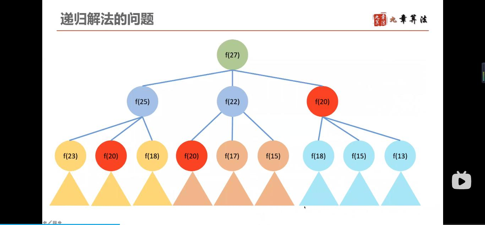
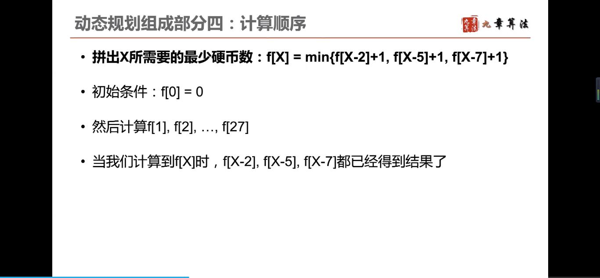

动态规划
---
  
## 解决的问题类型
  

**栗子**  
  
  

## 组成部分
### 确定状态
  
#### 最后一步
  
  
最优策略中，把最后一步去掉，用 k-1 枚硬币拼出 27-ak 的面值，还是一个最优策略  
#### 子问题
  
  
与**递归**有什么**不同**？  
  
递归解法的**问题**，见如下执行图：  
  
有大量的重复计算：  
  
f(20) 及 f(20) 下面的一大坨，都计算了三次......  
时间复杂度是指数级别的  
  

### 转移方程
  

### 初始条件和边界情况
  

### 计算顺序
  

**解答**  
  
  
  
  
  
  
  

**复杂度分析：**  
  
递归的时间复杂度是指数级别  

**小结**  
  

[43:26](https://www.bilibili.com/video/BV1xb411e7ww?from=search&seid=7988035214655151471)  