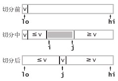

**希尔排序复杂度**

- 平均时间复杂度：根据步长序列的不同而不同。
- 最坏时间复杂度：根据步长序列的不同而不同。已知最好的：O(n log^2 n)

**希尔排序步长序列**


- 表格中第一种增量是最初Donald Shell提出的，即折半降低直到1。

- 由Sedgewick提出的步长序列 ，最坏时间复杂度为 O(n log^2 n)。是已知的最好步长序列。

  

  > 这项研究也表明“比较在希尔排序中是最主要的操作，而不是交换。”
  >
  > 用这样步长序列的希尔排序比插入排序要快，甚至在小数组中比快速排序和堆排序还快，但是在涉及大量数据时希尔排序还是比快速排序慢。

- 步长序列 `3 * k + 1`，最坏时间复杂度为 O(n^(3/2))。代码简便，常用。

**图片名词解释：** n: 数据规模 k:“桶”的个数 In-place: 占用常数内存，不占用额外内存 Out-place: 占用额外内存


## 冒泡排序（Bubble Sort）


```js
function bubbleSort(arr) {
    let tmp;
    for (let i = arr.length - 1; i > 0; i--) {
        for (let j = 0; j < i; j++) {
            if (arr[j] > arr[j + 1]) {
                tmp = arr[j];
                arr[j] = arr[j + 1];
                arr[j + 1] = tmp;
            }
        }
    }
}
```

**改进**：

设置标志变量pos，用于记录每趟排序中最后一次进行交换的位置。

由于pos位置之后的数字均已交换到位，故下一趟排序只需扫描到pos位置即可。

```js
function bubbleSort2(arr) {
    let tmp;    
    let i = arr.length - 1, pos;
    while (i > 0) { // 从后往前。此趟冒泡(见内循环)将下标i元素确定下来，此时下标i~arr.length-1有序
        pos = 0;
        for (let j = 0; j < i; j++) { // 从前往后。
            if (arr[j] > arr[j + 1]) {
                pos = j;
                tmp = arr[j];
                arr[j] = arr[j + 1];
                arr[j + 1] = tmp;
            }
        }
        i = pos;
    }
}
```

## 选择排序（Selection Sort）


```js
function selectionSort(arr) {
    let len = arr.length;
    let minIndex, tmp;
    for (let i = 0; i < len - 1; i++) { // 从前往后。选出第i+1小的数字(见内循环)放在下标i处，此时下标0~i有序
        minIndex = i;
        for (let j = i + 1; j < len; j++) { // 从前往后。
            if (arr[minIndex] > arr[j]) minIndex = j;
        }
        tmp = arr[minIndex];
        arr[minIndex] = arr[i];
        arr[i] = tmp;
    }
}
```

## 插入排序（Insertion Sort）


```js
function insertSort(arr) {
    let len = arr.length;
    let tmp;
    for (let i = 1; i < len; i++) { // 从前往后。将下标i处的数字插入到下标0~i中的某个位置(见内循环)，此时下标0~i有序
        for (let j = i; j >= 1 && arr[j] < arr[j-1]; j--) { // 从后往前。
            tmp = arr[j];
            arr[j] = arr[j - 1];
            arr[j - 1] = tmp;
        }
    }
}
```

**改进**：要大幅提高插入排序的速度并不难，只需要在内循环中将较大的元素都向右移动而不总是交换两个元素（这样访问数组的次数就能减半）

```js
function insertSort2(arr) {
    let len = arr.length;
    let key;
    for (let i = 1; i < len; i++) {
        key = arr[i];
        let j;
        for (j = i - 1; j >= 0 && key < arr[j]; j--) {
            arr[j + 1] = arr[j];
        }
        arr[j + 1] = key;
    }
}
```

**改进**：二分查找

（有点懵）

```js
function insertSort3(arr) {
    let len = arr.length;
    let key, l, r, m;
    for (let i = 1; i < len; i++) {
        key = arr[i];
        l = 0, r = i - 1;
        while (l <= r) {
            m = Math.floor((l + r) / 2);
            if (key < arr[m]) r = m - 1;
            else l = m + 1;
        }
        for (let j = i - 1; j >= l; j--) arr[j + 1] = arr[j];
        arr[l] = key;
    }
}
```

**插入排序与选择排序比较**：


## 希尔排序（Shell Sort）

> 第一个突破O(n^2)的排序算法；

> 核心在于间隔序列（最后一次间隔为1）的设定。

> 应用：中等大小的数组，希尔排序的运行时间是可以接受的。
> 它的代码量很小，且不需要使用额外的内存空间。除了对于很大的 N，其他更加高效的算法可能只会比希尔排序快两倍（可能还达不到），而且更复杂。
>
> 如果需要解决一个排序问题而又没有系统排序函数可用（例如直接接触硬件或是运行于嵌入式系统中的代码），可以先用希尔排序，然后再考虑是否值得将它替换为更加复杂的排序算法。


```js
/* O(n^3/2) */
function shellSort(arr) {
    var len = arr.length;
    var gap = 1;
    var tmp;
    while (gap < Math.floor(len / 3)) gap = 3 * gap + 1; // 1, 4, 13, 40, 121, 364, 1093, ...
    for (; gap >= 1; gap = Math.floor(gap / 3)) { // 将数组变为 gap 有序。间隔由大到小
        for (let i = gap; i < len; i++) {
            // 将 arr[i] 插入到 arr[i-gap], arr[i-2*gap], arr[i-3*gap]... 之中
            for (let j = i; j >= gap && arr[j] < arr[j - gap]; j -= gap) {
                tmp = arr[j];
                arr[j] = arr[j - gap];
                arr[j - gap] = tmp;
            }
        }
    }
}

```


## *归并排序（Merge Sort）

> 该算法是采用分治法（Divide and Conquer）的一个非常典型的应用。若将两个有序表合并成一个有序表，称为2-路归并。
>
> 应用：
>
> [剑指 Offer 51. 数组中的逆序对](https://leetcode-cn.com/problems/shu-zu-zhong-de-ni-xu-dui-lcof/)


```js
/* 采用递归方法——自上而下 */
function mergeSort(arr) {
    function recursive(arr) {
        var len = arr.length;
        if (len < 2) return arr;
        var middle = Math.floor(len / 2),
            left = arr.slice(0, middle),
            right = arr.slice(middle);
        return merge(mergeSort(left), mergeSort(right));
    }

    function merge(left, right) {
        var result = [];
        while (left.length && right.length) {
            result.push(left[0] <= right[0] ? left.shift() : right.shift());
        }
        while (left.length) result.push(left.shift());
        while (right.length) result.push(right.shift());
        return result;
    }

    recursive(arr);
    return arr;
}
```

**改进**：传数组不好，传 l, r 指针更好

```js
function mergeSort2(arr) {
    function recursive(l, r) { //采用自上而下的递归方法
        var len = r - l;
        if (len < 2) return;
        var middle = Math.floor((l + r) / 2);
        recursive(l, middle);
        recursive(middle, r);
        merge(l, middle, r);
        return;
    }

    function merge(l, m, r) {
        var tmp = [];
        var i = l,
            j = m;
        while (i < m && j < r) tmp.push(arr[i] <= arr[j] ? arr[i++] : arr[j++]);
        while (i < m) tmp.push(arr[i++]);
        while (j < r) tmp.push(arr[j++]);
        for (let k = l; k < r; k++) arr[k] = tmp[k - l];
        return;
    }

    recursive(0, arr.length);
    return arr;
}
```

**改进**：如果 arr[middle - 1] 小于等于 arr[middle] ，我们就认为数组已经是有序的并跳过 merge() 方法。任意有序的子数组算法的运行时间就变为线性的了，即最佳时间复杂度为 O(n)

```js
function recursive(l, r) { //采用自上而下的递归方法
    var len = r - l;
    if (len < 2) return;
    var middle = Math.floor((l + r) / 2);
    recursive(l, middle);
    recursive(middle, r);
    if (nums[middle - 1] > nums[middle]) merge(l, middle, r);
    return;
}
```

**改进**：使用插入排序处理小规模的子数组（比如长度小于 15）一般可以将归并排序的运行时间缩短 10% ～ 15%


## **快速排序（Quick Sort）

> 它是处理大数据最快的排序算法之一
>
> 缺点：非常脆弱，在实现时要非常小心才能避免低劣的性能。许多种错误都能致使它在实际中的性能只有平方级别。

> 与归并排序比较：
>
> 相同点：分治思想。
>
> 不同点：
>
> 归并排序中，递归调用发生在处理整个数组之前；快速排序中，递归调用发生在处理整个数组之后。
>
> 在归并排序中，一个数组被等分为两半；在快速排序中，切分（partition）的位置取决于数组的内容。

> 应用：
>
> [215. 数组中的第K个最大元素](https://leetcode-cn.com/problems/kth-largest-element-in-an-array/)


快排的切分示意图：



```js
function quickSort1(arr) {
    function recursive(left, right) {
        if (left >= right) return;
        let index = partition(left, right);
        recursive(left, index - 1);
        recursive(index + 1, right);
        return;
    }
    function partition(left, right) {
        let base = arr[left];
        let p = left + 1;
        let q = right;
        while (p <= q) {
            while (p <= q && arr[p] < base) p++;
            while (p <= q && arr[q] > base) q--;
            if (p <= q) {
                [arr[p], arr[q]] = [arr[q], arr[p]];
                // 交换值后两边各向中间推进一位
                p++;
                q--;
            }
        }
        // 修改基数的位置
        [arr[left], arr[q]] = [arr[q], arr[left]];
        return q;
    }
    recursive(0, arr.length - 1);
    return arr;
}
```

**改进**：在切分不平衡时这个程序可能会极为低效，因此要保持随机性。

方法一：在将数组排序之前将其随机打乱——洗牌算法

方法二：在`partition()`中随机选择切分元素

```js
//生成从minNum到maxNum的随机数
function randomNum(minNum,maxNum){ 
    return parseInt(Math.random()*(maxNum-minNum+1)+minNum,10); 
} 
```

**改进**：使用插入排序处理小规模的子数组

## *堆排序（Heap Sort）

> 堆排序很少被采用的原因：堆排比较的几乎都不是相邻元素，对cache极不友好，速度不如快排、归并排序，甚至是希尔排序。数学上的时间复杂度不代表实际运行时的情况

> 堆要满足：
>
> 1. 完全二叉树
> 2. 所有父节点的值都要大于子节点的值——大顶堆（或所有父节点的值都要小于子节点的值——小顶堆）

> 大顶堆用于升序排列；小顶堆用于降序排列


```js
function heapSort(arr) {
    function heapify(x, len) {
        var l = 2 * x + 1,
            r = 2 * x + 2,
            largest = x;
        if (l < len && arr[l] > arr[largest]) largest = l;
        if (r < len && arr[r] > arr[largest]) largest = r;
        if (largest != x) {
            [arr[x], arr[largest]] = [arr[largest], arr[x]]
            heapify(largest, len);
            // 建堆或堆排序过程中，若子节点发生改变，那么需要递归地调整子树
        }
    }

    //建堆
    var len = arr.length;
    for (var i = Math.floor(len / 2) - 1; i >= 0; i--) {
        heapify(i, len);
    }
    //堆排序
    for (var j = len - 1; j >= 1; j--) {
        [arr[0], arr[j]] = [arr[j], arr[0]];
        heapify(0, --len);
    }
    return arr;
}


```

## 计数排序（Counting Sort）

> 要求：
>
> 1. 需要排序的元素必须是整数；
> 2. 排序元素的取值要在一定范围内，并且比较集中。
>
> 应用：统计高考成绩


## 桶排序（Bucket Sort）


## 基数排序（Radix Sort）

