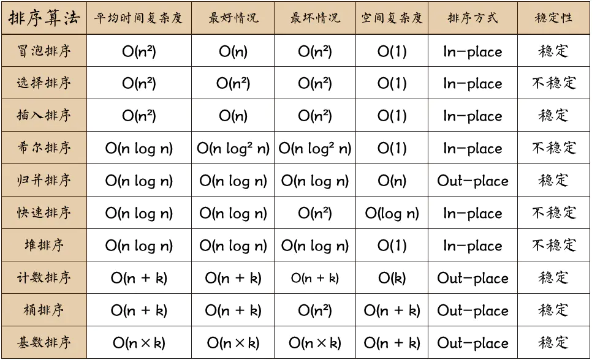
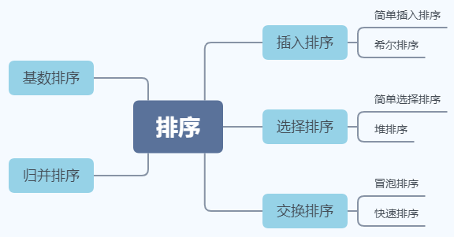

**图片名词解释：** n: 数据规模 k:“桶”的个数 In-place: 占用常数内存，不占用额外内存 Out-place: 占用额外内存



## 冒泡排序（Bubble Sort）


```js
function bubbleSort(arr) {
    let len = arr.length;
    let tmp;
    for (let i = len - 1; i > 0; i--) {
        for (let j = 0; j < i; j++) {
            if (arr[j] > arr[j + 1]) {
                tmp = arr[j];
                arr[j] = arr[j + 1];
                arr[j + 1] = tmp;
            }
        }
    }
    return arr;
}
```

**改进**：

设置标志变量pos，用于记录每趟排序中最后一次进行交换的位置。

由于pos位置之后的数字均已交换到位，故下一趟排序只需扫描到pos位置即可。

```js
function bubbleSort2(arr) {
    let i = arr.length - 1;
    let tmp;
    while (i > 0) {
        let pos = 0;
        for (let j = 0; j < i; j++)
            if (arr[j] > arr[j + 1]) {
                pos = j;
                tmp = arr[j];
                arr[j] = arr[j + 1];
                arr[j + 1] = tmp;
            }
        i = pos;
    }
    return arr;
}
```

## 选择排序（Selection Sort）


```js
function selectionSort(arr) {
    let len = arr.length;
    let minIndex, tmp;
    for (let i = 0; i < len - 1; i++) {
        minIndex = i;
        for (let j = i + 1; j < len; j++) {
            if (arr[minIndex] > arr[j]) minIndex = j;
        }
        tmp = arr[minIndex];
        arr[minIndex] = arr[i];
        arr[i] = tmp;
    }
    return arr;
}
```

## 插入排序（Insertion Sort）


```js
function insertSort(arr) {
    let len = arr.length;
    let key;
    for (let i = 1; i < len; i++) {
        key = arr[i];
        let j;
        for (j = i - 1; j >= 0 && key < arr[j]; j--) arr[j + 1] = arr[j];
        arr[j + 1] = key;
    }
    return arr;
}
```

**改进**：二分查找

（有点懵）

```js
function insertSort2(arr) {
    let len = arr.length;
    let key, l, r, m;
    for (let i = 1; i < len; i++) {
        key = arr[i];
        l = 0, r = i - 1;
        while (l <= r) {
            m = Math.floor((l + r) / 2);
            if (key < arr[m]) r = m - 1;
            else l = m + 1;
        }
        for (let j = i - 1; j >= l; j--) arr[j + 1] = arr[j];
        arr[l] = key;
    }
    return arr;
}
```

## 希尔排序（Shell Sort）

## 归并排序（Merge Sort）

## 快速排序（Quick Sort）

https://github.com/DangoSky/algorithm/tree/master/Algorithm-notes#%E5%BF%AB%E9%80%9F%E6%8E%92%E5%BA%8F


## 堆排序（Heap Sort）

## 计数排序（Counting Sort）

## 桶排序（Bucket Sort）

## 基数排序（Radix Sort）