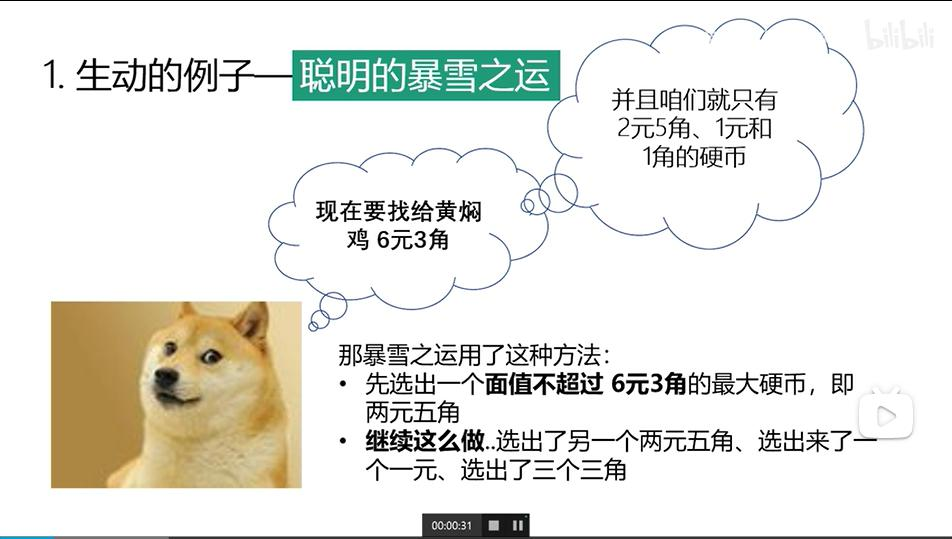
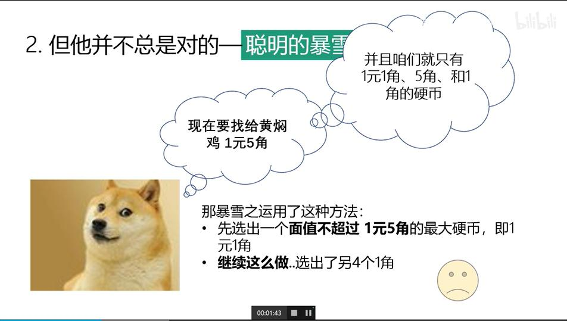
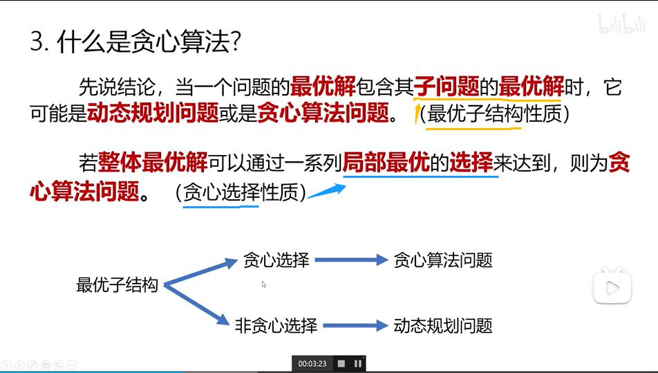
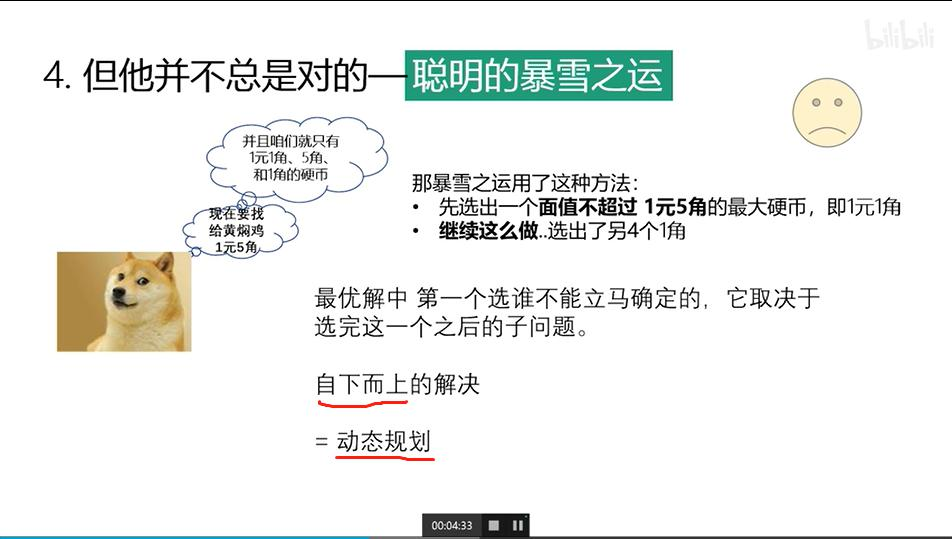
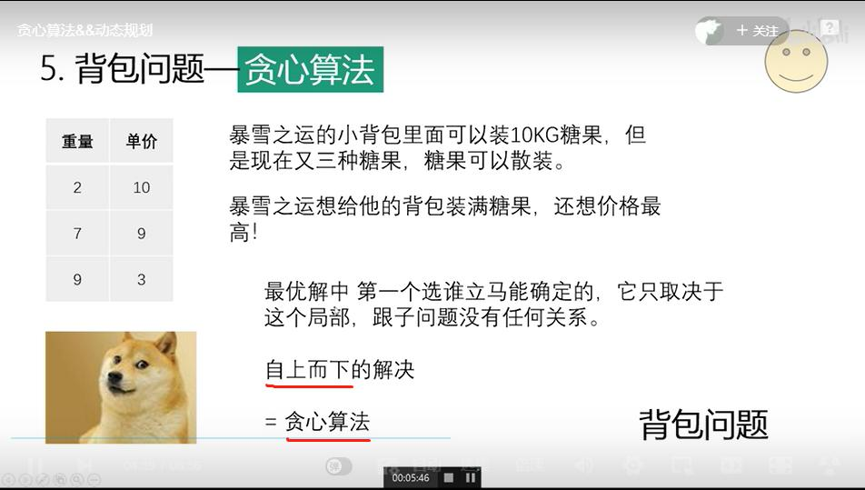
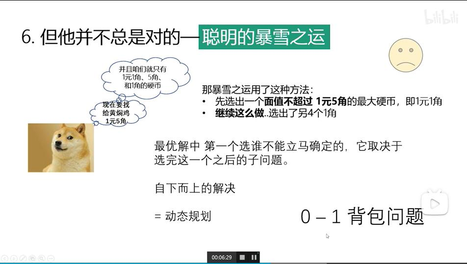
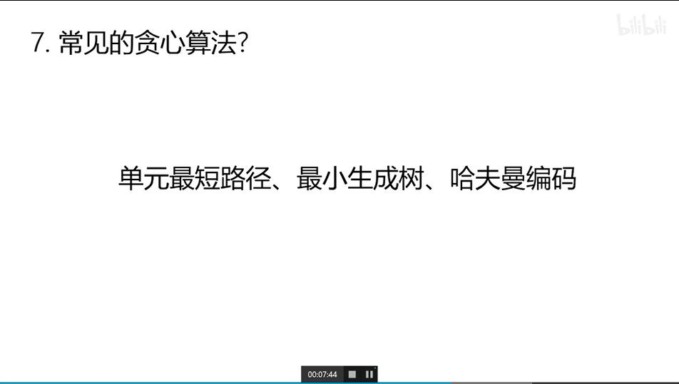
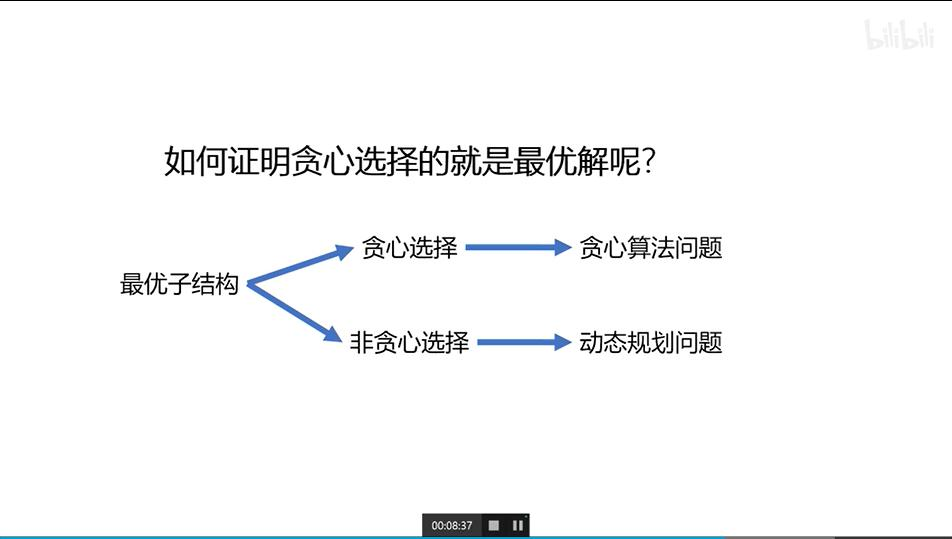

贪心算法 && 动态规划
---

## 引例
  
通过贪心选择，在该例中可以取得整体最优解  
  
通过贪心选择，在该例中无法取得整体最优解  

## 贪心算法与动态规划对比
|算法|选择方式|解决顺序|典例|
| - | - | - | - |
|动态规划|非贪心选择|自下而上|0-1背包问题(只有选/不选两种选择)|
|贪心算法|贪心选择|自上而下|背包问题(分开散装)|

  
**栗子**  
  
  
  

## 常见的贪心算法
  

## 什么时候使用贪心算法
  
贪心算法：贪心选择的局部最优解是最整体优解  
用**反证法**：若贪心选择的局部最优解不是整体最优解——使用动态规划  
