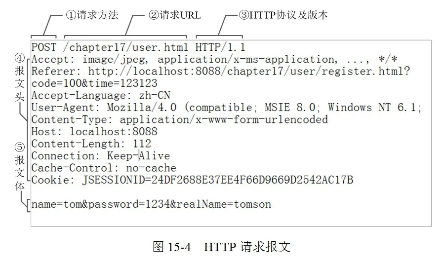

从输入 URL 到页面呈现
===

> Create by **jsliang** on **2020-09-21 23:29:10**  
> Recently revised in **2020-11-17 21:09:15**

<!-- 目录开始 -->
## 一 目录

**不折腾的前端，和咸鱼有什么区别**

| 目录 |
| --- |
| [一 目录](#one) |
| [二 前言](#two) |
| [三 整体过程](#three) |
| [四 DNS 解析](#four) |
| [五 TCP 连接](#five) |
| [六 发送 HTTP 请求](#six) |
| [七 服务器响应](#seven) |
| [八 浏览器解析渲染页面](#eight) |
| [九 其他问题及优化](#night) |
| &emsp;[9.1 渲染过程碰到 JS 文件怎么处理？](#night-one) |
| &emsp;[9.2 为什么操作 DOM 慢](#night-two) |
<!-- 目录结束 -->

## 二 前言

> [返回目录](#one)

这是一道经典面试题：

* 从输入 `URL` 到页面呈现发生了什么？

如果你还不懂，那么可以来看看。

## 三 整体过程

> [返回目录](#one)

在用户输入 URL，按下回车之后，走过的步骤：

1. `DNS` 解析
2. `TCP` 连接
3. 发送 `HTTP` 请求
4. 服务器响应
5. 浏览器解析渲染页面  

在所有这些请求中，还需要关注的就是[**浏览器缓存——缓存机制**](https://github.com/XingRenEr/Front-end/blob/master/%E6%B5%8F%E8%A7%88%E5%99%A8/%E6%B5%8F%E8%A7%88%E5%99%A8%E7%BC%93%E5%AD%98.md#chapter-five)  
> 可缓存的内容有：`DNS` 解析返回的 `IP` 地址；服务器响应返回的 `html` `css` 等资源；浏览器解析渲染页面时请求的 `js` 文件、图片等资源

当然，这是整体过程，实际面试过程中会进一步详细问，后面会逐步完善，让小伙伴们对这个系列的问题不在纠结。

## 四 [DNS](https://github.com/XingRenEr/Front-end/blob/master/%E8%AE%A1%E7%AE%97%E6%9C%BA%E7%BD%91%E7%BB%9C/DNS.md) 解析

> [返回目录](#one)

`DNS` 解析过程就是通过网络查找哪台机器有你需要的资源的过程。

浏览器输入 `github.com` 并不是真正意义上的去查找这个，而是查找这个域名解析到的 `IP` 地址。

互联网上每一台计算机的唯一标识是它的 `IP` 地址，但是 `IP` 地址并不方便记忆，所以互联网设计者为了方便，才会搞出 `github.com` 这样的域名。

* **DNS 解析过程**：

1. 查询 `www.baidu.com`
2. 访问客户端 DNS 缓存：**浏览器缓存** -> **系统缓存（host）** -> **路由器缓存**
3. 访问 **ISP DNS 缓存**（ISP，互联网服务提供商，有联通电信移动等。如果你是电信网络，则进入电信的 DNS 缓存服务器，以下简称本地），如果本地服务器有，则直接返回；如果没有，让本地 DNS 服务器去咨询查找。
4. 本地去咨询 **根域名服务器**，DNS 根服务器发现是 `.com 区域` 管理的，告诉本地去咨询它。
5. 本地去咨询 **顶级域名服务器**，.com 顶级域名服务器不太清楚，告诉本地去咨询 `baidu.com 主区域` 的服务器。
6. 本地去咨询 **主域名服务器**，baidu.com 域名服务器查找到对应的 IP 地址，返回给本地。
7. 本地服务器通知用户，`baidu.com` 对应的 IP 地址，同时缓存这个 IP 地址，下次就直接访问了。

## 五 [TCP](https://github.com/XingRenEr/Front-end/blob/master/%E8%AE%A1%E7%AE%97%E6%9C%BA%E7%BD%91%E7%BB%9C/TCP.md) 连接

> [返回目录](#one)

1. 建立连接阶段：3 次握手。建立客户端和服务器之间的连接。
2. 传输数据阶段
3. 断开连接阶段：4 次挥手。断开客户端和服务器之间的连接。

## 六 发送 HTTP 请求

> [返回目录](#one)

发送 `HTTP` 请求的过程就是构建 `HTTP` 请求报文，并通过 `TCP` 协议发送到服务器指定端口（`HTTP` 协议默认端口 `80/8080`，`HTTPS` 协议默认端口 `443`）。

`HTTP` 请求报文由 3 部分组成：**请求行**、**请求头** 和 **请求体**。  
  

* **请求行**：请求方法、请求URL、HTTP协议及版本。[请求方法](https://github.com/XingRenEr/Front-end/blob/master/%E8%AE%A1%E7%AE%97%E6%9C%BA%E7%BD%91%E7%BB%9C/HTTP.md#four-one)：常用方法有：GET、POST、PUT、DELETE、OPTIONS、HEAD。
* [**请求头**](https://itbilu.com/other/relate/EJ3fKUwUx.html#http-request-headers)：允许客户端向服务器传递请求的附加信息和客户端自身的信息。
* **请求体**：通过 POST、PUT 等方法时，通常需要客户端向服务器传递数据，这些数据就储存在请求体中。

当然，`HTTP` 请求需要注意是否[跨域](https://github.com/XingRenEr/Front-end/blob/master/%E6%B5%8F%E8%A7%88%E5%99%A8/%E8%B7%A8%E5%9F%9F.md)，如何解决跨域问题：

## 七 服务器响应

> [返回目录](#one)

服务器处理请求完毕后，会返回 `HTTP` 报文。

`HTTP` 响应报文也是由 3 部分组成：**响应行**、**响应头** 和 **响应体**。

* **响应行**：HTTP协议及版本、状态码及状态描述。[状态码](https://github.com/XingRenEr/Front-end/blob/master/%E8%AE%A1%E7%AE%97%E6%9C%BA%E7%BD%91%E7%BB%9C/HTTP.md#five)：`1xx` 指示信息-表示请求已接收；`2xx` 请求成功-表示请求成功接收并解析；`3xx` 重定向-表示要完成请求需要更进一步操作；`4xx` 客户端错误-请求有语法错误或者请求无法实现；`5xx`：服务端错误-服务端未能实现合法的请求。**常见状态码**：200（成功）、304（请求内容有缓存，不需要更新）、400、401、403、404（网页或者文件找不到）、500（服务器-后端处理错误）。
* [**响应头**](https://itbilu.com/other/relate/EJ3fKUwUx.html#http-response-headers)：常见的响应头字段 `Server`、`Connection` 等。
* **响应体**：服务器返回给浏览器的文本信息，通常 HTML、CSS、JS、图片等文件就放在这一部分。

综上，`URL` 解析过程的步骤 3 和步骤 4 是 `HTTP` 请求和服务器响应，所以这一块会问到 `HTTP` 状态码、[`HTTPS`](https://github.com/XingRenEr/Front-end/blob/master/%E8%AE%A1%E7%AE%97%E6%9C%BA%E7%BD%91%E7%BB%9C/HTTP.md#seven) 等知识点。

## 八 浏览器解析渲染页面

> [返回目录](#one)

如上图，浏览器的**渲染过程**为：

1. 解析 HTML —> 生成 `DOM` 树
> 在 `DOM` 树的构建过程中如果遇到 `JS` 脚本和外部 `JS` 链接，则会停止构建 `DOM` 树来执行和下载相应的代码，这会造成阻塞，这就是为什么推荐 `JS` 代码应该放在 `html` 代码的后面  
2. 加载 `CSS` —> 解析 `CSS` —> 生成 `CSS 规则树（CSS Rule Tree）`  
> `CSS` 包括外部样式，内部样式，内联样式  
3. 加载 `javascript` —> 执行 `javascript` 代码  
4. 将 `DOM Tree` 和 `CSS Rule Tree` 相结合，生成 **渲染树**（`Render Tree`）  
> 这里的主要目的是排除非视觉节点，比如 `script`，`meta` 标签和排除 `display: none` 的节点  
5. 从根节点开始，计算每一个元素的位置、尺寸，得到 **布局渲染树**（`Layout of the render tree`）
6. 遍历渲染树，由 UI 渲染引擎绘制，此步骤叫 **绘制渲染树**（`Painting the render tree`）  

在解析 `DOM` 的过程中，因为 `html` 文件中会含有图片，视频，音频等资源，遇到这些都会进行并行下载，浏览器对每个域的并行下载数量有一定的限制，一般是 4-6 个。**加载时机**为：  
1. 解析 HTML【遇到``标签**加载**图片】 —> 生成 **`DOM` 树**
2. 加载 `CSS` —> 解析 `CSS`【遇到背景图片链接**不加载**】 —> 生成 **`CSS` 规则树**  
3. 加载 `javascript` —> 执行 `javascript` 代码  
4. 将 `DOM` 树和 `CSS` 规则树相结合，生成 **渲染树**【遍历DOM树时**加载**对应样式规则上的背景图片】  
5. 得到 **布局渲染树**
6. **绘制**【开始**渲染**图片】

> 这个渲染过程需要重点记忆，出场概率非常大

在解析渲染过程中，可能会产生 [**回流** 和 **重绘**](https://github.com/XingRenEr/Front-end/blob/master/%E6%B5%8F%E8%A7%88%E5%99%A8/%E5%9B%9E%E6%B5%81%E5%92%8C%E9%87%8D%E7%BB%98.md)：

* **重绘(repaint)**：当元素样式的改变不影响布局时，浏览器将使用重绘对元素进行更新，此时由于只需要 UI 层面的重新像素绘制，因此**损耗较少**。
* **回流(reflow)**：又叫重排（`layout`）。当元素的尺寸、结构或者触发某些属性时，浏览器会重新渲染页面，称为回流。此时，浏览器需要重新经过计算，计算后还需要重新页面布局，因此是较重的操作。

在回流和重绘中，问题有：

1. 什么操作会重绘和回流？
2. 如何优化？

## 九 其他问题及优化

> [返回目录](#one)

在上面步骤中，其实可以发掘很多优化点：

* DNS 缓存
* 浏览器缓存
* 减少回流和重绘
* ……

如果你过程都了解了，那么优化基本不是问题。

* [x] [浏览器 - 性能优化](https://github.com/XingRenEr/Front-end/blob/master/%E6%B5%8F%E8%A7%88%E5%99%A8/%E6%80%A7%E8%83%BD%E4%BC%98%E5%8C%96.md)

### 9.1 渲染过程碰到 JS 文件怎么处理？

> [返回目录](#one)

JavaScript 的加载、解析和执行会阻塞 DOM 的构建。

也就是说：在构建 `DOM` 的时候，HTML 解析器如果碰到 JavaScript，那么就会停止构建 `DOM`，将控制权交给 JavaScript 引擎，等 JavaScript 运行完毕，浏览器再从中断的地方恢复 `DOM` 构建。

也就是说：首屏渲染越快，就越不应该在首屏的时候加载 JS 文件，这也就是建议将 `script` 标签放到 `body` 标签底部，或者给 `script` 标签添加 `defer/async` 属性的原因。

### 9.2 为什么操作 DOM 慢

> [返回目录](#one)

1. 涉及 JS 引擎和渲染引擎两个线程间的通信，损耗性能。
2. 操作 DOM 可能会重复回流，加剧性能损耗。

## 十 参考文献
* [x] [Web图片资源的加载与渲染时机](https://segmentfault.com/a/1190000010032501)
---

> jsliang 的文档库由 [梁峻荣](https://github.com/LiangJunrong) 采用 [知识共享 署名-非商业性使用-相同方式共享 4.0 国际 许可协议](http://creativecommons.org/licenses/by-nc-sa/4.0/) 进行许可。 基于 [https://github.com/LiangJunrong/document-library](https://github.com/LiangJunrong/document-library) 上的作品创作。 本许可协议授权之外的使用权限可以从 [https://creativecommons.org/licenses/by-nc-sa/2.5/cn/](https://creativecommons.org/licenses/by-nc-sa/2.5/cn/) 处获得。
