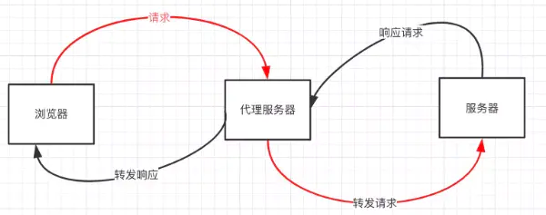

跨域
===

<!-- 目录开始 -->
## 一 目录

| 目录 |
| --- |
| [一 目录](#one) |
| [二 前言](#two) |
| [三 同源策略](#three) |
| [四 实现跨域的方式](#four) |
| &emsp;[4.1 JSONP](#four-one) |
| &emsp;[4.2 CORS](#four-two) |
| &emsp;[4.3 postMessage](#four-three) |
| &emsp;[4.4 WebSocket](#four-four) |
| &emsp;[4.5 Node](#four-five) |
| &emsp;[4.6 Nginx](#four-six) |
| &emsp;[4.7 其他方式](#four-seven) |
| [五 参考文献](#five) |
<!-- 目录结束 -->

## 二 前言

> [返回目录](#one)

带着问题学习：

* 什么是跨域？
* 为什么要设置跨域？
* 如何解决跨域？

## 三 同源策略

> [返回目录](#one)

**【1】什么是同源策略**？

所谓 **源**，可以指 URL。

简单来看某个 URL 组成；

* https://github.com/LiangJunrong/document-library

在这里：

| 名称 | 举例 |
| --- | --- |
| 协议 | `http`、`https` |
| 域名 | `github.com`、`jsliang.top` |
| 端口 | `80`、`443` |

> 其中，如果 URL 上未标明端口，那么 `http` 默认是 `80` 端口，`https` 默认是 `443` 端口。

而所谓的同源策略，是指这 3 个（协议、域名、端口）一致的情况下，才属于同源。

对于下面的 URL，我们判断下哪些属于同源哪些属于不同源：

* https://github.com/LiangJunrong/document-library

| URL | 是否同源 | 原因 |
| --- | --- | --- |
| http://github.com | 否 | 协议不同 |
| https://github2.com | 否 | 域名不同 |
| https://github.com:80/LiangJunrong | 否 | `https` 默认端口为 `443` |
| https://money.github.com | 是 | 多级域名和主域名一致 |

在上面，如果两个页面对应的地址不同源，那么浏览器就会判定跨域，从而导致下面问题：

* `Ajax` 请求不能发送
* 无法获取 `DOM` 元素并进行操作
* 无法读取 `Cookie`、`LocalStorage` 和 `IndexDB`

那么，出于怎样的考虑，**【2】浏览器才要设置跨域**？

**首先**，跨域只存在于浏览器端，因为我们知道浏览器的形态是很开放的，所以我们需要对它有所限制。

**其次**，同源策略主要是为了保证用户信息的安全，可分为两种：`Ajax` 同源策略和 `DOM` 同源策略。

`Ajax` 同源策略主要是使得不同源的页面不能获取 `Cookie` 且不能发起 `Ajax` 请求，这样在一定层度上防止了 `CSRF` 攻击。

`DOM` 同源策略也一样，它限制了不同源页面不能获取 `DOM`，这样可以防止一些恶意网站在自己的网站中利用 `iframe` 嵌入正规的网站并迷惑用户，以此来达到窃取用户信息。

**【3】实际开发场景为什么会出现跨域**：

1. 前后端部署的机子，不属于同一台云服务器。
2. 同一台云服务器，但是你在 `https://github.com` 请求的是 `https://github2.com` 上的资源。

那么，**【4】如何解决跨域问题**呢？

1. 使用代理（`proxy`）
2. 设置 `CORS`
3. JSONP
4. ……等

下面我们详细看看解决跨域的几个方案。

## 四 实现跨域的方式

> [返回目录](#one)

### 4.1 JSONP

> [返回目录](#one)

利用 `<script>` 标签没有跨域限制的漏洞，网页可以得到从其他来源动态产生的 `JSON` 数据。`JSONP` 请求一定需要对方的服务器做支持才可以。

优缺点：

1. 【优点】`Ajax` 和 `JSONP` 都是客户端向服务端发送请求，从而获取数据的方式。但是 `Ajax` 受到同源策略的限制，而 `JSONP` 属于非同源策略。
2. 【优点】兼容性好，在更加古老的浏览器中都可以运行，不需要 XMLHttpRequest 或 ActiveX 的支持
3. 【缺点】仅支持 `get` 请求
4. 【缺点】是一种脚本注入(Script Injection)行为，不安全，可能会遭受 `XSS` 攻击。

实现过程：省略，看 JS 手写代码部分。  
* [x] [手写JSONP](https://github.com/XingRenEr/Front-end/blob/master/Javascript/%E6%89%8B%E5%86%99%E6%BA%90%E7%A0%81/JSONP.md)

### 4.2 CORS

> [返回目录](#one)

**CORS 跨域的原理**。

跨域资源共享（`CORS`）是一种机制，是 `W3C` 标准。它允许浏览器向跨源服务器，发出 `XMLHttpRequest` 或 `Fetch` 请求。并且整个 `CORS` 通信过程都是浏览器自动完成的，不需要用户参与。

而使用这种跨域资源共享的前提是，浏览器必须支持这个功能，并且服务器端也必须同意这种 "跨域" 请求。因此实现 CORS 的关键是服务器。

浏览器会自动进行 `CORS` 通信，实现 `CORS` 通信的关键是后端。只要服务器实现了 `CORS` 接口，就可以跨源通信。

服务端设置 `Access-Control-Allow-Origin` 就可以开启 `CORS`（若要带 cookie 请求，前后端都需要设置）。

该属性表示哪些域名可以访问资源，如果设置通配符则表示所有网站都可以访问资源。

`CORS` 的请求分为两种：

* 简单请求
* 复杂请求

一个简单请求大致如下。

HTTP 方法是下列之一：

* HEAD
* GET
* POST

HTTP 头信息不超过以下几种字段

* Accept
* Accept-Language
* Content-Language
* Last-Event-ID
* Content-Type：只限于三个值application/x-www-form-urlencoded、multipart/form-data、text/plain

任何不满足上述要求的请求，都是复杂请求。

一个复杂请求不仅包含通讯内容的请求，同时也包含预请求。

**简单请求和复杂请求的区别**：

* **简单请求** 的发送从代码上看起来和普通的 XHR 没太大区别，但是 HTTP 头当中要求总是包含一个域（Origin）的信息。该域包含协议名、地址以及一个可选的端口。
* **复杂请求** 不止发送一个请求。其中最先发送的是一种 “预请求”，而服务端也需要返回 “预回应” 作为相应。预请求实际上是对服务端的一种权限请求，只有当预请求成功返回，实际请求才开始执行。

**与JSONP的比较**：  

CORS与JSONP的使用目的相同，但是比JSONP更强大。

JSONP只支持GET请求，CORS支持所有类型的HTTP请求。JSONP的优势在于支持老式浏览器，以及可以向不支持CORS的网站请求数据。  

### 4.3 postMessage

> [返回目录](#one)

`postMessage` 是 `HTML5 XMLHttpRequest Level 2` 中的 `API`，且是为数不多可以跨域操作的 `window` 属性之一。

它可用于解决以下方面的问题：

* 页面和其打开的新窗口的数据传递
* 多窗口之间消息传递
* 页面与嵌套的 `iframe` 消息传递
* 上面三个场景的跨域数据传递

`postMessage()` 方法允许来自不同源的脚本采用异步方式进行有限的通信，可以实现跨文本档、多窗口、跨域消息传递。

### 4.4 WebSocket

> [返回目录](#one)

`WebSocket` 是 HTML5 的一个持久化的协议，它实现了浏览器与服务器的全双工通信，同时也是跨域的一种解决方案。

`WebSocket` 是一种双向通信协议，在建立连接之后，`WebSocket` 的 `server` 与 `client` 都能主动向对方发送或接收数据。

`WebSocket` 的使用我们在计算机网络部分有写，后面再进行介绍。
### 4.5 Node

> [返回目录](#one)

同源策略是浏览器需要遵循的标准，而如果是服务器向服务器请求就无需遵循同源策略。

所以我们可以通过 `Node` 中间件代码（两次跨域）：

* 接受客户端请求
* 将请求转发给服务器
* 拿到服务器响应数据
* 将响应转发给客户端

  

### 4.6 Nginx

> [返回目录](#one)

使用 `Nginx` 反向代理实现跨域，是最简单的跨域方式。

只需要修改 `Nginx` 的配置即可解决跨域问题，支持所有浏览器，支持 `Session`，不需要修改任何代码，并且不会影响服务器性能。  

### 4.7 其他方式

> [返回目录](#one)

其他方式还有：

1. `window.name + iframe`
2. `location.hash + iframe`
3. `document.domain + iframe`
4. ……

但是感觉有生之年 **jsliang** 不会用到，这里看看即可。

## 五 参考文献

> [返回目录](#one)

* [x] [跨域资源共享 CORS 详解 - 阮一峰](https://www.ruanyifeng.com/blog/2016/04/cors.html)

---

> jsliang 的文档库由 [梁峻荣](https://github.com/LiangJunrong) 采用 [知识共享 署名-非商业性使用-相同方式共享 4.0 国际 许可协议](http://creativecommons.org/licenses/by-nc-sa/4.0/) 进行许可。 基于 [https://github.com/LiangJunrong/document-library](https://github.com/LiangJunrong/document-library) 上的作品创作。 本许可协议授权之外的使用权限可以从 [https://creativecommons.org/licenses/by-nc-sa/2.5/cn/](https://creativecommons.org/licenses/by-nc-sa/2.5/cn/) 处获得。
