Ajax
===

## 1 目录
1. 什么是 Ajax
2. 如何使用 Ajax
 - GET
 - POST
3. JSON

## 2 什么是Ajax
1. Ajax 全称: Asynchronous JavaScript And XML  
2. 是一种异步加载数据的技术  
3. 可以通过使用 Ajax，实现页面的局部刷新（更灵活）  

## 3 如何使用Ajax
1. Ajax 的核心对象: `XMLHttpRequest`
2. GET
目的：从服务器取得数据（GET 与 POST：根据服务器的实现不同，也能互相实现对方的功能）  
数据装载的位置：放在 url 中（这是两者最本质的区别）  
缺点：数据大小受限制（因为放在 url 中）；有安全隐患  
3. POST
目的：向服务器发送数据  
数据装载的位置：放在请求体中  
优点：数据大小不受限；有 HTTPS 数据加密  

### 3.1 使用GET
步骤：  
1. 创建 Ajax 对象
2. 打开这个对象
3. 发送请求
4. 监听请求（为了防止请求已经返回了还没有开始监听，要把这一步放在上面）

```javascript
//1.创建Ajax对象
var xhr = new XMLHttpRequest();
//4.监听请求
xhr.onreadystatechange = function() {
	//当xhr对象的readystate属性发生了改变,这个事件就会触发
	if (xhr.readyState !== 4) {
		return;
	}
	if (xhr.status >= 200 && xhr.status <= 300) { //请求成功
		// 数据在xhr.responseText属性中(String类型)
		document.querySelector("h1").innerText = xhr.responseText;
	} else {
		console.error('请求失败');
	}
}
//2.打开这个对象
xhr.open('get', './text.txt', true);
//3.发送请求
xhr.send();
```

**`XMLHttpRequest.readyState`**  

|值	|状态							|描述																							|
| - | -               | -                                             |
|0	|UNSENT						|代理被创建，但尚未调用 open() 方法。							|
|1	|OPENED						|open() 方法已经被调用。													|
|2	|HEADERS_RECEIVED	|send() 方法已经被调用，并且头部和状态已经可获得。|
|3	|LOADING					|下载中； responseText 属性已经包含部分数据。			|
|4	|DONE							|下载操作已完成。																	|

**HTTP 响应代码**  
HTTP 响应状态代码指示特定 HTTP 请求是否已成功完成。响应分为五类：信息响应(100–199)，成功响应(200–299)，重定向(300–399)，客户端错误(400–499)和服务器错误 (500–599)。

### 3.2 使用post请求
```js
xhr.open('post', './text.txt', true);
```  
使用 **`get`** 请求可以请求具体的文件，于是服务器中**不需要**具体的代码来**响应**这个请求。  
使用 **`post`** 请求**必须**在服务器中有代码来**响应**它。  

1. 在服务器中写一段最简单的代码来响应Ajax。  
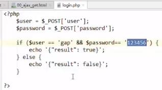  
2. JS脚本  
请求方式：post；请求路径：login.php；发送内容：用户名、密码；  
send的内容如果是按照表单格式编码的，要在头部告诉服务器发送的内容是表单格式的（还可以是JSON格式...）。  
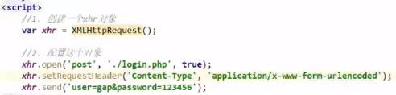  
完整代码：  
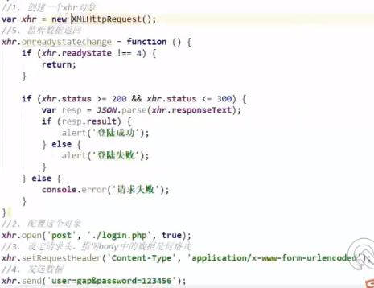  
3. 运行（阿帕奇服务器什么什么的？）：  
  
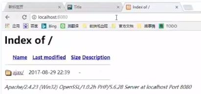  
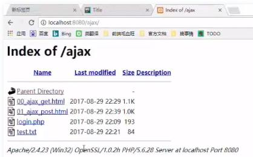  
  
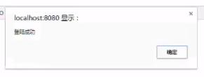  

## 4 JSON
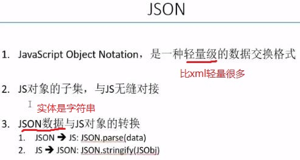  
【官网】[json.org](https://www.json.org/json-en.html)  
【简介】  
JSON是ECMA定义的，  
object格式：  
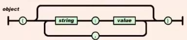  
array格式：  
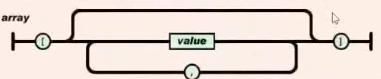  
value值（JSON可以嵌套）（value不能为undefined，也不能为function）：  
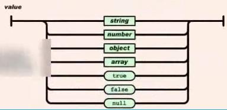  

## 5 目录(2)
1. 回调地狱、Promise  
 - 回调地狱
 - Promise
 - Ajax的依赖调用
 - Promise解决ajax的依赖调用
2. Ajax的同源策略

## 6 回调地狱、Promise
### 6.1 回调地狱
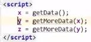  
问题：三个函数必须是同步的。如果是异步的话，```x = getData();```可能只是请求了数据，数据还没返回，就执行```y = getMoreData(x);```的话，x不是一个有效的数据，于是y也不是一个有效的数据。  
如果```getData()```和```getMoreData()```变成异步的话，程序应该变为：  
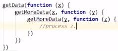  
前一次调用的结果作为下一次调用的输入，就需要一层一层的嵌套。导致回调函数的层级特别深，导致开发和维护特别难。  
在ES6中提出方法解决回调地狱的问题。
### 6.2 Promise
1. 使用方法：  
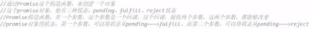  
等待状态/满足条件的状态（调用成功）/延时对象（调用失败）  
2. 代码：  
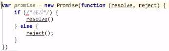  
3. 实例：  
要求：首先，创建一个Promise对象；然后，在3s之后随机生成一个数字[0~100)；如果这个数字为偶数，随机成功；如果为奇数，随机失败。  
分析："3s"，使用异步。  
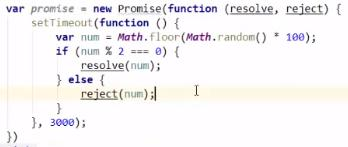  
如何接收成功/失败的状态？通过Promise的函数```then()```  
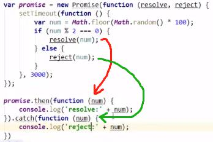  
Promise不仅可以处理一个回调的问题，还可以解决回调地狱的问题。  
下一节看一看Ajax中的回调地狱，也就是依赖调用问题。

### 6.3 Ajax的依赖调用
1. Ajax中如何产生依赖调用？  
假设这样的场景：  
有一篇文章，分四次来取得（第一次取第一段，第二次取第二段，第三次取第三段，第四次取第四段）。即这篇文章的取得是有顺序的，也就意味着第一次取得之前，是不能发第二次请求的，否则它们在进行字符串连接的时候可能会发生问题。  
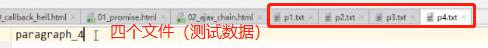  
代码使用了jQuery库。  
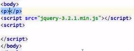  
>jquery官网提供2种jQuery的下载，一种是jquery.js另一种是jquery.min.js
>文件名不一定完全相同，但通常情况下：
>jquery.js是完整的未压缩的jQuery库，文件比较大，一般用于阅读学习源码或修改源码，一般不用于线上项目。
>jquery.min.js是由完整版的jQuery库经过压缩得来，压缩后功能与未压缩的完全一样，只是将其中的空白字符、注释、空行等与逻辑无关的内容删除，并进行一些优化。这个版本一般用于网站引用使用，减小文件体积，降低网站流量，提升访问速度等。

下面发送四个Ajax，分别取p1 p2 p3 p4，并且将它们进行连接，连接之后写到页面上（的p标签中）。  
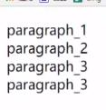  
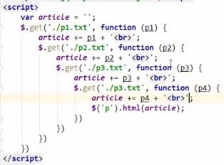  
2. Promise解决ajax的依赖调用
定义四个函数：  
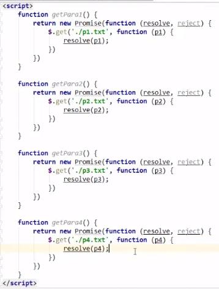  
调用：  
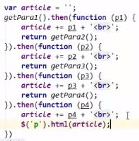  
通过then函数解决了代码嵌套的问题。  
