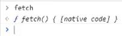
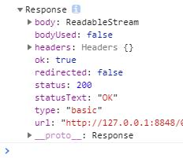
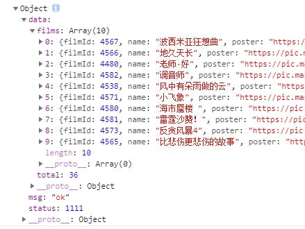
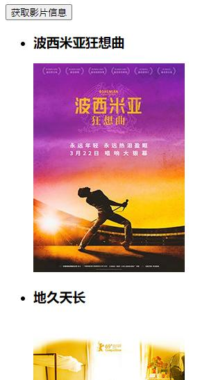

Fetch  
===

是W3C的一种标准。  
【背景】  
XMLHttpRequest 是一个设计粗糙的 API，配置和调用方式非常混乱，而且基于事件的异步模型写起来不友好。  
【缺点】  
兼容性不好  
Chrome支持  
  

>对于不支持 `Fetch` 的浏览器，可使用 `polyfill`:  
>https://github.com/camsong/fetch-ie8  

【用法】  
```JS
fetch("./json/test.json").then(res => {
	console.log(res)
});
```
  
第一个.then取得的只是返回头的一些信息，必须链式调用第二个.then才会取得数据  
```JS
fetch("./json/test.json").then(res => res.json()).then(res => {
	console.log(res)
});
```
  

【运用在Vue项目中】  
```HTML
<div id="box">
	<button @click="handleClick()">获取影片信息</button>
	<ul>
		<li v-for="data in datalist">
			<h3>{{data.name}}</h3>
			
		</li>
	</ul>
</div>
<script type="text/javascript">
	new Vue({
		el: "#box",
		data: {
			datalist: []
		},
		methods: {
			handleClick() {
				fetch("./json/test.json").then(res => res.json()).then(res => {
					console.log(res.data.films)
					this.datalist = res.data.films
				})
			}
		}
	})
</script>
```
  

>【注意】  
>Fetch 请求默认是不带 cookie 的，需要设置 fetch(url, {credentials:'include'})  
