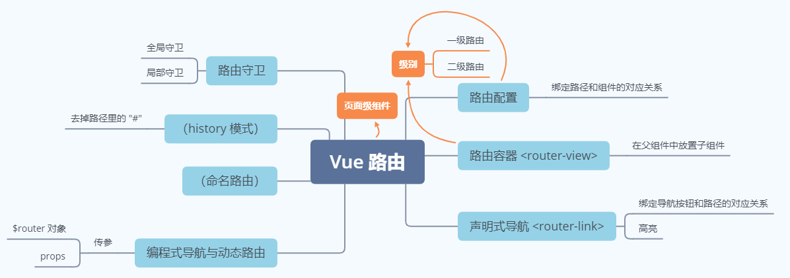

# 自我介绍

# HTML

- [ ] 常用html5标签/ [描述一下svg以及与cavas的区别](https://github.com/abcrun/abcrun.github.com/issues/13)

  > [如何为您的网站在Canvas和SVG之间做出选择](https://docs.microsoft.com/zh-cn/previous-versions/msdn10/Hh377884(v=MSDN.10))

# CSS

- [ ] 三栏布局/两列布局的实现方式（尽可能多方法）

- [ ] 垂直水平居中布局/ [div垂直居中，左右10px，高度始终为宽度一半](https://blog.csdn.net/weixin_42098339/article/details/102830381)

  ```css
  div {
      background-color: aquamarine;
      position: fixed;
      left: 0;
      right: 0;
      top: 0;
      bottom: 0;
      margin: auto 10px;
      height: calc((100vw - 20px)/2);
  }
  ```

- [ ] BFC

- [ ] margin重叠，如何解决

- [ ] 浮动清除，伪元素加在哪里

- [ ] flex/对flex布局的理解/flex布局的缺点，IE浏览器不兼容怎么处理

  如果你想要支持非常旧的浏览器使用flexbox属性，在CSS中加入：

  ```css
  .wrapper {
    display: -webkit-box;
    display: -webkit-flex;
    display: -ms-flexbox;
    display: flex;
  }
  ```

  向下支持技术：

  子元素设置为浮动元素

  子元素设置为 inline-block/table-cell + vertical-align 属性

  > 优先设置vertical-align 属性，来进行向下兼容。而对于支持弹性盒的浏览器，该属性将被忽略

  ```css
  div{
      display: flex;
      div{
          float: left;
      }
  }
  ```

- [ ] display的属性

- [ ] 盒模型及其转换/css的怪异盒与标准盒，他们是怎样切换的

- [ ] postiton各属性/position:fixed失效原因/absolute定位是想对于那个开始的

  - [x] [失效的 `position:fixed`](https://www.cnblogs.com/coco1s/p/7358830.html)

- [ ] z-index什么时候生效

- [ ] css选择器/样式优先级/css选择器优先级（出了道属性选择器和类选择器优先级的样式比较题）

- [ ] css绘制三角形

- [ ] icon图标怎么引入

  有iconfont（以这个为例）和fontawesome图标库。

  - [x] [字体图标icon的实现原理](https://zhuanlan.zhihu.com/p/22724856)
  - [x] [引入icon图标及原理](https://www.jianshu.com/p/8f14411824b2)

  原理：CSS文件中定义了自定义字体`iconfont`、通用类`.iconfont`（设置字体为自定义字体`iconfont`）与图标的特定类（这个特定类有个`::before`伪元素，伪元素的内容为图标对应的unicode编码）。

  应用：下载CSS文件/通过cdn引入CSS文件，给标签添加一个通用类以及特定类。

  > 传统访问方式有以下**弊端**：
  >
  > 1. 服务器（即使是云服务器），也一定有一个物理位置。离服务器越远，访问速度越**慢**。况且，中小型网站的服务器，本身带宽就小，一旦访问人多，即使访问的地方距离网站服务器很近，访问依然很慢。
  > 2. 服务的**稳定性**。所有服务器，都有一定几率遇到宕机问题。尤其是中小型网站，可能没有专门的运维人员。
  >
  > CDN 实现了服务器自由。**CDN** 的全称是 Content Delivery Network，即内容分发网络。
  >
  > 机制类似于京东物流仓储和配送机制。首先在全国各个区域建设仓储中心，把合作商家的货物放进来，于是客户购买时，直接从最近区域的仓库发货。最近物流又发明了前置仓——把仓库直接开到小区旁边。
  >
  > CDN 也是类似的机制，直接从最近的服务器给客户端发送数据。
  >
  > 使用CDN引用的**好处**：
  >
  > 1. 提高加载**速度**。
  >    许多用户在访问其他站点（如百度、又拍云、新浪、谷歌或微软）时，已经加载过 jQuery。当访问您的站点时，会从缓存中加载 jQuery
  >
  >    当用户请求文件时，会从离最近的服务器上返回响应
  >
  >  2. 提高服务的**稳定性**，避免原始服务器因宕机而导致的服务瘫痪。原理：缓存机制。一个服务器挂了，其他服务器还可以正常工作。
  >
  > 实现**原理**：
  >
  > 
  >
  > （回顾DNS）在DNS解析的过程中产生作用。当给一个域名开通了CDN，要先给域名的**DNS服务器**的DNS解析设置中添加一条CDN专用的解析记录，域名被解析后指向一个**CDN网络专用DNS服务器**，
  >
  > 这个CDN网络专用的处理DNS请求的服务器会给浏览器返回一台专门用来给各个请求设备分配合适的CDN服务器的一台服务器的IP地址，这种服务器叫做**CDN负载均衡系统服务器**。
  >
  > 浏览器访问该负载均衡系统服务器。负载均衡系统服务器会根据浏览器的网络地址，在CDN网络中找一台适合你的设备的一台**CDN服务器**（eg.较近且被分配的访问任务不多）。接着负载均衡系统服务器会把该CDN服务器的IP地址返回给浏览器，
  >
  > 浏览器访问该CDN服务器，请求文件资源。
  >
  > 为某个域名开通CDN服务时，会通过CDN后台进行设置，需要告诉CDN网络该域名的源站的IP（原始服务器的IP地址），而文件放在源站上。
  >
  > 被请求网站文件的CDN服务器在收到浏览器的请求之后，如果发现自己没有缓存相关的网站文件，他就会去CDN网络中的**上层缓存服务器**中拉取，如果上一层还没有，会继续向上找，直到网站的源站。拉取回来之后，会在每一层刚才没有缓存的CDN服务器上进行缓存。最后，这台指定为你提供服务的CDN服务器会发送网站文件给浏览器，于是浏览器就能加载指定域名的资源了。
  >
  > 通过CDN网络缓存机制，若有其他设备也要获取该网站文件，它就可以直接在有缓存的CDN服务器上直接返回相应的数据了，并不需要每次都去源站上拉取。

- [ ] translate和left/top进行位移的区别

  - [x] [css3的translate会引起重排吗?](https://www.zhihu.com/question/400613871)

  translate：**重绘**；开启新的复合图层，**只绘制新的复合图层**；**GPU硬件加速**；有额外消耗，如**更多的内存消耗**。

  left/top：位移部分脱离普通文档流，**重排**；不影响普通文档流的 render tree，但会**绘制整个默认复合图层**；**消耗大量资源**。

- [ ] rem的原理

  - [x] [为什么很多web项目还是使用 px，而不是 rem？](https://www.zhihu.com/question/313971223/answer/628236155)

  rem完全可由vw单位代替；另外，vw单位也不是自适应布局的最佳解决方案，不推荐使用

  - [x] [rem布局的原理解析](https://yanhaijing.com/css/2017/09/29/principle-of-rem-layout/)

  rem取值：

  rem作用于非根元素时，相对于根元素字体大小；rem作用于根元素字体大小时，相对于其出初始字体大小——MDN

  布局原理（通过设置根元素字体大小，确定统一的参考系，实现等比缩放效果）：

  1. 设置根元素字体大小为`x = 屏幕宽度 / 100`

     一般需要在页面dom ready、resize和屏幕旋转中设置

     ```js
     document.documentElement.style.fontSize = document.documentElement.clientWidth / 100 + 'px';
     ```

  2. 将UE图中的px单位的值，转换为rem单位的值

     `元素宽度 / (UE图宽度 / 100)`

     可以用sass来简化上面的手动计算过程

# JS

- [ ] es6经常使用的内容/es6的新特性

  - [x] [ES6 入门教程——阮一峰](https://es6.ruanyifeng.com/)

  - [x] [ES6中常用的10个新特性讲解](https://juejin.cn/post/6844903618810757128#heading-0)

  1. 模板字符串

  2. 二进制和八进制字面量

  3. 扩展运算符（展开数组/函数传参）

  4. 解构赋值：对象和数组

  5. 变量声明：`const` 和 `let`

  6. 函数参数的默认值

  7. 箭头函数

  8. `for...of` 和 `for...in`

  9. ES6 中的类：`class`

  10. 对象超类：`super`

      - [x] [js中ES6语法的super到底是什么？](https://www.jianshu.com/p/2a5a7352f4e5)
      
      ```js
      var parent = {
        foo() {
          console.log("Hello from the Parent");
        }
      }
       
      var child = {
        foo() {
          super.foo();
          console.log("Hello from the Child");
        }
      }
       
      Object.setPrototypeOf(child, parent); // 设置 child 对象的原型 (即内部 [[Prototype]] 特性) 为 parent
      child.foo(); // Hello from the Parent
                   // Hello from the Child
      ```
      
      > 而在ES5中，如果需要给父类的方法增加内容，则先通过`call(this)`执行父类的同名方法，再增加内容

- [ ] es6引入了类，它和之前的构造函数有什么区别

  - [x] [ES6 的 class 和构造函数的区别](https://blog.csdn.net/msjhw_com/article/details/107331588)

  1. 严格模式

     类和模块的内部，默认就是严格模式，所以不需要使用`use strict`指定运行模式。只要你的代码写在类或模块之中，就只有严格模式可用。考虑到未来所有的代码，其实都是运行在模块之中，所以 ES6 实际上把整个语言升级到了严格模式。

  2. 不存在变量提升（hoist）

  3. class 必须使用 new 调用，否则会报错。这是它跟普通构造函数的一个主要区别，后者不用 new 也可以执行。

  4. class 的所有方法（包括静态方法和实例方法）都没有原型对象 `prototype`，不能使用 new 来调用。

  5. 方法默认是不可枚举的

     ES6 中的 class，它的方法（包括静态方法和实例方法）默认是不可枚举的，而构造函数默认是可枚举的。细想一下，这其实是个优化，让你在遍历时候，不需要再使用 `hasOwnProperty()` 判断了

     > ES5中，
     >
     > `for ... in` 会把通过构造函数实例化的属性和方法，以及原型上的属性和方法全部枚举出来。
     >
     > 需要借助 `hasOwnProperty()` 排除来自原型的属性和方法。

  6. ES6可以继承静态方法，而构造函数不能

  7. ES5 和 ES6 子类 this 生成顺序不同

     ES5 的继承：先生成了子类实例，再调用父类的构造函数修饰子类实例。ES6 的继承：先生成父类实例，再调用子类的构造函数修饰父类实例。

     因此，ES5 中子类无法拿到父类的内部属性，于是 `Array`，`Error`等原生构造函数无法继承，而 ES6 可以**继承原生构造函数**。

- [ ] JS类方法是static的话和不加有什么区别

  | 无`static`——定义在原型上 | 有`static`——定义在构造函数上                                 |
  | ------------------------ | ------------------------------------------------------------ |
  | 可被实例调用             | 不可被实例调用，可被类调用`CLASSNAME.STATIC_METHOD_NAME()`   |
  |                          | 在其他静态方法中调用：`this.STATIC_METHOD_NAME()`            |
  |                          | 在非静态方法中调用：`CLASSNAME.STATIC_METHOD_NAME()`或`this.constructor.STATIC_METHOD_NAME()` |

- [ ] var,let,const的差别

  const声明时必须赋值

- [ ] 数据类型/判断数据类型

- [ ] null和undefined的区别

  1. 本质：

     null 是对象原型链的终点。`Object.prototype.__proto__ === null`。

     变量被声明但是没有赋值，等于 `undefined`。

  2. 函数的参数和返回值：

     null 表示该函数的参数是空对象。

     对应的参数若没有提供，被赋值为 `undefined`；若函数没有返回值，默认返回 `undefined`。

  3. `Number(null)` 得到 `0`；`Number(undefined)` 得到 `undefined`。

- [ ] 去除字符串开始与结束位置的空格

  1. `trim()`

  2. 手撕trim()

     ```js
     String.prototype.myTrim = function() {
         return this.replace(/(^\s*)|(\s*$)/g, "");
     }
     ```

- [ ] 写一个邮箱的正则表达式

  1. 常用：

  ```js
  var pattern = /^([A-Za-z0-9_\-\.]+)\@([A-Za-z0-9_\-\.]+)\.([A-Za-z]{2,4})$/;
  ```

  2. 安全

     邮箱域名只能是 `163.com`，`qq.com`

     ```js
     var pattern = /^([A-Za-z0-9_\-\.]+)\@(163\.com|qq\.com)$/;
     ```

- [ ] 函数的参数arguments是什么类型，怎么把他转换成数组

  类数组对象：有length属性，无数组方法

  转换：

  1. `Array.prototype.slice.call(arguments)`
  2. `Array.from(arguments)`
  3. `[...arguments]`

- [ ] 数组哪些方法使原数组发生改变

- [ ] 事件

  事件流

  DOM2级事件处理程序

  事件类型

  - 鼠标事件

    点击

    划过

    拖动

  事件委托

- [ ] 什么时候会挂载到window

- [ ] 闭包/ 闭包应用举例

  - [x] [深入理解JavaScript闭包之闭包的使用场景](https://segmentfault.com/a/1190000023425946)
  - [x] [闭包实际场景应用](https://juejin.cn/post/6844903619595075592)

  模拟块级作用域

  实现累加器

  回调函数，本质上是闭包：定时器、事件监听器、Ajax请求、跨窗口通信、Web Workers、其他异步或同步任务中的回调函数

- [ ] 作用域/ 作用域有哪些/ 最终的作用域/ 作用域链什么时候确定的/ 函数作用域，变量保存在哪里

  **作用域有哪些**

  ES5中：函数作用域、全局作用域

  ES6中：增加了块级作用域，通过let/const来实现

- [ ] 执行上下文

- [ ] this的指向/ 箭头函数的this指向

- [ ] call、apply和bind的区别；

- [ ] 箭头函数跟普通函数的区别

  1. 箭头函数不会创建自己的 this
     - 箭头函数不能作为构造函数使用（结合第三点）
     - this 指向（作为对象的方法；apply / call / bind）

  2. 箭头函数没有自己的 arguments

  3. 箭头函数没有原型 prototype

  4. 箭头函数不能使用 yeild 关键字，因此不能用作 Generator 函数

     > 除非是嵌套在允许使用的函数内

- [ ] new 操作符/ new 的过程发生了什么

- [ ] 原型链/ var arr=new Array();写出这个arr的原型链/ 最后object原型的原型是什么，指向什么

  

- [ ] 对事件循环机制的理解/ 宏任务和微任务

- [ ] promise/ 如果遇到错误，但是没有catch，会改变promise状态吗

  > promsie的状态跟你有没有使用catch、then无关，只要调用了resolve、reject、或者抛出异常就会改变状态

- [ ] async await的理解

  - [x] [对async await的理解](https://sunnyllxx.github.io/2021/02/17/conprehention-of-async-await/)

  async +await原理是 generate + yield的语法糖

  async +await可以省略then，使得异步代码看起来像同步代码

  - [x] [async await 详解视频](https://www.bilibili.com/video/BV1xW411J7K6?p=1)

  **`async `**

  async 用于**声明异步函数，主要针对不会马上完成的任务**。表现在两个方面：

  1. 返回一个 Promise 对象，可调用 then 方法啥的
  2. 函数内部可以使用 await 关键字来**暂停异步函数代码的执行**

  **`await`**

  await 关键字会**暂停**异步函数代码的执行，尝试**“解包”**对象的值，再**恢复**异步函数的执行。

  await 关键字必须在异步函数中使用（不能在顶级上下文中如`<script>`标签/模块中使用）。

  > 实现在顶级上下文中调用的效果：在立即调用的异步函数表达式中使用 await 关键字
  >
  > ```js
  > (async () => {
  >     console.log(await Promise.resolve(3));
  > })();
  > ```

  - [x] [结合 async 和 await 控制函数停止和恢复执行，判断输出顺序代码题](https://github.com/XingRenEr/Front-end/blob/master/Javascript/%E5%BC%82%E6%AD%A5/Promise.md#fifteen)

  **异常的捕获：**

  异步函数中，以下方式返回状态为 `rejected` 的 Promise 对象，可用 `catch()` 来捕获：

  1. `throw 3;`
  2. `await (() => {throw 3;})();`
  3. `await Promise.reject(3);`

  **应用：**

  1. 实现 `sleep()`

  2. 串行执行与并行执行

     串行可保证顺序，但是耗时久

     

     并行快

     

     使用Promise.all()让多个await操作并行

     

- [ ] xhr与fetch

  - [x] [异步网络请求 `xhr`、`JQuery`的`ajax`、`fetch`与`axios`](https://juejin.cn/post/6844904058466074637)

- [ ] axios的实现

- [ ] webworker

- [ ] 元素动画实现的几种方式（animation/transition/JS/Canvas/SVG/requestAnimationFrame）

  - [x] [前端实现动画的6种方式详解](https://www.cnblogs.com/Renyi-Fan/p/9268657.html)

  - animation/transition

    属于CSS，配合“translate和left/top进行位移的区别”问题

  - JS中的setTimeout、setTimeInterval与HTML5的requestAnimationFrame

    setTimeout比setTimeInterval好；requestAnimationFrame比setTimeout好

  - Canvas/SVG

    使用标签`<canvas>`/`<svg>`

- [ ] 一个页面里有一个同源的frame，如何通信（postmessage?cookie?还有吗？）

## 代码题

### 读代码，判断输出结果

- [ ] this的用法

- [ ] es6 module循环引用题

- [ ] 事件循环题

- [ ] promise输出顺序的题

- [ ] async await

  `await` 后是值，视为微任务。`console.log(await 3);`，当作 `resolve(3)` `.then((res) => {console.log(res);})`

  `await` 后是代码，直接执行。里面所有微任务执行完毕，才会管后面的代码

  `await` 语句后面的其他代码，当做 `promise.then()` 一样，视为微任务。

```JS
async function a(){ 
    console.log(“await start”) 
    await 10 
    console.log(“await end”) 
} 
setTimeout(()=>{ 
    console.log(“0”) 
}) 
console.log(“start”) 
a() 
new Promise((res) => { 
    console.log(“promise”) 
    res(0) 
}).then(() => { 
    console.log(“then”) 
}) 
console.log(“end”)
```

> start -> await start -> promise -> end -> await end -> then -> 0


> 2,1,3,5,7,6,4,1
>
> [解答](https://www.nowcoder.com/discuss/482015?type=post&order=hot&pos=&page=1&ncTraceId=&channel=-1&source_id=search_post_nctrack)

```JS
promise.resolve().then(() => {
    console.log("1");
    throw ERROR;
    catch...
    console.log("2");
    then...
    console.log("3");
    throw ERROR;
    catch...
    console.log("4");
    then...
    console.log("5");
    throw...
    console.log("6");
})
```

```JS
let foo = {}
let obj = {}
foo[obj]=`hello`
console.log(foo)
```

> {[object Object]: "hello"}
>
> 这里的`[object Object]`就是一个字符串

```JS
var a = 10;
var obj = {
    a:20,
    say:()=>{
        console.log(this.a)
    }
}
obj.say();
var obj2 = {a:30}
obj.say.apply(obj2);
```

> 10
>
> 10
>
> 箭头函数没有自己的 this，无法用 apply 改变 this 指向

### 手撕

- [ ] 实现节流或防抖函数/节流函数的原理和实现

- [ ] 继承

- [ ] 深拷贝（出现递归循环怎么办，结束条件是什么）、浅拷贝

- [ ] 实现call方法

- [ ] 判断一个对象是否存在循环引用

  循环引用：一个对象在它的内部引用了本身

```
实现一个函数（累加器）

add() //1 
add() //2 
... 

追问：用闭包的形式写 
```

```
实现一个函数add(1)(2)(3).done() 

题目解释：计算1+2+3，done()输出结果 
```

```
打印red，停1s,打印yellow,停2s,打印green,停4s，循环5次
```

### 场景实现

- [ ] 向后端获取数据，根据获取数据的时间长短的不同，实现不同的loading加载效果

# 网络编程及计网

- [ ] 跨域/ 同源策略/ 限制什么？/ 如何跨域/ CORS（简单请求非简单请求、如何携带cookie）/ JSONP（实现跨域时服务器端怎么处理数据）

- [ ] session和cookie的区别

- [ ] session和JWT的区别

- [ ] cookie localstorage sessionstorage的区别，哪个更安全，为什么

- [ ] 浏览器缓存（协商缓存与强缓存的header、返回码）/ header里有啥和缓存相关

- [ ] TCP/IP五层、OSI七层协议

- [ ] 常见的网络协议

- [ ] HTTP报文结构

- [ ] HTTP2.0（新特性、缺点）/ HTTP1.0和2.0的区别/ HTTP1.1和HTTP2.0的区别，HTTP1.1以文本形式进行传输，2.0还能这么做吗？二进制分帧后还能看到传输的内容吗？能不能读得懂？？？

- [ ] HTTPS怎么做到安全的（数字证书原理）/HTTP和HTTPS，他们在三次握手的区别 /HTTPS如何劫持，获取虚假数字证书给服务端发送信息

- [ ] 请求方式

- [ ] 状态码

- [ ] TCP握手过程，为什么是3次/ TCP 和 UDP/ TCP细节/ 为什么TCP安全

# 前端综合题

- [ ] 从输入url到页面加载完成的过程/ 渲染的流程

- [ ] 前端性能优化/ 加速首页渲染

- [ ] script标签中的defer属性/ 为什么不能全部设置为base64/ 重绘与回流

- [ ] XSS攻击/ CSRF

# 框架

- [ ] Vue 的原理

  **Vue的更新原理**：  

  数据修改 -> `Object.defineProperty`的 `set`拦截 -> 通知watcher -> 重新执行渲染函数

  渲染函数：创建新的虚拟dom -> 对比新老虚拟dom节点（diff算法） -> 产生patch -> 打到真实DOM上 -> 视图更新

  

  **响应式原理**：

  1. 基本的响应式实现：使用 `Object.defineProperty()`，用存取器描述对象的属性，这样在设置属性值是，被 `set` 方法拦截，除了设置属性值，还可以做其他事情（如进行视图更新）
  2. 处理值为复杂对象的情况：嵌套的对象需要进行深度监听（原本就嵌套/后来通过 `set` 设置了 `object` 类型产生的嵌套，所以需要两个地方增加监听）
  3. 处理值为数组的情况：继承数组原型，数组原型上的 `push`、`pop`、`shift`、`unshift`、`splice` 方法要重写

  > 1. 问题1：`Vue2` 中使用 `Object.defineProperty()` 的问题：如果对象嵌套的很深，那么需要深度监听，页面初次渲染时会卡死。
  >
  >    在 `Vue3` 中，使用 `proxy` 来解决：`proxy` 在使用数据时才会去监听。
  >
  > 2. 问题2：`Object.defineProperty()` 没有办法监听对象的新增/删除操作。
  >
  >    不能使用 `delete` 操作符来删除对象的属性；需要用 `Vue.delete` 和 `Vue.set`

  **虚拟DOM和diff算法**：

  1. 虚拟 DOM：

     - Vue与JavaScript更新视图的差别：

       JavaScript/jQuery中，**操作DOM -> 视图更新**

       > 操作DOM很昂贵，而JavaScript代码的运行是非常快的（Chrome的V8引擎），所以引入虚拟DOM的概念——

       Vue中，**数据改变 （-> 虚拟DOM（计算差异） -> 操作真实DOM ）-> 视图更新**。括号里的内容是 Vue 内部完成的。

     - 虚拟DOM

       虚拟DOM就是用JavaScript去模拟的DOM结构，用于对比计算出最小变化，使真实DOM只变更差异部分

  2. diff 算法

     diff算法是虚拟DOM的核心，用于比较新老虚拟DOM的最小变化。

     Vue中的diff算法（优化过的）：

     - 只比较同一层级，不跨级比较——减少比较次数
     - 标签名不同，直接删除，不继续按照树状结构深度比较
     - 标签名相同，key相同，则认为是相同节点，不再深度比较

  3. patch

  **订阅——发布者模式**

  - [x] [Vue原理解析——自己写个Vue](https://segmentfault.com/a/1190000016434836)
  - [x] [理解Object.defineProperty的作用](https://segmentfault.com/a/1190000007434923)
  - [x] [Vue2 响应式原理（视频）](https://www.bilibili.com/video/BV1VA411x76D?p=1)
  - [x] [虚拟DOM和diff算法（视频）](https://www.bilibili.com/video/BV1dV411a7mT?from=search&seid=6177358401998560970)

- [ ] v-if 和 v-show

- [ ] 说一下 Vue 的双向绑定，computed 中的 get 作用是什么 

- [ ] Vue 父子组建通信，$attrs

  - `Prop` (常用)
  - `$emit` (组件封装用的较多)
  - `.sync` 语法糖 （较少）
  - `$attrs` & `$listeners` (组件封装用的较多)
    - [x] [Vue 父子组件通信 $attrs及$listeners属性使用教程](https://blog.csdn.net/qq_33769914/article/details/87607796)
  - `provide` & `inject` （高阶组件/组件库用的较多）
  - `slot-scope` & `v-slot` （vue@2.6.0+）新增
  - `scopedSlots` 属性
  - 其他方式通信
    - 事件总线
    - Vuex 状态管理

- [ ] scoped 怎么样式不冲突，不覆盖

- [ ] 生命周期

- [ ] 路由

  

- [ ] Vue slot

- [ ] Vue 里面的 this.props 和 this.$options

  > this.$options中可以定义自定义的数据，就比如你在new Vue的时候传入一个自定义的属性进去，在这上面就能找到，但是this.props只能是传递到props上面的属性

- [ ] 尽可能多地说出单页面网站提升性能的方案

# 数据结构与算法

- [ ] 如何计算时间复杂度

- [ ] 排序算法有哪些（会描述、时间复杂度、空间复杂度、手撕代码）

- [ ] 堆排序/ 快速排序（结束条件，最优最差时间复杂度）/ 归并排序

- [ ] [hash表](https://segmentfault.com/a/1190000013132249)

- [ ] 堆和栈的区别

- [ ] 队列和栈

- [ ] 平衡二叉树是什么，平衡二叉树的应用场景/ 树（笔试选择题）

- [ ] 斐波那契数列

- [ ] 二分查找（递归或非递归）

- [ ] 深度优先搜索/ 广度优先搜索

- [ ] [两数之和](https://www.nowcoder.com/jump/super-jump/word?word=两数之和)

- [ ] 现在一个链表中有n个元素，怎么判断里面是否有环状结构

- [ ] 字符串反转（提供尽可能多的解决方案）

- [ ] 两个字符串的最大公共子串

- [ ] 数每个元素的比它小的元素的数量

  ```
  输入[8,1,2,2,3]
  
  输出[4,0,1,1,3]
  
  解释：比8小的有1，2，2，3所以是4
  
  比1小的有0个所以是0
  
  答案：map
  ```

- [ ] 列表转换树形结构

- [ ] 手写数组扁平化

# 计算机基础

- [ ] 进程和线程的区别和联系，为什么进程比线程开销大
- [ ] 举例说明线程/ 浏览器是多线程的吗？
- [ ] 进程间的通信方式/ 为什么打开一个 tab 页面就是一个进程/ 进程之间会互相影响吗，一个 tab 页面崩溃会不会影响其它 tab 页面？
  - [x] [「硬核JS」一次搞懂JS运行机制](https://juejin.cn/post/6844904050543034376)
  - [x] [从浏览器多进程到JS单线程，JS运行机制最全面的一次梳理](https://www.cnblogs.com/dailc/p/8325991.html)
- [ ] JS 编译原理/ ES6 转 ES5（《你不知道的JavaScript》）

# 前端工程化

- [ ] webpack/ webpack怎么处理图片/ webpack如何处理ES module

- [ ] 现代浏览器怎么写ES module

- [ ] babel

# 项目

- [ ] 项目（过程/难点）

- [ ] echart的原理（项目中使用到过）

# 数据库

- [ ] 索引和事务/数据库索引，优缺点

- [ ] mysql

  1）删除表

  2）有表Tab(TA,TB,TC)，选择TA=XXX的第10到20条数据并倒序排序

  3）drop,delete,truncate区别

# 其他

- [ ] 前端内存泄露

  - [x] [万恶的前端内存泄漏及万善的解决方案](https://segmentfault.com/a/1190000038816646)
  - [x] [IE<8循环引用导致的内存泄露](https://github.com/zhansingsong/js-leakage-patterns/blob/master/IE%3C8%E5%BE%AA%E7%8E%AF%E5%BC%95%E7%94%A8%E5%AF%BC%E8%87%B4%E7%9A%84%E5%86%85%E5%AD%98%E6%B3%84%E9%9C%B2/IE%3C8%E5%BE%AA%E7%8E%AF%E5%BC%95%E7%94%A8%E5%AF%BC%E8%87%B4%E7%9A%84%E5%86%85%E5%AD%98%E6%B3%84%E9%9C%B2.md)
  - [x] [「硬核JS」你真的了解垃圾回收机制吗](https://juejin.cn/post/6981588276356317214#heading-21)

  1. IE<8，DOM（COM）元素的垃圾回收机制为引用计数，不能自动解除循环引用

     DOM元素之间

     DOM元素与闭包之间（DOM元素自己）

     

  2. 闭包的不恰当使用
  3. 不使用的DOM没有清除
  4. 全局变量
  5. 计时器 `setTimeInterval()`

- [ ] 最近学到什么前端知识/ 学习前端的渠道

- [ ] 响应式布局与媒体查询；移动端布局与meta标签

  - [x] [Css-移动端适配总结](https://segmentfault.com/a/1190000018783148)
  - [x] [为什么很多web项目还是使用 px，而不是 rem？](https://www.zhihu.com/question/313971223/answer/628236155)

  > 响应式布局与移动端布局区别：
  >
  > |            | 响应式布局         | 移动端布局（H5站/m站）——自适应                               |
  > | ---------- | ------------------ | ------------------------------------------------------------ |
  > | 适配的群体 | 适配各种终端       | 智能手机为主                                                 |
  > | 呈现效果   | 实现不同的页面布局 | 大部分是单列布局                                             |
  > | 代码       | 冗余的代码较多     | 冗余代码较少，针对性较强                                     |
  > | 技术       | 媒体查询           | `<meta>`标签设置`viewport`；`rem`（不推荐，`flexible`方案不维护了）/`vw`单位😫；流式布局😐；弹性盒😀 |
  >
  > 相同之处：
  >
  > 1. 在智能手机上，响应式看到的页面效果能和移动端的效果一样
  > 2. 两者都要面对适配的问题

