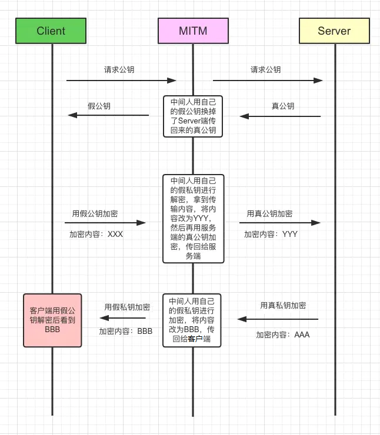
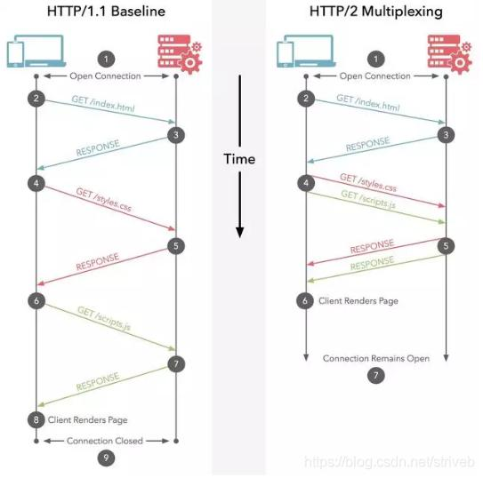

HTTP
===

<!-- 目录开始 -->
## <a id="one"></a>一 目录

| 目录 |
| --- |
| [一 目录](#one) |
| [二 前言](#two) |
| [三 HTTP 发展史](#three) |
| &emsp;[3.1 HTTP/0.9](#three-one) |
| &emsp;[3.2 HTTP/1.0](#three-two) |
| &emsp;[3.3 HTTP/1.1](#three-three) |
| &emsp;[3.4 HTTP/2.0](#three-four) |
| &emsp;[3.5 HTTP/3.0](#three-five) |
| [四 HTTP](#four) |
| &emsp;[4.1 请求方法](#four-one) |
| &emsp;[4.2 优缺点](#four-two) |
| &emsp;[4.3 GET 和 POST 的区别](#four-three) |
| &emsp;&emsp;[4.3.1 【误】GET 请求传参长度有限制](#four-three-one) |
| &emsp;&emsp;[4.3.2 【误】POST 方法比 GET 方法安全](#four-three-two) |
| &emsp;[4.4 keep-alive](#four-four) |
| &emsp;[4.5 HTTP 和 TCP 区别](#four-five) |
| [五 HTTP 状态码](#five) |
| &emsp;[5.1 1XX](#five-one) |
| &emsp;[5.2 2XX](#five-two) |
| &emsp;[5.3 3XX](#five-three) |
| &emsp;[5.4 4XX](#five-four) |
| &emsp;[5.5 5XX](#five-five) |
| [六 解决通讯安全问题](#six) |
| &emsp;[6.1 对称加密](#six-one) |
| &emsp;[6.2 非对称加密](#six-two) |
| &emsp;[6.3 对称加密 + 非对称加密](#six-three) |
| &emsp;[6.4 第三方认证](#six-four) |
| &emsp;[6.5 第三方认证安全性](#six-five) |
| [七 HTTPS](#seven) |
| &emsp;[7.1 工作原理](#seven-one) |
| &emsp;[7.2 优点](#seven-two) |
| &emsp;[7.3 缺点](#seven-three) |
| &emsp;[7.4 HTTP 和 HTTPS 对比](#seven-four) |
| [八 HTTP/2](#eight) |
| &emsp;[8.1 头部压缩](#eight-one) |
| &emsp;[8.2 多路复用](#eight-two) |
| [九 题外话：MD5](#night) |
<!-- 目录结束 -->

## <a id="two"></a>二 前言

> [返回目录](#one)

`HTTP` 有时候面试官也会问到，简单的诸如 `HTTP` 状态码、`GET` 和 `POST` 区别。

这里会将 `HTTP` 相关知识点整理过来。

同时，因为是网上查找的资料，未免会有疏漏、错误，欢迎指正。

又因为 **jsliang** 比较懒，有些图是从一些优秀的参考文章中复制的，如果侵权，立马删除并重新绘制，感谢支持。

## <a id="three"></a>三 HTTP 发展史

> [返回目录](#one)

### <a id="three-one"></a>3.1 HTTP/0.9

> [返回目录](#one)

传输体积很小的文件，没有 `HTTP` 请求头和请求体，服务器也不返回头信息。

**jsliang** 简述：

`HTTP/0.9` 并没有考虑太过复杂的内容，仅仅是用来传输体积很小的文件。

### <a id="three-two"></a>3.2 HTTP/1.0

> [返回目录](#one)

核心诉求是支持多种类型的文件下载。加入了请求头和响应头支持多种不同类型的数据。以及状态码、`Cache` 机制、用户代理等。

**jsliang** 简述：

1. 应对 `HTTP/0.9` 出现的问题，进行了支持多类型文件下载等内容的优化。
2. `HTTP/1.0` 定义了三种请求方法：`GET`，`POST` 和 `HEAD` 方法。

### <a id="three-three"></a>3.3 HTTP/1.1

> [返回目录](#one)

1. 改进了 `HTTP/1.0` 版本每次 `HTTP` 通信都需要建立 `TCP` 连接、传输 `HTTP` 数据再断开 `TCP` 连接的尴尬局面，支持持续连接。只要浏览器或者服务器没有明确断开连接，那么该 `TCP` 连接会一直保持（默认开启 `keep-alive`）。
2. 如果 `TCP` 通道中某个请求因为某些原因没有及时返回，会阻塞后面所有请求（队头阻塞），所以 `HTTP/1.1` 通过管线化来解决队头阻塞的问题。
3. `HTTP/1.0` 每个域名绑定唯一 `IP` 地址，一个服务器只能支持一个域名。`HTTP/1.1` 请求头增加 `Host` 字段，表示当前域名地址，服务器可以根据不同的 `Host` 值做不同的处理。这样一台物理主机就可以绑定多个虚拟主机，每个虚拟主机都有自己单独的域名。
4. `HTTP/1.0` 需要在响应头设置完整的数据大小来接收数据，但是随着服务器端发展，很多页面动态生成，不知道传输数据的最终大小。`HTTP/1.1` 引入 `Chunk transfer` 机制来解决这个问题，服务器将数据分割成任意大小的数据块，每个数据块发送时附带上个数据块的长度，最后使用一个零长度的块作为发送数据完成的标志，从而支持了动态内容。
5. 客户端 `Cookie`、安全机制。

**jsliang** 简述：

* `HTTP/1.1` 默认开启 `Connection: keep-alive`，让一个 `TCP` 连接能重复发送/接收多次 `HTTP` 请求。
* `HTTP/1.1` 新增了六种请求方法：`OPTIONS`、`PUT`、`PATCH`、`DELETE`、`TRACE` 和 `CONNECT` 方法。

### <a id="three-four"></a>3.4 HTTP/2.0

> [返回目录](#one)

1. 一个域名只使用一个 `TCP` 长连接和消除队头阻塞问题
2. 一旦一个 `TCP` 连接建立之后，就进入了发送数据状态，刚开始 `TCP` 协议会采用一个非常慢的速度去发送数据，然后慢慢加快发送数据的速度，直到发送数据的速度达到一个理想状态，我们把这个过程称为慢启动。`HTTP/2.0` 实现了一个域名只使用一个 `TCP` 长连接来传输数据，这样整个页面资源的下载过程只需要一次慢启动，同时也避免了多个 `TCP` 连接竞争带宽所带来的问题。
3. 队头阻塞的问题，等待请求完成后才能去请求下一个资源，这种方式无疑是最慢的，所以 `HTTP/2` 需要实现资源的并行请求，也就是任何时候都可以将请求发送给服务器，而并不需要等待其他请求的完成，然后服务器也可以随时返回处理好的请求资源给浏览器。

**jsliang** 简述：

1. **头部压缩**：`HTTP/2` 压缩消息头，减少了传输数据的大小
2. **多路复用**：即多个请求都通过一个 `TCP` 连接并发地完成
3. **服务器推送**：服务端能够主动把资源推送给客户端

### <a id="three-five"></a>3.5 HTTP/3.0

> [返回目录](#one)

**jsliang** 简述：

1. 实现了类似 `TCP` 的流量控制、传输可靠性的功能。
2. 集成了 `TLS` 加密功能。
3. 实现了 `HTTP/2` 中的多路复用功能。
4. 实现了快速握手功能。

## <a id="four"></a>四 HTTP

> [返回目录](#one)

Web 使用一种名为 `HTTP`（`HyperText Transfer Protocol`，超文本传输协议）的协议作为规范，完成从客户端到服务器等一系列运作流程。而协议是指规则的约定。可以说，Web 是建立在 `HTTP` 协议上通信的。

`HTTP` 最初的目的是为了让研究者共享知识信息，所以它的主要作用就是文档传输，它是一种用于传输文档的协议。

### <a id="four-one"></a>4.1 请求方法

> [返回目录](#one)

* **GET**：获取资源
* **HEAD**：获取资源的元信息
* **POST**：提交/上传 数据
* **PUT**：修改数据
* **DELETE**：删除资源（几乎用不到）
* **CONNECT**：建立连接渠道，用于代理服务器
* **OPTIONS**：列出可对资源实施的请求方法，用来跨域请求
* **TRACE**：追踪请求-响应的传输路径

### <a id="four-two"></a>4.2 优缺点

> [返回目录](#one)

优点：

1. **灵活可扩展**，主要体现在两个方面。一个是**语义上的自由**，只规定了基本格式，比如空格分隔单词，换行分隔字段，其他的各个部分都没有严格的语法限制。另一个是**传输形式的多样性**，不仅仅可以传输文本，还能传输图片、视频等任意数据，非常方便。
2. **可靠传输**。`HTTP` 基于 `TCP/IP`，因此把这一特性继承了下来。这属于 `TCP` 的特性，不具体介绍了。
3. **请求-应答**。也就是一发一收、有来有回，当然这个请求方和应答方不单单指客户端和服务器之间，如果某台服务器作为代理来连接后端的服务端，那么这台服务器也会扮演请求方的角色。
4. **无状态**。这里的状态是指通信过程的上下文信息，而每次 `HTTP` 请求都是独立、无关的，默认不需要保留状态信息。

缺点：

* **无状态**。在需要长连接的场景中，需要保存大量的上下文信息，以免传输大量重复的信息，那么这时候无状态就是 `HTTP` 的缺点了。
* **明文传输**。协议里的报文（主要指的是头部）不使用二进制数据，而是文本形式。
* **队头阻塞问题**。当 `HTTP` 开启长连接时，共用一个 `TCP` 连接，同一时刻只能处理一个请求，那么当前请求耗时过长的情况下，其它的请求只能处于阻塞状态。

### <a id="four-three"></a>4.3 GET 和 POST 的区别

> [返回目录](#one)

`GET` 和 `POST` 方法没有实质区别，只是报文格式不同。

`GET` 和 `POST` 只是 `HTTP` 协议中两种请求方式，而 `HTTP` 协议是基于 `TCP/IP` 的应用层协议。

无论 `GET` 还是 `POST`，用的都是同一个传输层协议，所以在传输上，没有区别。

* `GET` 获取资源；`POST` 提交/上传 数据。
* `GET` 请求长度在浏览器中有限制，而 `POST` 并没有。
* `GET` 请求会被浏览器主动保留下来（历史记录），而 `POST` 默认不会。

#### <a id="four-three-one"></a>4.3.1 【误】GET 请求传参长度有限制

> [返回目录](#one)

【误】我们经常说 `GET` 请求参数的大小存在限制，而 `POST` 请求的参数大小是无限制的。

其实这是有问题的，实际上 `HTTP` 协议从来没规定 `GET/POST` 的请求长度限制是多少。

对 `GET` 请求参数的限制来源于浏览器或者 `Web` 服务器，是它们限制了这个长度。

不同的浏览器和 `Web` 服务器，限制的最大长度不一样。

#### <a id="four-three-two"></a>4.3.2 【误】POST 方法比 GET 方法安全

> [返回目录](#one)

【误】`POST` 比 `GET` 安全，是因为数据在地址栏 `URL` 看不见。

从传输角度来说，都是 `HTTP` 在网络上的明文传输，可以通过抓包工具完整获取的。

如果想安全，那就用 `HTTPS` 吧。

### <a id="four-four"></a>4.4 keep-alive

> [返回目录](#one)

`HTTP` 的 `keep-alive` 也称为 `HTTP` 长连接。

它通过重用一个 `TCP` 连接来发送/接收多个 `HTTP` 请求，来减少创建/关闭多个 `TCP` 连接的开销。

在 `HTTP/1.0` 协议中，如果请求头中包含：

```
Connection: keep-alive
```

则代表开启 `keep-alive`，而服务端的返回报文头中，也会包含相同的内容。

在 `HTTP/1.1` 协议中，默认开启 `keep-alive`，除非显式地关闭它：

```
Connection: close
```

当然，除此之外我们也可以设置断开的时间等：

```js
Keep-Alive: timeout=5, max=100
```

这个就表示这个 `TCP` 通道可以保持 `5` 秒，`max=100` 表示这个长连接最多接收 `100` 次请求就断开。

### <a id="four-five"></a>4.5 HTTP 和 TCP 区别

> [返回目录](#one)

HTTP 是应用层协议，定义的是传输数据内容的规范；而 TCP 是底层通讯协议，定义的是数据传输和连接方式的规范。

HTTP 协议中的数据是利用 TCP 协议传输的，所以支持 HTTP 的也一定支持 TCP。

## <a id="five"></a>五 HTTP 状态码

> [返回目录](#one)

HTTP 状态码为 3 位数，被归为 5 类：

* **1XX**：表示目前是协议处理的中间状态，还需要后续操作。
* **2XX**：表示成功状态。
* **3XX**：重定向状态，资源位置发生变动，需要重新请求。
* **4XX**：请求报文有误。
* **5XX**：服务器端发生错误。

### <a id="five-one"></a>5.1 1XX

> [返回目录](#one)

* **101 Switching Protocols**：在 HTTP 升级为 `WebSocket` 的时候，如果服务器同意变更，就会发送状态码为 101。

### <a id="five-two"></a>5.2 2XX

> [返回目录](#one)

* **200 OK**：请求成功状态码，响应体中含有数据。
* **204 No Content**：含义同 200，但是响应报文不含实体的主体部分。
* **206 Partial Content**：表示部分内容请求成功。使用场景为 HTTP 分块下载和断点续传，当然也会带上相应的响应头字段 `Content-Range`。

### <a id="five-three"></a>5.3 3XX

> [返回目录](#one)

* **301 Move Permanently**：永久重定向。HTTP 升级 HTTPS，之前站点再也不用，那就是 301。
* **302 Found**：临时重定向。当前站点暂时不可用，那就是 302，后续可能换回来。
* **304 Not Modified**：当命中协商缓存时会返回这个状态码。

### <a id="five-four"></a>5.4 4XX

> [返回目录](#one)

* **400 Bad Request**：请求无效。通常为前后端数据格式不一致或者其他原因。
* **401 Bad Request**：当前请求需要用户验证。
* **403 Forbidden**：服务器已经得到请求，但是拒绝执行，比如没权限、法律禁止等。
* **404 Not Found**：资源未找到，服务器不存在对应的资源。

### <a id="five-five"></a>5.5 5XX

> [返回目录](#one)

* **500 Internal Server Error**：服务器报错，有些时候可以在 Response 看到后端 PHP 等技术的报错信息等。
* **502 Bad Gateway**：服务器正常，但是访问出错。
* **503 Service Unavailable**：服务器繁忙或者停机维护，暂时无法处理请求。

## <a id="six"></a>六 解决通讯安全问题

> [返回目录](#one)

### <a id="six-one"></a>6.1 对称加密

> [返回目录](#one)

**对称加密** 可以理解为对原始数据的可逆变换。比如 `Hello` 可以变换成 `Ifmmp`，规则就是每个字母变成它在字母表上的后一个字母，这里的秘钥就是 `1`，另一方拿到 `Ifmmp` 就可以还原成原来的信息 `Hello` 了。

引入对称加密，HTTPS 握手流程多加两步：

* 客户端：你好，我需要发起 HTTPS 请求
* 服务器：你好，你的秘钥是 1

但是网络是不安全的啊，如果对称秘钥在发送的时候就被拦截了，发送的信息就可能被中间人窥视和篡改。

### <a id="six-two"></a>6.2 非对称加密

> [返回目录](#one)

**非对称加密** 有两个秘钥：一个公钥、一个私钥。

> 公钥和私钥成对出现，每个用户对应的那套公钥和私钥是不同的。

服务器留着不对外公布的私钥，然后将公钥告诉所有人知道。

即公钥加密的内容只有私钥可以解密（服务器保留隐私），私钥加密的内容公钥可以解密（大众吃瓜权）。

* 客户端：你好，我需要发起 `HTTPS` 请求
* 服务端：（生成公钥和私钥），你好，给你公钥 1
* 客户端：你好，经公钥加密后我要告诉你的信息是 `XXX`
* 服务端：通过私钥解密，得到数据 `YYY`。下次再发送数据的话还是私钥加密后再发送。

因为客户端和服务器使用的是两个不同的秘钥，所以这种算法叫做非对称加密。

当然，结果还是容易被中间人攻击：



> 一般来说对称加密比非对称加密快，对服务器的运算压力小得多。

### <a id="six-three"></a>6.3 对称加密 + 非对称加密

> [返回目录](#one)

使用对称密钥的好处是解密的效率比较快，坏处是客户端的对称加密方法被知道了，服务端的也会被知道了。

而使用非对称密钥的好处是可以使得传输的内容不能被破解，但是坏处是非对称加密耗时比较多。

那我们就将对称加密与非对称加密结合起来，充分利用两者各自的优势。

在交换密钥环节使用非对称加密方式，之后的建立通信交换报文阶段则使用对称加密方式。

1. 客户端：发送密文的一方使用对方的公钥进行加密处理，形成 “对称的秘钥”
2. 服务端：用自己的私钥解密拿到 “对称的秘钥”，之后通讯用 “对称的秘钥” 进行加密，并发送给客户端
3. 通讯过程：确保交换的密钥是安全的前提下，使用对称加密方式进行通信

简单来说：

1. 服务器将公钥 `key2` 发送给客户端
2. 客户端希望大家用 `key3` 作为对称秘钥，所以将包含 `key3` 的报文，用 `key2` 进行加密后，发送给服务器
3. 服务器接收到到客户端加密后的报文，用私钥 `key1` 进行解密，得到 `key3` 的对称秘钥
4. 后续双方都使用 `key3` 对发送/接收的报文进行加密/解密

`HTTPS` 就是采用这种对称加密和非对称加密两者并用的混合加密机制。

但是，这种混合加密还是不能够保证数据的完整性和安全，在交换密钥的过程（数据稳定通讯之前）也是可能被替换的，所以要更加完美，还得需要数字签名（第三方认证）。

### <a id="six-four"></a>6.4 第三方认证

> [返回目录](#one)

公钥被掉包，是因为客户端无法分辨传回公钥的到底是中间人，还是服务器，这也是密码学中的身份验证问题。

在 `HTTPS` 中，为了解决无法验证公钥正确性的问题，使用数字证书认证机构（CA）及其颁发的数字证书来解决这个问题。


这里假设加密方式是 MD5，将网站的信息加密后通过第三方机构的私钥再次进行加密，生成数字签名。

> 用 MD5 对网站信息进行加密，得到的内容叫消息摘要

* **数字证书 = 网站信息 + 数字签名**

假如中间人拦截后把服务器的公钥替换为自己的公钥，因为数字签名的存在，会导致客户端验证签名不匹配，这样就防止了中间人替换公钥的问题。


浏览器安装后会内置一些权威第三方认证机构的公钥，比如 `VeriSign`、`Symantec` 以及 `GlobalSign` 等等。

验证签名的时候直接就从本地拿到相应第三方机构的公钥，对私钥加密后的数字签名进行解密得到真正的签名，然后客户端利用签名生成规则进行签名生成，看两个签名是否匹配，如果匹配认证通过，不匹配则获取证书失败。

为了更加容易理解，最后的最后再进行梳理：

1. **CA 业务流程**：服务器向 CA 提出公钥认证的申请，申请注册自己的公钥。CA 在判明服务器的身份后，会对公钥做数字签名，然后用 CA 自己的私钥加密这份数字证书。**数字证书 = 网站信息 + 数字签名**
2. **客户端收到信息**：服务器和客户端进行联系的时候，会将自身的证书和公钥传送给客户端。客户端使用 CA 的公钥，对证书进行解密，获取数字签名 A，然后根据 CA 的签名生成规则，进行签名生成，得到数字签名 B。进一步比对两者（A 和 B），如果不匹配，请求失败，否则成功。
3. **客户端发送信息**：这个环节跟混合加密（对称加密 + 非对称加密）的后续传输环节一致，即：客户端生成随机数，然后通过公钥进行加密，将加密后的数据发送给服务器，服务器通过私钥进行解密，然后双方用随机数对应的对称加密进行数据交流。
4. **保证安全**：操作系统和浏览器会维护一个权威第三方认证机构的列表（包括他们的公钥）。

其实这个梳理包含了后面的 HTTPS 工作原理了，所以小伙伴顺着继续往下看吧~

### <a id="six-five"></a>6.5 第三方认证安全性

> [返回目录](#one)

* 中间人可能篡改证书吗？

假设中间人篡改了服务器发送给客户端的证书，由于他没有 CA 的私钥，所以无法得到加密后签名，无法篡改相应的签名。

浏览器收到这个证书后，使用 CA 的公钥，对证书进行解密，获取数字签名 A，然后根据 CA 的签名生成规则，进行签名生成，得到数字签名 B。进一步比对两者（A 和 B），如果不匹配，请求失败。

这样子就终止了向服务器传输信息。

* 中间人可能将证书掉包吗？

如果中间人设置另一个网站，也拿到了 CA 机构认证的证书，拦截了原本服务器的发送，将自己的证书发送给客户端，可以成功吗？

答案也是否的。因为证书中包含了原本服务器对应的网站信息（域名等），浏览器将证书中的域名和自己请求的域名比对一下，就知道有没有被掉包了。

## <a id="seven"></a>七 HTTPS

> [返回目录](#one)

谈到 `HTTPS`, 就不得不谈到与之相对的 `HTTP`。

`HTTP` 的特性是明文传输，因此在传输的每一个环节，数据都有可能被第三方窃取或者篡改。

具体来说，`HTTP` 数据经过 `TCP` 层，然后经过 `WIFI` 路由器、运营商和目标服务器，这些环节中都可能被中间人拿到数据并进行篡改，也就是我们常说的中间人攻击。

为了防范这样一类攻击，我们不得已要引入新的加密方案，即 `HTTPS`。

简单来说 HTTPS 协议是由 HTTP 和 SSL 协议构建的可进行加密传输和身份认证的网络协议，比 HTTP 协议的安全性更高。

最后一个字母 `S` 指的是 `SSL/TLS` 协议，它位于 `HTTP` 协议与 `TCP/IP` 协议中间。

### <a id="seven-one"></a>7.1 工作原理

> [返回目录](#one)

1. 浏览器请求 `URL`，找到服务器，向服务器发送请求。服务器将自己的证书（包含服务器公钥）、对称加密算法种类以及其他相关信息返回给浏览器。
2. 浏览器检查 `CA` 证书是否可依赖，确认证书有效。
3. 如果不是，给服务器发警告，询问是否可以继续使用。
4. 如果是，浏览器使用公钥加密一个随机对称秘钥，包含加密的 `URL` 一起发送给服务器。
5. 服务器用自己的私钥解密浏览器发送的钥匙，然后用这把对称加密的钥匙给浏览器请求的 `URL` 连接解密。
6. 服务器用浏览器发送的对称钥匙给请求的网页加密，浏览器使用相同的钥匙就可以解密网页。


### <a id="seven-two"></a>7.2 优点

> [返回目录](#one)

* 使用 `HTTPS` 协议可认证用户和服务器，确保数据发送到正确的客户机和服务器。
* `HTTPS` 协议是由 `SSL + HTTP` 协议构建的可进行加密传输、身份认证的网络协议，要比 `HTTP` 协议安全，可防止数据在传输过程中不被窃取、改变，确保数据的完整性。
* `HTTPS` 是现行架构下最安全的解决方案，虽然不是绝对安全，但它大幅增加了中间人攻击的成本。
* 谷歌曾在 2014 年 8 月份调整搜索引擎算法，并称 “比起同等 `HTTP` 网站，采用 `HTTPS` 加密的网站在搜索结果中的排名将会更高”。

### <a id="seven-three"></a>7.3 缺点

> [返回目录](#one)

* `HTTPS` 握手阶段比较费时，会使页面加载时间延长 `50%`，增加 `10%~20%` 的耗电。
* `HTTPS` 缓存不如 `HTTP` 高效，会增加数据开销。
* `SSL` 证书也需要钱，功能越强大的证书费用越高。
* `SSL` 证书需要绑定 `IP`，不能在同一个 `IP` 上绑定多个域名，IPV4 资源支持不了这种消耗。

### <a id="seven-four"></a>7.4 HTTP 和 HTTPS 对比

> [返回目录](#one)

* **概念对比**。`HTTP` 是超文本传输协议，信息是明文传输，`HTTPS` 则是具有安全性的 `SSL` 加密传输协议。
* **费用对比**。`HTTPS` 协议需要 `CA` 证书，费用较高。
* **连接方式和端口**。使用不同的连接方式，端口也不同，一般而言，`HTTP` 协议的端口为 `80`，`HTTPS` 的端口为 `443`。
* **安全性对比**。`HTTP` 的连接很简单，是无状态的；`HTTPS` 协议是由 `SSL + HTTP` 协议构建的可进行加密传输、身份认证的网络协议，比 `HTTP` 协议安全。

## <a id="eight"></a>八 HTTP/2

> [返回目录](#one)

由于 `HTTPS` 在安全方面已经做的非常好了，`HTTP` 改进的关注点放在了性能方面。对于 `HTTP/2` 而言，它对于性能的提升主要在于以下几点:

* **头部压缩**：`HTTP/2` 压缩消息头，减少了传输数据的大小
* **多路复用**：即多个请求都通过一个 TCP 连接实现并行，而非有序并阻塞的
* **二进制分帧**：`HTTP/2` 采用二进制格式而非文本格式

当然还有一些颠覆性的功能实现:

* **服务器推送**：服务端能够主动把资源推送给客户端
* **请求优先级**设置

### <a id="eight-one"></a>8.1 头部压缩

> [返回目录](#one)


在 `HTTP/1.1` 及之前的时代，请求体一般会有响应的压缩编码过程，通过 `Content-Encoding` 头部字段来指定。

但是，当请求字段非常复杂的时候，尤其对于 `GET` 请求，请求报文几乎全是请求头，这个时候还是存在非常大的优化空间的。

`HTTP/2` 针对头部字段，也采用了对应的压缩算法——HPACK，对请求头进行压缩。

### <a id="eight-two"></a>8.2 多路复用和二进制分帧

> [返回目录](#one)

  
  

`HTTP` 队头阻塞的问题，其根本原因在于 `HTTP` 基于请求-响应的模型，在同一个 `TCP` 长连接中，前面的请求没有得到响应，后面的请求就会被阻塞。

`HTTP/2` 便从 `HTTP` 协议本身解决了队头阻塞问题，即多个请求都通过一个 TCP 连接并发地完成。

## <a id="night"></a>九 题外话：MD5

> [返回目录](#one)

好歹也是上大学的时候参与过网络攻防课程的人，看到对称加密、非对称加密的时候，就想起了之前用过的一种算法：`MD5`。

在 JavaScript 中可以通过引用类库来做到 `MD5` 加密：

```html
<script src="https://cdn.bootcss.com/blueimp-md5/2.10.0/js/md5.min.js"></script>
```

然后直接可以使用：

```html
<script>
  window.onload = function () {
    const password = md5('jsliang');
    console.log(password); // efadd62708ee4cc610691cd1bb9cf381
  };
</script>
```

然后，后端在做数据库安全的时候，可能会将用户传入的明文密码进行 `md5` 加密，再将加密后得到的哈希字符串存入到数据库中。

在用户登录的时候，获取用户的密码，进行 `md5` 加密后与数据库的内容进行比对，比对结果一致才运行用户登录。

这种方式下，如果数据库被盗取，用户实际上也无法比较难获取到用户的实际密码。

当然，网络攻防嘛，比较有意思的是：

* 用户如果是直接传输密码，要知道 `HTTP` 是明文的，所以黑客通过抓包工具 `Wireshark` 等查一下就知道了。
* 用户如果是 `md5` 加密后，再进行传输给后端，其实黑客也可以拦截请求，伪造客户端，实现中间人攻击。

道高一尺魔高一丈？

不，后面就有了 `HTTP` 升级 `HTTPS` 的需求。

当然，`HTTPS` 绝对安全？也不一定。不过大学期间老师教学的是简单级别的网络安全攻防，现代化的内容 **jsliang** 是学不到的~

另外，值得一提的是，`MD5` 加密本质上是一种散列函数（也叫哈希函数），但是相比较于单向密码体质，`MD5` 是从明文到密文的不可逆映射，只有加密过程没有解密过程。

但是，它还是有缺陷的：

* 哈希映射意味着有可能两个不同的内容映射到同一个哈希值
* `MD5` 曾经被大佬通过碰撞解密算法破解过，目前很多解密也会通过暴力破解方式破解（`MD5` 加密方法是公开的）

那么这个题外话就讲到这里啦，只是看到对称加密、非对称加密，突然话痨想唠嗑下而已。

## <a id="ten"></a>十 参考文献*
* [x] [谈谈HTTP协议的流程——知乎](https://zhuanlan.zhihu.com/p/29875810)
* [x] [HTTP详解——知乎](https://zhuanlan.zhihu.com/p/29907174)
* [x] [HTTP与HTTPS的联系与区别——知乎](https://zhuanlan.zhihu.com/p/29878510)
* [x] [HTTP1.0和HTTP2.0的区别，以及HTTP和HTTPS的区别](https://blog.csdn.net/striveb/article/details/84230923)
* [x] [HTTP消息头（HTTP headers）－常用的HTTP请求头与响应头](https://itbilu.com/other/relate/EJ3fKUwUx.html)
---

> jsliang 的文档库由 [梁峻荣](https://github.com/LiangJunrong) 采用 [知识共享 署名-非商业性使用-相同方式共享 4.0 国际 许可协议](http://creativecommons.org/licenses/by-nc-sa/4.0/) 进行许可。<br/>基于 [https://github.com/LiangJunrong/document-library](https://github.com/LiangJunrong/document-library) 上的作品创作。<br/>本许可协议授权之外的使用权限可以从 [https://creativecommons.org/licenses/by-nc-sa/2.5/cn/](https://creativecommons.org/licenses/by-nc-sa/2.5/cn/) 处获得。
