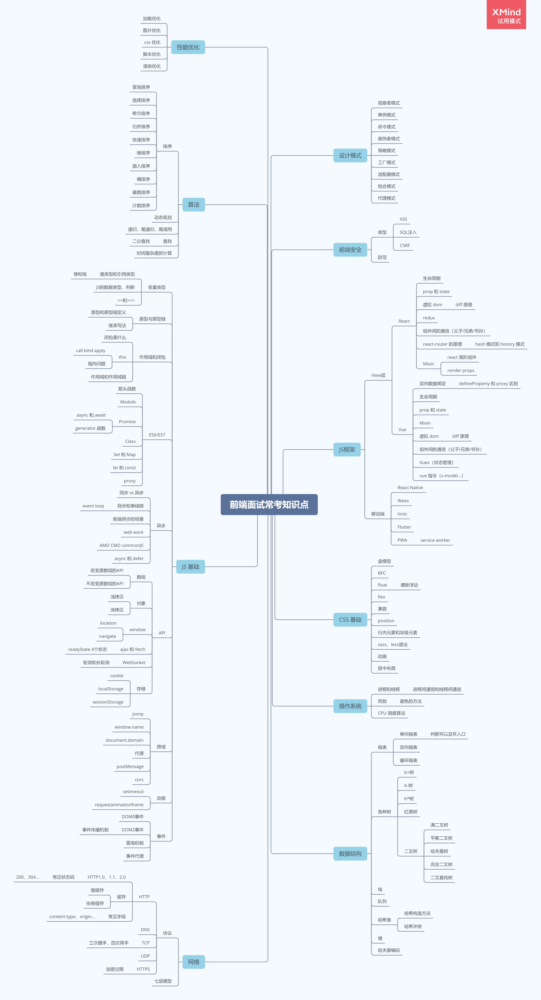
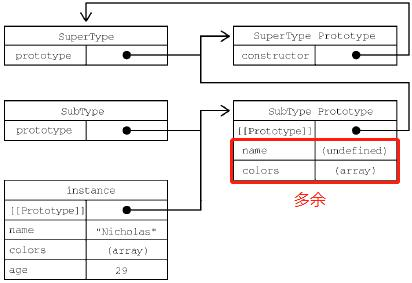
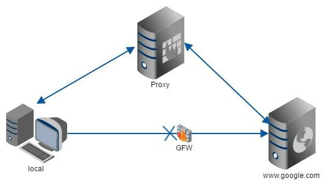
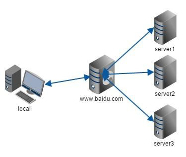

面试题库
---

* [x] [23:58，47:11，面试干货视频(hr 面以及技术面)](https://www.bilibili.com/video/BV16441137QB?from=search&seid=16025366212027778585)  
* [x] [面试题](https://zhuanlan.zhihu.com/p/101986056)  

  

## 一 JS 基础
**知识点**  
- [变量类型]
	- [值类型和引用类型]
		- [堆和栈]
	- [JS的数据类型、判断](#1.1)
	- [==和===]
- [原型与原型链]
	- [原型和原型链定义](#1.6)
	- [继承写法](#1.7)
- [作用域和闭包]
	- [闭包是什么](#1.4)
	- [this]
		- [call bind apply](#1.10)
		- [指向问题](#1.9)
	- [作用域和作用域链](#1.3)
- [ES6/ES7]
	- [箭头函数]
	- [Module]
	- [Promise]
		- [async 和 await]
		- [generator 函数]
	- [Class]
	- [Set 和 Map]
	- [let 和 const]
	- [proxy]
- [异步]
	- [同步 vs 异步]
	- [异步和单线程]
		- [event loop](#1.13)
	- [前端异步的场景]
	- [web work]
	- [AMD CMD commonJS]
	- [async 和 defer]
- [API]
	- [数组](#1.16)
		- [API(改变原数组/不改变原数组)](#1.12)
		- [数组去重](#1.11)
	- [对象](#1.5)
		- [浅拷贝 vs 深拷贝](#1.2)
		- [new](#1.8)
	- [window]
		- [location]
		- [navigate]
	- [ajax 和 fetch]
		- [readyState 4个状态]
	- [WebSocket]
		- [轮询和长轮询]
	- [存储]
		- [cookie]
		- [localStorage]
		- [sessionStorage]
- [跨域](#1.15)
	- [jsonp](#1.14)
	- [cors](#1.17)
	- [postMessage](#1.18)
	- [WebSocket](#1.19)
	- [代理](#1.20)
	- [iframe](#1.21)
- [动画]
	- [setimeout]
	- [requestanimationframe]
- [事件]
	- [DOM0事件]
	- [DOM2事件]
		- [事件传播机制]
	- [冒泡机制]
	- [事件代理]


### <a id="1.1"></a>1.1 数据类型及判断  
**数据类型**  
  
**判断类型**  
  
- `typeof(variable)`  
```js
typeof NaN; // number
typeof 10n; // bigint
typeof Symbol(); // symbol
```
- `variable instanceof Array`  
`instanceof` 就是原型链的查找过程。`instanceof` 能判断的有：  
 - `Function`  
 - `Array`  
 - `Date`  
 - `RegExp`  
 - `Error`  
- `variable.constructor == Array`  
`constructor` 能判断的有：除了 `undefined` 和 `null`  
问题：`constructor` 的属性是可以被修改的，可能导致检测出的结果不正确。  
- `Object.prototype.toString.call(variable)` 通用  
将它的结果 `result.slice(8, -1)`  
- `Array.isArray(variable)` 针对 Array 类型  

### <a id="1.2"></a>1.2 深浅拷贝  
**浅拷贝**  
```js
Object.assign() //es6
```
栗子  
```js
var obj={aa:1,b:{item:'45'}};
var newObj=Object.assign({},obj);
obj.aa=2;
obj.b.item='kk';
console.log(newObj.aa); //1
console.log(newObj.b.item); //kk
```
**深拷贝**  
原生API  
```js
JSON.parse(JSON.stringify(obj))
```
**常见问题**  
1. 什么是深拷贝？什么是浅拷贝？  
浅拷贝：Object.assign 会合并对象生成一个新对象。如果原对象的属性是普通类型改变之后新对象不会改变，如果是引用类型改变后新对象也会改变，所以 Object.assign 实际上还是浅拷贝。  
2. 手撕代码：深拷贝  
```js
function cloneDeep(source) {
  if (!isObject(source)) return source; // 非对象返回自身
  var target = Array.isArray(source) ? [] : {};
  for (var key in source) {
    if (source.hasOwnProperty(i)) {
      if (isObject(source[key])) {
        target[key] = cloneDeep(source[key]); // 注意这里
      } else {
        target[key] = source[key];
      }
    }
  }
  return target;
}
function isObject(obj) {
  return typeof obj === 'object' && obj != null;
}
```

### <a id="1.3"></a>1.3 变量声明提升、作用域与作用域链  
**变量声明提升**  
- 在JavaScript 中，函数声明（function aa(){}）与变量声明（var）被JavaScript 引擎隐式地提升到当前作用域的顶部。  
- 函数声明的优先级高于变量，如果变量名跟函数名相同且未赋值，则函数声明会覆盖变量声明  
- 声明语句中的赋值部分并不会被提升，只有变量的名称被提升  

**作用域与作用域链**  
- 在JavaScript 中，作用域为function(){}内的区域，称为函数作用域。  
- 函数的嵌套形成作用域的层级关系。  
- 当函数执行时，从当前作用域开始搜，没有找到的变量，会向上层作用域查找，直至全局函数，这就是作用域链。  
- 全局函数无法查看局部函数的内部细节，但局部函数可以查看其上层的函数细节，直至全局细节  

### <a id="1.4"></a>1.4 闭包  
原理：作用域链。  
定义：比函数F 内部有一个函数G，函数G 可以访问到函数F 中的变量，那么函数G 就是闭包。  
```js
function F() {
  let a = 1
  window.G = function() {
    console.log(a)
  }
}
F()
G() // 1
```

### <a id="1.5"></a>1.5 创建对象  
**创建对象的方式**  
1. 对象字面量 `{}`  
2. new 一个构造函数  
3. new 一个内置对象 `new Object()`  
4. `Object.create()`  
```js
var test = Object.create({x:1})
```

**常见问题**  
1. new Object() 、Object.create()、{}，这三种方式创建对象有什么区别  
Object.create(null) 创建的对象是一个空对象，在该对象上没有继承 Object.prototype 原型链上的属性或者方法，例如：toString()，hasOwnProperty()等方法  
2. 如何实现一个类  
构造函数法  
```js
function P(name, age) {
  this.name = name;
  this.age = age;
}
P.prototype.sal = function() {}
var pel = new P("jj", 1);
pel.sal()
```
ES6 语法糖 class  
```js
class Point {
  constructor(x, y) {
    this.x = x;
    this.y = y;
  }
  toString() {
    return '(' + this.x + ', ' + this.y + ')';
  }
}
var point = new Point(2, 3);
```


### <a id="1.6"></a>1.6 原型和原型链  
任何一个类（函数）都有**原型对象**  
函数上有一个 prototype 属性，指向**原型对象**，通过它可以访问原型对象  
函数的实列可以直接访问**原型对象**(因为实列上有 proto 指向构造函数的原型对象)  
原型对象至少有两个属性（constructor，proto）。constructor 指向函数本身，proto 指向**父类原型对象**，形成**原型链**。  

### <a id="1.7"></a>1.7 手撕代码：继承  
**原型链继承**  
问题：实例属性变为原型属性，引用类型在原型中共享会有问题；构造函数传参问题  
**盗用构造函数继承**  
问题：函数不能重用  
**组合继承**(原型链+盗用构造函数)  
问题：父类构造函数调用两次，实例属性变为子类原型属性，浪费空间  
  
```js
function SuperType(name) {
  this.name = name;
  this.colors = ["red", "blue", "green"];
}
SuperType.prototype.sayName = function() {
  console.log(this.name);
};

function SubType(name, age) {
  // 继承属性
  SuperType.call(this, name); // 盗用构造函数继承
  this.age = age;
}
// 继承方法
SubType.prototype = new SuperType(); // 原型链继承
SubType.prototype.constructor = SubType;
SubType.prototype.sayAge = function() {
  console.log(this.age);
};
```
**寄生式组合继承**(原型式继承+盗用构造函数)  
属性放在构造函数中(解决引用类型在原型中共享时出现的问题，以及可以为构造函数传参)，方法放在原型中(函数重用)  
```js
function SuperType(name) {
  this.name = name;
  this.colors = ["red", "blue", "green"];
}
SuperType.prototype.sayName = function() {
  console.log(this.name);
};

function SubType(name, age) {
  SuperType.call(this, name);
  this.age = age;
}
SubType.prototype = object(SuperType.prototype); // 创建对象
SubType.prototype.constructor = SubType; // 增强对象
SubType.prototype.sayAge = function() {
  console.log(this.age);
};

function object(o) {
  function F() {}
  F.prototype = o;
  return new F();
}
```
`SubType.prototype = object(SuperType.prototype);`的替代方法：  
1. `SubType.prototype = {}; SubType.prototype.__proto__ = SuperType.prototype;`(不兼容 IE)
2. `SubType.prototype = Object.create(SuperType.prototype);`(ES5 中的方法)  

**ES6 语法糖：extends 继承**  
```js
class ColorPoint extends Point {
  constructor(x, y, color) {
    super(x, y); // 继承属性
    this.color = color;
  }
  toString() {
    return this.color + ' ' + super.toString(); // 继承方法
  }
}
```

### <a id="1.8"></a>1.8 new  
**new 操作符具体做了什么**  
(1) 在内存中创建一个新对象。  
(2) 这个新对象内部的[[Prototype]]特性被赋值为构造函数的 prototype 属性。  
(3) 构造函数内部的 this 被赋值为这个新对象（即 this 指向新对象）。  
(4) 执行构造函数内部的代码（给新对象添加属性）。  
(5) 如果构造函数返回非空对象，则返回该对象；否则，返回刚创建的新对象。  
**手撕代码：new**  
```js
function myNew(func, ...args) {
  // 1. 判断方法体
  if (typeof func !== 'function') {
    throw '第一个参数必须是方法体';
  }

  // 2. 创建新对象
  const obj = {};

  // 3. 这个对象的 __proto__ 指向 func 这个类的原型对象
  // 即实例可以访问构造函数原型（constructor.prototype）所在原型链上的属性
  obj.__proto__ = func.prototype;

  // 为了兼容 IE 可以让步骤 2 和 步骤 3 合并
  // const obj = Object.create(func.prototype);

  // 4. 通过 apply 绑定 this 执行并且获取运行后的结果
  const funcObj = func.apply(obj, args);
  
  // 5. 如果构造函数返回的结果是引用数据类型，则返回运行后的结果
  // 否则返回新创建的 obj
  const isObject = typeof funcObj === 'object' && funcObj !== null;
  const isFunction = typeof funcObj === 'function';
  return isObject || isFunction ? funcObj : obj;
}
```
测试  
```js
function Person(name) {
  this.name = name;
  return function() { // 测试第 5 点
    console.log('返回引用数据类型');
  };
}
// 测试第 2 点和第 3 点
Person.prototype.sayName = function() {
  console.log(`My name is ${this.name}`);
}
const me = myNew(Person, 'jsliang'); // 测试第 4 点
me.sayName(); // My name is jsliang
console.log(me); // Person {name: 'jsliang'}

// 测试第 1 点
// const you = myNew({ name: 'jsliang' }, 'jsliang'); // 报错：第一个参数必须是方法体
```

### <a id="1.9"></a>1.9 this 对象的理解  
**常见问题**  
1. this指向  
- 通过 new 关键字调用构造函数，this 指向 new 出来的实例对象  
- 在事件中，this 指向触发这个事件的对象  
- IE 下 attachEvent 中的 this 总是指向全局对象 Window  
- 标准函数中 this 指向执行/调用时的上下文  
```js
function foo() {
  console.log(this.a)
}
var a = 1
foo() //1
const obj = {
  a: 2,
  foo
}
obj.foo() //2
const c = new foo() //undefined
```
  - 直接调用 foo (非严格模式下，不管 foo 函数作为全局函数还是闭包)，this 指向 window  
  - 作为对象的方法调用  
    - obj.f1()，this 指向 obj 对象  
    - obj.f2()()，闭包中的 this 指向 window  
    标准函数在调用时会自动创建 this 和 arguments，内部函数不可能直接访问外部函数的这两个变量。  
    (箭头函数不创建这两个变量，可以访问外部包装函数中的这两个变量)  
```js
var obj = {
  f1() {
    return this;
  },
  f2() {
    return function() {
      return this;
    }
  }
}
obj.f1(); // this 指向 obj
obj.f2(); // this 指向 window
```
解决问题：把外部函数的 this 保存到闭包可以访问的另一个变量中  
```js
var obj = {
  f2() {
    let that = this;
    return function() {
      return that;
    }
  }
}
obj.f2(); // that 指向 obj
```
- 箭头函数中 this 指向定义时的上下文  
```js
function a() {
  return () => {
    return () => {
      console.log(this)
    }
  }
}
a()()() //Window
```
箭头函数其实是没有 this 的，箭头函数中的 this 只取决包裹箭头函数的第一个普通函数的 this。  
在这个例子中，因为包裹箭头函数的第一个普通函数是 a，所以此时的 this 是 window。  
另外对箭头函数使用 bind 这类函数是无效的。
- 作为对象方法的标准函数/箭头函数，标准函数中的 this 指向对象；箭头函数中的 this 指向 Window  
```js
var f1 = function() {console.log(this);};
var f2 = () => {console.log(this);};
var obj = {
  f1,
  f2
};
obj.f1(); // {f1: ƒ, f2: ƒ}
obj.f2(); // Window
```
- 作为对象方法的标准函数，this 指向  
```js
var f = function() {};
var obj = {
  f
};
obj.f(); // this 指向 obj
(obj.f)(); // this 指向 obj，因为根据规范，(obj.f) == obj.f
(obj.f = obj.f)(); // this 指向 Window
```

### <a id="1.10"></a>1.10 call bind apply  
**是什么、用途**  
是 Function 对象的内置方法  
改变函数体内部 this 的指向  
bind 方法创建一个新函数，便于稍后调用；apply、call 则是立即调用。  
**用法**  
第一个参数都是 this 要指向的对象  
call、bind 传入参数列表  
apply 传入数组  
**常见问题**  
1. 手撕代码：call bind apply  
call  
```js
Function.prototype.myCall = function(context, ...args) {
  // 默认为全局的 this (这里为 window 对象)
  context = context || globalThis;
  
  // 为对象添加 fn 方法，即调用 myCall 的函数——this
  context.fn = this;

  // fn 必须为函数
  if (typeof fn !== "function") {
    throw new Error("Must accept function");
  }
  
  let result;
  
  // 将结果返回给 result
  if (arr) { // 如果存在参数，则传进去
    result = context.fn(...arr);
  } else { // 否则不传
    result = context.fn();
  }

  // 删除这个变量
  delete context.fn;

  // 返回 result 结果
  return result;
};
```
apply  
```js
Function.prototype.myApply = function(context, arr) {
  // 默认为全局的 this (这里为 window 对象)
  context = context || globalThis;
  
  // 为对象添加 fn 方法，即调用 myApply 的函数——this
  context.fn = this;

  // fn 必须为函数
  if (typeof fn !== "function") {
    throw new Error("Must accept function");
  }
  
  let result;

  // 将结果返回给 result
  if (arr) { // 如果存在参数，则传进去
    result = context.fn(...arr);
  } else { // 否则不传
    result = context.fn();
  }

  // 删除这个变量
  delete context.fn;

  // 返回 result 结果
  return result;
};
```
bind  
ES6 写法  
```js
Function.prototype.myBind = function(context, ...args) {
  // 默认为全局的 this (这里为 window 对象)
  context = context || globalThis;
  
  // 定义 fn 方法，即调用 myBind 的函数——this
  const fn = this;
  
  // fn 必须为函数
  if (typeof fn !== "function") {
    throw new Error("Must accept function");
  }
  
  // 设置返回的一个新方法
  function resultFn (...args2) {
    // 区分是通过 new 还是普通函数调用的
    return fn.apply(
      this instanceof resultFn ? this : context,
      [...args, ...args2]
    );
  }

  // 绑定原型链
  result.prototype = Object.create(fn.prototype);

  // 返回结果
  return resultFn;
};
```

### <a id="1.11"></a>1.11 数组去重  
**题型一**  
[2.1.1 (简单) 剑指 Offer 03. 数组中的重复数字](https://github.com/XingRenEr/Front-end/tree/master/%E6%95%B0%E6%8D%AE%E7%BB%93%E6%9E%84%E4%B8%8E%E7%AE%97%E6%B3%95/Leetcode#two-one-one)  
在一个长度为 n 的数组 nums 里的所有数字都在 0～n-1 的范围内。数组中某些数字是重复的，但不知道有几个数字重复了，也不知道每个数字重复了几次。请找出数组中任意一个重复的数字。  
**题型二**  
```JS
const arr = [1, 1, 2, 3, 3];
// 期望得到：[1, 2, 3]
```
方法一：includes  
```JS
const newArr1 = [];
for (let i = 0; i < arr.length; i++) {
  if (!newArr1.includes(arr[i])) {
    newArr1.push(arr[i]); 
  }
}
console.log('newArr1：', newArr1);
```
方法一：indexOf——与上述方法几乎完全一样，但是语义不如includes好  
```js
const newArr1 = [];
for (let i = 0; i < arr.length; i++) {
  if (newArr1.indexOf(arr[i]) == -1) {
    newArr1.push(arr[i]); 
  }
}
console.log('newArr1：', newArr1);
```
方法二： Set  
```JS
const newArr2 = [...new Set(arr)];
console.log('newArr2：', newArr2);
```
方法三： filter  
```JS
const newArr3 = arr.filter((item, index) => arr.lastIndexOf(item) === index);
console.log('newArr3：', newArr3);
```
方法四：不使用数组API——暴力遍历  
```JS
var newArr4 = [arr[0]];
for (var i = 1; i < arr.length; i++) {
  var repeatflag = false;
  for (var j = 0; j < newArr4.length; j++) {
    if (arr[i] === newArr4[j]) {
      repeatflag = true;
      break;
    }
  }
  if (!repeatflag) {
    newArr4[newArr4.length] = arr[i];
  }
}
console.log('newArr4', newArr4);
```

### <a id="1.12"></a>1.12 数组 API  
  

### <a id="1.13"></a>1.13 Event Loop  
**Event Loop执行过程**  
  
1. 执行一个宏任务（从事件队列中获取；起初 `script` 作为一个宏任务执行）
2. 执行过程中，**同步代码** 直接进入主线程执行栈执行，**异步任务**挂起(不影响执行栈中代码的执行)，等待返回结果后，再进入回调队列；**宏任务** 进入宏任务队列，**微任务** 进入微任务队列。
3. 执行栈中代码执行完毕后，检查微任务列表，有则进入执行栈依次执行，直到全部执行完毕。  
4. 检查渲染，然后浏览器 GUI 线程接管渲染工作。
5. 检查是否有 `Web Worker` 任务，有则执行。
> Web Worker 是运行在后台的 JS，独立于其他脚本，不会影响页面的性能。  
6. JS 线程继续接管，回到步骤 1 开始下一个宏任务，依次循环，直到宏任务和微任务队列为空。

**宏任务**  
* `script` (整体代码)
* `setTimeout`
* `setInterval`
* `I/O`
* `UI Rendering`
* `setImmediate` (仅 Node.js 环境，浏览器环境仅 IE10 支持)
* `requestAnimationFrame` (仅浏览器环境)
* `postMessage`
* `MessageChannel`???

**微任务**  
* `MutationObserver` (仅浏览器环境)
* `Promise.then()/catch()`
* `fetch API` (以 `Promise` 为基础开发的其他技术)
* `process.nextTick` (仅 Node.js 环境)
* `Object.observe` (废弃)
* V8 的垃圾回收过程???

### <a id="1.14"></a>1.14 JSONP  
**是什么 & 实现**  
ajax 请求受同源策略影响，不允许进行跨域请求，而 script 标签 src 属性中的链接却可以访问跨域的 js 脚本。利用这个特性，客户端动态创建 script，请求一个带参网址，服务端返回一段调用某个函数的 js 代码 (不再返回 JSON 格式的数据)，调用本地函数并传参，这样实现了跨域。  
**优点**  
- 不像Ajax请求那样受到同源策略的限制；  
- 兼容性更好，在更加古老的浏览器中都可以运行，不需要XMLHttpRequest或ActiveX的支持；  
- 并且在请求完毕后可以通过调用callback的方式回传结果。  

**缺点**  
- 它只支持GET请求  
- 它只支持跨域HTTP请求这种情况，不能解决不同域的两个页面之间如何进行JavaScript调用的问题 (与postMessage相比)  
- JSONP是一种脚本注入(Script Injection)行为，不安全，可能遭受 `XSS` 攻击  

### <a id="1.15"></a>1.15 跨域  
**常见问题**  
1. 同源策略  
协议、域名、端口都一致，才属于同源。  
2. 跨域导致的问题  
  - Ajax 请求不能发送  
  - 无法获取 DOM 元素并进行操作  
  - 无法读取 Cookie、LocalStorage 和 IndexDB  
3. 浏览器为什么要设置跨域  
  - `DOM` 同源策略。防止一些恶意网站在自己的网站中利用 `iframe` 嵌入正规的网站并迷惑用户，以此来达到窃取用户信息。  
  - `Ajax` 同源策略。不同源的页面不能获取 `Cookie` 且不能发起 `Ajax` 请求，这样在一定程度上防止了 `CSRF` 攻击。
4. jQuery AJAX跨域问题  
其实这是个伪命题，jQuery `$.ajax()` 方法名有误导人之嫌。  
如果设置 `dataType: 'jsonp'`，这个 `$.ajax()` 方法就和 ajax XmlHttpRequest没什么关系了，取而代之的则是 JSONP 协议。

### <a id="1.16"></a>1.16 数组  
**常见问题**  
1. 对象数组按照 sort 属性排序，若 sort 属性相等，则按照 id 排序  
```js
/**
 * 按sort 及id 排序
 * @param {Object} a
 * @param {Object} b
 */
function sortFun(a, b) {
  return a.sort - b.sort == 0 ? a.id - b.id : a.sort - b.sort
};
arr.sort(sortFun) //从小到大排序
```

### <a id="1.17"></a>1.17 CORS  
**是什么**  
`XMLHttpRequest` 或 `Fetch` 请求，加入跨域资源共享（`CORS`）机制 (服务端设置CORS响应头，同时客户端对相应CORS请求头进行配置)，可实现跨域。  
**分类**  
- 简单请求
- 复杂请求

**简单请求**  
- 请求方法  
  - HEAD  
  - GET  
  - POST  
- 请求头  
  - Accept
  - Accept-Language
  - Content-Language
  - Content-Type：只限于三个值`application/x-www-form-urlencoded`、`multipart/form-data`、`text/plain`
- 域 (Origin) 字段  
域包含协议名、地址以及一个可选的端口。  
  - 服务端：`Access-Control-Allow-Origin`，客户端：`Origin`  
  - `Access-Control-Allow-Origin: *`，`Origin: 任意`  
  - `Access-Control-Allow-Origin: http://foo.example`，`Origin: http://foo.example`  

**复杂请求**  
任何不满足上述要求的请求，都是复杂请求。  
复杂请求不止发送一个请求。先发送预请求，服务端返回预响应。  

**与JSONP的比较**  
JSONP只支持GET请求，CORS支持所有类型的HTTP请求。JSONP对老式浏览器的兼容性好。  

### <a id="1.18"></a>1.18 postMessage  
**是什么**  
`postMessage` 是 `HTML5 XMLHttpRequest Level 2` 中的 `API`，且是为数不多可以跨域操作的 `window` 属性之一。  
**应用场景**  
* 页面和其打开的新窗口的数据传递
* 多窗口之间消息传递
* 页面与嵌套的 `iframe` 消息传递
* 上面三个场景的跨域数据传递  

### <a id="1.19"></a>1.19 WebSocket  
`WebSocket` 是 HTML5 的一种双向通信协议，在建立连接之后，`WebSocket` 的 `server` 与 `client` 都能主动向对方发送或接收数据，同时也是跨域的一种解决方案。  

### <a id="1.20"></a>1.20 代理  
**是什么**  
代理服务器，实现数据的转发，分为正向代理和反向代理  
**两者区别**  
代理的对象不一样：正向代理代理的对象是客户端，反向代理代理的对象是服务端  
正向代理隐藏真实客户端，反向代理隐藏真实服务端。  
**正向代理**  
栗子：内推；科学上网  
  
**反向代理**  
栗子：拨打10086客服电话；访问百度主页，www.baidu.com 就是反向代理服务器  
  
**正向代理实现跨域——Node**  
浏览器需要遵循同源策略，而如果是服务器向服务器请求就无需遵循同源策略。  
使用 `Node` 中间件  
**反向代理实现跨域——Nginx**  
优点：最简单的跨域方式。支持所有浏览器，支持 Session，并且不会影响服务器性能。  
实现方式：修改 Nginx 的配置即可，不需要修改任何代码。  

### <a id="1.21"></a>1.21 iframe  
- `window.name + iframe`  
- `location.hash + iframe`  
- `document.domain + iframe`  


* [x] [30分钟学会前端模块化开发](https://www.cnblogs.com/best/p/10076782.html)  

**常见问题**  
2. 箭头函数与普通函数的区别  
3. 手撕代码：Promise  
4. 什么是同步？什么是异步？什么是单线程？  
5. async 和 defer 区别  
7. window.navigate  
用于客户端检测  
9. 手撕代码：原生 Ajax  
10. Ajax 和 Fetch 区别  
11. WebSocket 兼容  
轮询、长轮询  
12. 轮询、长轮询区别、优缺点  
13. cookie、localStorage、sessionStorage 区别、应用场景  
14. 动画是用什么实现的  


## 二 CSS 基础
**知识点**  
- 盒模型
- BFC
- float
	- 请除浮动
- flex
- 兼容
- position(五个属性值)
- 行内元素和块级元素
- sass，less语法
- 动画
- 居中布局

**常见问题**  
1. 考察 BFC 的规则  
2. 清除浮动的原理  
3. 行内元素和块级元素转化  

## 三 JS 框架
**知识点**  
- View层
	- React
		- 生命周期
		- prop 和 state
		- 虚拟 dom
			- diff 原理
		- redux
		- 组件间的通信（父子/兄弟/爷孙）
		- react-router 的原理
			- hash 模式和 history 模式
		- Mixin
			- react 高阶组件
			- render props
	- Vue
		- 双向数据绑定
			- defineProperty 和 proxy 区别
		- 生命周期
		- prop 和 state
		- Mixin
		- 虚拟 dom
			- diff 原理
		- 组件间的通信（父子/兄弟/爷孙）
		- Vuex（状态管理）
		- vue 指令（v-model...）
- 移动端
	- React Native
	- Weex
	- lonic
	- Flutter
	- PWA
		- service worker

**常见问题**  
1. React 生命周期  
一般不考单个组件的生命周期  
eg：父组件中有一个子组件，子组件中又有一个子组件；父组件中还有一个同级的子组件。它们的生命周期是怎么发生的  
2. React redux 是什么，用途  
3. React react-router hash 模式和 history 模式的区别、优缺点  
4. React Mixin 为什么被弃用？替代方法是什么？  
5. React react 高阶组件和渲染 props 的优缺点、应用场景  
6. Vue 实现双向数据绑定有哪几种方法？defineProperty(Vue2) 和 proxy(Vue3) 的区别？为什么要用 proxy 代替 defineProperty？  
7. 移动端框架的实现原理  
8. 移动端 JS 如何与 React Native 进行通信  
9. 移动端框架的优缺点  
10. 移动端 PWA 特性有哪些  
11. 移动端 PWA service worker 的生命周期  

## 四 网络
**知识点**  
- 协议
	- HTTP
		- HTTP1.0、1.1、2.0
			- 常见状态码(知道的越多越好)
				- 200、304...
		- 缓存
			- 强缓存
			- 协商缓存
		- 常见字段
			- content-type、origin...
	- DNS
	- TCP
		- 三次握手、四次挥手
	- UDP
	- HTTPS
		- 加密过程
- 七层模型

**常见问题**  
1. HTTP1.0、1.1、2.0 的区别、新增的字段及作用  
2. TCP、UDP 的区别  
3. HTTP 与 HTTPS 的区别  

## 五 性能优化
**知识点**  
- 加载优化
- 图片优化
- css 优化
- 脚本优化
- 渲染优化


1. 图片优化  
若图片允许使用 WebP 格式，用 WebP 格式代替 JPEG  
2. 脚本优化  
避免重绘、重排  
3. 渲染优化  
用 CSS 的三个属性加速 GPU 渲染  

**常见问题**  

## 六 设计模式
**知识点**  
- 观察者模式  

- 单例模式  

- 命令模式  

- 装饰者模式  

- 策略模式  

- 工厂模式  

- 适配器模式  

- 组合模式  

- 代理模式  


**常见问题**  
1. 你知道的设计模式有哪些  
2. 优缺点  
3. 应用场景  
4. 几种设计模式的比较  
> 结合 1 2 3  
5. 观察者模式手撕代码——Vue 的双向数据绑定  

## 七 前端安全
**知识点**  
- XSS  
- SQL 注入  
- CSRF  

**常见问题**  
1. 你知道前端有什么安全的问题吗？
2. 如何去防范

## 八 操作系统
**知识点**  
- 进程和线程
	- 进程间通信和线程间通信
- 死锁
	- 避免的方法
- CPU 调度算法

**常见问题**  
1. 进程和线程分别是什么、它们的区别  
2. 产生死锁有哪几个条件  
3. CPU 调度算法有哪些  
先到先服务(FCFS)、最短作业优先(SJF)  
4. CPU 调度算法的应用场景、优缺点  


## 九 数据结构
**知识点**  
- 链表
	- 单向链表
		- 判断环以及环入口
	- 双向链表
	- 循环链表
- 各种树
	- b+树
	- b-树
	- b*树
	- 红黑树
	- 二叉树
		- 满二叉树
		- 平衡二叉树
		- 哈夫曼树
		- 完全二叉树
		- 二叉查找树
- 栈
- 队列
- 哈希表
	- 哈希构造方法
	- 哈希冲突
- 堆
- 哈夫曼编码

**常见问题**  
1. 堆的实现、堆的应用  


## 十 算法
**知识点**  
- 排序
	- 冒泡排序
	- 选择排序
	- 希尔排序
	- 归并排序
	- 快速排序
	- 堆排序
	- 插入排序
	- 桶排序
	- 基数排序
	- 计数排序
- 动态规划
- 递归，尾递归，尾调用
- 查找
	- 二分查找
- 时间复杂度的计算


* [x] [十大排序算法](https://github.com/shenzekun/Sorts)  

**常见问题**  
1. 手撕代码：会写十大排序算法  
2. 了解十大排序算法的最好、最坏、平均时间复杂度  
3. 尾递归、尾调用的区别是什么  

## 十一 其他
**常见问题**  
1. 浏览器：从输入 URL 到页面呈现发生了什么？  
- `DNS` 解析
由域名解析得到 IP 地址。解析过程如下：  
  - 查询 `www.baidu.com`
  - 访问客户端 DNS 缓存：**浏览器缓存** -> **系统缓存（host）** -> **路由器缓存**
  - 访问 **ISP DNS 缓存**（ISP，互联网服务提供商，有联通电信移动等。如果你是电信网络，则进入电信的 DNS 缓存服务器，以下简称本地），如果本地服务器有，则直接返回；如果没有，让本地 DNS 服务器去咨询查找。
  - 本地去咨询 **根域名服务器**，DNS 根服务器发现是 `.com 区域` 管理的，告诉本地去咨询它。
  - 本地去咨询 **顶级域名服务器**，.com 顶级域名服务器不太清楚，告诉本地去咨询 `baidu.com 主区域` 的服务器。
  - 本地去咨询 **主域名服务器**，baidu.com 域名服务器查找到对应的 IP 地址，返回给本地。
  - 本地服务器通知用户，`baidu.com` 对应的 IP 地址，同时缓存这个 IP 地址，下次就直接访问了。
- `TCP` 连接
  - 建立连接阶段：3 次握手。建立客户端和服务器之间的连接。
  - 传输数据阶段
  - 断开连接阶段：4 次挥手。断开客户端和服务器之间的连接。
- 发送 `HTTP` 请求  
构建 `HTTP` **请求报文**，并通过 `TCP` 协议发送到服务器指定端口（`HTTP` 协议默认端口 `80/8080`，`HTTPS` 协议默认端口 `443`）。请求报文由 3 部分组成：  
  - **请求行**：请求方法、请求URL、HTTP协议及版本。  
  - **请求头**
  - **请求体**：客户端向服务器传递的数据。  
- 服务器响应  
服务器处理完请求后，会返回 `HTTP` 报文。  
`HTTP` 响应报文也是由 3 部分组成：  
  - **响应行**：HTTP协议及版本、状态码及状态描述
  - **响应头**
  - **响应体**：服务器返回给浏览器的文本信息，如 HTML、CSS、JS、图片等文件。
- 浏览器解析渲染页面  
(包含了图片资源加载时机)  
  - 解析 HTML【遇到``标签加载图片】 —> 生成 **`DOM` 树**  
  > `JS` 代码应放在 `html` 代码的后面，防止 `DOM` 树的构建过程中遇到 `JS` 脚本 (需要加载和执行) 造成阻塞  
  - 加载 `CSS` —> 解析 `CSS`【遇到背景图片链接不加载】 —> 生成 **`CSS` 规则树**  
> `CSS` 包括外部样式，内部样式，内联样式  
  - 加载 `javascript` —> 执行 `javascript` 代码  
  - 将 `DOM` 树和 `CSS` 规则树相结合【加载背景图片】，生成 **渲染树**  
> 这里的主要目的是排除非视觉节点，比如 `script`、`meta` 标签、 `display: none` 的节点  
  - 遍历计算元素位置、尺寸，得到 **布局渲染树**  
  - 遍历布局渲染树，**绘制**【开始渲染图片】  

还需要关注的就是**浏览器缓存**、**跨域**、**回流和重绘**  
> 可缓存的内容有：`DNS` 解析返回的 `IP` 地址；服务器响应返回的 `html` `css` 等资源；浏览器解析渲染页面时请求的 `js` 文件、图片等资源  

