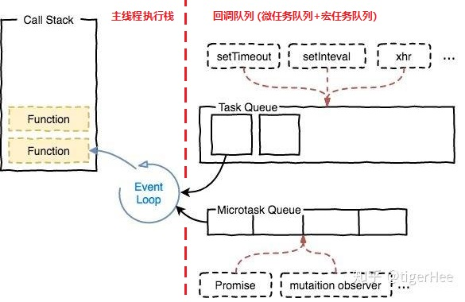
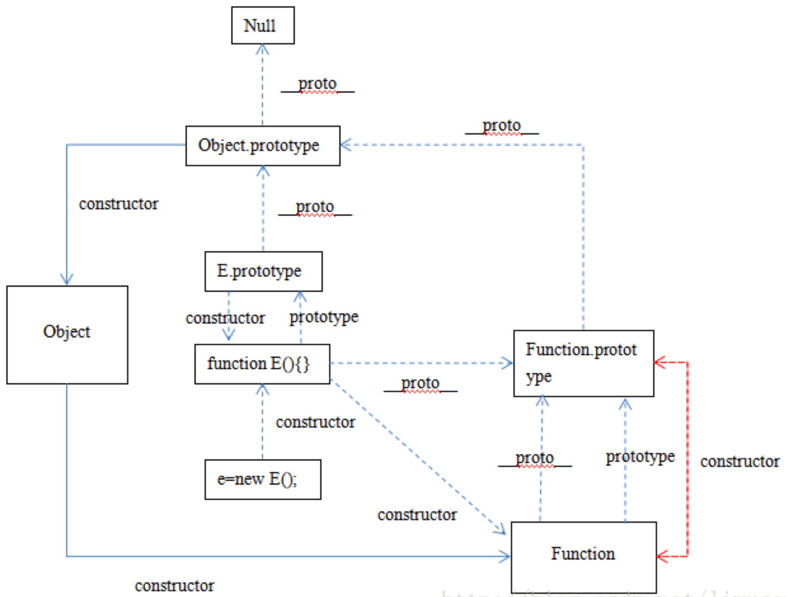

面试题库
---

* [x] [23:58，47:11，面试干货视频(hr 面以及技术面)](https://www.bilibili.com/video/BV16441137QB?from=search&seid=16025366212027778585)  
* [x] [面试题](https://zhuanlan.zhihu.com/p/101986056)  


## 一 JS 基础
**知识点**  

- 变量类型
	- [值类型和引用类型]
		- [堆和栈]
	- [JS的数据类型、判断](#1.1)
	- [==和===](#1.44)
- 原型与原型链
	- [原型和原型链定义](#1.6)
	- [继承写法](#1.7)
- 作用域和闭包
	- [闭包是什么](#1.4)
	- this
		- [call bind apply](#1.10)
		- [指向问题](#1.9)
	- [作用域和作用域链](#1.3)
- [ES6/ES7]
	- [箭头函数]
	- [Module]
	- [Promise](#1.42)
		- [async 和 await](#1.54)
		- [generator 函数](#1.55)
		- [手撕代码](#1.56)
	- [Class]
	- [Set 和 Map]
	- [let 和 const]
	- [proxy]
- [异步]
	- [同步 vs 异步]
	- [异步和单线程]
		- [event loop](#1.13)
	- [前端异步的场景]
	- [web worker](#1.27)
	- [AMD CMD commonJS]
	- [async 和 defer]
- API
	- [数组](#1.16)
		- [API(改变原数组/不改变原数组)](#1.12)
		- [数组去重](#1.11)
	- [对象](#1.5)
		- [浅拷贝 vs 深拷贝](#1.2)
		- [new](#1.8)
	- [DOM](#1.22)
	- [BOM](#1.25)
	- [ajax 和 fetch](#1.24)
		- [readyState 4个状态](#1.23)
	- [WebSocket]
		- [轮询和长轮询]
	- [存储](#1.26)
		- [cookie](#1.29)
		- localStorage
		- sessionStorage
- [跨域](#1.15)
	- [jsonp](#1.14)
	- [cors](#1.17)
	- [postMessage](#1.18)
	- [WebSocket](#1.19)
	- [代理](#1.20)
	- [iframe](#1.21)
- [动画]
	- [setTimeout](#1.46)
	- [requestAnimationFrame](#1.45)
- [事件]
  - [事件流](#1.30)
  - [DOM0事件]
  - [DOM2事件](#1.28)
  - [事件对象]
  - [事件类型](#1.32)
  - [事件委托](#1.31)


### <a id="1.1"></a>1.1 数据类型及判断  
**数据类型**  

- [x] [Symbol](#1.53)

 

**判断类型**  

  

- `typeof(variable)`  
```js
typeof NaN; // number
typeof 10n; // bigint
typeof Symbol(); // symbol
```
- `variable instanceof Array` / `Array.prototype.isPrototypeOf(variable)`

  原型链的查找过程。适用范围：  `Function`、`Array`、`Date`、`RegExp`、`Error`  

- `variable.constructor == Array`  

  适用范围：除了 `undefined` 和 `null`  

  问题：`constructor` 的属性是可以被修改的，可能导致检测出的结果不正确。  

- `Object.prototype.toString.call(variable)` 

  适用范围：通用。将它的结果 `result.slice(8, -1)`  

- `Array.isArray(variable)` 

  适用范围：`Array`

### <a id="1.2"></a>1.2 深浅拷贝  

**什么是深拷贝？什么是浅拷贝？**

浅拷贝：Object.assign 会合并对象生成一个新对象。如果原对象的属性是普通类型改变之后新对象不会改变，如果是引用类型改变后新对象也会改变，所以 Object.assign 实际上还是浅拷贝。  

**浅拷贝**  

```js
Object.assign() //es6
```
栗子  
```js
var obj={aa:1,b:{item:'45'}};
var newObj=Object.assign({},obj);
obj.aa=2;
obj.b.item='kk';
console.log(newObj.aa); //1
console.log(newObj.b.item); //kk
```
**深拷贝**  

原生API  

```js
JSON.parse(JSON.stringify(obj))
```
**手撕代码：深拷贝**

实现一般对象、数组和基本数据类型的克隆，但是不能实现正则对象 RegExp 和 Date 对象的克隆

```js
function cloneDeep(source) {
    if (!isObject(source)) return source; // 非对象返回自身
    var target = Array.isArray(source) ? [] : {};
    for (var key in source) {
        if (source.hasOwnProperty(key)) {
            target[key] = isObject(source[key]) ? cloneDeep(source[key]) : target[key] = source[key];
        }
    }
    return target;
}
function isObject(obj) {
    return typeof obj === 'object' && obj != null;
}
```

对于 Date 类型：

在 Date 的原型上定义克隆的方法

```js
Date.prototype.clone=function(){
    return new Date(this.valueOf());
}
```

对于正则对象 RegExp：

```js
RegExp.prototype.clone = function() {
    var pattern = this.valueOf();
    var flags = '';
    flags += pattern.global ? 'g' : '';
    flags += pattern.ignoreCase ? 'i' : '';
    flags += pattern.multiline ? 'm' : '';
    return new RegExp(pattern.source, flags);
};
```

### <a id="1.3"></a>1.3 变量声明提升、作用域与作用域链  

**变量声明提升**  

- 在JavaScript 中，函数声明（function aa(){}）与变量声明（var）被JavaScript 引擎隐式地提升到当前作用域的顶部。  
- 函数声明的优先级高于变量，如果变量名跟函数名相同且未赋值，则函数声明会覆盖变量声明  
- 声明语句中的赋值部分并不会被提升，只有变量的名称被提升  

**作用域与作用域链**  
- 在JavaScript 中，作用域为function(){}内的区域，称为函数作用域。  
- 函数的嵌套形成作用域的层级关系。  
- 当函数执行时，从当前作用域开始搜，没有找到的变量，会向上层作用域查找，直至全局函数，这就是作用域链。  
- 全局函数无法查看局部函数的内部细节，但局部函数可以查看其上层的函数细节，直至全局细节  

### <a id="1.4"></a>1.4 闭包  
**简介**

定义：比函数F 内部有一个函数G，函数G 可以访问到函数F 中的变量，那么函数G 就是闭包。  

原理：作用域链。

栗子：

```js
function F() {
  let a = 1
  window.G = function() {
    console.log(a)
  }
}
F()
G() // 1
```

**作用**

- 可以读取函数内部的变量

  隐藏变量，避免全局污染

  不用到全局对象上查找，提升访问速度

- 让这些变量的值始终保持在内存中

**缺点**

- 变量不会被垃圾回收机制回收，造成内存消耗
- 不恰当的使用闭包，可能会造成内存泄漏

### <a id="1.5"></a>1.5 创建对象  

**创建对象的方式**  

1. 对象字面量 `{}`  
2. new 一个构造函数  
3. new 一个内置对象 `new Object()`  
4. `Object.create()`  
```js
var test = Object.create({x:1})
```

**`new Object()` 、`Object.create()`、`{}`，这三种方式创建对象的区别**

Object.create(null) 创建的对象是一个空对象，在该对象上没有继承 Object.prototype 原型链上的属性或者方法，例如：toString()，hasOwnProperty()等方法  

**如何实现一个类**

- 构造函数法

```js
function P(name, age) {
  this.name = name;
  this.age = age;
}
P.prototype.sal = function() {}
var pel = new P("jj", 1);
pel.sal()
```
- ES6 语法糖 class  

```js
class Point {
  constructor(x, y) {
    this.x = x;
    this.y = y;
  }
  toString() {
    return '(' + this.x + ', ' + this.y + ')';
  }
}
var point = new Point(2, 3);
```


### <a id="1.6"></a>1.6 原型和原型链  
任何一个类（函数）都有**原型对象**  
函数上有一个 prototype 属性，指向**原型对象**，通过它可以访问原型对象  
函数的实列可以直接访问**原型对象**(因为实列上有 proto 指向构造函数的原型对象)  
原型对象至少有两个属性（constructor，proto）。constructor 指向函数本身，proto 指向**父类原型对象**，形成**原型链**。  

### <a id="1.7"></a>1.7 手撕代码：继承  
**原型链继承**

问题：实例属性变为原型属性，引用类型在原型中共享会有问题；构造函数传参问题

**盗用构造函数继承**

问题：函数不能重用

**组合继承**(原型链+盗用构造函数)

问题：父类构造函数调用两次，实例属性变为子类原型属性，浪费空间

  

```js
function SuperType(name) {
  this.name = name;
  this.colors = ["red", "blue", "green"];
}
SuperType.prototype.sayName = function() {
  console.log(this.name);
};

function SubType(name, age) {
  // 继承属性
  SuperType.call(this, name); // 盗用构造函数继承
  this.age = age;
}
// 继承方法
SubType.prototype = new SuperType(); // 原型链继承
SubType.prototype.constructor = SubType;
SubType.prototype.sayAge = function() {
  console.log(this.age);
};
```
**寄生式组合继承**(原型式继承+盗用构造函数)

通过寄生方式，砍掉父类的实例属性，这样，在调用两次父类的构造的时候，就不会初始化两次实例方法/属性，避免组合继承的缺点

属性放在构造函数中(解决引用类型在原型中共享时出现的问题，以及可以为构造函数传参)，方法放在原型中(函数重用)  

```js
function SuperType(name) {
  this.name = name;
  this.colors = ["red", "blue", "green"];
}
SuperType.prototype.sayName = function() {
  console.log(this.name);
};

function SubType(name, age) {
  SuperType.call(this, name);
  this.age = age;
}
SubType.prototype = object(SuperType.prototype); // 创建对象
SubType.prototype.constructor = SubType; // 增强对象
SubType.prototype.sayAge = function() {
  console.log(this.age);
};

function object(o) {
  function F() {}
  F.prototype = o;
  return new F();
}
```
`SubType.prototype = object(SuperType.prototype);`的替代方法：  
1. `SubType.prototype = {}; SubType.prototype.__proto__ = SuperType.prototype;`(不兼容 IE)
2. `SubType.prototype = Object.create(SuperType.prototype);`(ES5 中的方法)  

**ES6 语法糖：extends 继承**  
```js
class ColorPoint extends Point {
  constructor(x, y, color) {
    super(x, y); // 继承属性
    this.color = color;
  }
  toString() {
    return this.color + ' ' + super.toString(); // 继承方法
  }
}
```

### <a id="1.8"></a>1.8 new  
**new 操作符具体做了什么**

(1) 在内存中创建一个新对象。  
(2) 这个新对象内部的[[Prototype]]特性被赋值为构造函数的 prototype 属性。  
(3) 构造函数内部的 this 被赋值为这个新对象（即 this 指向新对象）。  
(4) 执行构造函数内部的代码（给新对象添加属性）。  
(5) 如果构造函数返回非空对象，则返回该对象；否则，返回刚创建的新对象。

**手撕代码：new**  

```js
function myNew(func, ...args) {
  // 1. 判断方法体
  if (typeof func !== 'function') {
    throw '第一个参数必须是方法体';
  }

  // 2. 创建新对象
  const obj = {};

  // 3. 这个对象的 __proto__ 指向 func 这个类的原型对象
  // 即实例可以访问构造函数原型（constructor.prototype）所在原型链上的属性
  obj.__proto__ = func.prototype;

  // 为了兼容 IE 可以让步骤 2 和 步骤 3 合并
  // const obj = Object.create(func.prototype);

  // 4. 通过 apply 绑定 this 执行并且获取运行后的结果
  const funcObj = func.apply(obj, args);
  
  // 5. 如果构造函数返回的结果是引用数据类型，则返回运行后的结果
  // 否则返回新创建的 obj
  const isObject = typeof funcObj === 'object' && funcObj !== null;
  const isFunction = typeof funcObj === 'function';
  return isObject || isFunction ? funcObj : obj;
}
```
测试  
```js
function Person(name) {
  this.name = name;
  return function() { // 测试第 5 点
    console.log('返回引用数据类型');
  };
}
// 测试第 2 点和第 3 点
Person.prototype.sayName = function() {
  console.log(`My name is ${this.name}`);
}
const me = myNew(Person, 'jsliang'); // 测试第 4 点
me.sayName(); // My name is jsliang
console.log(me); // Person {name: 'jsliang'}

// 测试第 1 点
// const you = myNew({ name: 'jsliang' }, 'jsliang'); // 报错：第一个参数必须是方法体
```

### <a id="1.9"></a>1.9 this 对象的理解  
**this指向**  

1. 通过 new 关键字调用构造函数，this 指向 new 出来的实例对象  

2. 在事件中
  
   - this 指向触发这个事件的对象  
   - IE 下 attachEvent 中的 this 总是指向全局对象 Window  

3. 标准函数中 this 指向执行/调用时的上下文  

   ```js
   function foo() {
     console.log(this.a)
   }
   var a = 1
   foo() // 1. 全局上下文
   const obj = {
     a: 2,
     foo
   }
   obj.foo() // 2. 作为对象的方法，this指向对象
   const c = new foo() // undefined. this指向new出来的实例对象
   ```

   - 直接调用 foo (非严格模式下，不管 foo 函数作为全局函数还是闭包)，this 指向 window  
   - 作为对象的方法调用  

     ```js
     var obj = {
       f1() {
         return this;
       },
       f2() {
         return function() {
           return this;
         }
       }
     }
     obj.f1(); // this 指向 obj
     obj.f2()(); // this 指向 window
     ```
   
     - obj.f1()，this 指向 obj 对象  
   
     - obj.f2()()，闭包中的 this 指向 window  
   
       标准函数在调用时会自动创建 this 和 arguments，内部函数不可能直接访问外部函数的这两个变量。  
     
       (箭头函数不创建这两个变量，可以访问外部包装函数中的这两个变量)  
     
       解决问题：把外部函数的 this 保存到闭包可以访问的另一个变量中  

       ```js
       var obj = {
         f2() {
           let that = this;
           return function() {
             return that;
           }
         }
       }
       obj.f2(); // that 指向 obj
       ```

4. 箭头函数中 this 指向定义时的上下文  

   栗子一——this 指向 window：

   ```js
   function a() {
     return () => {
       return () => {
         console.log(this)
       }
     }
   }
   a()()() //Window
   ```

   箭头函数其实是没有 this 的，箭头函数中的 this 只取决包裹箭头函数的第一个普通函数的 this。

   在这个例子中，因为包裹箭头函数的第一个普通函数是 a，所以此时的 this 是 window。

   栗子二——this 指向定义时的上下文：

   ```js
   var a=11;
   function test2(){
       this.a=22;
       let b=()=>{console.log(this.a)}
       b();
   }
   var x=new test2(); // 22
   ```

   栗子三——this 指向触发事件的 DOM 元素：

   箭头函数定义在事件处理程序中，this 指向触发事件的 DOM 元素（见[第二点](#1.9)）

   另外对箭头函数使用 bind 这类函数是无效的。

5. 作为对象方法的标准函数/箭头函数，标准函数中的 this 指向对象；箭头函数中的 this 指向 Window  

   ```js
   var f1 = function() {console.log(this);};
   var f2 = () => {console.log(this);};
   var obj = {
     f1,
     f2
   };
   obj.f1(); // {f1: ƒ, f2: ƒ}
   obj.f2(); // Window
   ```

6. 作为对象方法的标准函数，调用方式不同，this 指向  

   ```js
   var f = function() {};
   var obj = {
     f
   };
   obj.f(); // this 指向 obj
   (obj.f)(); // this 指向 obj，因为根据规范，(obj.f) == obj.f
   (obj.f = obj.f)(); // this 指向 Window
   ```

7. [`call()`、`apply()`、`bind()`](#1.10)

### <a id="1.10"></a>1.10 call bind apply  
**是什么、用途**  

是 Function 对象的内置方法  
改变函数体内部 this 的指向  
bind 方法创建一个新函数，便于稍后调用；apply、call 则是立即调用。  

**用法**  

第一个参数都是 this 要指向的对象  
call、bind 传入参数列表  
apply 传入数组  

**手撕代码：call bind apply**

call  

```js
Function.prototype.myCall = function(context, ...args) {
  // 默认为全局的 this (这里为 window 对象)
  context = context || globalThis;
  
  // 为对象添加 fn 方法，即调用 myCall 的函数——this
  context.fn = this;

  // fn 必须为函数
  if (typeof fn !== "function") {
    throw new Error("Must accept function");
  }
  
  let result;
  
  // 将结果返回给 result
  if (arr) { // 如果存在参数，则传进去
    result = context.fn(...arr);
  } else { // 否则不传
    result = context.fn();
  }

  // 删除这个变量
  delete context.fn;

  // 返回 result 结果
  return result;
};
```
apply  
```js
Function.prototype.myApply = function(context, arr) {
  // 默认为全局的 this (这里为 window 对象)
  context = context || globalThis;
  
  // 为对象添加 fn 方法，即调用 myApply 的函数——this
  context.fn = this;

  // fn 必须为函数
  if (typeof fn !== "function") {
    throw new Error("Must accept function");
  }
  
  let result;

  // 将结果返回给 result
  if (arr) { // 如果存在参数，则传进去
    result = context.fn(...arr);
  } else { // 否则不传
    result = context.fn();
  }

  // 删除这个变量
  delete context.fn;

  // 返回 result 结果
  return result;
};
```
bind  

ES6 写法  

```js
Function.prototype.myBind = function(context, ...args) {
  // 默认为全局的 this (这里为 window 对象)
  context = context || globalThis;
  
  // 定义 fn 方法，即调用 myBind 的函数——this
  const fn = this;
  
  // fn 必须为函数
  if (typeof fn !== "function") {
    throw new Error("Must accept function");
  }
  
  // 设置返回的一个新方法
  function resultFn (...args2) {
    // 区分是通过 new 还是普通函数调用的
    return fn.apply(
      this instanceof resultFn ? this : context,
      [...args, ...args2]
    );
  }

  // 绑定原型链
  result.prototype = Object.create(fn.prototype);

  // 返回结果
  return resultFn;
};
```

### <a id="1.11"></a>1.11 数组去重  
**题型一**  
* [x] [2.1.1 (简单) 剑指 Offer 03. 数组中的重复数字](https://github.com/XingRenEr/Front-end/tree/master/%E6%95%B0%E6%8D%AE%E7%BB%93%E6%9E%84%E4%B8%8E%E7%AE%97%E6%B3%95/Leetcode#two-one-one)  

在一个长度为 n 的数组 nums 里的所有数字都在 0～n-1 的范围内。数组中某些数字是重复的，但不知道有几个数字重复了，也不知道每个数字重复了几次。请找出数组中任意一个重复的数字。  

**题型二**  

```JS
const arr = [1, 1, 2, 3, 3];
// 期望得到：[1, 2, 3]
```
方法一：includes  
```JS
const newArr1 = [];
for (let i = 0; i < arr.length; i++) {
  if (!newArr1.includes(arr[i])) {
    newArr1.push(arr[i]); 
  }
}
console.log('newArr1：', newArr1);
```
方法一变体：indexOf——与上述方法几乎完全一样，但是语义不如includes好  
```js
const newArr1 = [];
for (let i = 0; i < arr.length; i++) {
  if (newArr1.indexOf(arr[i]) == -1) {
    newArr1.push(arr[i]); 
  }
}
console.log('newArr1：', newArr1);
```
方法二： Set  
```JS
const newArr2 = [...new Set(arr)];
console.log('newArr2：', newArr2);
```
方法三： filter  
```JS
const newArr3 = arr.filter((item, index) => arr.lastIndexOf(item) === index);
console.log('newArr3：', newArr3);
```
方法四：不使用数组API——暴力遍历  
```JS
var newArr4 = [arr[0]];
for (var i = 1; i < arr.length; i++) {
  var repeatflag = false;
  for (var j = 0; j < newArr4.length; j++) {
    if (arr[i] === newArr4[j]) {
      repeatflag = true;
      break;
    }
  }
  if (!repeatflag) {
    newArr4[newArr4.length] = arr[i];
  }
}
console.log('newArr4', newArr4);
```

### <a id="1.12"></a>1.12 数组 API  
  

### <a id="1.13"></a>1.13 Event Loop  
**Event Loop执行过程**  

  

1. 执行一个宏任务（从事件队列中获取；起初 `script` 作为一个宏任务执行）
2. 执行过程中，**同步代码** 直接进入主线程执行栈执行，**异步任务**挂起(不影响执行栈中代码的执行)，等待返回结果后，再进入回调队列；**宏任务** 进入宏任务队列，**微任务** 进入微任务队列。
3. 执行栈中代码执行完毕后，检查微任务列表，有则进入执行栈依次执行，直到全部执行完毕。  
4. 检查渲染，然后浏览器 GUI 线程接管渲染工作。
5. 检查是否有 `Web Worker` 任务，有则执行。

   > Web Worker 是运行在后台的 JS，独立于其他脚本，不会影响页面的性能。  

6. JS 线程继续接管，回到步骤 1 开始下一个宏任务，依次循环，直到宏任务和微任务队列为空。

**宏任务**  
* `script` (整体代码)
* `setTimeout`
* `setInterval`
* `I/O`
* `UI Rendering`
* `setImmediate` (仅 Node.js 环境，浏览器环境仅 IE10 支持)
* `requestAnimationFrame` (仅浏览器环境)
* `postMessage`
* `MessageChannel`???

**微任务**  
* `MutationObserver` (仅浏览器环境)
* `Promise.then()/catch()`
* `fetch API` (以 `Promise` 为基础开发的其他技术)
* `process.nextTick` (仅 Node.js 环境)
* `Object.observe` (废弃)
* V8 的垃圾回收过程???

**代码执行顺序题目**


### <a id="1.14"></a>1.14 JSONP  
**是什么 & 实现**  
ajax 请求受同源策略影响，不允许进行跨域请求，而 script 标签 src 属性中的链接却可以访问跨域的 js 脚本。利用这个特性，客户端动态创建 script，请求一个带参网址，服务端返回一段调用某个函数的 js 代码 (不再返回 JSON 格式的数据)，调用本地函数并传参，这样实现了跨域。  
**优点**  
- 不像Ajax请求那样受到同源策略的限制；  
- 兼容性更好，在更加古老的浏览器中都可以运行，不需要XMLHttpRequest或ActiveX的支持；  
- 并且在请求完毕后可以通过调用callback的方式回传结果。  

**缺点**  
- 它只支持GET请求  
- 它只支持跨域HTTP请求这种情况，不能解决不同域的两个页面之间如何进行JavaScript调用的问题 (与postMessage相比)  
- JSONP是一种脚本注入(Script Injection)行为，不安全，可能遭受 `XSS` 攻击  

### <a id="1.15"></a>1.15 跨域  
**同源策略**  

协议、域名、端口都一致，才属于同源。  

**跨域导致的问题**  

  - Ajax 请求不能发送  
  - 无法获取 DOM 元素并进行操作  
  - 无法读取 Cookie、LocalStorage 和 IndexDB  

**浏览器为什么要设置跨域**  

​	浏览器对 JavaScript 实施的安全限制

  - `DOM` 同源策略。防止一些恶意网站在自己的网站中利用 `iframe` 嵌入正规的网站并迷惑用户，以此来达到窃取用户信息。  
  - `Ajax` 同源策略。不同源的页面不能获取 `Cookie` 且不能发起 `Ajax` 请求，这样在一定程度上防止了 `CSRF` 攻击。

**jQuery AJAX跨域问题**  

  - 如果设置 `dataType: 'jsonp'`，这个 `$.ajax()` 方法就和 ajax XmlHttpRequest没什么关系了，取而代之的则是 JSONP 协议。  
  - AJAX跨域可以用 CORS 机制解决

**跨域原理**

- 跨域的定义。跨域，是指浏览器不能执行其他网站的脚本。
- 产生原因。它是由浏览器的同源策略造成的，是浏览器对 JavaScript 实施的安全限制，那么只要协议、域名、端口有任何一个不同，都被当作是不同的域。
- 跨域原理。即是通过各种方式，避开浏览器的安全限制。

### <a id="1.16"></a>1.16 数组  
**数组常用方法**

- [x] [数组API](#1.12)
- [x] [数组方法详解](https://github.com/XingRenEr/Front-end/blob/master/Javascript/%E5%9F%BA%E7%A1%80/%E6%95%B0%E7%BB%84.md)

**对象数组按照 sort 属性排序，若 sort 属性相等，则按照 id 排序**  

```js
/**
 * 按sort 及id 排序
 * @param {Object} a
 * @param {Object} b
 */
function sortFun(a, b) {
  return a.sort - b.sort == 0 ? a.id - b.id : a.sort - b.sort
};
arr.sort(sortFun) //从小到大排序
```

### <a id="1.17"></a>1.17 CORS  
**是什么**  
`XMLHttpRequest` 或 `Fetch` 请求，加入跨域资源共享（`CORS`）机制 (服务端设置CORS响应头，同时客户端对相应CORS请求头进行配置)，可实现跨域。  
**分类**  
- 简单请求
- 复杂请求

**简单请求**  
- 请求方法  
  - HEAD  
  - GET  
  - POST  
- 请求头  
  - Accept
  - Accept-Language
  - Content-Language
  - Content-Type：只限于三个值`application/x-www-form-urlencoded`、`multipart/form-data`、`text/plain`
- 域 (Origin) 字段  
  域包含协议名、地址以及一个可选的端口。  
  - 服务端：`Access-Control-Allow-Origin`，客户端：`Origin`  
  - `Access-Control-Allow-Origin: *`，`Origin: 任意`  
  - `Access-Control-Allow-Origin: http://foo.example`，`Origin: http://foo.example`  

**复杂请求**  
任何不满足上述要求的请求，都是复杂请求。  
复杂请求不止发送一个请求。先发送预请求，服务端返回预响应。  

**与JSONP的比较**  
JSONP只支持GET请求，CORS支持所有类型的HTTP请求。JSONP对老式浏览器的兼容性好。  

### <a id="1.18"></a>1.18 postMessage  
**是什么**  
`postMessage` 是 `HTML5 XMLHttpRequest Level 2` 中的 `API`，且是为数不多可以跨域操作的 `window` 属性之一。  
**应用场景**  
* 页面和其打开的新窗口的数据传递
* 多窗口之间消息传递
* 页面与嵌套的 `iframe` 消息传递
* 上面三个场景的跨域数据传递  

### <a id="1.19"></a>1.19 WebSocket  
`WebSocket` 是 HTML5 的一种双向通信协议，在建立连接之后，`WebSocket` 的 `server` 与 `client` 都能主动向对方发送或接收数据，同时也是跨域的一种解决方案。  

### <a id="1.20"></a>1.20 代理  
**是什么**  
代理服务器，实现数据的转发，分为正向代理和反向代理  
**两者区别**  
代理的对象不一样：正向代理代理的对象是客户端，反向代理代理的对象是服务端  
正向代理隐藏真实客户端，反向代理隐藏真实服务端。  
**正向代理**  
栗子：内推；科学上网  
  
**反向代理**  
栗子：拨打10086客服电话；访问百度主页，www.baidu.com 就是反向代理服务器  
  
**正向代理实现跨域——Node**  
浏览器需要遵循同源策略，而如果是服务器向服务器请求就无需遵循同源策略。  
使用 `Node` 中间件  
**反向代理实现跨域——Nginx**  
优点：最简单的跨域方式。支持所有浏览器，支持 Session，并且不会影响服务器性能。  
实现方式：修改 Nginx 的配置即可，不需要修改任何代码。  

### <a id="1.21"></a>1.21 iframe  
- `window.name + iframe`  
- `location.hash + iframe`  
- `document.domain + iframe`  

### <a id="1.22"></a>1.22 DOM  
**DOM 常用 API**  
- 节点关系
  


- 创建  
- 修改 (元素属性、元素样式)
- 添加  


- 获取  
- 删除  
- 替换  


```js
// 创建
const heading = document.createElement(name); // name: p、div、h1...
// 修改
heading.innerHTML = '';
// 添加
document.body.appendChild(heading);
```
```js
// 添加 (到指定位置)
someNode.insertBefore(newNode, null); // 作为最后一个子节点插入
someNode.insertBefore(newNode, someNode.firstChild); // 作为新的第一个子节点插入
someNode.insertBefore(newNode, someNode.lastChild); // 插入最后一个子节点前面
```
```js
// 获取
const node = document.getElementById(id); // 或者 querySelector(".class|#id|name");
// 删除
document.body.removeChild(node);
```
```js
// 替换
someNode.replaceChild(newNode, someNode.firstChild);
```

### <a id="1.23"></a>1.23 readyState 的四个状态  
|值|状态|描述|
| - | - | - |
|0|UNSENT|代理被创建，但尚未调用 open() 方法。|
|1|OPENED|open() 方法已经被调用。|
|2|HEADERS_RECEIVED|send() 方法已经被调用，并且头部和状态已经可获得。|
|3|LOADING|下载中； responseText 属性已经包含部分数据。|
|4|DONE|下载操作已完成。|

### <a id="1.24"></a>1.24 Ajax 和 Fetch  
**实现一个 Ajax**  
```javascript
//1.创建Ajax对象
var xhr = new XMLHttpRequest();
//4.监听请求
xhr.onreadystatechange = function() { // 当xhr对象的readystate属性发生了改变,触发该事件
	if (xhr.readyState !== 4) { // 获取xhr对象的readyState 属性
		return;
	}
	if (xhr.status >= 200 && xhr.status <= 300) { //判断响应头的状态，请求成功
		document.querySelector("h1").innerText = xhr.responseText; // 读取响应数据
	} else {
		console.error('请求失败');
	}
}
//2.打开这个对象
xhr.open('get', './text.txt', true); // 设置请求方式，请求页面的相对路径，是否异步
//3.发送请求
xhr.send();
```
**有多个请求，如何让这些 ajax 请求按照顺序**  
- 嵌套的回调函数 (回调地狱)  
  - 原生 Ajax
  - jquery 中的 ajax 函数
  ```js
  $.ajax({
    url: "servletURL",
    type: "post",
    data: {},
    dataType: "json",
    success: function(data) {
      $.ajax({
        url: "servletURL",
        type: "post",
        data: {},
        dataType: "json",
        success: function(data) {
          $.ajax({
            url: "servletURL",
            type: "post",
            data: {},
            dataType: "json",
            success: function(data) {}
          });
        }
      });
    }
  });
  ```
- **解决异步回调地狱问题**

  - jquery 的 ajax 函数中，增加 `async: false`，所有的 ajax 就会同步执行，请求顺序就是代码顺序

  ```js
  var ajax1 = $.ajax({
    async: false,
    url: url1,
    success: function(paraResponse) {}
  });
  var ajax2 = $.ajax({
    async: false,
    url: url2,
    success: function(paraResponse) {}
  })；
  $.when(ajax1, ajax2).done(function() {
    //确保ajax1, ajax2两个请求完毕时执行
    alert("done");
  }).fail(function() {
    alert("fail");
  });
  ```

  - Promise.then
  - async/await
  - generator

**Ajax 解决浏览器缓存问题**

不保存缓存记录

- 原生JS

  在 ajax 发送请求前加上：

  ​	`anyAjaxObj.setRequestHeader("If-Modified-Since","0")`

  ​	`anyAjaxObj.setRequestHeader("Cache-Control","no-cache")`

  在 URL 后面加上一个随机数以及时间戳：

  ​	`"fresh=" + Math.random()`

  ​	`"nowtime=" + new Date().getTime()`

- jQuery

  ` $.ajaxSetup({cache:false})`

**Fetch 和 Ajax 相比有什么优缺点**

【优点】

- fetch api是基于 promise 的设计，方便写异步代码，避免了回调地狱。
- 在不想用 jQuery 的情况下，相比于原生的 Ajax，取代传统 xhr 的不合理的写法，更简便。

【缺点】

兼容性差，但是在不兼容的浏览器上可使用 polyfill。  

**Fetch 发送两次请求的原因**

若使用带预检(Preflighted)的跨域请求，会发送2次请求：一个类型为`OPTIONS`的预检请求、真实请求。

预检请求会检测服务器是否支持我们的真实请求所需要的跨域资源，唯有资源满足条件才会发送真实请求。

参考[CORS——复杂请求](#1.17)  


### <a id="1.25"></a>1.25 BOM  
**BOM 常用 API**  
  
  

### <a id="1.26"></a>1.26 存储  
**本地存储：Cookie、WebStorage(sessionStorage、localStorage) 的区别**  

|								|生命周期																							|存储大小	|作用域																				|http 请求																													|易用性																			|应用场景																																																																							|其他														|
| - | - | - | - | - | - | - | - |
|Cookie					|可设置失效时间，否则默认为关闭浏览器后失效						|4k				|在所有同源窗口共享														|每次都会携带在http 头中，如果使用cookie 保存过多数据会带来性能问题	|需要程序员自己封装，原生的cookie 接口不友好|会话状态管理（如用户登录状态、购物车、游戏分数或其它需要记录的信息）；个性化设置（如用户自定义设置、主题等）；浏览器行为跟踪（如跟踪分析用户行为等）	|可以限制cookie只属于某个路径下	|
|Localstorage		|除非被手动清除，否则永久保存													|5M				|在所有同源窗口共享														|仅在客户端保存，不参与和服务器的通信																|接口友好																		|用来在页面传递参数																																																																		|																|
|Sessionstorage	|仅在当前网页会话下有效，关闭页面或浏览器后就会被清除	|5M				|不在不同的浏览器窗口共享（即使是同一个页面）	|仅在客户端保存，不参与和服务器的通信																|接口友好																		|用来保存一些临时的数据，防止用户刷新页面后丢失了一些参数																																															|																|

共同点：保存在浏览器端，并且是同源的  

**本地存储有哪些**  
- Cookie  
- WebStorage(sessionStorage、localStorage)  
- IndexedDB  
- token  
> 用于身份验证，解决 HTTP 无状态的问题  

**token 与 session**  
* [x] [session和token的关系和区别？](https://www.jianshu.com/p/54c69103f245)  

token 和 session 本质功能相似，  
- 实现上  
Session的状态是存储在服务器端，客户端只有session id  
Token的状态是存储在客户端。  
- 特点  
session是空间换时间，token是时间换空间  
token可扩展性强  
(没看完)...  
- 应用  
视具体情况而定。但如果跨站使用，token 会更方便一些。  

**客户端存储 Cookie 和服务器端存储 Session 区别**  

|				|概念产生																																																																																			|保存位置	|存取格式			|存储大小			|隐私策略	|有效期																														|
| - | - | - | - | - | - | - |
|cookie	|Cookie 是服务器发送到用户浏览器并保存在本地的一小块数据，它会在浏览器下次向同一服务器再发起请求时被携带并发送到服务器上；使基于无状态的 HTTP 协议记录稳定的状态信息成为了可能|浏览器		|ASCII				|4k						|不安全		|可设置为长时间保持，如我们经常使用的默认登录功能									|
|session|Session 代表着服务器和客户端一次会话的过程。Session 对象存储特定用户会话所需的属性及配置信息，在整个用户会话中一直存在																												|服务器		|任意数据类型	|远大于cookie	|安全			|服务器会把长时间（Session的超时时间）没有活跃的Session从内存删除	|

联系：cookie存储sessionId，用来验证用户登录状态

### <a id="1.27"></a>1.27 web worker  
**是什么**  

web worker 是运行在后台的 js，独立于其他脚本，并且可将结果回传到主线程。这样在进行复杂操作时，不会阻塞主线程。

web worker 在 [Event Loop](#1.13) 中  

> 我的理解：JS是单线程语言，有同步代码和异步代码，想把普通的同步代码变为异步代码，塞到后台线程进行并行处理时，就可以使用 web worker  

**如何使用**  
- 检测浏览器对于web worker 的支持性
- 创建web worker 文件
```js
onmessage = (res) => {
  // Worker 接收数据
  console.log('Worker 收到数据：', res);
  // Worker 发送数据
  postMessage('门打开啦，这里是 web_worker.js');
}
```
- 创建web worker 对象
```js
const worker = new Worker('./web_worker.js');
// 主线程接收数据
worker.addEventListener('message', (res) => {
  console.log('index.html 收到数据：', res);
});
// 主线程发送数据
worker.postMessage('查房，这里是 index.html！');
//  终止 Worker
worker.terminate();
```

### <a id="1.28"></a>1.28 DOM2 事件处理程序  
`addEventListener()` `removeEventListener()`

**语法**

`target.addEventListener(type, listener, options/useCapture);`  

- `type`：事件名  
- `listener`：事件处理函数  
- `options`(可选)：参数对象  
  - `capture`：Boolean，表示 listener 会在该类型的事件捕获阶段传播到该 EventTarget 时触发。
  - `once`：Boolean，表示 listener 在添加之后最多只调用一次。如果是 true， listener 会在其被调用之后自动移除。
  - `passive`：Boolean，设置为true时，表示 listener 永远不会调用 preventDefault()。如果 listener 仍然调用了这个函数，客户端将会忽略它并抛出一个控制台警告。查看 使用 passive 改善的滚屏性能 了解更多.

- `useCapture`(可选)：布尔值，true 表示在捕获阶段调用事件处理程序，false（默认值）表示在冒泡阶段调用事件处理程序。  

**使用**  

```js
let btn = document.getElementById("myBtn");
let handler = function() {
console.log(this.id);
};
btn.addEventListener("click", handler, false);
// 其他代码
btn.removeEventListener("click", handler, false);
```

**优势**  
- 可以为同一个事件添加多个事件处理程序  
- 可以控制 listener 的触发阶段，即捕获或者冒泡  
- 对任何 DOM 元素都是有效的，而不仅仅只对 HTML 元素有效  

### <a id="1.29"></a>1.29 cookie  
**cookie 字段**  

|字段名|描述|
| - | - |
|name           |名称|
|value          |值|
|domain         |可访问此cookie的域名|
|path           |可访问此cookie的页面路径|
|Size           |大小|
|http           |httponly属性。若为true，则只有在http请求头中会带有此cookie的信息，而不能通过document.cookie来访问此cookie|
|expires/Max-Age|过期时间。默认值是Session，即cookie会和session一起失效。当浏览器关闭(不是浏览器标签页)后，此cookie失效。|
|secure         |是否只能通过https来传递此条cookie|

**cookie 编码方式**  
`encodeURI()`  

### <a id='1.30'></a>1.30 事件流

IE 将支持事件冒泡流，而 Netscape Communicator支持事件捕获流。

**DOM 事件流**

DOM 事件流即 DOM2 事件规范规定的事件流。分为 3 个阶段：事件捕获、到达目标和事件冒泡。


[**DOM2 事件处理程序**](#1.28)

可以指定事件处理程序在捕获阶段/冒泡阶段触发。

> DOM2 事件规范明确捕获阶段不命中事件目标，事件的“到达目标”阶段，通常在事件处理时被认为是冒泡阶段的一部分；但现代浏览器都支持在捕获阶段在事件目标上触发事件。最终结果是在事件目标上有两个机会来处理事件。基于这个原理：
>
> - 事件处理程序可以设置为冒泡/捕获阶段触发。
> - 可以分别在冒泡阶段/捕获阶段来触发事件，触发两个事件。

**事件捕获的作用**

事件捕获实际上是为了在事件到达最终目标前拦截事件（具体栗子：通过事件对象取消事件）。

**如何让事件先冒泡后捕获**

根据w3c标准，应先捕获再冒泡。若要实现先冒泡后捕获，给一个元素绑定两个addEventListener，其中一个第三个参数设置为false（即冒泡），另一个第三个参数设置为true（即捕获），调整它们的代码顺序，将设置为false的监听事件放在设置为true的监听事件前面即可。

### <a id='1.31'></a>1.31 事件委托

**原理**：事件委托利用事件冒泡，可以只使用一个事件处理程序来管理一种类型的事件。

**使用**：配合事件对象 `event.target` 属性

**应用场景**：比较适动态元素的绑定

**栗子**：ul 和 li 列表。在添加事件时，不会在 li 标签上直接添加，而是在 ul 父元素上添加。

**优点**：

- document 对象随时可用，任何时候都可以给它添加事件处理程序（不用等待 DOMContentLoaded 或 load 事件）
- 代码简洁，节省时间。
- 节省 DOM引用，减少所需的内存，提升性能。

### <a id='1.32'></a>1.32 事件类型

**点击一个 `input` 依次触发的事件**

`onmouseenter -> onmousedown -> onfocus -> onmouseup -> onclick`

**`onmouseover` 和 `onmouseenter` 区别**


### <a id="1.33"></a>1.33 JS 原生拖拽  
  - `mousedown`、`mousemove`、`mouseup`  
```html
<div id="box">
  <div id="drag">
  </div>
</div>
```
```js
var drag = document.getElementById('drag');
drag.onmousedown = function(event) {
  var event = event || window.event; // 兼容 IE
  var diffX = event.clientX - drag.offsetLeft;
  var diffY = event.clientY - drag.offsetTop;
  if (typeof drag.setCapture !== 'undefined') { // ???
    drag.setCapture();
  }
  document.onmousemove = function(event) {
    var event = event || window.event;
    var moveX = event.clientX - diffX;
    var moveY = event.clientY - diffY;
    if (moveX < 0) {
      moveX = 0
    } else if (moveX > window.innerWidth - drag.offsetWidth) {
      moveX = window.innerWidth - drag.offsetWidth
    }
    if (moveY < 0) {
      moveY = 0
    } else if (moveY > window.innerHeight - drag.offsetHeight) {
      moveY = window.innerHeight - drag.offsetHeight
    }
    drag.style.left = moveX + 'px';
    drag.style.top = moveY + 'px'
  }
  document.onmouseup = function(event) {
    this.onmousemove = null; // 修复低版本 IE (引用计数垃圾回收机制??) 的 bug  
    this.onmouseup = null;
    if (typeof drag.releaseCapture != 'undefined') {
      drag.releaseCapture();
    }
  }
}
```
  - HTML5 的 `Drag` 和 `Drop`  
```html
<div class="box1" draggable="true" id="source"></div>
<div class="box2" id="target"></div>
```
```js
var source = document.getElementById('source');
var target = document.getElementById('target');
source.ondragstart = function(event) {
  console.log('ondragstart');
}
source.ondrag = function() {
  console.log('ondrag');
}
source.ondragend = function() {
  console.log('ondragend')
}
target.ondragenter = function() {
  console.log('ondragenter')
}
target.ondragover = function(event) {
  var event = event || window.event;
  console.log('ondragover');
  event.preventDefault()
}
target.ondragleave = function() {
  console.log('ondragleave')
}
target.ondrop = function(event) {
  console.log('ondrop');
}
```

### <a id="1.34"></a>1.34 异步加载 js 的方法；async 和 defer 区别  

**异步加载 js 的方法**

- `<script></script>` 的 `defer` 属性
- `<script></script>` 的 `async` 属性

- 动态生成 `<script></script>`

  在js里创建script标签，插入DOM中，加载完成后callback。

  这样所有的js脚本都会在onload事件后才加载，而onload事件会在所有文件内容（包括文本、图片、CSS文件等）加载完成后才开始执行，极大的优化了网页的加载速度，提高了用户体验

  ```js
  function loadScript(url, callback){
      var s = document.createElement('script');
      s.type = 'text/javascript';
      if(s.readyState){
          s.onreadystatechange = function(){  //兼容IE
              if(s.readyState == 'complete' || s.readyState == 'loaded'){
                  callback();
              }
          }
      }else{
          s.onload = function(){  //safari chrome opera firefox
              callback();
          }
      }
   
      s.src = url;
      document.head.appendChild(s);
  }
  ```

**async 和 defer 区别**


蓝色线代表网络读取，红色线代表执行时间，这俩都是针对脚本的；绿色线代表 HTML 解析。

|              | defer                                         | async                                         |
| ------------ | --------------------------------------------- | --------------------------------------------- |
| 产生         | 以前适用于IE，现在适用于所有主流浏览器        | h5新属性                                      |
| 用法         | `<script src='www.baidu.com' defer></script>` | `<script src='www.baidu.com' async></script>` |
| 脚本执行时间 | 所有元素加载完成后                            | 某个js脚本加载完                              |
| 脚本执行顺序 | 按照js脚本声明的顺序                          | 乱序                                          |
| 适用范围     | 所有脚本                                      | 外部脚本（即script有src属性）                 |
| 应用         | 最接近我们对于应用脚本加载和执行的要求        | 可以不依赖任何脚本或不被任何脚本依赖的脚本    |

### <a id="1.35"></a>1.35 window.navigate  
用于客户端检测  
### <a id="1.36"></a>1.36 元素尺寸  
**DOM 中的 API**  

  
  
  

**`clientHeight`**：表示元素可视区域的高度，不包含 `border` 和滚动条  
**`offsetHeight`**：表示元素可视区域的高度，包含了 `border` 和滚动条  
**`scrollHeight`**：表示了元素所有区域的高度，包含了因为滚动被隐藏的部分  
**`clientTop`**：表示边框 `border` 的厚度，在未指定的情况下一般为`0`（应该用的不多，在红宝书里没有）  
**`offsetTop`**：元素上边框外侧距离包含元素（**`offsetParent`** 为由 CSS 定位的元素或 `body` 元素）上边框内侧的像素数  
**`scrollTop`**：滚动后内容区顶部隐藏的像素数（可写）  

**`style.height`**：只可获取行内样式设置的高度 (带单位)  

**BOM 中关于视口大小的 API**  

`innerWidth`  

**获取浏览器视口大小的方法**  

`window.innerWidth`  
`document.documentElement.clientWidth`  
`document.body.clientWidth`  

### <a id="1.7"></a>1.37 防抖和节流


**什么是防抖和节流**

防抖：频繁触发时，每次触发都会清空计时器，重新开始计时。计时器到达指定时间后，任务才会执行。

节流：频繁触发时，在指定时间间隔内，只会执行一次任务。

**手撕代码：防抖和节流的实现**

【注】`setTimeout`使用箭头函数，这样做的意义是让`this`的指向准确，`this`的真实指向并非`debounce`的调用者，而是返回闭包的调用者。

【防抖】

```js
function debounce(fn, time) {
    let timer = null;
    return function() {
        clearTimeout(timer);
        timer = setTimeout(() => {
            fn.apply(this, arguments);
        }, time);
    };
}
```

优化：

第一次触发时，不设置定时器，而是立即执行

```js
function debounce(fn, time) {
    let timer = null;
    let flag = true; // flag 用于标示是否为第一次点击
    return function() {
        clearTimeout(timer);
        if (flag && !timer) { // 如果是第一次点击则立即执行
            fn.apply(this, arguments);
            flag = false;
            return;
        }
        timer = setTimeout(() => {
            fn.apply(this, arguments);
        }, time);
    };
}
```

【节流】

时间戳实现：

> 第一次事件触发，最后一次不触发

```js
function throttle(fn, time) {
    let pre = 0;
    return function() {
        let now = new Date();
        if (now - pre > time) {
            pre = now;
            fn.apply(this, arguments);
        }
    }
}
```

定时器实现：

> 第一次事件不触发，最后一次触发
>
> 注：最后一次触发指的是，停止点击后，还会有一个延时触发

```js
function throttle(fn) {
    let flag = true;
    return function() {
        if (!flag) {
            return;
        }
        flag = false;
        setTimeout(() => {
            fn.apply(this, arguments);
            flag = true;
        }, 1000);
    }
}
```

结合版：

> 定时器和时间戳的结合版，也相当于节流和防抖的结合版，第一次和最后一次都会触发

```js
function throttle(fn, time) {
    let pre = 0;
    let timer = null;
    return function() {
        let now = new Date();
        if (now - pre < time) {
            clearTimeout(timer);
            timer = setTimeout(function() {
                pre = now;
                fn.apply(this, arguments);
            }, time);
        } else {
            // 这个时候表示时间到了，必须给响应
            pre = now;
            fn.apply(this, arguments);
        }
    }
}
```
**防抖的应用**

- 窗口大小变化，调整样式
- 搜索框，输入后1000毫秒搜索
- 表单验证，输入1000毫秒后验证

### <a id="1.38"></a>1.38 垃圾回收机制

**简介**

在 JavaScript 中，原始数据类型是存储在栈空间中的，引用类型的数据是存储在堆空间中的。不再使用的垃圾数据要进行回收，以释放有限的内存空间。由此引入垃圾回收机制。在 Javascript 中，垃圾由垃圾回收器自动回收。

> 高级语言解释器嵌入了“垃圾回收器”，它的主要工作是跟踪内存的分配和使用，以便当分配的内存不再使用时，自动释放它。

**垃圾回收方法**

- 标记清除

  这个算法把“对象是否不再需要”简化定义为“对象是否可以获得”。

  如何判断“对象是否可以获得”：这个算法假定设置一个叫做根（root）的对象（在Javascript里，根是全局对象）。垃圾回收器将定期从根开始，找所有引用的对象，然后找这些对象引用的对象……垃圾回收器将找到所有可以获得的对象并收集所有不能获得的对象。

  该算法比引用计数法好，因为“零引用的对象”总是不可获得的，但是相反却不一定。可以解决“循环引用”的问题。

  所有现代浏览器都使用了标记-清除垃圾回收算法。

- 引用计数法

  此算法把“对象是否不再需要”简化定义为“对象有没有其他对象引用到它”。如果没有引用指向该对象（零引用），对象将被垃圾回收机制回收。

  **栗子**：

  ```js
  var o = {
    a: {
      b:2
    }
  };
  // 两个对象被创建，一个作为另一个(称为)的属性被引用，另一个被变量o引用
  
  var o2 = o; // 现在，“这个对象”有两个引用(o，o2)
  o = 1;      // 现在，“这个对象”只有一个引用(o2)
  var oa = o2.a; // oa引用“这个对象”的a属性
                 // 现在，“这个对象”有两个引用(o2，oa)
  o2 = "yo"; // 虽然最初的对象有零个引用
             // 但是它的a属性被oa引用，所以不能回收
  oa = null; // a属性现在也是零引用了
             // 可以被垃圾回收了
  ```

  **问题**：

  循环引用（子子孙孙无穷尽也）时内存发生泄漏。

  栗子一：两个对象之间的循环引用

  ```js
  function f(){
    var o = {};
    var o2 = {};
    o.a = o2; // o 引用 o2
    o2.a = o; // o2 引用 o
  
    return "azerty";
  }
  
  f();
  ```

  栗子二：一个对象自己的循环引用

  IE 6, 7 采用引用计数方式对 DOM 对象进行垃圾回收，可能会出现如下的循环引用导致的内存泄漏问题

  ```js
  var div;
  window.onload = function(){
    div = document.getElementById("myDivElement");
    div.circularReference = div;
    div.lotsOfData = new Array(10000).join("*");
  };
  ```

  在上面的例子里，引用计数式垃圾收集器将总是至少有一个引用，（如果该属性没有显示移除或者设为 null，）DOM 元素将一直保持在内存里（即使将其从DOM 树中删除）。如果这个 DOM 元素拥有大量的数据 (如上的 `lotsOfData` 属性)，则占用的内存将永远不会被释放。

### <a id="1.39"></a>1.39 `eval()`

功能：将对应的字符串解析成 js 并执行

应该避免使用，因为非常消耗性能（处理 2 次，一次解析成 js，一次执行）

### <a id="1.40"></a>1.40 模块化开发

* [x] [30分钟学会前端模块化开发](https://www.cnblogs.com/best/p/10076782.html)  
* [x] [CommonJS](https://www.cnblogs.com/xiaohuochai/p/6847939.html#anchor6)
* [x] [AMD](https://www.cnblogs.com/xiaohuochai/p/6847942.html)
* [x] [CMD](https://www.cnblogs.com/xiaohuochai/p/6879432.html)

**概要**

前端模块化就是复杂的文件编程一个一个独立的模块（比如 js 文件），这有利于重用（复用性）和维护（版本迭代）。分成独立的模块会引来模块之间相互依赖和命名冲突的问题，所以有了 CommonJS 规范，AMD，CMD 规范等等，以及用于 js打包（编译等处理）的工具 webpack

**优点**

提高代码复用率

提高了可维护性

方便依赖关系管理

避免变量污染，命名冲突

**模块化开发规范对比**

| 规范                       | 加载模式 | 适用范围        | 实现       | 缺点                                       | 使用                                             | 说明                                                         |
| -------------------------- | -------- | --------------- | ---------- | ------------------------------------------ | ------------------------------------------------ | ------------------------------------------------------------ |
| IIFE（立即执行函数表达式） | -        | -               | -          | -                                          | -                                                | -                                                            |
| CommonJS                   | 同步     | Node端          | -          | 以同步模式加载模块，在浏览器端使用效率低下 | `modules.exports`<br/>`require()`                | 模块是对象<br/>“运行时加载”                                  |
| AMD（异步模块定义规范）    | 异步     | 浏览器端        | Require.js | 使用复杂；模块请求频繁                     | `define()`<br/>`require()`                       | 异步加载主要用于解决：<br/>1.多个文件有依赖关系，被依赖的文件需要早于依赖它的文件加载到浏览器<br/>2.加载时浏览器停止页面渲染的问题 |
| CMD（普通模块定义规范）    | -        | 浏览器端        | Sea.js     | -                                          | `define()`<br/>`modules.exports`<br/>`require()` | `define()`类似AMD，可以使用`return`直接向外提供接口；`require()`、`modules.exports`类似CommonJS<br/>模块内部同步加载模块（对模块进行预下载）；也可以模块内部异步加载模块`require.async()`（懒加载，执行时再下载） |
| ES Modules                 | -        | 浏览器端/Node端 | -          | -                                          | `export`<br/>`import`                            | 未来的模块化标准<br/>模块不是对象<br/>“编译时加载”或者静态加载 |
| UMD                        | -        | 浏览器端/Node端 | -          | -                                          | -                                                | -                                                            |

**模块化开发的使用**

**AMD**

- require.js的加载

  ```html
  <script src="js/require.js" defer async="true" data-main="js/main"></script>
  ```

  `async`：异步加载（`defer`：兼容IE）

  `data-main`：指定主模块。由于require.js默认的文件后缀名是js，所以可以把main.js简写成main。

- 主模块

  主模块，意为整个网页的入口代码。它有点像C语言的main()函数。

  `requie()` 方法

  ```js
  // main.js
  
  require(['moduleA', 'moduleB', 'moduleC'], function (moduleA, moduleB, moduleC){ // 第一个参数是数组，第二个参数是回调函数
      // some code here
  });
  ```

  `require.config()`方法（写在主模块的头部）

  自定义模块的加载行为（路径/文件名）。否则会从主模块同级目录下加载文件。

  栗子：

  ```js
  // 不使用 require.config()
  
  require(['jquery', 'underscore', 'backbone'], function ($, _, Backbone){
      // some code here
  });
  ```

  ```js
  // 使用 require.config()
  
  require.config({
      paths: {
          "jquery": "lib/jquery.min",
          "underscore": "lib/underscore.min",
          "backbone": "lib/backbone.min"
      }
  });
  
  require(['jquery', 'underscore', 'backbone'], function ($, _, Backbone){
      // some code here
  });
  ```

  ```js
  // 使用 require.config()
  
  require.config({
      baseUrl: "js/lib",
      paths: {
          "jquery": "jquery.min",
          "underscore": "underscore.min",
          "backbone": "backbone.min"
      }
  });
  
  require(['jquery', 'underscore', 'backbone'], function ($, _, Backbone){
      // some code here
  });
  ```

- AMD模块

  `define()` 方法

  定义不依赖其他模块的模块：

  ```js
  // math.js
  
  define(function (){
      var add = function (x,y){
          return x+y;
      };
      return {
          add: add
      };
  });
  ```

  加载：

  ```js
  // main.js
  
  require(['math'], function (math){
      alert(math.add(1,1));
  });
  ```

  定义依赖其他模块的模块：

  ```js
  define(['myLib'], function(myLib){ // 第一个参数是数组
      function foo(){
          myLib.doSomething();
      }
      return {
          foo : foo
      };
  });
  ```

**ES Modules**

- `export` 命令

  一个模块就是一个独立的文件。该文件内部的所有变量/函数/类，必须使用export关键字导出，外部才能够获取

  ```js
  // profile.js
  
  export var firstName = 'Michael';
  export var lastName = 'Jackson';
  export var year = 1958;
  ```

  另一种写法：

  ```js
  var firstName = 'Michael';
  var lastName = 'Jackson';
  var year = 1958;
  
  export {firstName, lastName, year};
  ```

- `import` 命令

  ```js
  // main.js
  
  import {firstName, lastName} from './profile.js';
  ```

  上面代码的实质是从profile模块加载 2 个变量，其他内容不加载。

  **`as`关键字**：

  将加载的变量重命名

  ```js
  import { lastName as surname } from './profile.js';
  ```

  **from 指定模块文件位置**：

  - 相对路径/绝对路径

  - .js 后缀可省略

  - 若只是模块名（不带有路径），必须有配置文件指定模块位置

    ```js
    import {myMethod} from 'util'; // 必须有配置文件指定模块位置
    ```

  **模块的整体加载**：

  ```js
  // circle.js
  
  export function area(radius) {
    return Math.PI * radius * radius;
  }
  
  export function circumference(radius) {
    return 2 * Math.PI * radius;
  }
  ```

  ```js
  import * as circle from './circle';
  
  console.log('圆面积：' + circle.area(4));
  console.log('圆周长：' + circle.circumference(14));
  ```

- `export default` 命令

  使用 `import` 命令的时候，用户需要知道所要加载的变量名或函数名，否则无法加载。`export default` 命令解决该问题。

  一个模块只能有一个默认输出，因此`export default`命令只能使用一次；不加大括号的`import`命令与之唯一对应。
  
  本质上，`export default`就是输出一个叫做`default`的变量或方法，然后系统允许你为它取任意名字。所以它后面不能跟变量声明语句（与函数不同）。
  
  ```js
  // export-default.js
  
  export default function () { // 默认输出是一个匿名函数
    console.log('foo');
  }
  ```
  
  ```javascript
  // import-default.js
  
  import customName from './export-default'; // 可以为该匿名函数指定任意名字
  customName(); // 'foo'
  ```
  
  |        | 函数                                                         | 变量                                                         |
  | ------ | ------------------------------------------------------------ | ------------------------------------------------------------ |
  | 匿名   |  |  |
  | 非匿名 |  |  |
  | 非匿名 |  |  |

### <a id="1.41"></a>1.41 实现一个 once 函数，传入函数参数只执行一次

使用闭包

```js
function ones(func){
    var tag=true;
    return function(){
        if(tag){
            func.apply(null,arguments);
            tag=false;
        }
        return undefined
    }
}
```

### <a id="1.42"></a>1.42 Promise

- [x] [Promise](https://github.com/XingRenEr/Front-end/blob/master/Javascript/%E5%BC%82%E6%AD%A5/Promise.md)

**将原生的 ajax 封装成 promise**

```js
var myNewAjax = function(url) {
  return new Promise(function(resolve, reject) {
    var xhr = new XMLHttpRequest();
    xhr.open('get', url);
    xhr.send(data);
    xhr.onreadystatechange = function() {
      if (xhr.status == 200 && readyState == 4) {
        var json = JSON.parse(xhr.responseText);
        resolve(json)
      } else if (xhr.readyState == 4 && xhr.status != 200) {
        reject('error');
      }
    }
  })
}
```

**简介**

异步方案的演进：`callback -> promise -> generator -> async/await`

`Promise` 是一个对象，是对将来要完成的事件的一个替身

**`Promise` 基础**

1. `Promise` 状态

   - 待定状态：`pending`
   - 成功状态：`fulfilled`（实际打印会看到 `resolved`）
   - 失败状态：`rejected`

   状态是私有的，不能直接通过 `JavaScript` 检测到/修改，原因是把异步行为封装起来，隔离外部的同步代码

2. `new Promise` 与执行器函数

   `new Promise` 用于 `Promise` 的创建

   ```js
   let p1 = new Promise((resolve,reject) => {
       setTimeout(function(){
           resolve('ok')
       },1000)
   })
   ```

   执行器函数的作用：

   - 初始化 `Promise` 的异步行为

     > 执行器函数是同步执行的

   - 控制状态的最终转换

     > 调用 `resolve()` / `reject()` 即发生状态转换。状态转换只能发生一次：`pending -> fulfilled` / `pending -> rejected`，状态转换不可逆

**`Promise` 的 API**

1. `Promise.resolve()` / `Promise.reject()`——静态方法

   生成 `Promise` 的实例

   以下两种方式是等价的：

   ```js
   let p1 = Promise.resolve()
   ```

   ```js
   let p2 = new Promise((resolve,reject) => resolve())
   ```

   以下两种方式是等价的：

   ```js
   let p1 = Promise.reject()
   ```

   ```js
   let p2 = new Promise((resolve,reject) => reject())
   ```

   `Promise.resolve()`传参

   - 任何类型的值

   - 问题：传入 `Error` 对象生成的 `Promise` 实例的状态也为 `resolved`，该行为不符合预期

     ```js
     let p = Promise.resolve(new Error('foo'));
     p;  // Promise <fulfilled>: Error: foo
     ```

   - 幂等方法：若传入 `Promise` 类型，与传入的参数`===`，保留传入的 `Promise` 的状态

     ```js
     let p1 = Promise.resolve(7);
     p1 === Promise.resolve(p1);  // true
     
     let p1 = Promise.reject(7);
     p1 === Promise.resolve(p1);  // true
     
     let p2 = new Promise(() => {});
     p2 === Promise.resolve(p2);  // true
     ```

2. `Promise.prototype.then()` / `Promise.prototype.catch()` / `Promise.prototype.finally()`——实例方法

   `onResolved` / `onRejected` / `onFinally` 处理程序不会立即执行，而是推入消息队列，等待主线程上的同步代码执行完成后再执行

   

   `Promise.prototype.then()`

   - 两个参数（都是可选的）：`onResolved` 处理程序和 `onRejected` 处理程序。`Promise` 实例分别进入 `resolved` 和 `rejected` 状态时执行

     ```js
     p.then();
     ```

     ```js
     p.then((val) => onResolved(val), (err) => onRejected(err));
     ```

     ```js
     p.then((val) => onResolved(val));
     ```

     ```js
     p.then(null, (err) => onRejected(err));
     ```

   - 具体栗子：

     ```js
     let p1 = new Promise((resolve,reject) => {
         setTimeout(resolve, 1000, 'ok');
     })
     // Promise {<pending>}
     p1.then((val) => onResolved(val), () => onRejected());
     // ok
     function onResolved(val) {
         console.log(val);
     }
     ```

   - 返回一个**新的** `Promise` 实例

     - 若 `onResolved` / `onRejected` 处理程序有返回值：`Promise.resolve()`包装该返回值

       ```js
       let p1 = Promise.resolve('foo');
       
       let p3 = p1.then(() => undefined);
       let p5 = p1.then(() => Promise.resolve()); // Promise <resolved>: undefined
       
       let p6 = p1.then(() => 'bar');
       let p7 = p1.then(() => Promise.resolve('bar')); // Promise <resolved>: bar
       
       let p8 = p1.then(() => new Promise(() => {})); // Promise <pending>
       let p9 = p1.then(() => Promise.reject()); // Promise <rejected>: undefined
       
       let p11 = p1.then(() => Error('qux')); // Promise <resolved>: Error: qux
       ```
     
     - 若 `onResolved` / `onRejected` 处理程序中抛出异常：`Promise.reject()`包装该异常
     
       ```js
       let p10 = p1.then(() => { throw 'baz'; }); // Promise <rejected> baz
       ```
     
     - 若 `onResolved` / `onRejected` 处理程序无返回值：`Promise.resolve()`包装 `undefined`
     
       ```js
       let p4 = p1.then(() => {}); // Promise <resolved>: undefined
       ```
     
     - 若没有 `onResolved` / `onRejected` 处理程序：`Promise.resolve()`包装传入 `resolve()` 的参数，即上一个 `Promise` 实例原样向后传
     
       ```js
       let p1 = new Promise(() => {});
       let p2 = p1.then(); // Promise <pending>
       p1 === p2 // false
       ```
     
       ```js
       let p1 = Promise.resolve('foo');
       let p2 = p1.then(); // Promise <resolved>: foo
       ```
     
       ```js
       let p1 = Promise.reject('foo');
       let p2 = p1.then(); // Promise <rejected>: foo
       ```

   

   `Promise.prototype.catch()`

   - 一个参数：`onRejected` 处理程序。
   - 语法糖，等价于 `Promise.prototype.then(null, onRejected) `。

   

   `Promise.prototype.finally()`

   - 用于给 `Promise` 添加 `onFinally` 处理程序，这个处理程序在 `Promise` 转换为解决或拒绝状态时都会执行

   - 没办法知道 `Promise` 的状态是解决还是拒绝，所以主要用于添加清理代码

   - 返回一个**新的** `Promise` 实例（不同于 `then()` 或 `catch()` 方式返回的实例）

     - `onFinally` 处理程序抛出异常 / 返回了一个状态为 `rejected` 的 `Promise`：返回状态为 `rejected` 的 `Promise`

       ```js
       let p1 = Promise.resolve('foo');
       let p10 = p1.finally(() => Promise.reject()); // Promise <rejected>: undefined
       let p11 = p1.finally(() => { throw 'baz'; }); // Promise <rejected>: baz
       ```

     - `onFinally` 处理程序返回一个状态为 `pending` 的 `Promise`：返回状态为 `pending` 的 `Promise`。只要该 `Promise` 对象状态转换为 `resolved`，则转换为情况三

       ```js
       let p1 = Promise.resolve('foo');
       let p9 = p1.finally(() => new Promise(() => {})); // Promise <pending>
       ```

       ```js
       let p1 = Promise.resolve('foo');
       let p2 = p1.finally(() => new Promise((resolve, reject) => setTimeout(() => resolve('bar'), 100)));
       setTimeout(console.log, 0, p2); // Promise <pending>
       setTimeout(console.log, 200, p2)
       // 200 毫秒后：
       // Promise <resolved>: foo
       ```

     - 父 `Promise` 的传递

       状态为 `resolved` / `rejected` / `pending` 的 `Promise`

       ```js
       let p1 = new Promise(() => {});
       let p2 = p1.finally(); // Promise <pending>
       ```

       ```js
       let p1 = Promise.resolve('foo');
       // 这里都会原样后传
       let p2 = p1.finally();
       let p3 = p1.finally(() => undefined);
       let p4 = p1.finally(() => {});
       let p5 = p1.finally(() => Promise.resolve());
       let p6 = p1.finally(() => 'bar');
       let p7 = p1.finally(() => Promise.resolve('bar'));
       let p8 = p1.finally(() => Error('qux')); // Promise <resolved>: foo
       ```

   

   **状态为 `rejected` 的 `Promise` 以及错误处理**

   - 拒绝理由最好使用错误对象，以便浏览器捕获错误对象中的栈追踪信息

   - 产生状态为 `rejected` 的 `Promise` 对象的方式

     - 执行函数中抛出异常 / 调用 `reject()` 方法

       ```js
       // 执行函数中抛出异常
       let p2 = new Promise((resolve, reject) => { throw Error('foo'); });
       // 执行函数中调用reject()方法
       let p1 = new Promise((resolve, reject) => reject(Error('foo')));
       let p4 = Promise.reject(Error('foo'));
       ```

     - 处理程序中抛出异常 / 返回状态为 `rejected` 的 `Promise` 对象

       ```js
       // 处理程序中抛出异常
       let p3 = Promise.resolve().then(() => { throw Error('foo'); });
       // 处理程序中返回状态为rejected的Promise对象
       let p5 = Promise.resolve().then(() => Promise.reject(Error('foo')));
       ```

   - 异步错误只能通过异步的 `onRejected` 处理程序捕获

     ```js
     Promise.reject(Error('foo')).catch((e) => {});
     ```

   

   **`Promise` 连锁**

   ```js
   delayedResolve('p1 executor')
       .then(() => delayedResolve('p2 executor'))
       .then(() => delayedResolve('p3 executor'))
       .then(() => delayedResolve('p4 executor'))
   
   function delayedResolve(str) {
       return new Promise((resolve, reject) => {
           console.log(str);
           setTimeout(resolve, 1000);
       });
   }
   ```

3. [`Promise.all()` / `Promise.race()`](#1.57)——静态方法

4. [`generator`](#1.55)

5. [`async/await`](#1.54)


[**手写 `Promise`**](#1.56)

- [x] [Promise](https://github.com/XingRenEr/Front-end/blob/master/Javascript/%E6%89%8B%E5%86%99%E6%BA%90%E7%A0%81/Promise.md)

### <a id="1.43"></a>1.43 实现一个私有变量，用 getName 方法可以访问，不能直接访问

**通过 `defineProperty` 来实现**

```js
obj={
    name: 'yuxiaoliang',
    getName: function(){
        return this.name
    }
}
Object.defineProperty(obj, "name", {
    //不可枚举不可配置
});
```

- [x] [`defineProperty`](https://developer.mozilla.org/zh-CN/docs/Web/JavaScript/Reference/Global_Objects/Object/defineProperty)

**通过构造函数创建**

```js
function Product(){
    var name='yuxiaoliang';
    this.getName=function(){
        return name;
    }
}
var obj=new Product();
```

### <a id="1.44"></a>1.44 ==、=== 、`Object.is` 的区别

**==**


- `null` 和 `undefined` 相等
- 一操作符为 `null` / `undefined`，不相等。因为null和undefined不能转换为其他类型值
- `NaN` 与任何值不相等
- 一操作符为对象，调用 `valueOf()`，再根据后续两规则比较

- 一操作符为 `Boolean`，转为 `Number`

- 一操作符为 `String`，另一操作符为 `Number`，`String` 转为 `Number`

  `" "==0 //true`

  `"0"==0 //true`

  `"123"==123 //true`

- 两操作符都为对象，比较它们是否为同一个对象

**`Object.is`**

`Object.is(-0, 0) // false`

`Object.is(NaN, NaN) // true`

### <a id="1.45"></a>1.45 requestAnimationFrame

- [x] [requestAnimationFrame](https://www.cnblogs.com/xiaohuochai/p/5777186.html)

**概述**

`requestAnimationFrame ` 是 HTML5 为动画提供的 API

大多数电脑显示器的刷新频率是60Hz，因此最平滑动画的最佳循环间隔是1000ms/60，约等于16.6ms。

而 `setTimeout` 和 `setInterval` 都不精确。它们的内在[运行机制（Event Loop）](#1.13)决定了时间间隔参数实际上只是指定了把动画代码添加到浏览器UI线程队列中以等待执行的时间。

与 `setTimeout` 和 `setInterval` 不同，`requestAnimationFrame` 不需要设置时间间隔，而是采用系统时间间隔，保持最佳绘制效率

**优点**

- `requestAnimationFrame` 会把每一帧中的所有DOM操作集中起来，在一次重绘或回流中就完成（**一次性**）
- **重绘或回流的时间间隔**紧紧跟随浏览器的刷新频率（节省系统资源，提高系统性能，同时又改善视觉效果）
- 在**隐藏或不可见的元素**中，`requestAnimationFrame` 将不会进行重绘或回流，这当然就意味着更少的CPU、GPU和内存使用量
- 浏览器专门为动画提供的API，浏览器会自动优化方法的调用；并且**页面非激活状态时，动画自动暂停**，节省CPU开销

**使用**

与setTimeout很相似，只是不需要设置时间间隔

```js
requestID = requestAnimationFrame(callback); 
```

### <a id="1.46"></a>1.46 用 setTimeout 来实现 setInterval

**setInterval 的缺陷**

假如时间间隔为 100 毫秒，回调函数执行的时间需要 300 毫秒，这样一来，前一次代码还没有执行完，后一次代码就被添加到队列了。


300 毫秒时，第一次的定时器代码还在执行中，第二次的定时器代码在事件队列末端等待执行。所以第三次的代码不会被推入队列，被跳过。会导致前后两次定时器代码的执行间隔产生不可预料的变化。

**用 setTimeout 来实现 setInterval**

```js
const say = () => {
  // do something
  timer = setTimeout(say, 200);
};

setTimeout(say, 200);
```

隔某个时间后停止：

```js
let timer;
let i = 0;

const say = () => {
  // do something
  console.log(i++);
  timer = setTimeout(say, 200);
};

setTimeout(say, 200);

setTimeout(() => { // 隔 1000ms 后停止
  clearTimeout(timer);
}, 1000);
```

### <a id="1.47"></a>1.47 `Function.__proto__` 是什么

获取一个对象的原型，在 chrome 中可以通过`__proto__`，在 ES6 中可以通过 `Object.getPrototypeOf` 

所有函数都是 `Function()` 构造函数的实例，`Function()` 也不例外。

```js
Function.__proto__ == Function.prototype // true
```



### <a id="1.48"></a>1.48 去除字符串首尾空格

使用[正则表达式](#1.49)

```js
" 123   ".replace(/^\s*|\s*$/g, "")
```

### <a id="1.49"></a>1.49 RegExp

- [x] [RegExp](https://github.com/XingRenEr/Front-end/blob/master/Javascript/%E5%9F%BA%E7%A1%80/RegExp.md)


### <a id="1.50"></a>1.50 JS 的语言特性

运行在客户端浏览器上；
不用预编译，直接解析执行代码；
是弱类型语言，较为灵活；
与操作系统无关，跨平台的语言；
脚本语言、解释性语言

### <a id="1.51"></a>1.51 暂时性死区

在代码块内，使用 let、const 命令声明变量之前，该变量都是不可用的

### <a id="1.52"></a>1.52 Flappy Bird 游戏卡顿甚至崩溃， 原因（3-5个）及解决办法（3-5个）

（注意因为这是单机游戏，所以回答与网络无关）

1. 针对内存溢出问题，我们应该在钢管离开可视区域后，销毁钢管，让垃圾收集器回收钢管，因为不断生成的钢管不及时清理容易导致内存溢出游戏崩溃。
2. 针对资源过大问题，我们应该选择图片文件大小更小的图片格式，比如使用webp、png 格式的图片，因为绘制图片需要较大计算量。
3. 针对资源加载问题，我们应该在可视区域之前就预加载好资源，如果在可视区域生成钢管的话，用户的体验就认为钢管生成的过程出现卡顿，不流畅。
4. 针对 canvas 绘制频率问题，我们应该需要知道大部分显示器刷新频率为 60 次/s,因此游戏的每一帧绘制间隔时间需要小于 1000/60=16.7ms，才能让用户觉得不卡顿。

### <a id="1.53"></a>*1.53 Symbol 类型

- [x] [Symbol 类型](https://www.jianshu.com/p/e36a558bec34)

Symbol 生成一个全局唯一的值，作用是用给定名称作为唯一标识。它可以理解为字符串类型的一种拓展。

**创建方式**

```jsx
let s1 = Symbol();
```

`Symbol`函数可以接收一个字符串做为参数,它是对该`Symbol`实例的一种描述,主要是为了在控制台显示

**`Symbol` 键名枚举**

使用`for...in`循环和`Object.getOwnPropertyNames()`方法都得不到 `Symbol` 键名

要得到 `Symbol` 键名，可使用以下方法：

1. `Object.getOwnPropertySymbols(obj)`：所有 `Symbol` 键名
2. `Reflect.ownKeys(obj)`：返回对象所有的键，包括 `Symbol` 键名

**使用场景**

1. 使用`Symbol`来作为对象属性名(key)
2. 使用 `Symbol` 定义类的私有属性/方法
3. 模块化机制
4. 使用`Symbol`来替代常量
5. 注册和获取全局的`Symbol`

### <a id="1.54"></a>1.54 `async/await`

### <a id="1.55"></a>1.55 `generator`

### <a id="1.56"></a>1.56 手写 `Promise`

- [x] [Promise](https://github.com/XingRenEr/Front-end/blob/master/Javascript/%E6%89%8B%E5%86%99%E6%BA%90%E7%A0%81/Promise.md)

**手写 `Promise`（简版）**


**手写 `Promise`（完整版）**


### <a id="1.57"></a>1.57 `Promise.all()` / `Promise.race()`

将多个 `Promise` 实例组合成一个 `Promise` 的静态方法


### 箭头函数与普通函数的区别  

### 手撕代码：Promise  

### 什么是同步？什么是异步？什么是单线程？  

### 手撕代码：原生 Ajax  

### WebSocket 兼容  

轮询、长轮询  

### 轮询、长轮询区别、优缺点  

### 动画是用什么实现的  


## 二 CSS 基础
**知识点**  
- [盒模型](#2.1)
- [BFC](#2.4)
- 布局  
	- [行内元素和块级元素](#2.7)
	- [position(五个属性值)](#2.8)
	- [float](#2.)
	  - [请除浮动](#2.6)
	- [flex](#2.3)
- [兼容](#2.)
- [sass，less](#2.9)
- [动画](#2.2)
- [居中布局](#2.5)

### <a id="2.1"></a>2.1 盒模型  
1. CSS 盒子模型分为标准盒子(`content-box`，W3C)和怪异盒子(`border-box`，IE)。  
2. 标准盒子的设置的 `width`/`height` 为 `内容`  
怪异盒子的设置的 `width`/`height` 为 `内容 + padding + border`  
```css
div {
  width: 100px;
  padding: 10px;
  border: 10px;
  margin: 10px;
}
```
```css
/* 标准盒子 */
div {
  box-sizing: content-box;
}
```
  
```css
/* 怪异盒子 */
div {
  box-sizing: border-box;
}
```
  
3. 建议在页面初始化的时候，设置全局 CSS 属性 `box-sizing`，统一标准。  
  - `inherit`：继承父元素的值  
  - `content-box`：指定盒子为 W3C（标准盒子）  
  - `border-box`：指定为 IE（怪异盒子）  

4. JavaScript 获取 HTML 元素的宽度高度：
  - `div.style.width`：与采用哪种盒子模型无关。只可获取行内样式设置的高度 (带单位)：`100px`，否则为空。  
  - `div.offsetWidth`：与采用哪种盒子模型有关。值为 `内容 + padding + border`。`border-box`: `100`；`content-box`: `140`。  

### <a id="2.2"></a>2.2 动画  
- `transition`

`transition: transition-property|transition-duration|transition-timing-function|transition-delay;`  
  其中，  

  - `transition-property: none|all|`*`property`* CSS 属性名  
  - `transition-duration` 默认为 0  
  - `transition-timing-function: linear|ease|ease-in|ease-out|ease-in-out|cubic-bezier(n,n,n,n);` 默认为"ease"  
  - `transition-delay` 默认为 0  
  ```css
  /* 栗子 */
  transition: all 2s;
  ```
  ```css
  /* 栗子 */
  transition: width 2s, height 4s;
  ```
- `animation`  
  - 定义动画
  ```css
  @keyframes animationname {
    keyframes-selector {css-styles;}
  }
  ```
  `animationname`：声明动画的名称

  `keyframes-selector`：用来划分动画的时长。取值如下：
  
    - 百分比 (浏览器支持好)  

  - 关键词"from"和"to"，等价于0% 和100%   
  
  - 使用动画
  
  `animation: duration|timing-function|delay|iteration-count|direction|fill-mode|play-state|name;`  
    其中，
  
    - `name`  
    - `duration` 默认是0  
    - `timing-function`  
    - `delay` 默认是0  
    - `iteration-count` 动画播放次数。默认是1  
    - `direction: normal(默认)|alternate;`  
    - `play-state: paused|running;`  
  
- `transition` 与 `animation` 区别  
触发事件：transition 需要触发一个事件才能改变属性，而 animation 不需要触发任何事件  
帧数：transition 为 2 帧，等价于 animation 的 from .... to，而 animation 可以若干帧  

### <a id="2.3"></a>2.3 flex  
  

### <a id="2.4"></a>2.4 BFC  
[**BFC**](https://www.jianshu.com/p/66632298e355)  
1. 是什么  

   - Box、Formatting Context 分别是什么

     Box 是 CSS 布局的基本单位，Formatting Context 是一个决定如何渲染文档的区域。不同类型的 Box，会参与不同的 Formatting Context。 

     > Formatting context 是 W3C CSS2.1 规范中的一个概念。它是页面中的一块渲染区域，并且有一套渲染规则，它决定了其子元素将如何定位，以及和其他元素的关系和相互作用。最常见的 Formatting context 有 Block fomatting context (简称BFC)和 Inline formatting context (简称IFC)。
     >
     > CSS2.1 中只有 BFC 和 IFC, CSS3 中还增加了 GFC 和 FFC。  

     - `display: block/list-item/table` 的元素，生成 block-level box，参与 block formatting context  
     - `display: inline/inline-block/inline-table` 的元素，生成 inline-level box，参与 inline formatting context  
     - run-in box: css3 中才有， 这儿先不讲了。  

   - **BFC 定义**

     BFC(Block formatting context)直译为“块级格式化上下文”，是一个独立的渲染区域。

     只有 Block-level box 参与。

     规定了内部的 Box 如何布局，与外部隔离开。

   - **BFC 布局规则**  
     
     - 内部的Box会在垂直方向，一个接一个地放置。  
     - Box垂直方向的距离由margin决定。属于同一个BFC的两个相邻Box的margin会发生重叠  
     - 每个元素的margin box的左边， 与包含块border box的左边相接触(对于从左往右的格式化，否则相反)。即使存在浮动也是如 此。  
     - BFC的区域不会与float box重叠。  
     - BFC就是页面上的一个隔离的独立容器，容器里面的子元素不会影响到外面的元素。反之也如此。  
     - 计算BFC的高度时，浮动元素也参与计算  

2. 哪些元素会生成 BFC / 如何创建 BFC  

   - 根元素  
   - float属性不为none  
   - position为absolute或fixed  
   - display为inline-block, table-cell, table-caption, flex, inline-flex, flow-root...  
   - overflow不为visible( hidden,scroll,auto... )  

3. **作用**
   
    清除浮动(自适应两栏布局、防止子元素溢出)；防止垂直 margin 重叠  
    
    - 解决兄弟元素(其中之一是浮动元素)之间重叠的问题 —— 自适应两栏布局  
    
      ```css
      body {
        width: 300px;
        position: relative;
      }
      .aside {
        width: 100px;
        height: 150px;
        float: left;
        background: #f66;
      }
      .main {
        height: 200px;
        background: #fcc;
      }
      ```
    
      ```html
      <body>
        <div class="aside"></div>
        <div class="main"></div>
      </body>
      ```
    
      变为方法如下：
    
         - 给非浮动元素 `.main` 添加 `overflow:hidden;` 或 `overflow:auto;`，生成 BFC
         - 给非浮动元素 `.main` 添加 `display:flow-root;`，生成 BFC  
    
    - 解决父子元素(子元素是浮动元素)之间重叠的问题 —— 防止子元素溢出  
    
      ```css
      .par {
          border: 5px solid #fcc;
          width: 300px;
       }
      .child {
          border: 5px solid #f66;
          width: 100px;
          height: 100px;
          float: left;
      }
      ```
    
      ```html
      <body>
          <div class="par">
              <div class="child"></div>
              <div class="child"></div>
          </div>
      </body>
      ```
    
      变为方法如下：
    
      - 给非浮动元素 `.par` 添加 `overflow:hidden;` 或 `overflow:auto;`
      - 给非浮动元素 `.par` 添加 `display:flow-root;`
    
    - 防止垂直 margin 重叠  
    
      ```css
      p {
          color: #f55;
          background: #fcc;
          width: 200px;
          line-height: 100px;
          text-align: center;
          margin: 100px;
      }
      ```
    
      ```html
      <body>
          <p>Haha</p>
          <p>Hehe</p>
      </body>
      ```
    
      变为方法如下：
    
      在 p 外面包裹一层容器
    
      ```html
      <body>
          <p>Haha</p>
          <div class="wrap">
              <p>Hehe</p>
          </div>
      </body>
      ```
    
      并给该容器 `.wrap` 添加 `overflow:hidden;` 或 `overflow:auto;` 或 `display:flow-root;`，生成 BFC

### <a id="2.5"></a>2.5 居中布局  
#### 一个元素在另一个普通元素(容器)中水平垂直居中  
```html
<body>
  <div class="box">
    <p></p>
  </div>
</body>
```
```css
.box p {
  background: #fcc;
  width: 200px;
  height: 200px;
}
.box {
  width: 300px;
  height: 300px;
  border: 5px solid #f66;
  margin: 100px;
}
```
 变为  方法如下：  
- 将容器设置为 flexbox (首选)  
  ```css
  .box {
    display: flex;
    justify-content: center;
    align-items: center;
  }
  ```
- 定位；自动计算 `margin` (好)  
  ```css
  .box {
    position: relative;
  }
  p {
    position: absolute;
    top: 0;
    bottom: 0;
    left: 0;
    right: 0;
    margin: auto;
  }
  ```
- 定位；根据子元素大小，计算 `margin` (不太好)  
  ```css
  .box {
    position: relative;
  }
  p {
    position: absolute;
    top: 50%;
    left: 50%;
    margin-top: -100px;
    margin-left: -100px;
  }
  ```
  > 还可以用2D变换 `transform` 替代计算 `margin`
  > `margin-top: -100px; margin-left: -100px;` 变为 `transform: translate(-100px, -100px);`
  > 优点：语义上比上个方法更直观
  > 缺点：低版本不兼容  

- 根据子元素大小和容器大小，计算 `margin` (不好)  

- 若子元素为图像 (`display: inline-block;`)，还可以将容器设置为 `display: table-cell;`  

  ```css
  .box {
    display: table-cell;
    vertical-align: middle;
    text-align: center;
    font-size: 0; /*  消除 inline-block 近似居中的 bug */
  }
  ```

#### 衍生问题一：网页弹窗水平垂直居中  
```html
<body>
  <p></p>
</body>
```
```css
* {
  margin: 0;
}
p {
  background: #fcc;
  width: 200px;
  height: 200px;
}
```
- `fixed` 定位；自动计算 `margin` (首选)  
  ```css
  p {
    position: fixed;
    top: 0;
    bottom: 0;
    left: 0;
    right: 0;
    margin: auto;
  }
  ```
- `fixed` 定位；根据子元素大小，计算 `margin` (不太好)  
  ```css
  p {
    position: fixed;
    top: 50%;
    left: 50%;
    margin-top: -100px;
    margin-left: -100px;
  }
  ```

  > 还可以用2D变换 `transform` 替代计算 `margin`  
  > `margin-top: -100px; margin-left: -100px;` 变为 `transform: translate(-100px, -100px);`  

- 将容器 `body` 设置为 flexbox (不好)  

  ```css
  html, body {
    height: 100%;
    width: 100%;
  }
  body {
    display: flex;
    justify-content: center;
    align-items: center;
  }
  ```
  
  缺点：局限性。html 和 body 高度必须是 100%。  

  > 否则，设置为其他任何值，flexbox 的大小就固定好了，里面的垂直居中元素的位置也固定好了，不能相对于网页居中  

- 视口单位 `vh`；`transform` (独有方法)(还不错)  

  ```css
  body {
    overflow: hidden; /* 防止滚动条出现 */
  }
  div {
    margin: 50vh auto 0;
    transform: translateY(-50%);
  }
  ```

#### 衍生问题二：一个元素在另一个普通元素(容器)中垂直居中  
关注一下让块里的多行文字垂直居中的问题  
```html
<body>
  <div class="parent">
    <p class="son">
      会议认为，党的十八大以来，我国经济发展取得历史性成就、发生历史性变革，为其他领域改革发展提供了重要物质条件。经济实力再上新台阶，经济年均增长7.1%，成为世界经济增长的主要动力源和稳定器。
    </p>
  </div>
</body>
```
```css
.parent {
	width: 300px;
	height: 300px;
	border: 5px solid #f66;
	display: table;
}
.son {
	height: 200px;
	background: #fcc;
	display: table-cell;
	vertical-align: middle;
}
```
  

### <a id="2.6"></a>2.6 清除浮动  
[BFC](#2.4) 中有其他清除浮动的方法  
**元素重叠问题**  
使用 CSS float 属性会使元素脱离文档流，进而导致元素重叠，需要**清除浮动**  

- 解决兄弟元素(其中之一是浮动元素)之间重叠的问题  
  - CSS clear 属性  
  `clear: left;`可清除浮动  
  不使用 clear  
    
  使用 clear  
    
- 解决父子元素(子元素是浮动元素)之间重叠的问题 —— 防止子元素溢出  
  - CSS float 属性  
  给浮动元素容器也添加上浮动属性即可清除内部浮动，但是这样会使其整体浮动，影响布局，不推荐使用。  
  - CSS clear 属性  
  若浮动元素后有其他非浮动元素，则为其添加 `clear: both;`；  
  否则在浮动元素容器的末尾(即`浮动元素容器选择器::after`)添加一个看不见的块元素来清除浮动  
```css
.clearfix::after {
  content: "";
  clear: both;
  display: table;
}
```
  - CSS overflow 属性  
    给浮动元素容器添加 `overflow:hidden;` 或 `overflow:auto;`，浮动元素又回到了容器层，把容器高度撑起，可以清除浮动  

### <a id="2.7"></a>2.7 行内元素和块级元素  
**比较**  

| 块级元素 | 行内元素 |
| --- | --- |
| 独占一行。默认情况下宽度自动填充父元素宽度 | 宽度随元素内容变化。相邻的行内元素会排列在同一行内，直到一行排不下，才会换行。 |
| 可以设置 `width`、`height` | 设置 `width`、`height` 无效 |
| 可以设置 `margin` 和 `padding` | 设置垂直方向的 `margin` 和 `padding` 无效 |
| 对应：`display: block` | 对应 `display: inline` |

**常见的 `block`、`inline`、`inline-block`**  

| 元素类型 | 标签 |
| --- | --- |
| `block` |`<div>`<br>`<h1>`、`<h2>`、`<h3>`、`<h4>`、`<h5>`、`<h6>`<br>`<form>`<br>`<hr>` - 水平线<br>`<ul>`、`<ol>`、`<li>`<br>`<p>`<br>`<table>`、`<thead>`、`<tbody>`、`<thead>`、`<th>`、`<tr>`、`<td>` - 表格元素|
| `inline` |`<a>`<br>`<b>`<br>`<br>`<br>`<code>`<br>`<i>`<br>`<label>`<br>`<button>`|
| `inline-block`<br>(有争议) |``<br>`<input>`<br>`<textarea>`<br>|

行内元素和块级元素可以通过设置 CSS 属性 `display` 转换  

**可替换元素**

表格中的`inline-block`都是可替换元素，可以设置 `width`、`height`，`margin` 和 `padding`。

常见的可替换元素有：``、`<input>`、`<textarea>`、`<select>`、`<object>`

### <a id="2.8"></a>2.8 position 属性  

|属性值|名称|文档流|占据空间|覆盖其他元素|说明|
| - | - | - | - | - | - |
|`relative`|相对定位|普通流|是|移动导致覆盖|`top, bottom, left, right`相对于原位置进行移动|
|`absolute`|绝对定位|脱离文档流|否|覆盖|`top, bottom, left, right`相对于最近已定位父元素/`<html>`定位<br>`z-index`生效|
|`fixed`|固定定位|脱离文档流|否|覆盖|`top, bottom, left, right`相对于浏览器窗口定位<br>`z-index`生效|
|`sticky`|粘性定位<br>相对定位和固定定位的混合|-|-|-|须指定`top, bottom, left, right`之一才生效|
|`static`|默认定位|普通流|-|-|忽略`top, bottom, left, right` 及 `z-index`|

常见用法：  
- 子绝父相  
- `sticky`用法  
  
    

`z-index` 属性：设置元素的堆叠顺序  

栗子：

```css
div {
    position: absolute; /* 父子都是 absolute 定位 */
}
.parent {
    width: 50px;
    height: 50px;
    padding: 50px;
    border: 50px solid #f99;
    margin: 50px;
    background-color: #faa;
}
.child {
    width: 50px;
    height: 50px;
    background-color: #f66;
    top: 0; /* 子元素设置 top 属性 */
}
```

```html
<body>
    <div class="parent">
        <div class="child"></div>
    </div>
</body>
```


### <a id="2.9"></a>2.9 less sass

它们是CSS的预处理器

**语法**

### <a id="2.10"></a>2.10 画一个三角形  
原理：边框的均分原理  
```css
div {
  width: 0px;
  height: 0px;
  border-top: 10px solid red;
  border-right: 10px solid transparent;
  border-bottom: 10px solid transparent;
  border-left: 10px solid transparent;
}
```
### <a id="2.11"></a>2.11 CSS3  
- [选择器](#2.20)
- `@font-face` 定义自己的字体  
  `iconfont` 等基于字体的小图标的实现原理是基于`@font-face`  
- 属性
  - `word-wrap`  
    对长的不可分割单词换行，eg. `word-wrap：break-word`  
  - 颜色
    - `rgba`
    - `opacity`
  - 边框
  	- `border-radius`
  	- `border-image`  
    eg. `border-image: url(border.png) 30 30 round`  
  - 背景
  	- `background-image`
  	- `background-origin`  
    eg. `content-box/padding-box/border-box`  
  	- `background-size`
  	- `background-repeat`
  - 阴影
  	- `text-shadow`  
    eg. `text-shadow: 5px 5px 5px #FF0000;`  
    水平阴影，垂直阴影，模糊距离，阴影颜色  
  	- `box-shadow`
- 媒体查询
- [Flexbox](#2.3)
- [2D 3D](#2.100)，[动画](#2.2)
	- `transform`
	- `transition`
	- `animation`

### <a id="2.12"></a>2.12 `link` 和 `@import` 区别  

|`link`|`@import`|
| - | - |
|`link` 是 `XHTML` 标签|属于 `CSS` 范畴|
|还可以定义 `RSS` 等其他事务|只能加载 `CSS`|
|无兼容问题|在 `CSS2.1` 提出的，IE5 以上浏览器支持|
|在页面载入时同时加载|页面完全载入以后加载|
|权重高|权重低|
|支持使用 `Javascript` 控制 `DOM` 去改变样式|不支持???|

### <a id="2.13"></a>2.13 多行元素的文本省略号  
- [x] [纯css实现多行文本省略号](https://www.jianshu.com/p/3bce7924a466)  


- `text-overflow` (单行文本截断)  
```css
div {
  white-space: nowrap;
  overflow: hidden;
  text-overflow: ellipsis;
}
```
缺点：只支持单行文本截断，不支持多行文本截取  
- `-webkit-line-clamp`  
```css
div {
  display: -webkit-box;
  overflow: hidden;  
  -webkit-line-clamp: 2; /* 超过几行就截断 */
  -webkit-box-orient: vertical;
}
```
缺点：-webkit-line-clamp 不属于 CSS 规范，只有 webkit 内核的浏览器才支持，Firefox, IE 不支持，浏览器兼容性不好。  
- `float`  

### <a id="2.14"></a>2.14 `visibility: hidden`, `opacity: 0`, `display: none` 区别  
共同点：都把元素隐藏起来了  

|属性|是否改变页面布局|是否可以触发绑定的事件|
| - | - | - |
|`visibility: hidden`|否|是|
|`opacity: 0`|否|否|
|`display: none`|是|否|

注意：改变页面布局会导致[重绘](#11.12)

### <a id="2.15"></a>2.15 外边距重叠问题  

多个相邻（兄弟或者父子关系）普通流的块元素垂直方向 marigin 会重叠  
  - 两个相邻的外边距都是正数时，折叠结果是它们两者之间较大的值。
  - 两个相邻的外边距都是负数时，折叠结果是两者绝对值的较大值。
  - 两个外边距一正一负时，折叠结果是两者的相加的和。

### <a id="2.16"></a>2.16 CSS 选择器优先级  
**CSS 选择器**  
id 选择器，class 选择器，标签选择器，伪元素选择器，伪类选择器等  
**CSS 选择器优先级**  
id 选择器 > class 选择器 > 标签选择器  
**CSS 样式优先级**  
!important 优先级最高  
内联样式> 内部样式 > 外部样式 > 浏览器用户自定义样式 > 浏览器默认样式  

### <a id="2.17"></a>2.17 2D、3D 变换  
- 2D  
`transform:none|rotate(angle)|scale(x,y)|scaleX(x)|scaleY(y)|skew(x-angle,y-angle)|skewX(angle)|skewY(angle)|translate(x,y)|translateX(x)|translateY(y)|matrix(n,n,n,n,n,n);`  
```css
/* 最常用栗子 */
transform: translate(-100px, -100px);
```
- 3D  
`transform:none|rotate3d(x,y,z,angle)|rotateX(angle)|rotateY(angle)|rotateZ(angle)|scale3d(x,y,z)|scaleX(x)|scaleY(y)|scaleZ(z)|translate3d(x,y,z)|translateX(x)|translateY(y)|translateZ(z)|matrix3d(n,n,n,n,n,n,n,n,n,n,n,n,n,n,n,n);`  
```css
/* 最常用栗子 */
transform: translate(-100px, -100px, -100px);
```

### <a id="2.18"></a>2.18 三栏布局  
**两列定宽一列自适应**  
```css
div {
  height: 300px;
  background-color: #fcc;
  border: 0px solid #f99;
}
.left, .middle {
  width: 100px;
}
```
```html
<body>
  <div class="left"></div>
  <div class="middle"></div>
  <div class="right"></div>
</body>
```
- float + margin (计算多)  
  
```css
.left, .middle {
  float: left;
}
.left {
  margin-right: 5px;
}
.right {
  margin-left: calc(100px + 100px + 10px);
}
```
- float + BFC  
  
```css
.left, .middle {
  float: left;
  margin-right: 5px;
}
.right {
  overflow: hidden;
}
```
- position (兼容性好，计算太多)  
子绝父相  
- table  
(没有仔细研究)  
- flex  
  
```css
body {
  display: flex;
}
.left, .middle {
  margin-right: 5px;
}
.right {
  flex: 1;
}
```
- grid  

**两侧定宽中间自适应 —— 圣杯布局/双飞翼布局**  
```css
div {
  height: 300px;
  background-color: #fcc;
  border: 0px solid #f99;
}
.left, .right {
  width: 100px;
}
```
```html
<body>
  <div class="left"></div>
  <div class="middle"></div>
  <div class="right"></div>
</body>
```
- flex  
  
```css 
body {
  display: flex;
}
.left, .middle {
  margin-right: 5px;
}
.middle {
  flex: 1;
}
```
- float  
  
```css
.left, .middle {
  float: left;
  margin-right: 5px;
}
.middle {
  width: calc(100% - 210px);
}
.right {
  float: right;
}
```
- [grid](https://blog.csdn.net/qq_38128179/article/details/86533976)  

### <a id="2.19"></a>2.19 `display: table` 和 `<table></table>` 区别
`display: table` 和 `<table></table>` 是相对应的。`display: table` 声明即可让一个 html 元素和它的子节点的布局像 `<table></table>` 元素一样。  
> 简单的 HTML 表格由 table 元素以及一个或多个 tr、th 或 td 元素组成。  
> 更复杂的 HTML 表格也可能包括 caption、col、colgroup、thead、tfoot 以及 tbody 元素。  

**区别**  

|-|`div` + `display: table`|`<table></table>`|
| - | - | - |
|是否包含语义信息|否|是|
|占用空间|小|大|
|显示时机|页面完全加载后|页面加载中逐行显示|
|代码简洁性|简洁|嵌套性太多，不简洁|

因此逐渐淘汰了 `<table></table>` 元素  

### <a id='2.20'></a>2.20 CSS 选择器

**CSS 选择器有哪些**

- 基本选择器

| 选择器      | 含义                      | CSS 版本            |
| :--------- | :------------------------------ | ------------------------------- |
| *          | 通用元素选择器           | 基本         |
| *element*              | 标签选择器                             | 基本                           |
| .*class* | class选择器 | 基本 |
| #*id* | id选择器 | 基本 |

- 多元素的组合选择器

| 选择器 | 含义           | CSS 版本 |
| :----- | :------------- | -------- |
| E, F   | 多元素选择器   | 基本     |
| E F    | 后代元素选择器 | 基本     |
| E > F  | 子元素选择器   | 基本     |
| E + F  | 毗邻元素选择器 | 基本     |
| E ~ F  | 匹配任何在E元素之后的同级F元素 |CSS 3|

- 属性选择器

| 选择器                           | 含义                                                         | 用途                                     | CSS 版本                                       |
| :------------------------------- | :----------------------------------------------------------- | ------------------------------------------------ | ------------------------------------------------ |
| E[*attribute*]           | 匹配所有具有*attribute*属性的E元素                   |                                          | CSS 2.1                                         |
| E[*attribute*=*value*]   | 匹配所有*attribute*属性等于*value*的E元素            |                                          | CSS 2.1                                         |
| E[*attribute*~=*value*]  | 匹配所有*attribute*属性具有多个空格分隔的值且其中一个值等于*value*的E元素 |                                          | CSS 2.1                                         |
| E[*attribute*\|=*value*] | 匹配所有*attribute*属性具有多个连字号分隔的值且以*value*开头的E元素 | 主要用于lang属性，比如"en"、"en-us"、"en-gb"等等 | CSS 2.1 |
| E[*attribute*^=*value*]  | 属性*attribute*的值以*value*开头的元素     ||CSS 3|
| E[*attribute*$=*value*]  | 属性*attribute*的值以*value*结尾的元素     ||CSS 3|
| E[*attribute*\*=*value*] | 属性*attribute*的值包含*value*字符串的元素 ||CSS 3|

- 伪类

| 选择器                  | 含义                                    | CSS 版本 | 用途 |
| :-----------------      | :-------------------------------------- | -------- | -------- |
| E:hover                 | 匹配鼠标悬停其上的E元素                 | CSS 2.1  |   |
| E:active                | 匹配鼠标已经其上按下、还没有释放的E元素 | CSS 2.1  |   |
| E:first-child           | 匹配父元素的第一个子元素                | CSS 2.1  |   |
| E:link                  | 匹配所有未被点击的链接                  | CSS 2.1  |   |
| E:visited               | 匹配所有已被点击的链接                  | CSS 2.1  |   |
| E:lang(*language*)      | 匹配lang属性等于*language*的E元素       | CSS 2.1  |   |
| E:focus                 | 匹配获得当前焦点的E元素                 | CSS 2.1  |   |
| E:disabled              |匹配表单中禁用的元素|CSS 3|与用户界面有关|
| E:enabled               |匹配表单中激活的元素|CSS 3|与用户界面有关|
| E:checked               |匹配表单中被选中的radio（单选框）或checkbox（复选框）元素|CSS 3|与用户界面有关|
| E::selection            |匹配用户当前选中的元素|CSS 3|与用户界面有关|
| E:root                  |匹配文档的根元素，对于HTML文档，就是HTML元素|CSS 3|结构性伪类|
| E:nth-child(*n*)        |匹配其父元素的第n个子元素，第一个编号为1<br>n可以取值为`odd`（奇数）或`even`（偶数）|CSS 3|结构性伪类|
| E:nth-last-child(*n*)   |匹配其父元素的倒数第n个子元素，第一个编号为1|CSS 3|结构性伪类|
| E:nth-of-type(*n*)      |与:nth-child()作用类似，但是仅匹配使用同种标签的元素|CSS 3|结构性伪类|
| E:nth-last-of-type(*n*) |与:nth-last-child() 作用类似，但是仅匹配使用同种标签的元素|CSS 3|结构性伪类|
| E:last-child            |匹配父元素的最后一个子元素|CSS 3|结构性伪类|
| E:first-of-type         |匹配父元素下使用同种标签的第一个子元素|CSS 3|结构性伪类|
| E:last-of-type          |匹配父元素下使用同种标签的最后一个子元素|CSS 3|结构性伪类|
| E:only-child            |匹配父元素下仅有的一个子元素|CSS 3|结构性伪类|
| E:only-of-type          |匹配父元素下使用同种标签的唯一一个子元素|CSS 3|结构性伪类|
| E:empty                 |匹配一个不包含任何子元素的元素，注意，文本节点也被看作子元素|CSS 3|结构性伪类|
| E:not(*selector*)       |匹配不符合当前选择器的任何元素|CSS 3|反选伪类|
| E:target                |匹配文档中特定"id"点击后的效果|CSS 3||

- 伪元素

| 选择器          | 含义                      | CSS 版本 |
| :-------------- | :------------------------ | -------- |
| E::after        | 在E元素之后插入生成的内容 | CSS 2.1  |
| E::before       | 在E元素之前插入生成的内容 | CSS 2.1  |
| E::first-letter | 匹配E元素的第一个字母     | CSS 2.1  |
| E::first-line   | 匹配E元素的第一行         | CSS 2.1  |

**属性选择器和伪类选择器的优先级**

优先级相同

### <a id="2.21"></a>2.21 `overflow` 原理

- 应用：

  `overflow ` 不为 `visible` 时，能清除块内子元素的浮动影响

- 原理：

  `overflow ` 不为 `visible` ，构建一个 [BFC](#2.4)。（根据 BFC 规则）BFC 在计算高度时，内部浮动元素的高度也要计算在内

### 2.22 `display`

取值：`none`,`block`,`inline-block`,`inline`,`flex`

## 三 JS 框架
**知识点**  
- View层
	- React
		- 生命周期
		- prop 和 state
		- 虚拟 dom
			- diff 原理
		- redux
		- 组件间的通信（父子/兄弟/爷孙）
		- react-router 的原理
			- hash 模式和 history 模式
		- Mixin
			- react 高阶组件
			- render props
	- [Vue]
		- [双向数据绑定]
			- [defineProperty 和 proxy 区别]
		- [生命周期](#3.2)
		- [prop 和 state]
		- [Mixin]
		- [虚拟 dom](#3.1)
			- [diff 原理]
		- [组件间的通信（父子/兄弟/爷孙）]
		- [Vuex（状态管理）]
		- [vue 指令（v-model...）]
- 移动端
	- React Native
	- Weex
	- lonic
	- Flutter
	- PWA
		- service worker

### <a id="3.1"></a>3.1 虚拟 DOM

Virtual DOM 本质上是在 JS 和 DOM 之间做了一个缓存。

当你用传统的源生api或jQuery去操作DOM时，浏览器会把解析渲染页面的全过程执行一遍。比如当你在一次操作时，有10次DOM的更新。操作DOM的代价是昂贵的（DOM节点，哪怕一个最简单的div也包含着很多属性），频繁操作会出现页面卡顿，影响用户的体验。

虚拟DOM就是为了解决这个浏览器性能问题而被设计出来的。例如前面的例子，一次操作中有10次DOM的更新，虚拟DOM不会立即操作DOM，而是将这10次更新的diff内容保存到本地的一个js对象中，最终将这个js对象一次性attach到DOM树上，浏览器再绘制，这样可以避免大量无谓的计算。

### <a id="3.2"></a>3.2 Vue 生命周期


**流程**

1. 创建之前`beforeCreate`

   通过`new Vue()`创建后，执行`beforeCreate`，此时数据未挂载，只是一个空壳，无法访问到数据和 DOM，不做操作

2. 创建完成`created`

   挂载数据、绑定事件后，执行`created`，此时可访问、修改数据

   使用场景：在这里更改数据不会触发`updated`，是渲染前倒数第二次更改数据的机会。一般在这里做初始数据的获取

3. 挂载之前`beforeMount`

   开始找实例或组件的模板，编译模板，创建虚拟 DOM 准备渲染，然后执行 `beforeMount`

   使用场景：在这里更改数据不会触发`updated`，是渲染前最后一次更改数据的机会。一般在这里做初始数据的获取

4. 挂载完成`mounted`

   接下来开始渲染出真实 DOM，然后执行`mounted`，此时，真实 DOM 已处理好，组件已出现在页面中

   使用场景：可以在这里操作真实 DOM、绑定事件、发送 Ajax

5. 更新之前`beforeUpdate`

   当实例或组件的数据更改之后，会立即执行 `beforeUpdate`，然后 Vue 的虚拟 DOM 机制会：重新构建虚拟 DOM，利用 diff 算法，与上一次的虚拟 DOM 树对比，之后重新渲染。一般不做操作

6. 更新完成`updated`

   当更新完成后，执行 `updated`，数据已经更改完成，DOM 也重新渲染完成

   使用场景：可以操作更新后的虚拟 DOM

7. 销毁之前`beforeDestroy`

   当经过某种途径调用`$destroy`方法（如`v-if=false`）后，立即执行 `beforeDestroy`

   使用场景：一般在这里做一些善后工作，例如在`mounted`中绑定的事件（非指令绑定的事件）、启动的监听、启动的定时器，要在此过程中解绑

8. 销毁完成`destroyed`

   使用场景：在这里做善后工作也可以

**为什么会有生命周期的概念**

组件是活着的，组件从出生到死亡都需要经历一系列的函数，可以为这些生命周期绑定回调函数。  

**比较重要的几个生命周期**

`created`/`beforeMount`；`mounted`；`updated`；`beforeDestroy`/`destroyed`  

### React 生命周期  

一般不考单个组件的生命周期   
eg：父组件中有一个子组件，子组件中又有一个子组件；父组件中还有一个同级的子组件。它们的生命周期是怎么发生的  

### React redux 是什么，用途  
### React react-router hash 模式和 history 模式的区别、优缺点  
### React Mixin 为什么被弃用？替代方法是什么？  
### React react 高阶组件和渲染 props 的优缺点、应用场景  
### Vue 实现双向数据绑定有哪几种方法？defineProperty(Vue2) 和 proxy(Vue3) 的区别？为什么要用 proxy 代替 defineProperty？  
### 移动端框架的实现原理  
### 移动端 JS 如何与 React Native 进行通信  
### 移动端框架的优缺点  
### 移动端 PWA 特性有哪些  
### 移动端 PWA service worker 的生命周期  
### 移动APP(原生APP/APP) 与 web APP  
* [x] [详解移动APP与web APP的区别](https://www.jianshu.com/p/46354ad12e59)  


- **Web App**即是一种框架型APP开发模式(HTML5 APP框架开发模式)，该开发具有跨平台的优势，该模式通常由“HTML5云网站+APP应用客户端”两部份构成，APP应用客户端只需安装应用的框架部份，而应用的数据则是每次打开APP的时候，去云端取数据呈现给手机用户。  
- 原生APP又称**Native App**，该开发针对IOS、Android、Windows等不同的手机操作系统要采用不同的语言和框架进行开发，该模式通常是由“云服务器数据+APP应用客户端”两部份构成，APP应用所有的UI元素、数据内容、逻辑框架均安装在手机终端上。  

## 四 网络
**知识点**  
- [协议]
	- [HTTP](#4.1)
		- [HTTP 演进过程]
		- [HTTP 请求](#4.4)
		- [HTTP 响应]
			- [状态码](#4.6)
				- [200、304...]
		- [HTTP 头部](#4.7)
			- [content-type、origin...]
		- [缓存](#4.8)
			- [强缓存]
			- [协商缓存]
	- [HTTP 2.0](#4.5)
	- [HTTPS]
		- [加密过程](#4.2)
	- [DNS]
	- [TCP]
		- [三次握手、四次挥手](#4.3)
	- [UDP]
- [七层模型]

### <a id="4.1"></a>4.1 HTTP  
**基本概念**  
`HyperText Transfer Protocol`，超文本传输协议。是应用层协议，传输层基于TCP/IP协议  
**优缺点(特点)**  
优点：
- **灵活可扩展**，主要体现在两个方面。一个是**语义上的自由**，只规定了基本格式，比如空格分隔单词，换行分隔字段，其他的各个部分都没有严格的语法限制。另一个是**传输形式的多样性**，不仅仅可以传输文本，还能传输图片、视频等任意数据，非常方便。
- **可靠传输**。`HTTP` 基于 `TCP/IP`，因此把这一特性继承了下来。这属于 `TCP` 的特性，不具体介绍了。
- **请求-应答**。也就是一发一收、有来有回，当然这个请求方和应答方不单单指客户端和服务器之间，如果某台服务器作为代理来连接后端的服务端，那么这台服务器也会扮演请求方的角色。
- **无状态**。这里的状态是指通信过程的上下文信息，而每次 `HTTP` 请求都是独立、无关的，默认不需要保留状态信息。

缺点：
* **无状态**。在需要长连接的场景中，需要保存大量的上下文信息，以免传输大量重复的信息，那么这时候无状态就是 `HTTP` 的缺点了。
* **明文传输**。协议里的报文（主要指的是头部）不使用二进制数据，而是文本形式。
* **队头阻塞问题**。当 `HTTP` 开启长连接时，共用一个 `TCP` 连接，同一时刻只能处理一个请求，那么当前请求耗时过长的情况下，其它的请求只能处于阻塞状态。

**HTTP1.0第六版(目前使用)/衍生的HTTP1.1/HTTP-NG/HTTP2.0/HTTPS的特点**  

**用于客户端发送请求到服务端；服务端发送响应到客户端**  

**请求方法**  

**状态码**  

**常见头部(通用首部/请求首部/响应首部/实体首部)**  


### <a id="4.2"></a>4.2 HTTPS  
**基本概念**  
https 协议是由 http 和 ssl 协议 (在传输层实现的) 构建的可进行加密传输和身份认证的网络协议  

### <a id="4.3"></a>4.3 TCP  
**一句话概括三次握手**  
客户端和服务端都需要确认自己可收发，因此需要三次握手。  

  

### <a id="4.4"></a>4.4 HTTP 请求  
**请求行**  
包括请求方法、请求URL、HTTP协议及版本。  

- 请求方法  
|方法		|描述																									|
| -     | -                                                   |
|GET		|获取资源																							|
|HEAD		|获取资源的报头																				|
|POST		|提交/上传 数据                                      	|
|PUT		|修改数据																							|
|DELETE	|删除资源（几乎用不到）																|
|CONNECT|建立连接渠道，用于(能够将连接改为管道方式的)代理服务器	|
|OPTIONS|列出可对资源实施的请求方法，用来跨域请求								|
|TRACE	|回显服务器收到的请求，主要用于测试或诊断。							|
|PATCH	|是对 PUT 方法的补充，用来对已知资源进行局部更新。				|

**请求头**  

**请求体**  

### <a id="4.5"></a>4.5 HTTP 2.0  
**主要目标**  
提升访问速度  
**特点**  
- 提升性能  
  - **头部压缩**：只发送差异值
  - **多路复用**：多个请求通过一个 TCP 连接实现并行
  - **二进制分帧**：http1.X 的解析是基于文本的，http2.0 将信息分割为更小的消息和帧，并采用二进制格式编码  
  - **请求优先级**：客户端可设置请求优先级，服务器优先处理，优先传输
- 其他  
  - **服务器推送**：服务端主动推送资源

### <a id="4.6"></a>4.6 状态码  
- **1XX**：表示目前是协议处理的中间状态，还需要后续操作。
  
  - **101 Switching Protocols**：在 HTTP 升级为 `WebSocket` 的时候，如果服务器同意变更，就会发送状态码为 101。
- **2XX**：表示成功状态。
  - **200 OK**：√ 请求成功状态码，响应体中含有数据。
  > **200 OK (from disk cache)**
  - **204 No Content**：含义同 200，但是响应报文不含实体的主体部分。
  - **206 Partial Content**：表示部分内容请求成功。使用场景为 HTTP 分块下载和断点续传，当然也会带上相应的响应头字段 `Content-Range`。
- **3XX**：重定向状态，资源位置发生变动，需要重新请求。
  - **301 Move Permanently**：√ 永久重定向。HTTP 升级 HTTPS，之前站点再也不用，那就是 301。
  - **302 Found**：√ 临时重定向。当前站点暂时不可用，那就是 302，后续可能换回来。
  - **304 Not Modified**：√ 协商缓存，从缓存中读取数据时会返回这个状态码。
- **4XX**：客户端发生错误。
  - **400 Bad Request**：√ 请求无效。通常为前后端数据格式不一致或者其他原因。
  - **401 Bad Request**：√ 当前请求需要用户验证。
  - **403 Forbidden**：√ 服务器已经得到请求，但是拒绝执行，比如没权限、法律禁止等。
  - **404 Not Found**：√ 资源未找到，服务器不存在对应的资源。
- **5XX**：服务器端发生错误。
  - **500 Internal Server Error**：服务器报错，有些时候可以在 Response 看到后端 PHP 等技术的报错信息等。
  - **502 Bad Gateway**：服务器正常，但是访问出错。
  - **503 Service Unavailable**：服务器繁忙或者停机维护，暂时无法处理请求。

### <a id="4.7"></a>4.7 HTTP 头部  
**分类**  
`HTTP` 首部分为通用首部，请求首部，响应首部，实体首部  

| 首部类型 | 描述 | 举例 |
| - | - | - |
| 通用首部 | 根据上下文环境，通用首部可以是响应头部或者请求头部 | [`Date`](https://developer.mozilla.org/zh-CN/docs/Web/HTTP/Headers/Date)，**`Cache-Control`**，[`Connection`](https://developer.mozilla.org/zh-CN/docs/Web/HTTP/Headers/Connection)，[**`Pragma`**](https://developer.mozilla.org/zh-CN/docs/Web/HTTP/Headers/Pragma)，[`Transfer-Encoding`](https://developer.mozilla.org/zh-CN/docs/Web/HTTP/Headers/Transfer-Encoding) |
| 请求首部 | 有关要获取的资源或客户端本身信息 | 条件请求：[`Accept`](https://developer.mozilla.org/zh-CN/docs/Web/HTTP/Headers/Accept)、`Accept-*`、**`If-*`**，描述请求本身(以确保服务端返回正确响应)：[`Cookie`](https://developer.mozilla.org/zh-CN/docs/Web/HTTP/Headers/Cookie)、[`User-Agent`](https://developer.mozilla.org/zh-CN/docs/Web/HTTP/Headers/User-Agent)、[`Referer`](https://developer.mozilla.org/zh-CN/docs/Web/HTTP/Headers/Referer) |
| 响应首部 | 有关响应的信息，如其位置或服务器本身（名称和版本等） | [`Age`](https://developer.mozilla.org/zh-CN/docs/Web/HTTP/Headers/Age)，[`Location`](https://developer.mozilla.org/zh-CN/docs/Web/HTTP/Headers/Location)(重定向，配合响应码使用)，[`Server`](https://developer.mozilla.org/zh-CN/docs/Web/HTTP/Headers/Server)，**`ETag`** |
| [实体首部](https://developer.mozilla.org/zh-CN/docs/Glossary/Entity_header) | 用来描述实体部分，既可用于请求也可用于响应中 | [`Allow`](https://developer.mozilla.org/zh-CN/docs/Web/HTTP/Headers/Allow)，`Content-Length`，`Content-Language`，`Content-Encoding`，`Content-Location`，`Content-Type`，**`Expires`**，**`Last-Modified`** |

> 与缓存相关的 HTTP 头部有：`Cache-Control`、`Pragma`、`Expires`、`ETag`、`Last-Modified`、`If-None-Match`、`If-Match`、`If-Modified-Since`

**通用首部**  
- `Cache-Control`：被用于在http请求和响应中  
`Cache-Control` 被用在请求和响应中的区别：  
只有服务端才能开启缓存，默认不缓存  
客户端的请求头中只有设置为 `no-store` / `no-cache`(eg.浏览器按ctrl+F5强制刷新) / `max-age=0` 才会有效（即客户端不想走强缓存时生效） 

|字段名|说明|
| - | - |
|`public`|表明响应可以被任何对象（包括：发送请求的客户端，代理服务器，等等）缓存，即使是通常不可缓存的内容。（例如：1.该响应没有max-age指令或Expires消息头；2. 该响应对应的请求方法是 POST 。）|
|`private`|表明响应只能被单个用户缓存，不能作为共享缓存（即代理服务器不能缓存它）。私有缓存可以缓存响应内容，比如：对应用户的本地浏览器。|
|`no-cache`|强制进行协商缓存|
|`no-store`|不使用任何缓存(强制缓存/协商缓存)。|
|`max-age=<seconds>`|设置缓存存储的最大周期，超过这个时间缓存被认为过期(单位秒)。|
|`s-maxage=<seconds>`|覆盖max-age或者Expires头，但是仅适用于共享缓存(比如各个代理)，私有缓存会忽略它。|

**请求首部**  

|协议头				|说明				|示例			|
| - | - | - |
|`Accept`								|可接受的响应内容类型（Content-Types）。	|Accept: text/plain																		|
|`Accept-Charset`				|可接受的字符集													|Accept-Charset: utf-8																|
|`Accept-Encoding`			|可接受的响应内容的编码方式。							|Accept-Encoding: gzip, deflate												|
|`Accept-Language`			|可接受的响应内容语言列表。								|Accept-Language: en-US																|
|`Cookie`								|由之前服务器通过Set-Cookie（见下文）设置的一个HTTP协议Cookie|Cookie: $Version=1; Skin=new;			|
|`Host`									|表示服务器的域名以及服务器所监听的端口号。如果所请求的端口是对应的服务的标准端口（80），则端口号可以省略。|Host: www.itbilu.com:80<br>Host: www.itbilu.com |
|`If-Modified-Since`		|允许在对应的资源未被修改的情况下返回304未修改|If-Modified-Since: Dec, 26 Dec 2015 17:30:00 GMT	|
|`If-None-Match`				|允许在对应的内容未被修改的情况下返回304未修改（ 304 Not Modified ），参考 超文本传输协议 的实体标记|If-None-Match: "9jd00cdj34pss9ejqiw39d82f20d0ikd"		|
|`If-Match`							|	|	|
|`Origin`								|发起一个针对跨域资源共享的请求（该请求要求服务器在响应中加入一个Access-Control-Allow-Origin的消息头，表示访问控制所允许的来源）。|Origin: http://www.itbilu.com			|
|`Referer`							|表示浏览器所访问的前一个页面，可以认为是之前访问页面的链接将浏览器带到了当前页面。|Referer: http://itbilu.com/nodejs																			|
|`User-Agent`						|浏览器的身份标识字符串										|User-Agent: Mozilla/……																|

- `Accept-*`  
  - `Accept-Charset`：可接受的字符集  
```
Accept-Charset: <charset>
Accept-Charset: *
Accept-Charset: utf-8, iso-8859-1;q=0.5
```
  - `Accept-Encoding`：可接受的响应内容的编码方式  
```
Accept-Encoding: gzip
Accept-Encoding: compress
Accept-Encoding: deflate
Accept-Encoding: br
Accept-Encoding: identity
Accept-Encoding: *
Accept-Encoding: deflate, gzip;q=1.0, *;q=0.5
```
  - `Accept-Language`：可接受的响应内容语言列表  
```
Accept-Language: <language>
Accept-Language: *
Accept-Language: fr-CH, fr;q=0.9, en;q=0.8, de;q=0.7, *;q=0.5
```
- `If-*`  
  - `If-Modified-Since`：协商缓存，与`Last-Modified`实体首部配合使用；只可以用在 GET 或 HEAD 请求中；与 If-None-Match 一同出现时，会被忽略；响应码为 200/304  
```
If-Modified-Since: <day-name>, <day> <month> <year> <hour>:<minute>:<second> GMT
```
  - `If-None-Match`：协商缓存，与`ETag`响应首部配合使用；对于 GET 和 HEAD 方法来说，响应码为 200/304；对于能够引发服务器状态改变的方法，响应码为 412  
```
If-None-Match: <etag_value>
If-None-Match: <etag_value>, <etag_value>, …
If-None-Match: *
```
  - `If-Match`：比较实体标记（与If-None-Match相反）  

**响应首部**  

|响应头				|说明					|示例				|
| - | - | - |
|`Access-Control-Allow-Origin`|指定哪些网站可以跨域源资源共享																															|Access-Control-Allow-Origin: *												|
|`Accept-Range`								|服务器所支持的内容范围																																			|Accept-Ranges: bytes																	|
|`Age`												|响应对象在代理缓存中存在的时间，以秒为单位																									|Age: 12																							|
|`Content-Disposition`				|对已知MIME类型资源的描述，浏览器可以根据这个响应头决定是对返回资源的动作，如：将其下载或是打开。|Content-Disposition: attachment; filename="fname.ext"|
|`ETag`												|对于某个资源的某个特定版本的一个标识符，通常是一个 消息散列																	|ETag: "737060cd8c284d8af7ad3082f209582d"							|
|`Location`										|用于在进行重定向，或在创建了某个新资源时使用。																							|Location: http://www.itbilu.com/nodejs								|
|`Server`											|服务器的名称																																							|Server: nginx/1.6.3																	|
|`Set-Cookie`									|设置HTTP cookie																																					|Set-Cookie: UserID=itbilu; Max-Age=3600; Version=1		|
|`Vary`												|决定了对于未来的一个请求头，应该用一个缓存的回复还是向源服务器请求一个新的回复									|Vary: *																							|

### <a id="4.8"></a>4.8 缓存  
  

### <a id="4.9"></a>4.9 TCP、UDP 的区别  
|TCP|UDP|
| - | - |
|面向连接|无连接 (即发送数据前不需要先建立链接)|
|提供可靠的服务 (无差错，不丢失，不重复，按序到达)|尽最大努力交付，即不保证可靠交付|
|面向字节流|面向报文，并且网络出现拥塞不会使得发送速率降低 (会出现丢包，应用：实时传输如 IP 电话、视频会议等)|
|1对1|支持1对1、1对多|
|首部20-60字节|首部8字节|

### <a id="4.10"></a>4.10 HTTP 与 HTTPS 的区别  
||HTTP|HTTPS|
| - | - | - |
|基本概念|超文本传输协议，明文传输|http 和 ssl 协议构建的可进行加密传输和身份认证的网络协议|
|端口|80|443|
|优缺点||**安全性**：①可认证用户和服务器，确保数据发送到正确的客户机和服务器 ②可进行加密传输、身份认证，可防止数据在传输过程中不被窃取、改变，确保数据的完整性和真实性 **消耗资源**：③握手阶段比较费时，页面加载时间延长50%，耗电增加10%~20% ④消耗缓存，增加数据开销 ⑤功能越强大的 SSL 证书费用越高 ⑥SSL 证书需要绑定 IP，不能在同一个 ip 上绑定多个域名，ipv4 资源支持不了这种消耗???|

### <a id="4.11"></a>4.11 GET 和 和 POST 的区别  
没有实质区别。

`GET` 和 `POST` 只是 `HTTP` 协议中两种请求方式，用的都是同一个传输层协议——`TCP/IP`，所以在传输上没有区别。  

> 所谓的 `POST` 比 `GET` 安全，是因为数据在地址栏 `URL` 看不见。从传输角度来说，都是 `HTTP` 在网络上的明文传输，可以通过抓包工具完整获取的。如果想安全，那就用 `HTTPS` 吧。

* 报文格式不同  

* 用途不同：`GET` 获取资源；`POST` 提交/上传 数据。

* 大小限制：`GET` 请求长度在浏览器中有限制，而 `POST` 并没有。

  > 这里的长度限制，指的是整个URI长度，而不是 `GET` 请求传参长度；HTTP协议从未规定GET/POST的请求长度限制是多少。对 `GET` 请求参数的限制来源于浏览器或者 `Web` 服务器。传统IE中URL的最大可用长度为2048字符，其他浏览器对URL长度限制实现上有所不同  
* 缓存：`GET` 请求会被浏览器主动保留下来，而 `POST` 默认不会。

  > get 请求类似于查找的过程，用户获取数据，可以不用每次都与数据库连接，所以缓存。
  > post 做的一般是修改和删除的工作，必须与数据库交互，所以不缓存。

### HTTP1.0、1.1、2.0 的区别、新增的字段及作用  

## 五 性能优化
**知识点**  
- [加载优化]
- [图片优化]
- [css 优化]
- [脚本优化]
- [渲染优化]


### 图片优化  
若图片允许使用 WebP 格式，用 WebP 格式代替 JPEG  
### 脚本优化  
避免重绘、重排  
### 渲染优化  
用 CSS 的三个属性加速 GPU 渲染  

## 六 设计模式
**知识点**  
- [观察者模式]

- [单例模式]

- [命令模式]

- [装饰者模式]

- [策略模式]

- [工厂模式]

- [适配器模式]

- [组合模式]

- [代理模式]

### 你知道的设计模式有哪些  
**优缺点**

**应用场景**

### 手撕代码：Vue 的双向数据绑定（观察者模式）  

## 七 前端安全
**知识点**  
- [XSS]
- [SQL 注入]
- [CSRF]

### 前端的安全问题及防范

## 八 操作系统
**知识点**  
- [进程和线程]
	- [进程间通信和线程间通信]
- [死锁]
	- [避免的方法]
- [CPU 调度算法]

### 进程和线程分别是什么、它们的区别  
### 产生死锁有哪几个条件  
### CPU 调度算法有哪些  
先到先服务(FCFS)、最短作业优先(SJF)  
### CPU 调度算法的应用场景、优缺点  

## 九 数据结构
**知识点**  
- [链表]
	- [单向链表]
		- [判断环以及环入口]
	- [双向链表]
	- [循环链表]
- [各种树]
	- [b+树]
	- [b-树]
	- [b*树]
	- [红黑树]
	- [二叉树]
		- [满二叉树]
		- [平衡二叉树]
		- [哈夫曼树]
		- [完全二叉树]
		- [二叉查找树]
- [栈]
- [队列]
- [哈希表]
	- [哈希构造方法]
	- [哈希冲突]
- [堆]
- [哈夫曼编码]

### 堆的实现、堆的应用  

## 十 算法
**知识点**  
- [排序]
	- [冒泡排序]
	- [选择排序]
	- [希尔排序]
	- [归并排序]
	- [快速排序]
	- [堆排序]
	- [插入排序]
	- [桶排序]
	- [基数排序]
	- [计数排序]
- [动态规划]
- [递归，尾递归，尾调用]
- [查找]
	- [二分查找]
- [时间复杂度的计算]

* [x] [十大排序算法](https://github.com/shenzekun/Sorts)  

### 手撕代码：写十大排序算法  
### 了解十大排序算法的最好、最坏、平均时间复杂度  
### 尾递归、尾调用的区别是什么  

## 十一 其他
**常见问题**  
### <a id="11.1"></a>11.1 浏览器：从输入 URL 到页面呈现发生了什么？  
- `DNS` 解析
  由域名解析得到 IP 地址。解析过程如下：  
  - 查询 `www.baidu.com`
  - 访问客户端 DNS 缓存：**浏览器缓存** -> **系统缓存（host）** -> **路由器缓存**
  - 访问 **ISP DNS 缓存**（ISP，互联网服务提供商，有联通电信移动等。如果你是电信网络，则进入电信的 DNS 缓存服务器，以下简称本地），如果本地服务器有，则直接返回；如果没有，让本地 DNS 服务器去咨询查找。
  - 本地去咨询 **根域名服务器**，DNS 根服务器发现是 `.com 区域` 管理的，告诉本地去咨询它。
  - 本地去咨询 **顶级域名服务器**，.com 顶级域名服务器不太清楚，告诉本地去咨询 `baidu.com 主区域` 的服务器。
  - 本地去咨询 **主域名服务器**，baidu.com 域名服务器查找到对应的 IP 地址，返回给本地。
  - 本地服务器通知用户，`baidu.com` 对应的 IP 地址，同时缓存这个 IP 地址，下次就直接访问了。
  
- `TCP` 连接
  - 建立连接阶段：3 次握手。建立客户端和服务器之间的连接。
  - 传输数据阶段
  - 断开连接阶段：4 次挥手。断开客户端和服务器之间的连接。
  
- 发送 `HTTP` 请求  
  构建 `HTTP` **请求报文**，并通过 `TCP` 协议发送到服务器指定端口（`HTTP` 协议默认端口 `80/8080`，`HTTPS` 协议默认端口 `443`）。请求报文由 3 部分组成：  
  - **请求行**：请求方法、请求URL、HTTP协议及版本。  
  - **请求头**
  - **请求体**：客户端向服务器传递的数据。  
  
- 服务器响应  
  服务器处理完请求后，会返回 `HTTP` 报文。  
  `HTTP` 响应报文也是由 3 部分组成：  
  - **响应行**：HTTP协议及版本、状态码及状态描述
  - **响应头**
  - **响应体**：服务器返回给浏览器的文本信息，如 HTML、CSS、JS、图片等文件。
  
- 浏览器解析渲染页面  

  (包含了图片资源加载时机)  

  - 解析 HTML【遇到``标签加载图片】 —> 生成 **`DOM` 树**  

    > `JS` 代码应放在 `html` 代码的后面，防止 `DOM` 树的构建过程中遇到 `JS` 脚本 (需要加载和执行) 造成阻塞  

  - 加载 `CSS` —> 解析 `CSS`【遇到背景图片链接不加载】 —> 生成 **`CSS` 规则树**  

    > `CSS` 包括外部样式，内部样式，内联样式  
  - 加载 `javascript` —> 执行 `javascript` 代码  

  - 将 `DOM` 树和 `CSS` 规则树相结合【加载背景图片】，生成 **渲染树**  

    > 这里的主要目的是排除非视觉节点，比如 `script`、`meta` 标签、 `display: none` 的节点  

  - 遍历计算元素位置、尺寸，得到 **布局渲染树**  
  - 遍历布局渲染树，**绘制**【开始渲染图片】  

还需要关注的就是**浏览器缓存**、**跨域**、**回流和重绘**  
> 可缓存的内容有：`DNS` 解析返回的 `IP` 地址；服务器响应返回的 `html` `css` 等资源；浏览器解析渲染页面时请求的 `js` 文件、图片等资源  

### <a id="11.2"></a>11.2 web Quality（无障碍）  
能够被残障人士使用的网站才能称得上一个易用的（易访问的）网站。  
使用 alt 属性，浏览器至少可以显示或读出有关图像的描述：  
```html

```

### <a id="11.3"></a>11.3 HTML5：语义化标签  
语义元素仅仅是页面结构的规范化，并不会对内容有本质的影响。

**优点**  

- 结构好，便于维护  
- 有利于阅读，无障碍阅读  
- 更好的SEO  

**有哪些语义化标签**

  

### <a id="11.4"></a>11.4 HTML5：标签  
HTML5 语义化标签，以及：  
- `<mark>` - 文字高亮
- `<progress>` - 进度条
- `<meter>` - 滑动条
- `<video>` - 视频
- `<audio>` - 音频
- `<source>` - 为 `video` 和 `audio` 指定 **媒体源**
- `<track>` - 为 `video` 和 `audio` 指定 **文本轨道**（字幕）
- `<canvas>` - 位图区域
- `<svg>` - 矢量图

### <a id="11.5"></a>11.5 iframe 元素  
**定义**

iframe 元素会创建包含另一个文档的内联框架

**使用**

可以将提示文字放在`<iframe></iframe>`之间，来提示某些不支持iframe 的浏览器

**缺点**  

- 会阻塞主页面的 onload 事件  
- 搜索引擎无法解读这种页面，不利于SEO  
- iframe 和主页面共享连接池，而浏览器对相同区域有限制所以会影响性能  

### <a id="11.6"></a>11.6 Doctype、严格模式与混杂模式  
**Doctype**

Doctype 声明于文档最前面，告诉浏览器以何种方式来渲染页面。有两种模式：严格模式和混杂模式。  

**严格模式**  

排版和 JS 运作模式是以该浏览器支持的最高标准运行。  

**混杂模式**  

向后兼容，模拟老式浏览器，防止浏览器无法兼容页面。  

### <a id="11.7"></a>11.7 RESTful  
* [x] [怎样用通俗的语言解释REST，以及RESTful？](https://www.zhihu.com/question/28557115)  

**一句话概括**

用 URL (名词) 定位资源，用 HTTP (动词：GET,POST,PUT,DELETE) 描述操作。

**实现**

Server 端设计 API，满足 RESTful 的要求


**举例**  

- `GET /products : will return the list of all products`  
- `POST /products : will add a product to the collection`  
- `GET /products/4 : will retrieve product #4`  
- `PATCH/PUT /products/4 : will update product #4`  

### <a id="11.8">*</a>11.8 移动端：布局  
* [x] [移动前端开发之viewport的深入理解](https://www.cnblogs.com/2050/p/3877280.html)  


- 视口：`<meta name="viewport" content=""/>`  
- 单位：em  rem  %  vw/vh  
- 布局：Flex  

### <a id="11.9">*</a>11.9 移动端：300ms 点击延迟  
**原因**  

首款 iPhone 发布的时候，为了区分用户是点击按钮链接，还是行双击缩放，所以 IOS Safari 就等待 300ms 来判断用户是单击还是双击。其他手机也逐渐变成这样了。  

**解决**  

**iOS 解决**  

### <a id="11.10"></a>11.10 HTML5：新增的内容  
**元素**  

- [语义化标签](#11.3)  

- 内容元素

   `<mark>` 文字高亮，`<progress>` 进度条，`<meter>` 滑动条  

- 新的表单控件  

   `<calander>`、`<date>`、`<time>`、`<email>`、`<url>`、`<search>`  

- 新的 input 类型  

   `<color>`，`<data>`，`<datetime>`，`<datetime-local>`，`<email>`，`<range>`  

- 移除过时标签  

   big、font、frame、frameset  

- 多媒体元素  

   `<audio>`，`<video>`，`<source>`、`<track>`  

- 图形  

   `<canvas>` 位图，支持内联 `<svg>`  

**API**  

- 地理定位

- 拖放

- 定时器 `requestAnimationFrame`

- 存储

   本地存储：Web Storage(Local Storage, Session Storage)  

   离线缓存：通过 manifest 配置文件  

- Web Workers(多线程编程)

- WebSocket(双向通信协议)

### <a id="11.11"></a>11.11 JS 动画和 CSS3 动画的差异性  
- 渲染线程。渲染线程分为 `main thread` 和 `compositor thread`。如果 CSS3 动画只改变 `transform` 和 `opacity`，动画在 `compositor thread` 完成；而 JS 动画则在 `main thread` 执行，然后触发 `compositor thread` 进行下一步操作  
- 功能涵盖面。JS 比 CSS3 大  
- 实现/重构难度。CSS3 比 JS 更加简单，性能调优方向固定  
- 对帧速表现不好的低版本浏览器，CSS3 可以做到自然降级  
- 兼容性。JS 动画有天然事件支持，CSS3 有兼容性问题  

### <a id="11.12"></a>11.12 浏览器：重排和重绘

**重排（`layout`）**

又叫回流（reflow）。DOM 改变/元素的几何属性改变（影响布局）-> 浏览器重新计算 -> 浏览器需要重新构造渲染树 -> 绘制渲染树（重绘）的过程

**重绘**

元素样式改变（不影响布局） -> 浏览器只需要在 `UI` 层面重新进行像素绘制的过程

**触发重排**

- 添加删除 DOM 元素
- 改变边框、边距、宽高（`border`、`margin`、`padding`、`width`、`height`）
- 浏览器改变窗口（`resize`）
- ……

**触发重绘**

- 修改背景色、颜色（`background`、`color`）
- 设置可见度（`visibility`）
- 设置背景图（`background-image`）
- ……

**减少重绘重排的方法**

- CSS：用`display:none;`替换`visibility:hidden;`
- CSS：避免 `table` 布局。对于 `Render Tree` 的计算只需遍历一次，但 `table` 布局需要计算多次，要花 3 倍时间
- JS：避免频繁操作 `width`、`height`
- JS：操作 DOM 时，若要添加 DOM 节点，可将所有节点都在 JS 中操作完毕，再进行渲染（一次性）

### <a id="11.13"></a>11.13 工程化：webpack

**webpack 用来干什么的**

webpack 是一个现代 JavaScript 应用程序的静态模块打包器(module bundler)。当 webpack 处理应用程序时，它会递归地构建一个依赖关系图(dependency graph)，其中包含应用程序需要的每个模块，然后将所有这些模块打包成一个或多个 bundle。

### <a id="11.14"></a>11.14 代码题：写一个函数，第一秒打印 1 ，第二秒打印 2

思路：产生块级作用域

方法一：let块级作用域

```js
for (let i = 0; i < 5; i++) {
  setTimeout(function() {
    console.log(i)
  }, 1000 * i)
}
```

方法二：闭包

```js
for (var i = 0; i < 5; i++) {
  (function(i) {
    setTimeout(function() {
      console.log(i)
    }, 1000 * i)
  })(i)
}
```

